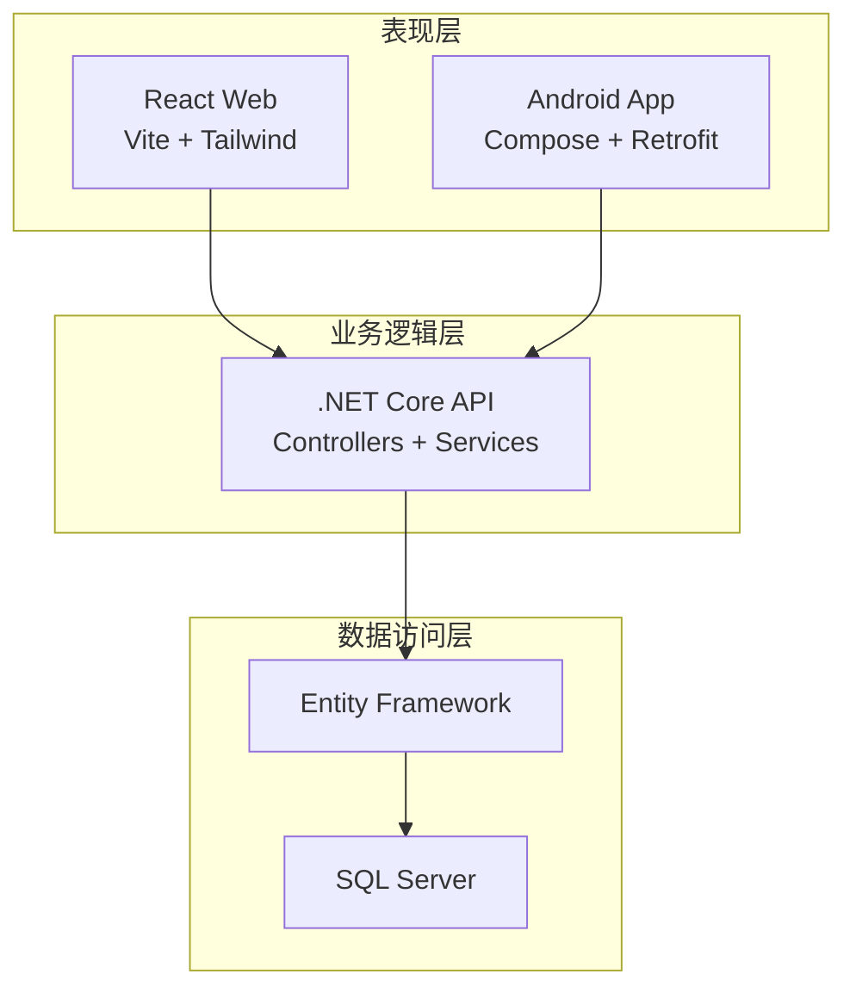
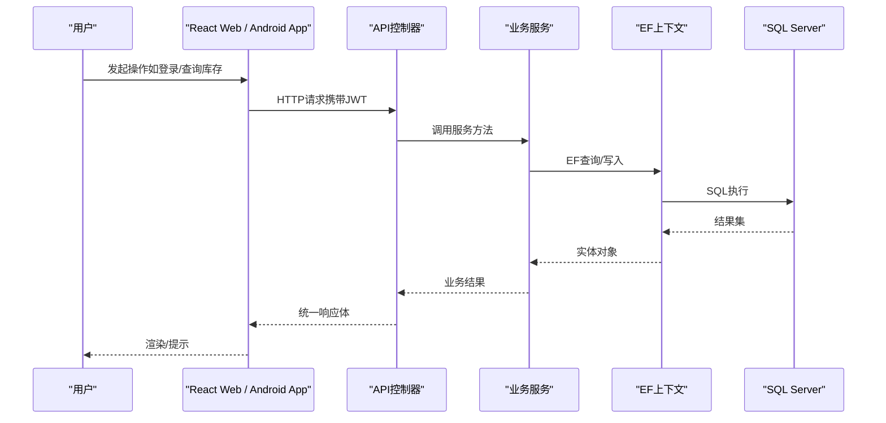
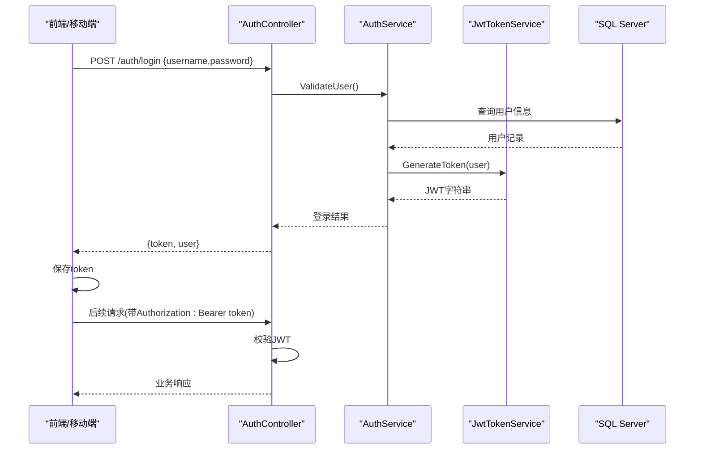
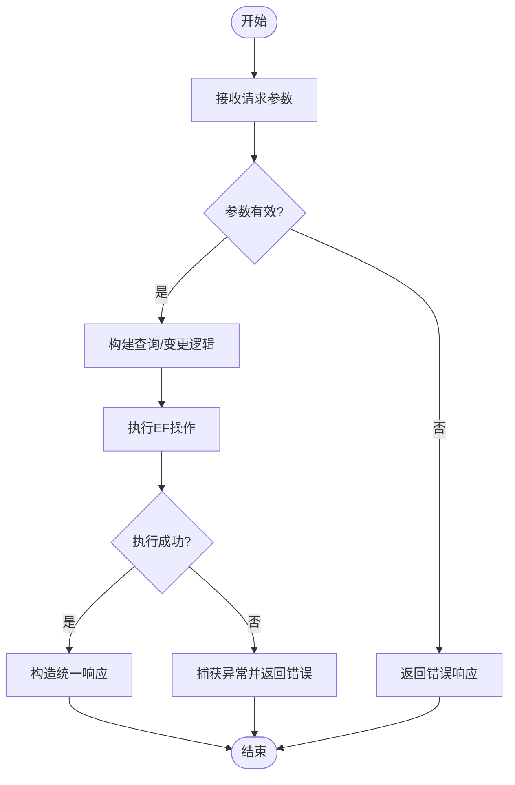
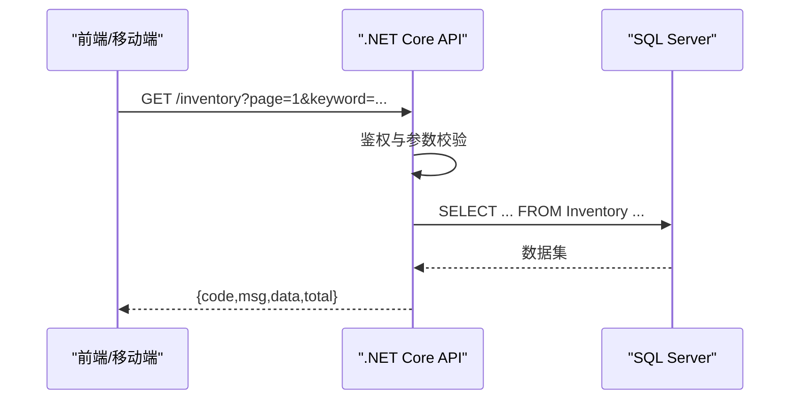
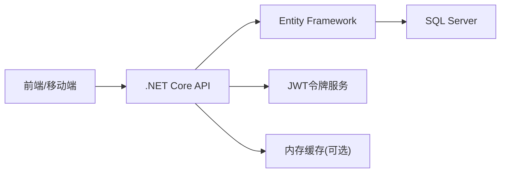

# 整体架构

<cite>
**本文引用的文件**   
- [Program.cs](file://dip-system/api/Program.cs)
- [AppDbContext.cs](file://dip-system/api/Data/AppDbContext.cs)
- [AuthController.cs](file://dip-system/api/Controllers/AuthController.cs)
- [AuthService.cs](file://dip-system/api/Services/AuthService.cs)
- [JwtTokenService.cs](file://dip-system/api/Services/JwtTokenService.cs)
- [InventoryController.cs](file://dip-system/api/Controllers/InventoryController.cs)
- [InventoryService.cs](file://dip-system/api/Services/InventoryService.cs)
- [ApiResponse.cs](file://dip-system/api/Models/ApiResponse.cs)
- [BaseEntity.cs](file://dip-system/api/Models/BaseEntity.cs)
- [api.ts](file://dip-system/frontend-web/src/lib/api.ts)
- [auth.ts](file://dip-system/frontend-web/src/lib/auth.ts)
- [App.tsx](file://dip-system/frontend-web/src/App.tsx)
- [RetrofitClient.kt](file://mobile-android/app/src/main/java/com/dip/material/data/network/RetrofitClient.kt)
- [ApiService.kt](file://mobile-android/app/src/main/java/com/dip/material/data/network/ApiService.kt)
- [AuthInterceptor.kt](file://mobile-android/app/src/main/java/com/dip/material/data/network/AuthInterceptor.kt)
- [TokenHolder.kt](file://mobile-android/app/src/main/java/com/dip/material/data/network/TokenHolder.kt)
- [AppRepository.kt](file://mobile-android/app/src/main/java/com/dip/material/data/repository/AppRepository.kt)
- [MainActivity.kt](file://mobile-android/app/src/main/java/com/dip/material/MainActivity.kt)
- [docker-compose.yml](file://dip-system/docker-compose.yml)
</cite>

## 目录
1. [简介](#简介)
2. [项目结构](#项目结构)
3. [核心组件](#核心组件)
4. [架构总览](#架构总览)
5. [详细组件分析](#详细组件分析)
6. [依赖分析](#依赖分析)
7. [性能考虑](#性能考虑)
8. [故障排查指南](#故障排查指南)
9. [结论](#结论)
10. [附录](#附录)

## 简介
本文件为DIP物料管理系统的整体架构文档，面向技术与管理读者，系统阐述三层架构（表现层、业务逻辑层、数据访问层）、前后端分离与RESTful通信机制、微服务化考量与模块划分原则、系统边界与组件交互、数据流向与技术选型优势。通过架构图与流程图帮助读者快速理解系统全貌与关键流程。

## 项目结构
系统由三个主要子系统构成：
- 前端Web（React + TypeScript + Vite）：提供桌面端操作界面，负责页面路由、状态管理与API调用。
- Android移动端（Kotlin + Jetpack Compose + Retrofit）：提供现场扫码、补料、出库等移动作业能力。
- .NET Core API服务（C# + Entity Framework + SQL Server）：统一承载业务逻辑与数据访问，对外暴露RESTful接口。



**图表来源** 
- [Program.cs](file://dip-system/api/Program.cs)
- [App.tsx](file://dip-system/frontend-web/src/App.tsx)
- [MainActivity.kt](file://mobile-android/app/src/main/java/com/dip/material/MainActivity.kt)

**章节来源**
- [Program.cs](file://dip-system/api/Program.cs)
- [App.tsx](file://dip-system/frontend-web/src/App.tsx)
- [MainActivity.kt](file://mobile-android/app/src/main/java/com/dip/material/MainActivity.kt)

## 核心组件
- 认证与授权
  - 后端：控制器处理登录请求，服务层校验用户并签发JWT令牌，令牌服务负责生成与验证。
  - 前端：维护登录态与令牌，拦截器自动附加Authorization头。
  - 移动端：Retrofit拦截器注入令牌，本地持久化Token。
- 库存与物料主数据
  - 控制器暴露查询与变更接口，服务层封装领域规则与事务边界，EF映射到数据库实体。
- 统一响应模型
  - 所有API返回统一的响应结构，便于前后端一致处理成功/失败场景。

**章节来源**
- [AuthController.cs](file://dip-system/api/Controllers/AuthController.cs)
- [AuthService.cs](file://dip-system/api/Services/AuthService.cs)
- [JwtTokenService.cs](file://dip-system/api/Services/JwtTokenService.cs)
- [InventoryController.cs](file://dip-system/api/Controllers/InventoryController.cs)
- [InventoryService.cs](file://dip-system/api/Services/InventoryService.cs)
- [ApiResponse.cs](file://dip-system/api/Models/ApiResponse.cs)
- [api.ts](file://dip-system/frontend-web/src/lib/api.ts)
- [auth.ts](file://dip-system/frontend-web/src/lib/auth.ts)
- [ApiService.kt](file://mobile-android/app/src/main/java/com/dip/material/data/network/ApiService.kt)
- [AuthInterceptor.kt](file://mobile-android/app/src/main/java/com/dip/material/data/network/AuthInterceptor.kt)
- [TokenHolder.kt](file://mobile-android/app/src/main/java/com/dip/material/data/network/TokenHolder.kt)

## 架构总览
系统采用前后端分离的三层架构：
- 表现层：React Web与Android App各自独立演进，通过HTTP/JSON与后端交互。
- 业务逻辑层：.NET Core API按领域划分控制器与服务，集中实现校验、编排与事务。
- 数据访问层：Entity Framework作为ORM，SQL Server作为持久化存储。



**图表来源** 
- [AuthController.cs](file://dip-system/api/Controllers/AuthController.cs)
- [AuthService.cs](file://dip-system/api/Services/AuthService.cs)
- [InventoryController.cs](file://dip-system/api/Controllers/InventoryController.cs)
- [InventoryService.cs](file://dip-system/api/Services/InventoryService.cs)
- [AppDbContext.cs](file://dip-system/api/Data/AppDbContext.cs)

## 详细组件分析

### 认证与授权流程（登录与鉴权）
- 登录流程
  - 客户端提交用户名/密码至登录接口。
  - 服务端校验用户身份，签发JWT并返回给客户端。
  - 客户端保存令牌并在后续请求中附加Authorization头。
- 鉴权流程
  - 服务端中间件或过滤器解析JWT，校验签名与有效期。
  - 通过后进入控制器与服务层执行业务逻辑。



**图表来源** 
- [AuthController.cs](file://dip-system/api/Controllers/AuthController.cs)
- [AuthService.cs](file://dip-system/api/Services/AuthService.cs)
- [JwtTokenService.cs](file://dip-system/api/Services/JwtTokenService.cs)

**章节来源**
- [AuthController.cs](file://dip-system/api/Controllers/AuthController.cs)
- [AuthService.cs](file://dip-system/api/Services/AuthService.cs)
- [JwtTokenService.cs](file://dip-system/api/Services/JwtTokenService.cs)
- [api.ts](file://dip-system/frontend-web/src/lib/api.ts)
- [auth.ts](file://dip-system/frontend-web/src/lib/auth.ts)
- [ApiService.kt](file://mobile-android/app/src/main/java/com/dip/material/data/network/ApiService.kt)
- [AuthInterceptor.kt](file://mobile-android/app/src/main/java/com/dip/material/data/network/AuthInterceptor.kt)
- [TokenHolder.kt](file://mobile-android/app/src/main/java/com/dip/material/data/network/TokenHolder.kt)

### 库存查询与变更（示例业务流程）
- 查询流程
  - 前端/移动端发起GET请求，携带分页与筛选参数。
  - 控制器接收参数，调用服务层进行条件组装与排序。
  - 服务层通过EF查询数据库，返回DTO集合。
- 变更流程
  - 前端/移动端发起POST/PUT请求，提交变更数据。
  - 控制器校验入参，服务层执行业务规则与事务。
  - EF持久化变更，返回统一响应。



**图表来源** 
- [InventoryController.cs](file://dip-system/api/Controllers/InventoryController.cs)
- [InventoryService.cs](file://dip-system/api/Services/InventoryService.cs)
- [AppDbContext.cs](file://dip-system/api/Data/AppDbContext.cs)

**章节来源**
- [InventoryController.cs](file://dip-system/api/Controllers/InventoryController.cs)
- [InventoryService.cs](file://dip-system/api/Services/InventoryService.cs)
- [AppDbContext.cs](file://dip-system/api/Data/AppDbContext.cs)

### 数据模型与实体关系
- 基础实体
  - BaseEntity定义通用字段（如ID、创建时间、更新时间），供各业务实体继承。
- 业务实体
  - 库存、订单、出库、补料等实体围绕业务域建模，体现一对一、一对多关系。
- ORM映射
  - AppDbContext配置实体映射、关系与索引，支撑高效查询。

```mermaid
classDiagram
class BaseEntity {
+int Id
+DateTime CreatedAt
+DateTime UpdatedAt
}
class Inventory {
+string PartNo
+int Quantity
+string Location
+string Batch
}
class Order {
+string OrderNo
+string ProductCode
+DateTime DueDate
}
class Outbound {
+string OutboundNo
+string OrderId
+DateTime OutboundTime
}
BaseEntity <|-- Inventory
BaseEntity <|-- Order
BaseEntity <|-- Outbound
Order ||--o{ Outbound : "包含"
```

**图表来源** 
- [BaseEntity.cs](file://dip-system/api/Models/BaseEntity.cs)
- [AppDbContext.cs](file://dip-system/api/Data/AppDbContext.cs)

**章节来源**
- [BaseEntity.cs](file://dip-system/api/Models/BaseEntity.cs)
- [AppDbContext.cs](file://dip-system/api/Data/AppDbContext.cs)

### 前端与后端的RESTful通信
- 前端
  - 使用统一的API封装库发起HTTP请求，自动附加JWT与错误处理。
  - 页面级组件按需加载数据，结合分页与搜索提升体验。
- 移动端
  - Retrofit定义接口，AuthInterceptor在请求前注入Authorization头。
  - TokenHolder持久化令牌，支持刷新与失效处理。



**图表来源** 
- [api.ts](file://dip-system/frontend-web/src/lib/api.ts)
- [ApiService.kt](file://mobile-android/app/src/main/java/com/dip/material/data/network/ApiService.kt)
- [AuthInterceptor.kt](file://mobile-android/app/src/main/java/com/dip/material/data/network/AuthInterceptor.kt)
- [TokenHolder.kt](file://mobile-android/app/src/main/java/com/dip/material/data/network/TokenHolder.kt)

**章节来源**
- [api.ts](file://dip-system/frontend-web/src/lib/api.ts)
- [ApiService.kt](file://mobile-android/app/src/main/java/com/dip/material/data/network/ApiService.kt)
- [AuthInterceptor.kt](file://mobile-android/app/src/main/java/com/dip/material/data/network/AuthInterceptor.kt)
- [TokenHolder.kt](file://mobile-android/app/src/main/java/com/dip/material/data/network/TokenHolder.kt)

## 依赖分析
- 组件耦合
  - 控制器仅负责参数绑定与响应包装，业务逻辑下沉至服务层，降低耦合度。
  - EF上下文集中管理实体映射与连接，避免在各服务中重复配置。
- 外部依赖
  - JWT用于无状态鉴权，减少会话服务器压力。
  - Docker Compose用于本地开发与测试环境编排。



**图表来源** 
- [Program.cs](file://dip-system/api/Program.cs)
- [AppDbContext.cs](file://dip-system/api/Data/AppDbContext.cs)
- [JwtTokenService.cs](file://dip-system/api/Services/JwtTokenService.cs)

**章节来源**
- [Program.cs](file://dip-system/api/Program.cs)
- [AppDbContext.cs](file://dip-system/api/Data/AppDbContext.cs)
- [JwtTokenService.cs](file://dip-system/api/Services/JwtTokenService.cs)

## 性能考虑
- 查询优化
  - 合理使用分页、投影与索引，避免N+1查询。
  - 对热点数据引入内存缓存（如IMemoryCache）以降低数据库压力。
- 并发与吞吐
  - API服务启用异步I/O，提高并发处理能力。
  - 合理设置连接池大小与超时策略。
- 前端与移动端
  - 列表页使用虚拟滚动与懒加载，减少首屏渲染压力。
  - 移动端在网络不稳定时提供重试与离线缓存策略。

[本节为通用指导，不直接分析具体文件]

## 故障排查指南
- 认证失败
  - 检查JWT是否过期、签名是否正确；确认客户端是否携带Authorization头。
  - 查看服务端日志中的鉴权失败原因。
- 数据库连接问题
  - 核对连接字符串、网络连通性与权限配置。
  - 观察EF生成的SQL语句，定位慢查询。
- 接口错误
  - 统一响应体包含错误码与消息，优先根据code/msg定位问题。
  - 使用浏览器开发者工具或抓包工具检查请求/响应载荷。

**章节来源**
- [ApiResponse.cs](file://dip-system/api/Models/ApiResponse.cs)
- [AppExceptionFilter.cs](file://dip-system/api/Controllers/AppExceptionFilter.cs)

## 结论
DIP物料管理系统采用清晰的三层架构与前后端分离模式，以.NET Core API为核心，结合Entity Framework与SQL Server实现稳定可靠的数据访问。通过JWT实现无状态鉴权，前端与移动端分别适配不同终端需求。系统在模块化、可维护性与扩展性方面具备良好基础，未来可按领域进一步拆分为微服务以提升弹性与可观测性。

[本节为总结性内容，不直接分析具体文件]

## 附录
- 部署与环境
  - 使用Docker Compose编排API、数据库等服务，简化本地与CI/CD环境搭建。
- 技术选型优势
  - React生态成熟、组件化开发效率高；Android Compose声明式UI提升开发体验。
  - .NET Core跨平台、高性能；Entity Framework简化ORM映射与迁移。
  - SQL Server在企业级场景中稳定性与工具链完善。

**章节来源**
- [docker-compose.yml](file://dip-system/docker-compose.yml)