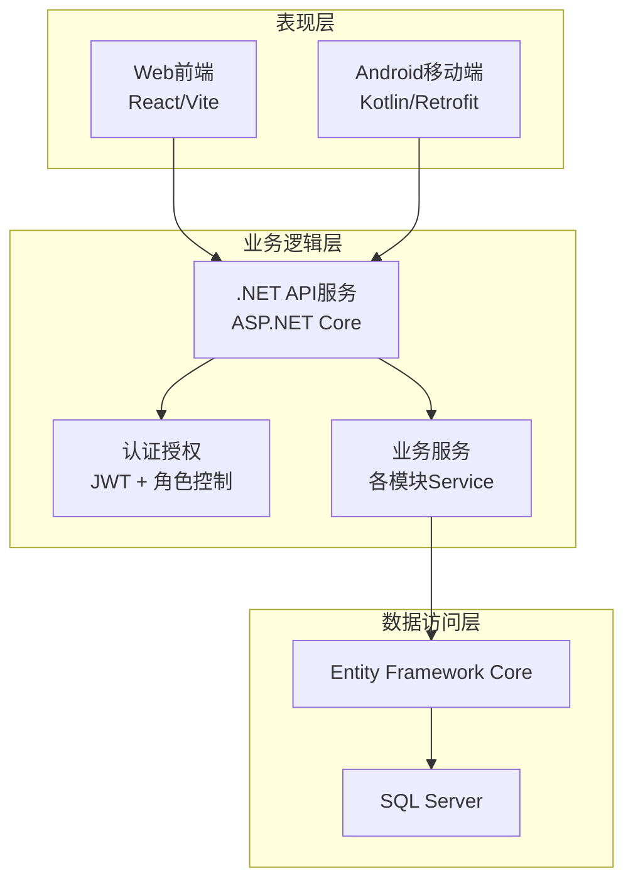
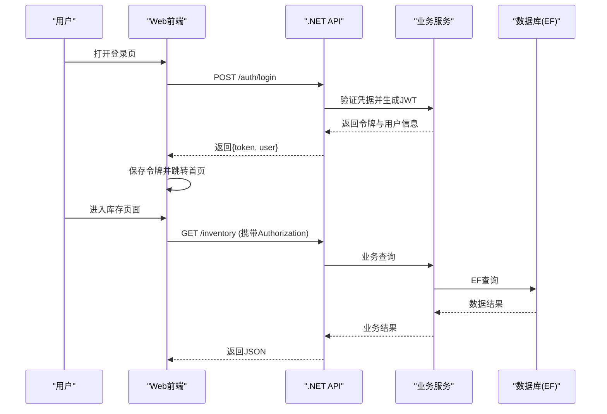
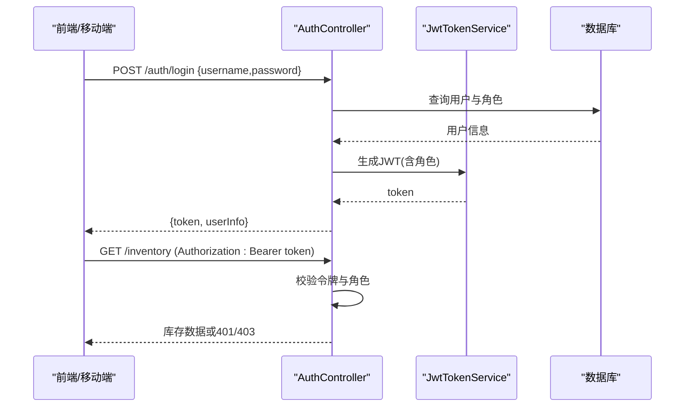
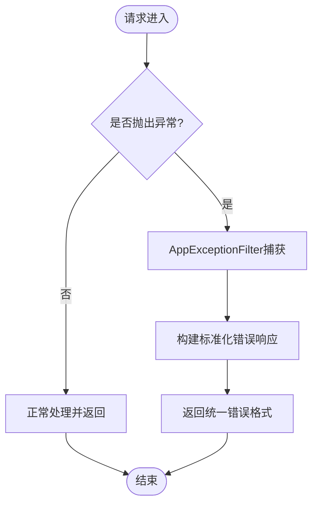
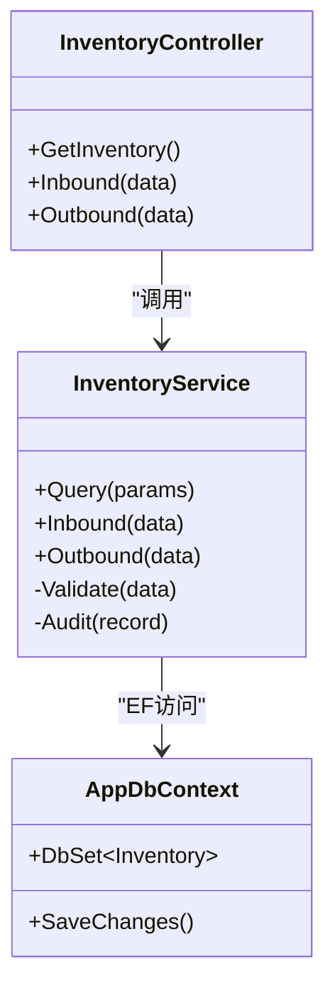
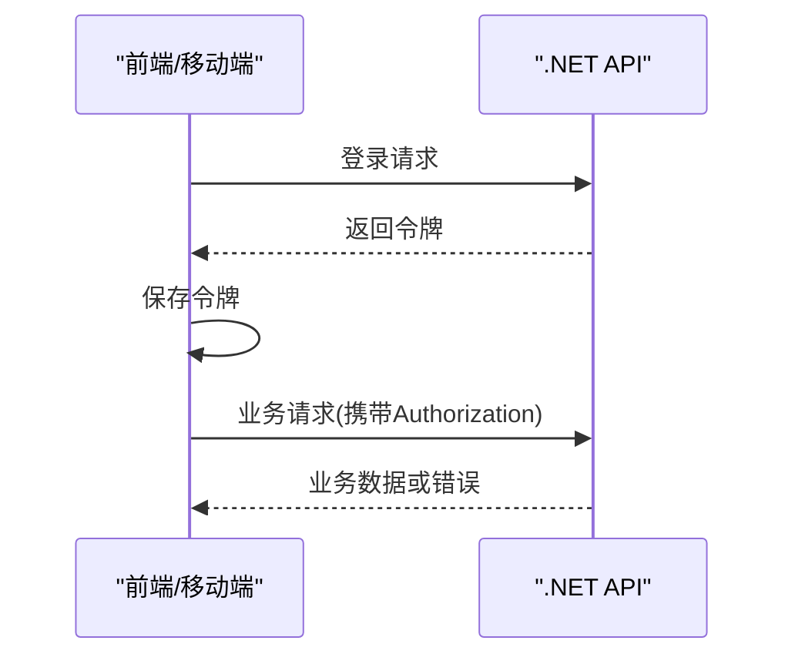
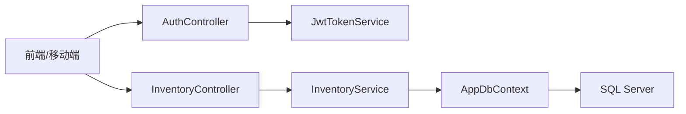

# 架构设计

<cite>
**本文引用的文件**   
- [Program.cs](file://dip-system/api/Program.cs)
- [AppDbContext.cs](file://dip-system/api/Data/AppDbContext.cs)
- [AuthController.cs](file://dip-system/api/Controllers/AuthController.cs)
- [JwtTokenService.cs](file://dip-system/api/Services/JwtTokenService.cs)
- [AppExceptionFilter.cs](file://dip-system/api/Controllers/AppExceptionFilter.cs)
- [ApiResponse.cs](file://dip-system/api/Models/ApiResponse.cs)
- [InventoryController.cs](file://dip-system/api/Controllers/InventoryController.cs)
- [InventoryService.cs](file://dip-system/api/Services/InventoryService.cs)
- [auth.ts](file://dip-system/frontend-web/src/lib/auth.ts)
- [api.ts](file://dip-system/frontend-web/src/lib/api.ts)
- [Login.tsx](file://dip-system/frontend-web/src/pages/Login.tsx)
- [RetrofitClient.kt](file://mobile-android/app/src/main/java/com/dip/material/data/network/RetrofitClient.kt)
- [AuthInterceptor.kt](file://mobile-android/app/src/main/java/com/dip/material/data/network/AuthInterceptor.kt)
- [TokenHolder.kt](file://mobile-android/app/src/main/java/com/dip/material/data/network/TokenHolder.kt)
- [ApiService.kt](file://mobile-android/app/src/main/java/com/dip/material/data/network/ApiService.kt)
- [docker-compose.yml](file://dip-system/docker-compose.yml)
</cite>

## 目录
1. [简介](#简介)
2. [项目结构](#项目结构)
3. [核心组件](#核心组件)
4. [架构总览](#架构总览)
5. [详细组件分析](#详细组件分析)
6. [依赖分析](#依赖分析)
7. [性能考虑](#性能考虑)
8. [故障排查指南](#故障排查指南)
9. [结论](#结论)
10. [附录](#附录)

## 简介
本架构设计文档面向DIP物料管理系统，围绕三层架构（表现层、业务逻辑层、数据访问层）展开，说明前后端分离与RESTful API通信机制，阐述认证授权（JWT令牌验证、基于角色的权限控制）、错误处理与全局异常过滤、缓存策略与性能优化方案，并提供系统架构图与关键数据流图。该系统包含Web前端（React/Vite）、Android移动端（Kotlin/Compose或Activity）、.NET API服务（ASP.NET Core + Entity Framework + SQL Server），并通过容器化编排进行部署。

## 项目结构
- 表现层
  - Web前端：位于dip-system/frontend-web，使用Vite+React构建，提供登录、看板、库存、出库、补料等页面，通过统一的API客户端调用后端接口。
  - Android移动端：位于mobile-android，使用Kotlin与Retrofit进行网络请求，封装鉴权拦截器与令牌管理。
- 业务逻辑层
  - .NET API服务：位于dip-system/api，采用控制器-服务-仓储/EF的层次组织，暴露RESTful API，集中处理业务规则、校验与事务。
- 数据访问层
  - 使用Entity Framework Core与SQL Server交互，上下文类定义数据库连接与实体映射。
- 配置与部署
  - docker-compose.yml用于本地或生产环境的一键编排（API、数据库等）。

**图表来源** 
- [Program.cs:1-200](file://dip-system/api/Program.cs#L1-L200)
- [AppDbContext.cs:1-200](file://dip-system/api/Data/AppDbContext.cs#L1-L200)

**章节来源**
- [Program.cs:1-200](file://dip-system/api/Program.cs#L1-L200)
- [docker-compose.yml:1-200](file://dip-system/docker-compose.yml#L1-L200)

## 核心组件
- 认证与授权
  - 控制器：AuthController负责登录、颁发与刷新令牌。
  - 服务：JwtTokenService生成与验证JWT，结合用户角色实现RBAC。
  - 过滤器：RequireManagerFilter用于按角色限制访问。
- 全局异常处理
  - AppExceptionFilter统一捕获并返回标准化错误响应。
- 业务服务
  - InventoryService等Service封装库存、出入库、盘点等业务逻辑。
- 数据访问
  - AppDbContext定义EF上下文与实体关系，配合仓储模式访问SQL Server。
- 前端与移动端
  - Web前端通过api.ts发起HTTP请求，auth.ts管理登录状态与令牌。
  - Android通过RetrofitClient与AuthInterceptor自动附加令牌，TokenHolder持久化令牌。

**章节来源**
- [AuthController.cs:1-200](file://dip-system/api/Controllers/AuthController.cs#L1-L200)
- [JwtTokenService.cs:1-200](file://dip-system/api/Services/JwtTokenService.cs#L1-L200)
- [AppExceptionFilter.cs:1-200](file://dip-system/api/Controllers/AppExceptionFilter.cs#L1-L200)
- [InventoryService.cs:1-200](file://dip-system/api/Services/InventoryService.cs#L1-L200)
- [AppDbContext.cs:1-200](file://dip-system/api/Data/AppDbContext.cs#L1-L200)
- [api.ts:1-200](file://dip-system/frontend-web/src/lib/api.ts#L1-L200)
- [auth.ts:1-200](file://dip-system/frontend-web/src/lib/auth.ts#L1-L200)
- [RetrofitClient.kt:1-200](file://mobile-android/app/src/main/java/com/dip/material/data/network/RetrofitClient.kt#L1-L200)
- [AuthInterceptor.kt:1-200](file://mobile-android/app/src/main/java/com/dip/material/data/network/AuthInterceptor.kt#L1-L200)
- [TokenHolder.kt:1-200](file://mobile-android/app/src/main/java/com/dip/material/data/network/TokenHolder.kt#L1-L200)

## 架构总览
系统采用前后端分离的三层架构：
- 表现层：Web前端与Android移动端通过RESTful API与后端交互。
- 业务逻辑层：.NET API服务承载控制器与服务，实现业务规则、校验与事务。
- 数据访问层：Entity Framework Core映射实体到SQL Server，提供强类型查询与变更跟踪。

**图表来源** 
- [AuthController.cs:1-200](file://dip-system/api/Controllers/AuthController.cs#L1-L200)
- [JwtTokenService.cs:1-200](file://dip-system/api/Services/JwtTokenService.cs#L1-L200)
- [InventoryController.cs:1-200](file://dip-system/api/Controllers/InventoryController.cs#L1-L200)
- [InventoryService.cs:1-200](file://dip-system/api/Services/InventoryService.cs#L1-L200)
- [AppDbContext.cs:1-200](file://dip-system/api/Data/AppDbContext.cs#L1-L200)

## 详细组件分析

### 认证与授权（JWT + RBAC）
- 登录流程
  - 前端调用登录接口，后端验证用户凭据，签发JWT令牌，返回给前端。
  - 前端在后续请求中携带Authorization头，服务端过滤器解析并校验令牌有效性及角色。
- 角色控制
  - 控制器方法或过滤器根据角色限制访问，未授权返回标准错误响应。

**图表来源** 
- [AuthController.cs:1-200](file://dip-system/api/Controllers/AuthController.cs#L1-L200)
- [JwtTokenService.cs:1-200](file://dip-system/api/Services/JwtTokenService.cs#L1-L200)

**章节来源**
- [AuthController.cs:1-200](file://dip-system/api/Controllers/AuthController.cs#L1-L200)
- [JwtTokenService.cs:1-200](file://dip-system/api/Services/JwtTokenService.cs#L1-L200)
- [auth.ts:1-200](file://dip-system/frontend-web/src/lib/auth.ts#L1-L200)
- [AuthInterceptor.kt:1-200](file://mobile-android/app/src/main/java/com/dip/material/data/network/AuthInterceptor.kt#L1-L200)
- [TokenHolder.kt:1-200](file://mobile-android/app/src/main/java/com/dip/material/data/network/TokenHolder.kt#L1-L200)

### 全局异常处理与错误响应
- 全局异常过滤器统一捕获未处理异常，转换为标准化的ApiResponse格式，便于前端与移动端一致处理。
- 业务异常可通过自定义异常抛出，由过滤器捕获并返回相应状态码与消息。

**图表来源** 
- [AppExceptionFilter.cs:1-200](file://dip-system/api/Controllers/AppExceptionFilter.cs#L1-L200)
- [ApiResponse.cs:1-200](file://dip-system/api/Models/ApiResponse.cs#L1-L200)

**章节来源**
- [AppExceptionFilter.cs:1-200](file://dip-system/api/Controllers/AppExceptionFilter.cs#L1-L200)
- [ApiResponse.cs:1-200](file://dip-system/api/Models/ApiResponse.cs#L1-L200)

### 库存业务（示例）
- 控制器InventoryController暴露库存查询、入库、出库等REST接口。
- 服务InventoryService实现库存校验、并发控制、事务边界与审计记录。
- 数据访问通过AppDbContext与EF查询数据库，支持分页、排序与条件筛选。

**图表来源** 
- [InventoryController.cs:1-200](file://dip-system/api/Controllers/InventoryController.cs#L1-L200)
- [InventoryService.cs:1-200](file://dip-system/api/Services/InventoryService.cs#L1-L200)
- [AppDbContext.cs:1-200](file://dip-system/api/Data/AppDbContext.cs#L1-L200)

**章节来源**
- [InventoryController.cs:1-200](file://dip-system/api/Controllers/InventoryController.cs#L1-L200)
- [InventoryService.cs:1-200](file://dip-system/api/Services/InventoryService.cs#L1-L200)
- [AppDbContext.cs:1-200](file://dip-system/api/Data/AppDbContext.cs#L1-L200)

### 前端与移动端通信
- Web前端
  - api.ts封装HTTP请求，统一处理基础URL、超时与错误。
  - auth.ts管理登录状态、令牌存储与过期刷新。
  - Login.tsx触发登录流程并跳转到主页。
- Android移动端
  - RetrofitClient配置Base URL与拦截器。
  - AuthInterceptor自动附加Authorization头。
  - TokenHolder负责令牌的获取与持久化。

**图表来源** 
- [api.ts:1-200](file://dip-system/frontend-web/src/lib/api.ts#L1-L200)
- [auth.ts:1-200](file://dip-system/frontend-web/src/lib/auth.ts#L1-L200)
- [Login.tsx:1-200](file://dip-system/frontend-web/src/pages/Login.tsx#L1-L200)
- [RetrofitClient.kt:1-200](file://mobile-android/app/src/main/java/com/dip/material/data/network/RetrofitClient.kt#L1-L200)
- [AuthInterceptor.kt:1-200](file://mobile-android/app/src/main/java/com/dip/material/data/network/AuthInterceptor.kt#L1-L200)
- [TokenHolder.kt:1-200](file://mobile-android/app/src/main/java/com/dip/material/data/network/TokenHolder.kt#L1-L200)

**章节来源**
- [api.ts:1-200](file://dip-system/frontend-web/src/lib/api.ts#L1-L200)
- [auth.ts:1-200](file://dip-system/frontend-web/src/lib/auth.ts#L1-L200)
- [Login.tsx:1-200](file://dip-system/frontend-web/src/pages/Login.tsx#L1-L200)
- [RetrofitClient.kt:1-200](file://mobile-android/app/src/main/java/com/dip/material/data/network/RetrofitClient.kt#L1-L200)
- [AuthInterceptor.kt:1-200](file://mobile-android/app/src/main/java/com/dip/material/data/network/AuthInterceptor.kt#L1-L200)
- [TokenHolder.kt:1-200](file://mobile-android/app/src/main/java/com/dip/material/data/network/TokenHolder.kt#L1-L200)

## 依赖分析
- 控制器依赖服务，服务依赖EF上下文，EF上下文依赖SQL Server。
- 认证相关组件耦合于JWT服务与角色过滤器。
- 前端与移动端依赖统一的API契约（路径、参数、响应格式）。

**图表来源** 
- [AuthController.cs:1-200](file://dip-system/api/Controllers/AuthController.cs#L1-L200)
- [JwtTokenService.cs:1-200](file://dip-system/api/Services/JwtTokenService.cs#L1-L200)
- [InventoryController.cs:1-200](file://dip-system/api/Controllers/InventoryController.cs#L1-L200)
- [InventoryService.cs:1-200](file://dip-system/api/Services/InventoryService.cs#L1-L200)
- [AppDbContext.cs:1-200](file://dip-system/api/Data/AppDbContext.cs#L1-L200)

**章节来源**
- [Program.cs:1-200](file://dip-system/api/Program.cs#L1-L200)
- [AppDbContext.cs:1-200](file://dip-system/api/Data/AppDbContext.cs#L1-L200)

## 性能考虑
- 数据库层面
  - 合理使用索引、避免N+1查询、分页与投影减少数据传输。
  - 读写分离与连接池优化（EF连接池、SQL Server Max Pool Size）。
- 应用层面
  - 引入内存缓存（如IMemoryCache）缓存热点字典、配置与只读数据。
  - 异步I/O与并行查询提升吞吐。
  - 压缩响应与批量接口减少网络开销。
- 前端与移动端
  - 列表分页加载、防抖与节流、离线缓存与重试机制。
  - 图片与资源CDN加速。

[本节为通用指导，不直接分析具体文件]

## 故障排查指南
- 认证失败
  - 检查JWT签名与过期时间、角色声明是否正确。
  - 确认前端/移动端正确设置Authorization头。
- 权限不足
  - 核对RequireManagerFilter的角色配置与用户角色。
- 全局异常
  - 查看AppExceptionFilter日志与ApiResponse结构，定位业务异常。
- 数据库问题
  - 检查AppDbContext连接字符串、迁移状态与慢查询。

**章节来源**
- [AppExceptionFilter.cs:1-200](file://dip-system/api/Controllers/AppExceptionFilter.cs#L1-L200)
- [ApiResponse.cs:1-200](file://dip-system/api/Models/ApiResponse.cs#L1-L200)
- [AppDbContext.cs:1-200](file://dip-system/api/Data/AppDbContext.cs#L1-L200)

## 结论
本架构通过前后端分离与三层分层设计，实现了清晰的职责划分与可维护性。JWT与RBAC保障了安全访问，全局异常过滤器提升了错误处理一致性。通过EF与SQL Server的数据访问层，保证了数据的强一致与可追溯。未来可按微服务原则拆分高内聚模块，引入缓存与消息队列进一步提升性能与可扩展性。

[本节为总结，不直接分析具体文件]

## 附录
- 部署与环境
  - 使用docker-compose.yml编排API与数据库，便于开发与测试。
- 扩展建议
  - 将认证与用户管理拆分为独立微服务。
  - 引入分布式缓存（Redis）与消息队列（RabbitMQ/Kafka）支撑高并发场景。

**章节来源**
- [docker-compose.yml:1-200](file://dip-system/docker-compose.yml#L1-L200)