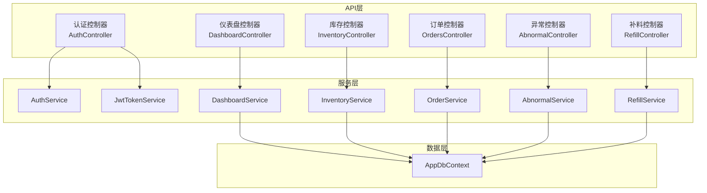
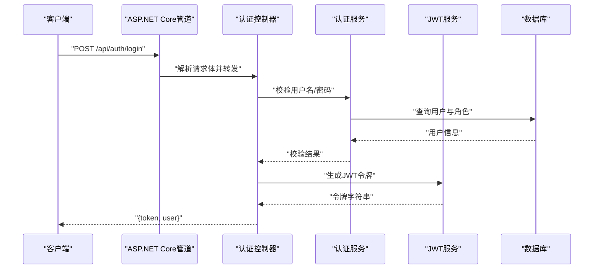
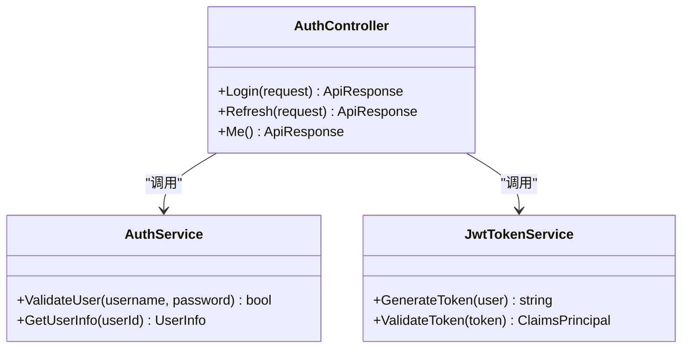
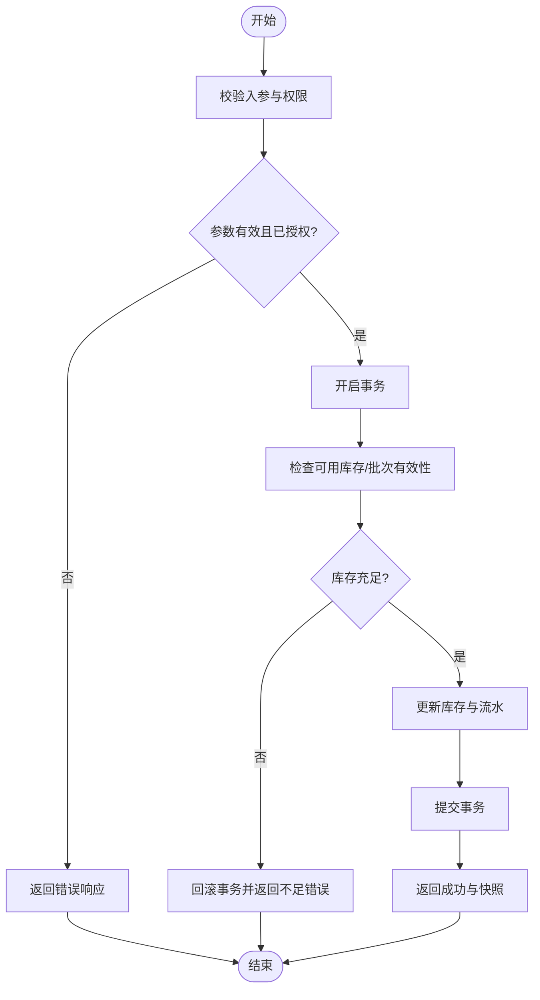
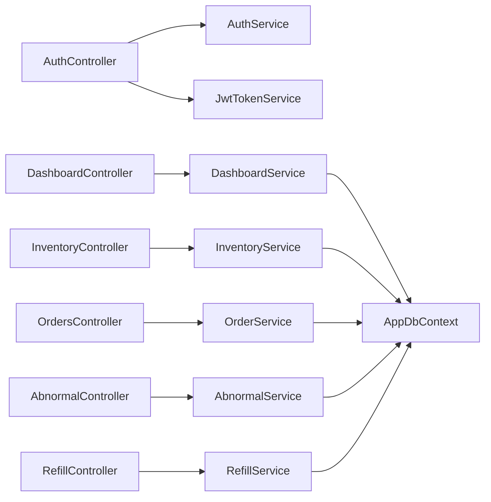

# API控制器模块

<cite>
**本文引用的文件**   
- [Program.cs](file://dip-system/api/Program.cs)
- [AppExceptionFilter.cs](file://dip-system/api/Controllers/AppExceptionFilter.cs)
- [RequireManagerFilter.cs](file://dip-system/api/Controllers/RequireManagerFilter.cs)
- [AuthController.cs](file://dip-system/api/Controllers/AuthController.cs)
- [DashboardController.cs](file://dip-system/api/Controllers/DashboardController.cs)
- [InventoryController.cs](file://dip-system/api/Controllers/InventoryController.cs)
- [OrdersController.cs](file://dip-system/api/Controllers/OrdersController.cs)
- [AbnormalController.cs](file://dip-system/api/Controllers/AbnormalController.cs)
- [RefillController.cs](file://dip-system/api/Controllers/RefillController.cs)
- [AuthService.cs](file://dip-system/api/Services/AuthService.cs)
- [JwtTokenService.cs](file://dip-system/api/Services/JwtTokenService.cs)
- [DashboardService.cs](file://dip-system/api/Services/DashboardService.cs)
- [InventoryService.cs](file://dip-system/api/Services/InventoryService.cs)
- [OrderService.cs](file://dip-system/api/Services/OrderService.cs)
- [AbnormalService.cs](file://dip-system/api/Services/AbnormalService.cs)
- [RefillService.cs](file://dip-system/api/Services/RefillService.cs)
- [AppDbContext.cs](file://dip-system/api/Data/AppDbContext.cs)
- [ApiResponse.cs](file://dip-system/api/Models/ApiResponse.cs)
</cite>

## 目录
1. [简介](#简介)
2. [项目结构](#项目结构)
3. [核心组件](#核心组件)
4. [架构总览](#架构总览)
5. [详细组件分析](#详细组件分析)
6. [依赖关系分析](#依赖关系分析)
7. [性能考虑](#性能考虑)
8. [故障排查指南](#故障排查指南)
9. [结论](#结论)
10. [附录](#附录)

## 简介
本文件为DIP物料管理系统的API控制器模块提供系统化、可操作的技术文档。内容覆盖控制器的职责划分原则、HTTP端点设计、请求响应格式、权限验证机制、路由配置与中间件集成、控制器间依赖关系与数据流转，以及API调用示例与错误处理策略。读者无需深入代码即可理解系统如何组织控制器与服务层交互，以及如何通过统一异常过滤器和鉴权中间件保障接口安全与一致性。

## 项目结构
后端采用ASP.NET Core Web API分层架构：
- Controllers：按业务域划分控制器，暴露RESTful端点
- Services：封装领域逻辑与数据访问编排
- Data：EF Core上下文与数据库连接
- Models：DTO与实体模型
- Program：应用启动、服务注册、中间件管线与路由映射
- Filters：全局异常过滤与自定义授权过滤器

图表来源
- [Program.cs](file://dip-system/api/Program.cs)
- [AuthController.cs](file://dip-system/api/Controllers/AuthController.cs)
- [DashboardController.cs](file://dip-system/api/Controllers/DashboardController.cs)
- [InventoryController.cs](file://dip-system/api/Controllers/InventoryController.cs)
- [OrdersController.cs](file://dip-system/api/Controllers/OrdersController.cs)
- [AbnormalController.cs](file://dip-system/api/Controllers/AbnormalController.cs)
- [RefillController.cs](file://dip-system/api/Controllers/RefillController.cs)
- [AuthService.cs](file://dip-system/api/Services/AuthService.cs)
- [JwtTokenService.cs](file://dip-system/api/Services/JwtTokenService.cs)
- [DashboardService.cs](file://dip-system/api/Services/DashboardService.cs)
- [InventoryService.cs](file://dip-system/api/Services/InventoryService.cs)
- [OrderService.cs](file://dip-system/api/Services/OrderService.cs)
- [AbnormalService.cs](file://dip-system/api/Services/AbnormalService.cs)
- [RefillService.cs](file://dip-system/api/Services/RefillService.cs)
- [AppDbContext.cs](file://dip-system/api/Data/AppDbContext.cs)

章节来源
- [Program.cs](file://dip-system/api/Program.cs)

## 核心组件
- 认证授权控制器（AuthController）
  - 职责：用户登录、令牌签发与校验、会话状态查询
  - 关键能力：基于JWT的无状态鉴权；密码校验与用户信息返回
  - 典型端点：登录、刷新令牌、获取当前用户信息
  - 权限机制：登录成功后颁发JWT；后续请求携带Authorization头进行校验
- 仪表盘控制器（DashboardController）
  - 职责：聚合统计指标、看板数据展示
  - 关键能力：多表聚合查询、缓存友好型数据组装
  - 典型端点：获取生产概览、库存健康度、异常趋势等
- 库存管理控制器（InventoryController）
  - 职责：物料库存的查询、调整、批次与库位关联
  - 关键能力：事务性扣减/入库、并发安全、库存快照
  - 典型端点：库存查询、入库登记、出库登记、库存盘点
- 订单处理控制器（OrdersController）
  - 职责：工单/生产订单生命周期管理
  - 关键能力：订单创建、状态流转、与库存联动扣减
  - 典型端点：创建订单、提交领料、完成订单、取消订单
- 异常管理控制器（AbnormalController）
  - 职责：异常上报、跟踪、闭环处理
  - 关键能力：异常分类、升级通知、处理记录
  - 典型端点：上报异常、查询异常列表、更新处理结果
- 补料管理控制器（RefillController）
  - 职责：产线缺料触发补料流程
  - 关键能力：补料申请、拣配、回仓、核销
  - 典型端点：发起补料、确认拣货、完成补料、查询补料进度

章节来源
- [AuthController.cs](file://dip-system/api/Controllers/AuthController.cs)
- [DashboardController.cs](file://dip-system/api/Controllers/DashboardController.cs)
- [InventoryController.cs](file://dip-system/api/Controllers/InventoryController.cs)
- [OrdersController.cs](file://dip-system/api/Controllers/OrdersController.cs)
- [AbnormalController.cs](file://dip-system/api/Controllers/AbnormalController.cs)
- [RefillController.cs](file://dip-system/api/Controllers/RefillController.cs)

## 架构总览
整体采用“控制器→服务→数据”的分层模式，配合统一的异常过滤器与鉴权中间件，确保接口一致性与安全性。

图表来源
- [Program.cs](file://dip-system/api/Program.cs)
- [AuthController.cs](file://dip-system/api/Controllers/AuthController.cs)
- [AuthService.cs](file://dip-system/api/Services/AuthService.cs)
- [JwtTokenService.cs](file://dip-system/api/Services/JwtTokenService.cs)
- [AppDbContext.cs](file://dip-system/api/Data/AppDbContext.cs)

## 详细组件分析

### 认证授权控制器（AuthController）
- 职责边界
  - 负责身份认证与会话管理，不承载业务逻辑
  - 与AuthService协作完成用户校验，与JwtTokenService协作签发令牌
- HTTP端点设计
  - POST /api/auth/login：登录，返回令牌与用户基本信息
  - POST /api/auth/refresh：刷新令牌
  - GET /api/auth/me：获取当前用户信息
- 请求/响应格式
  - 登录请求：包含用户名、密码
  - 登录响应：包含access_token、expires_in、user_info
  - 刷新请求：包含refresh_token或原令牌
  - 刷新响应：新的access_token
  - 用户信息响应：包含用户ID、角色、权限集合
- 权限验证机制
  - 登录后颁发JWT，后续请求需在Authorization头携带Bearer令牌
  - 服务端通过中间件解析并注入用户上下文
- 路由配置与中间件集成
  - 在Program中启用认证中间件与JWT校验
  - 对敏感接口使用[Authorize]或自定义过滤器限定角色/权限

图表来源
- [AuthController.cs](file://dip-system/api/Controllers/AuthController.cs)
- [AuthService.cs](file://dip-system/api/Services/AuthService.cs)
- [JwtTokenService.cs](file://dip-system/api/Services/JwtTokenService.cs)

章节来源
- [AuthController.cs](file://dip-system/api/Controllers/AuthController.cs)
- [AuthService.cs](file://dip-system/api/Services/AuthService.cs)
- [JwtTokenService.cs](file://dip-system/api/Services/JwtTokenService.cs)

### 仪表盘控制器（DashboardController）
- 职责边界
  - 聚合各子系统指标，提供只读视图
  - 避免直接写操作，保证高并发读取稳定性
- HTTP端点设计
  - GET /api/dashboard/overview：生产概览
  - GET /api/dashboard/inventory-health：库存健康度
  - GET /api/dashboard/anomaly-trend：异常趋势
- 请求/响应格式
  - 请求：可选时间范围、产品筛选参数
  - 响应：结构化指标对象，含数值、趋势、阈值标记
- 权限验证机制
  - 默认需登录；部分只读指标可开放匿名访问（视安全策略）
- 路由配置与中间件集成
  - 使用[Authorize]保护敏感指标；支持按角色限制访问

章节来源
- [DashboardController.cs](file://dip-system/api/Controllers/DashboardController.cs)
- [DashboardService.cs](file://dip-system/api/Services/DashboardService.cs)

### 库存管理控制器（InventoryController）
- 职责边界
  - 维护库存数量、批次、库位与出入库流水
  - 保证事务性与并发安全
- HTTP端点设计
  - GET /api/inventory/{sku}：查询SKU库存
  - POST /api/inventory/inbound：入库登记
  - POST /api/inventory/outbound：出库登记
  - PUT /api/inventory/{id}/adjust：库存调整
  - GET /api/inventory/stock-count：盘点清单
- 请求/响应格式
  - 入库/出库请求：包含SKU、数量、批次、库位、操作人
  - 响应：操作结果、新库存快照、流水ID
- 权限验证机制
  - 入库/出库需具备“库存操作”权限；盘点需“盘点员”角色
- 路由配置与中间件集成
  - 结合RequireManagerFilter进行细粒度权限校验
  - 使用事务包装写入操作，失败回滚

图表来源
- [InventoryController.cs](file://dip-system/api/Controllers/InventoryController.cs)
- [InventoryService.cs](file://dip-system/api/Services/InventoryService.cs)
- [AppDbContext.cs](file://dip-system/api/Data/AppDbContext.cs)

章节来源
- [InventoryController.cs](file://dip-system/api/Controllers/InventoryController.cs)
- [InventoryService.cs](file://dip-system/api/Services/InventoryService.cs)

### 订单处理控制器（OrdersController）
- 职责边界
  - 管理订单生命周期：创建、分配、领料、完成、取消
  - 与库存服务联动扣减物料
- HTTP端点设计
  - POST /api/orders：创建订单
  - PUT /api/orders/{id}/status：更新状态
  - POST /api/orders/{id}/issue-material：提交领料
  - POST /api/orders/{id}/complete：完成订单
  - POST /api/orders/{id}/cancel：取消订单
- 请求/响应格式
  - 创建订单：包含产品、BOM、计划数量、交期
  - 响应：订单号、状态、下一步动作提示
- 权限验证机制
  - 创建/完成需“计划员”或“班组长”角色；取消需“主管”角色
- 路由配置与中间件集成
  - 使用RequireManagerFilter进行角色校验
  - 状态机驱动，非法状态转换拒绝

章节来源
- [OrdersController.cs](file://dip-system/api/Controllers/OrdersController.cs)
- [OrderService.cs](file://dip-system/api/Services/OrderService.cs)

### 异常管理控制器（AbnormalController）
- 职责边界
  - 接收异常上报、跟踪处理进度、归档历史
- HTTP端点设计
  - POST /api/abnormal/report：上报异常
  - GET /api/abnormal/list：查询异常列表
  - PUT /api/abnormal/{id}/resolve：更新处理结果
- 请求/响应格式
  - 上报：异常类型、描述、影响范围、责任人
  - 列表：分页、筛选、排序
  - 处理结果：原因、措施、验证结果
- 权限验证机制
  - 上报：所有登录用户；处理：质量/工程角色
- 路由配置与中间件集成
  - 结合RequireManagerFilter进行角色校验

章节来源
- [AbnormalController.cs](file://dip-system/api/Controllers/AbnormalController.cs)
- [AbnormalService.cs](file://dip-system/api/Services/AbnormalService.cs)

### 补料管理控制器（RefillController）
- 职责边界
  - 管理补料申请、拣配、回仓、核销全流程
- HTTP端点设计
  - POST /api/refill/request：发起补料
  - PUT /api/refill/{id}/pick：确认拣货
  - PUT /api/refill/{id}/complete：完成补料
  - GET /api/refill/list：查询补料进度
- 请求/响应格式
  - 发起：订单号、物料、数量、需求时间
  - 进度：状态、拣货人、预计到达时间
- 权限验证机制
  - 发起：操作员；拣货：仓库拣配员；完成：班组长
- 路由配置与中间件集成
  - RequireManagerFilter校验角色；状态机约束流转

章节来源
- [RefillController.cs](file://dip-system/api/Controllers/RefillController.cs)
- [RefillService.cs](file://dip-system/api/Services/RefillService.cs)

## 依赖关系分析
控制器与服务层的依赖清晰，服务层再依赖数据上下文。鉴权与异常处理贯穿整个管道。

图表来源
- [Program.cs](file://dip-system/api/Program.cs)
- [AuthController.cs](file://dip-system/api/Controllers/AuthController.cs)
- [DashboardController.cs](file://dip-system/api/Controllers/DashboardController.cs)
- [InventoryController.cs](file://dip-system/api/Controllers/InventoryController.cs)
- [OrdersController.cs](file://dip-system/api/Controllers/OrdersController.cs)
- [AbnormalController.cs](file://dip-system/api/Controllers/AbnormalController.cs)
- [RefillController.cs](file://dip-system/api/Controllers/RefillController.cs)
- [AuthService.cs](file://dip-system/api/Services/AuthService.cs)
- [JwtTokenService.cs](file://dip-system/api/Services/JwtTokenService.cs)
- [DashboardService.cs](file://dip-system/api/Services/DashboardService.cs)
- [InventoryService.cs](file://dip-system/api/Services/InventoryService.cs)
- [OrderService.cs](file://dip-system/api/Services/OrderService.cs)
- [AbnormalService.cs](file://dip-system/api/Services/AbnormalService.cs)
- [RefillService.cs](file://dip-system/api/Services/RefillService.cs)
- [AppDbContext.cs](file://dip-system/api/Data/AppDbContext.cs)

章节来源
- [Program.cs](file://dip-system/api/Program.cs)

## 性能考虑
- 只读接口（如仪表盘）建议引入内存缓存，降低数据库压力
- 库存写入使用事务与行级锁，避免超卖与脏读
- 分页与筛选：列表接口必须支持分页与条件筛选，减少数据传输量
- 异步I/O：服务层尽量使用异步方法，提升吞吐
- 连接池：合理配置EF Core连接池大小，避免连接耗尽

## 故障排查指南
- 统一异常处理
  - 使用AppExceptionFilter捕获未处理异常，返回标准错误响应
  - 区分业务异常与系统异常，记录日志并返回友好消息
- 常见错误码与场景
  - 401：未认证或令牌过期
  - 403：权限不足
  - 400：参数校验失败
  - 404：资源不存在
  - 500：服务器内部错误
- 调试建议
  - 开启开发环境详细日志
  - 检查JWT签名与有效期配置
  - 核对数据库连接与事务是否提交

章节来源
- [AppExceptionFilter.cs](file://dip-system/api/Controllers/AppExceptionFilter.cs)
- [ApiResponse.cs](file://dip-system/api/Models/ApiResponse.cs)

## 结论
本控制器模块以清晰的职责划分与分层架构为基础，结合JWT鉴权与统一异常处理，提供了稳定、可扩展的API能力。通过严格的路由与中间件集成，确保了接口的一致性与安全性。建议在后续迭代中持续完善权限模型、增加审计日志与性能监控，以提升系统的可观测性与健壮性。

## 附录
- 路由与中间件集成要点
  - 在Program中注册服务、启用认证与异常过滤器
  - 使用[Authorize]与RequireManagerFilter组合实现细粒度权限控制
- 标准响应格式
  - 成功：{ code: 0, data: {...}, message: "success" }
  - 失败：{ code: 非0, data: null, message: "错误描述" }
- API调用示例（概念性）
  - 登录：POST /api/auth/login，请求体包含用户名与密码，响应包含令牌
  - 查询库存：GET /api/inventory/{sku}，响应包含库存数量与批次
  - 创建订单：POST /api/orders，请求体包含BOM与计划数量，响应包含订单号