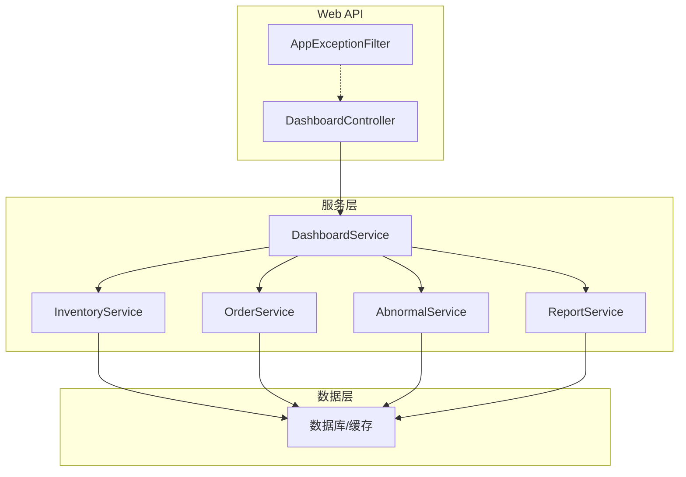
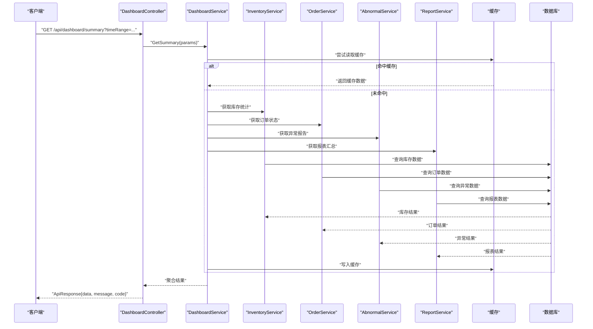
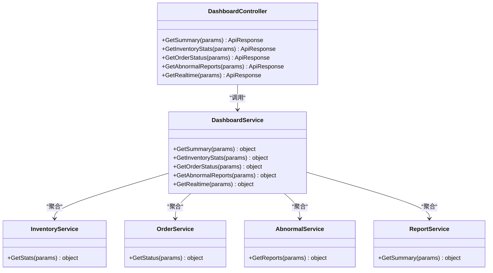

# 仪表盘控制器

<cite>
**本文档引用的文件**   
- [DashboardController.cs](file://dip-system/api/Controllers/DashboardController.cs)
- [DashboardService.cs](file://dip-system/api/Services/DashboardService.cs)
- [InventoryService.cs](file://dip-system/api/Services/InventoryService.cs)
- [OrderService.cs](file://dip-system/api/Services/OrderService.cs)
- [AbnormalService.cs](file://dip-system/api/Services/AbnormalService.cs)
- [ReportService.cs](file://dip-system/api/Services/ReportService.cs)
- [AppExceptionFilter.cs](file://dip-system/api/Controllers/AppExceptionFilter.cs)
- [ApiResponse.cs](file://dip-system/api/Models/ApiResponse.cs)
- [Program.cs](file://dip-system/api/Program.cs)
- [appsettings.json](file://dip-system/api/appsettings.json)
</cite>

## 目录
1. [简介](#简介)
2. [项目结构](#项目结构)
3. [核心组件](#核心组件)
4. [架构总览](#架构总览)
5. [详细组件分析](#详细组件分析)
6. [依赖关系分析](#依赖关系分析)
7. [性能考虑](#性能考虑)
8. [故障排查指南](#故障排查指南)
9. [结论](#结论)
10. [附录：API 文档与使用示例](#附录api-文档与使用示例)

## 简介
本文件为 DIP 物料管理系统的“仪表盘控制器”提供完整的技术与使用文档，覆盖数据聚合、统计报表、实时监控等能力。重点说明库存统计、订单状态、异常报告等关键指标的获取接口，解释数据缓存策略与性能优化方案，并提供完整的 API 定义、参数说明与调用示例，帮助前端与移动端快速集成。

## 项目结构
DIP 系统采用前后端分离架构，后端基于 ASP.NET Core Web API，仪表盘相关功能集中在 Controllers 与 Services 层：
- 控制器层：DashboardController 暴露仪表盘相关 REST 接口
- 服务层：DashboardService 负责指标聚合与计算；各业务 Service（如 InventoryService、OrderService、AbnormalService、ReportService）提供底层数据访问与统计
- 模型与响应：统一 ApiResponse 封装返回结构
- 异常处理：全局异常过滤器 AppExceptionFilter 统一错误格式
- 配置与启动：Program.cs 注册服务与中间件；appsettings.json 提供运行时配置

图表来源
- [DashboardController.cs](file://dip-system/api/Controllers/DashboardController.cs)
- [DashboardService.cs](file://dip-system/api/Services/DashboardService.cs)
- [InventoryService.cs](file://dip-system/api/Services/InventoryService.cs)
- [OrderService.cs](file://dip-system/api/Services/OrderService.cs)
- [AbnormalService.cs](file://dip-system/api/Services/AbnormalService.cs)
- [ReportService.cs](file://dip-system/api/Services/ReportService.cs)
- [AppExceptionFilter.cs](file://dip-system/api/Controllers/AppExceptionFilter.cs)

章节来源
- [Program.cs](file://dip-system/api/Program.cs)
- [appsettings.json](file://dip-system/api/appsettings.json)

## 核心组件
- DashboardController：对外暴露仪表盘接口，接收请求参数，调用 DashboardService 完成聚合，并返回统一 ApiResponse。
- DashboardService：编排多源数据聚合逻辑，组合库存、订单、异常、报表等指标，支持时间范围过滤、分页、排序等查询条件。
- 业务服务：InventoryService、OrderService、AbnormalService、ReportService 分别提供库存、订单、异常、报表的查询与统计能力。
- 统一响应与异常：ApiResponse 作为标准返回体；AppExceptionFilter 捕获未处理异常并转换为统一错误结构。

章节来源
- [DashboardController.cs](file://dip-system/api/Controllers/DashboardController.cs)
- [DashboardService.cs](file://dip-system/api/Services/DashboardService.cs)
- [InventoryService.cs](file://dip-system/api/Services/InventoryService.cs)
- [OrderService.cs](file://dip-system/api/Services/OrderService.cs)
- [AbnormalService.cs](file://dip-system/api/Services/AbnormalService.cs)
- [ReportService.cs](file://dip-system/api/Services/ReportService.cs)
- [ApiResponse.cs](file://dip-system/api/Models/ApiResponse.cs)
- [AppExceptionFilter.cs](file://dip-system/api/Controllers/AppExceptionFilter.cs)

## 架构总览
仪表盘的数据流遵循“控制器→服务→数据源”的分层模式，DashboardService 作为聚合中心，协调多个业务服务完成指标计算，最终由控制器以统一格式返回。

图表来源
- [DashboardController.cs](file://dip-system/api/Controllers/DashboardController.cs)
- [DashboardService.cs](file://dip-system/api/Services/DashboardService.cs)
- [InventoryService.cs](file://dip-system/api/Services/InventoryService.cs)
- [OrderService.cs](file://dip-system/api/Services/OrderService.cs)
- [AbnormalService.cs](file://dip-system/api/Services/AbnormalService.cs)
- [ReportService.cs](file://dip-system/api/Services/ReportService.cs)

## 详细组件分析

### DashboardController
职责与行为
- 暴露仪表盘相关 REST 接口，包括汇总、库存统计、订单状态、异常报告、实时看板等。
- 解析查询参数（时间范围、分页、排序、筛选条件），校验输入合法性。
- 调用 DashboardService 获取聚合数据，并以 ApiResponse 统一返回。
- 通过全局异常过滤器捕获异常，避免直接抛出堆栈信息。

典型接口
- GET /api/dashboard/summary：仪表盘汇总（库存、订单、异常、报表）
- GET /api/dashboard/inventory-stats：库存统计（按仓库/品类/状态）
- GET /api/dashboard/order-status：订单状态分布（待处理、进行中、已完成、异常）
- GET /api/dashboard/abnormal-reports：异常报告（按类型、严重等级、时间）
- GET /api/dashboard/realtime：实时监控（近 N 分钟指标趋势）

参数与返回
- 查询参数：timeRange（如 today/week/month/custom）、startTime、endTime、page、pageSize、sortField、sortOrder、filters（JSON）
- 返回体：ApiResponse<T>，包含 data、message、code

章节来源
- [DashboardController.cs](file://dip-system/api/Controllers/DashboardController.cs)
- [ApiResponse.cs](file://dip-system/api/Models/ApiResponse.cs)

### DashboardService
职责与行为
- 编排多源数据聚合：库存、订单、异常、报表等。
- 实现缓存策略：优先从内存缓存读取，未命中则查询各业务服务并回填缓存。
- 支持时间窗口过滤、分组统计、TopN 排行、趋势计算。
- 对异常进行降级与兜底：当某服务不可用时返回空或默认值，保证整体可用性。

关键方法
- GetSummary(params)：汇总仪表盘数据
- GetInventoryStats(params)：库存统计聚合
- GetOrderStatus(params)：订单状态统计
- GetAbnormalReports(params)：异常报告聚合
- GetRealtime(params)：实时指标采集与聚合

章节来源
- [DashboardService.cs](file://dip-system/api/Services/DashboardService.cs)

### 业务服务（InventoryService、OrderService、AbnormalService、ReportService）
职责与行为
- InventoryService：提供库存数量、在途、缺货、库龄等统计。
- OrderService：提供订单状态分布、完成率、平均处理时长等。
- AbnormalService：提供异常分类、严重等级、处理时效等。
- ReportService：提供报表汇总、同比环比、KPI 达成率等。

章节来源
- [InventoryService.cs](file://dip-system/api/Services/InventoryService.cs)
- [OrderService.cs](file://dip-system/api/Services/OrderService.cs)
- [AbnormalService.cs](file://dip-system/api/Services/AbnormalService.cs)
- [ReportService.cs](file://dip-system/api/Services/ReportService.cs)

### 统一响应与异常处理
- ApiResponse：统一封装成功/失败响应结构，便于前端一致处理。
- AppExceptionFilter：全局异常拦截，将未处理异常转换为 ApiResponse 错误格式，避免泄露内部细节。

章节来源
- [ApiResponse.cs](file://dip-system/api/Models/ApiResponse.cs)
- [AppExceptionFilter.cs](file://dip-system/api/Controllers/AppExceptionFilter.cs)

## 依赖关系分析
DashboardController 依赖 DashboardService；DashboardService 依赖各业务服务；业务服务依赖数据层（数据库/缓存）。该分层设计降低了耦合度，提升了可测试性与可维护性。

图表来源
- [DashboardController.cs](file://dip-system/api/Controllers/DashboardController.cs)
- [DashboardService.cs](file://dip-system/api/Services/DashboardService.cs)
- [InventoryService.cs](file://dip-system/api/Services/InventoryService.cs)
- [OrderService.cs](file://dip-system/api/Services/OrderService.cs)
- [AbnormalService.cs](file://dip-system/api/Services/AbnormalService.cs)
- [ReportService.cs](file://dip-system/api/Services/ReportService.cs)

章节来源
- [Program.cs](file://dip-system/api/Program.cs)

## 性能考虑
- 缓存策略
  - 使用内存缓存（IMemoryCache）存储仪表盘聚合结果，减少重复计算与数据库压力。
  - 缓存键包含时间范围、筛选条件、分页参数等，确保数据一致性。
  - 设置合理的过期时间与刷新策略（如定时刷新热点数据）。
- 查询优化
  - 在服务层进行必要的预聚合与索引利用，避免全表扫描。
  - 对高频查询字段建立复合索引，提升检索效率。
- 异步与并发
  - 使用异步 I/O 与并行聚合，缩短端到端响应时间。
  - 对慢依赖进行超时控制与熔断降级。
- 限流与保护
  - 对仪表盘接口实施速率限制，防止恶意刷取。
  - 对大数据量查询增加分页与上限保护。

[本节为通用性能建议，不直接分析具体文件]

## 故障排查指南
常见问题与定位步骤
- 接口返回 5xx 错误
  - 检查全局异常过滤器是否捕获异常并返回统一错误结构。
  - 查看日志中是否有数据库连接失败、超时或空引用异常。
- 数据不一致或延迟
  - 确认缓存键是否正确包含查询参数。
  - 检查缓存过期策略与刷新任务是否正常执行。
- 性能退化
  - 监控数据库慢查询与索引命中率。
  - 评估聚合逻辑是否存在 N+1 查询问题。
- 权限与认证
  - 确认请求是否携带有效 Token，鉴权中间件是否放行。

章节来源
- [AppExceptionFilter.cs](file://dip-system/api/Controllers/AppExceptionFilter.cs)
- [DashboardService.cs](file://dip-system/api/Services/DashboardService.cs)

## 结论
仪表盘控制器通过清晰的分层设计与统一的响应格式，提供了稳定、可扩展的指标聚合能力。结合缓存与异步优化，能够在高并发场景下保持良好性能。建议在后续迭代中持续完善缓存策略、监控告警与错误追踪，以提升系统可靠性与可观测性。

[本节为总结性内容，不直接分析具体文件]

## 附录：API 文档与使用示例

### 通用响应结构
- 响应体：ApiResponse<T>
- 字段说明
  - code：状态码（如 200 成功，非 200 表示异常）
  - message：消息描述
  - data：业务数据（对象或数组）

章节来源
- [ApiResponse.cs](file://dip-system/api/Models/ApiResponse.cs)

### 接口清单与参数说明
- GET /api/dashboard/summary
  - 描述：仪表盘汇总（库存、订单、异常、报表）
  - 查询参数
    - timeRange：today/week/month/custom
    - startTime：开始时间（ISO 8601）
    - endTime：结束时间（ISO 8601）
    - page：页码（默认 1）
    - pageSize：每页条数（默认 20）
    - sortField：排序字段
    - sortOrder：asc/desc
    - filters：JSON 字符串，包含额外筛选条件
  - 返回：ApiResponse<object>

- GET /api/dashboard/inventory-stats
  - 描述：库存统计（按仓库、品类、状态）
  - 查询参数：同上
  - 返回：ApiResponse<object>

- GET /api/dashboard/order-status
  - 描述：订单状态分布（待处理、进行中、已完成、异常）
  - 查询参数：同上
  - 返回：ApiResponse<object>

- GET /api/dashboard/abnormal-reports
  - 描述：异常报告（按类型、严重等级、时间）
  - 查询参数：同上
  - 返回：ApiResponse<object>

- GET /api/dashboard/realtime
  - 描述：实时监控（近 N 分钟指标趋势）
  - 查询参数：minutes（默认 5）、timeRange、filters
  - 返回：ApiResponse<object>

章节来源
- [DashboardController.cs](file://dip-system/api/Controllers/DashboardController.cs)

### 使用示例（请求与响应）
- 请求示例
  - GET /api/dashboard/summary?timeRange=today&page=1&pageSize=20
- 响应示例
  - {
      "code": 200,
      "message": "成功",
      "data": {
        "inventory": { ... },
        "orders": { ... },
        "abnormal": { ... },
        "reports": { ... }
      }
    }

章节来源
- [DashboardController.cs](file://dip-system/api/Controllers/DashboardController.cs)
- [ApiResponse.cs](file://dip-system/api/Models/ApiResponse.cs)

### 数据模型与字段说明（概览）
- 库存统计
  - 字段：仓库、品类、可用数量、在途数量、缺货数量、库龄分布
- 订单状态
  - 字段：状态、数量、占比、平均处理时长
- 异常报告
  - 字段：类型、严重等级、发生次数、处理时效、责任人
- 报表汇总
  - 字段：KPI 名称、目标值、实际值、达成率、趋势

[本节为概念性说明，不直接分析具体文件]

### 缓存与性能优化要点
- 缓存键生成规则：包含 timeRange、filters、page、pageSize 等影响结果的参数
- 过期策略：热点数据短过期（如 1-5 分钟），低频数据长过期（如 15-30 分钟）
- 预热机制：系统启动或定时任务预热常用查询
- 降级策略：当某服务不可用时返回空集合或默认值，保证整体可用性

章节来源
- [DashboardService.cs](file://dip-system/api/Services/DashboardService.cs)