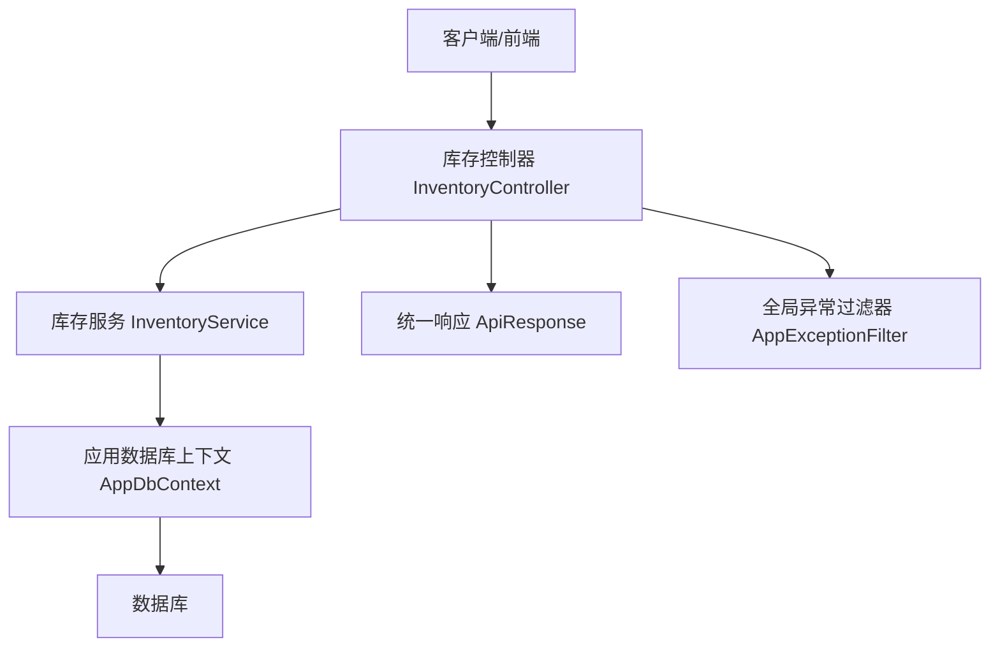
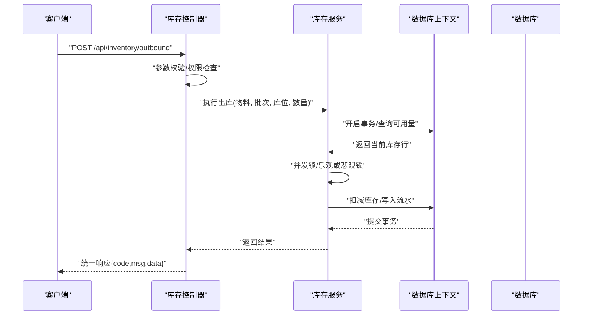
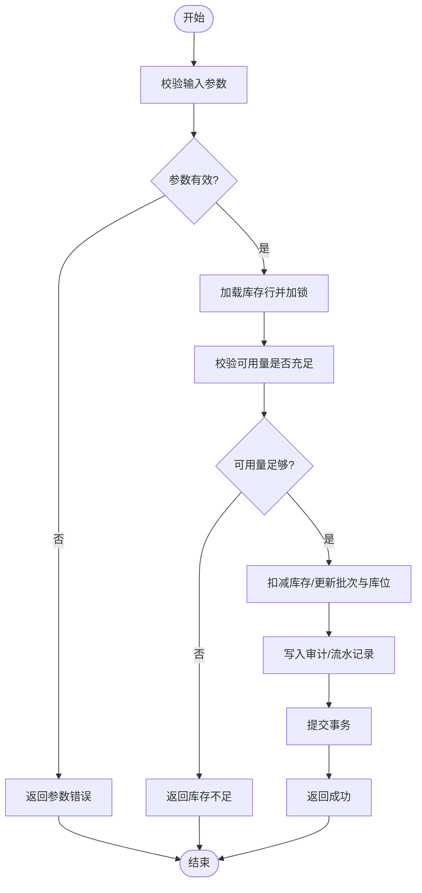
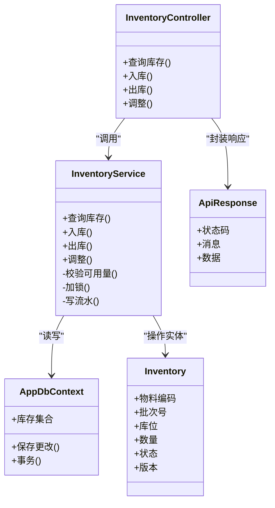

# 库存管理控制器

<cite>
**本文引用的文件**   
- [InventoryController.cs](file://dip-system/api/Controllers/InventoryController.cs)
- [InventoryService.cs](file://dip-system/api/Services/InventoryService.cs)
- [Inventory.cs](file://dip-system/api/Models/Inventory.cs)
- [AppDbContext.cs](file://dip-system/api/Data/AppDbContext.cs)
- [ApiResponse.cs](file://dip-system/api/Models/ApiResponse.cs)
- [AppExceptionFilter.cs](file://dip-system/api/Controllers/AppExceptionFilter.cs)
- [Program.cs](file://dip-system/api/Program.cs)
- [appsettings.json](file://dip-system/api/appsettings.json)
</cite>

## 目录
1. [简介](#简介)
2. [项目结构](#项目结构)
3. [核心组件](#核心组件)
4. [架构总览](#架构总览)
5. [详细组件分析](#详细组件分析)
6. [依赖关系分析](#依赖关系分析)
7. [性能考虑](#性能考虑)
8. [故障排查指南](#故障排查指南)
9. [结论](#结论)
10. [附录：API端点文档](#附录api端点文档)

## 简介
本文件面向DIP物料管理系统的“库存管理控制器”模块，聚焦库存查询、入库出库、库存调整等核心业务，覆盖数据结构（含批次与位置跟踪）、并发控制、事务处理与数据一致性保证机制，并提供完整的API端点说明、调用示例与错误处理策略。读者无需深入代码即可理解系统如何工作以及如何正确调用接口。

## 项目结构
库存相关能力由控制器层、服务层、数据模型与数据库上下文共同构成：
- 控制器层：对外暴露REST API，负责请求校验、参数绑定与响应封装
- 服务层：实现库存业务逻辑（查询、出入库、调整、批号与库位追踪）
- 数据模型：定义库存实体、审计字段、统一响应体等
- 数据访问：通过Entity Framework Core的DbContext进行持久化操作
- 异常与配置：全局异常过滤器与应用程序配置

图表来源
- [InventoryController.cs](file://dip-system/api/Controllers/InventoryController.cs)
- [InventoryService.cs](file://dip-system/api/Services/InventoryService.cs)
- [AppDbContext.cs](file://dip-system/api/Data/AppDbContext.cs)
- [ApiResponse.cs](file://dip-system/api/Models/ApiResponse.cs)
- [AppExceptionFilter.cs](file://dip-system/api/Controllers/AppExceptionFilter.cs)

章节来源
- [Program.cs](file://dip-system/api/Program.cs)
- [appsettings.json](file://dip-system/api/appsettings.json)

## 核心组件
- 库存控制器（InventoryController）
  - 职责：接收HTTP请求，路由到服务层方法，返回统一响应
  - 关键能力：库存查询、入库、出库、库存调整、批量操作、搜索过滤
- 库存服务（InventoryService）
  - 职责：实现库存领域逻辑，包括批次与库位追踪、并发控制、事务边界
  - 关键能力：数量校验、可用量计算、锁定与重试、审计记录
- 数据模型（Inventory）
  - 职责：描述库存实体属性（如物料编码、批次、库位、数量、状态等）
- 数据库上下文（AppDbContext）
  - 职责：EF Core上下文，提供DbSet与映射配置
- 统一响应（ApiResponse）
  - 职责：标准化成功/失败响应格式
- 异常过滤器（AppExceptionFilter）
  - 职责：捕获未处理异常并转换为统一错误响应

章节来源
- [InventoryController.cs](file://dip-system/api/Controllers/InventoryController.cs)
- [InventoryService.cs](file://dip-system/api/Services/InventoryService.cs)
- [Inventory.cs](file://dip-system/api/Models/Inventory.cs)
- [AppDbContext.cs](file://dip-system/api/Data/AppDbContext.cs)
- [ApiResponse.cs](file://dip-system/api/Models/ApiResponse.cs)
- [AppExceptionFilter.cs](file://dip-system/api/Controllers/AppExceptionFilter.cs)

## 架构总览
库存管理采用典型的三层架构：控制器→服务→数据访问。服务层承担业务规则与一致性保障，控制器仅做请求编排与响应包装。

图表来源
- [InventoryController.cs](file://dip-system/api/Controllers/InventoryController.cs)
- [InventoryService.cs](file://dip-system/api/Services/InventoryService.cs)
- [AppDbContext.cs](file://dip-system/api/Data/AppDbContext.cs)

## 详细组件分析

### 库存控制器（InventoryController）
- 设计要点
  - 使用RESTful风格路由，按资源命名组织端点
  - 输入参数校验（必填、范围、格式），非法请求直接返回错误
  - 将业务调用委托给服务层，不直接访问数据库
  - 统一响应体封装，便于前端解析
- 典型流程
  - 接收请求 → 参数校验 → 调用服务 → 捕获异常 → 返回统一响应
- 并发与事务
  - 控制器本身不持有事务，事务在服务层内管理
  - 对高并发场景，控制器可结合限流/幂等键（若服务支持）

章节来源
- [InventoryController.cs](file://dip-system/api/Controllers/InventoryController.cs)
- [ApiResponse.cs](file://dip-system/api/Models/ApiResponse.cs)
- [AppExceptionFilter.cs](file://dip-system/api/Controllers/AppExceptionFilter.cs)

### 库存服务（InventoryService）
- 设计要点
  - 以领域为中心组织方法：查询、入库、出库、调整、盘点差异处理
  - 批次管理：维护批次号、生产日期/有效期、入库时间等
  - 位置跟踪：记录库区/货架/货位，支持先进先出或指定批次出库
  - 并发控制：采用乐观锁（版本号）或数据库行级锁，避免超卖
  - 事务处理：每个写操作在事务中完成，确保原子性
- 关键算法与流程
  - 可用量计算：根据批次与库位聚合，考虑冻结/预留数量
  - 出库扣减：优先FIFO或按策略选择批次，扣减后生成出库流水
  - 库存调整：需审批流或审计记录，支持正负调整
- 错误处理
  - 业务异常（如库存不足、批次不存在）抛出明确异常
  - 数据异常（如并发冲突）触发重试或回滚

图表来源
- [InventoryService.cs](file://dip-system/api/Services/InventoryService.cs)
- [AppDbContext.cs](file://dip-system/api/Data/AppDbContext.cs)

章节来源
- [InventoryService.cs](file://dip-system/api/Services/InventoryService.cs)
- [Inventory.cs](file://dip-system/api/Models/Inventory.cs)
- [AppDbContext.cs](file://dip-system/api/Data/AppDbContext.cs)

### 数据模型（Inventory）
- 关键字段（概念性说明）
  - 物料标识、批次号、库位标识、数量、状态、版本（用于乐观锁）
  - 创建/更新时间、操作人、备注等审计字段
- 关系与约束
  - 唯一性：同一物料+批次+库位的组合应唯一
  - 非负约束：数量字段不得为负
  - 外键关联：与物料主数据、库位主数据关联（若存在）

章节来源
- [Inventory.cs](file://dip-system/api/Models/Inventory.cs)

### 数据库上下文（AppDbContext）
- 职责
  - 注册DbSet，配置实体映射与索引（如物料+批次+库位）
  - 提供事务与查询优化（如AsNoTracking用于只读查询）
- 性能建议
  - 对高频查询建立合适索引
  - 分页与投影减少数据传输

章节来源
- [AppDbContext.cs](file://dip-system/api/Data/AppDbContext.cs)

### 统一响应与异常处理
- 统一响应（ApiResponse）
  - 包含状态码、消息、数据体，便于前端一致化处理
- 全局异常过滤器（AppExceptionFilter）
  - 捕获未处理异常，转换为统一错误格式
  - 区分业务异常与系统异常，避免泄露敏感信息

章节来源
- [ApiResponse.cs](file://dip-system/api/Models/ApiResponse.cs)
- [AppExceptionFilter.cs](file://dip-system/api/Controllers/AppExceptionFilter.cs)

## 依赖关系分析
- 控制器依赖服务，服务依赖数据库上下文
- 统一响应与异常过滤器贯穿控制器层
- 数据模型被服务与上下文共同使用

图表来源
- [InventoryController.cs](file://dip-system/api/Controllers/InventoryController.cs)
- [InventoryService.cs](file://dip-system/api/Services/InventoryService.cs)
- [Inventory.cs](file://dip-system/api/Models/Inventory.cs)
- [AppDbContext.cs](file://dip-system/api/Data/AppDbContext.cs)
- [ApiResponse.cs](file://dip-system/api/Models/ApiResponse.cs)

章节来源
- [Program.cs](file://dip-system/api/Program.cs)
- [appsettings.json](file://dip-system/api/appsettings.json)

## 性能考虑
- 查询优化
  - 使用分页与必要字段投影，避免全表扫描
  - 对常用过滤条件（物料、批次、库位）建立索引
- 并发与锁
  - 优先乐观锁（版本号），减少锁竞争；必要时降级为行级锁
  - 对热点物料设置短事务与快速失败策略
- 事务边界
  - 尽量缩小事务范围，避免长事务导致阻塞
- 缓存策略
  - 对只读热点数据（如库位字典）可使用内存缓存（注意失效策略）

[本节为通用指导，不直接分析具体文件]

## 故障排查指南
- 常见错误
  - 参数校验失败：检查必填项、数据类型与取值范围
  - 库存不足：确认批次与库位可用量，检查是否有预留/冻结
  - 并发冲突：观察版本号变化，增加重试或提示用户稍后重试
  - 事务失败：检查数据库连接与死锁日志
- 定位步骤
  - 查看统一响应的状态码与消息
  - 启用服务层日志，记录关键变量（物料、批次、库位、数量、版本）
  - 检查数据库事务日志与锁等待情况

章节来源
- [AppExceptionFilter.cs](file://dip-system/api/Controllers/AppExceptionFilter.cs)
- [InventoryService.cs](file://dip-system/api/Services/InventoryService.cs)

## 结论
库存管理控制器通过清晰的层次划分与严谨的服务层实现，提供了可靠的库存查询、出入库与调整能力。借助批次与库位追踪、并发控制与事务保障，系统在复杂生产环境下仍能保持数据一致性与高性能。配合统一响应与全局异常处理，前后端交互稳定可靠。

[本节为总结性内容，不直接分析具体文件]

## 附录：API端点文档
以下为库存管理的典型API端点说明（基于控制器与服务职责归纳）。实际字段与行为以控制器与服务实现为准。

- 库存查询
  - 方法：GET
  - 路径：/api/inventory
  - 功能：按物料、批次、库位、状态等条件查询库存
  - 请求参数：物料编码、批次号、库位、页码、每页条数
  - 响应：统一响应体，包含分页数据列表
  - 错误：参数无效、无权限、数据库异常

- 入库
  - 方法：POST
  - 路径：/api/inventory/inbound
  - 功能：新增或增加库存数量，支持批次与库位登记
  - 请求体：物料编码、批次号、库位、数量、供应商/来源单号、备注
  - 响应：统一响应体，包含入库流水ID
  - 错误：参数无效、库存不足（反向场景）、并发冲突

- 出库
  - 方法：POST
  - 路径：/api/inventory/outbound
  - 功能：扣减库存，支持FIFO或指定批次出库
  - 请求体：物料编码、批次号（可选）、库位（可选）、数量、目标单号
  - 响应：统一响应体，包含出库流水ID
  - 错误：库存不足、批次不存在、并发冲突

- 库存调整
  - 方法：POST
  - 路径：/api/inventory/adjustment
  - 功能：对指定物料+批次+库位进行正负调整，需审计记录
  - 请求体：物料编码、批次号、库位、调整数量、原因、操作人
  - 响应：统一响应体，包含调整流水ID
  - 错误：参数无效、调整超限、并发冲突

- 批量处理
  - 方法：POST
  - 路径：/api/inventory/batch
  - 功能：批量入库/出库/调整，内部事务保证一致性
  - 请求体：操作类型、明细数组（每项包含物料、批次、库位、数量等）
  - 响应：统一响应体，包含成功/失败明细
  - 错误：部分失败时返回明细错误，整体回滚或按策略处理

- 搜索与过滤
  - 方法：GET
  - 路径：/api/inventory/search
  - 功能：多条件组合查询，支持模糊匹配与范围筛选
  - 请求参数：关键词、日期范围、库区、状态等
  - 响应：统一响应体，包含搜索结果与分页信息
  - 错误：参数无效、查询超时

- 幂等与重试
  - 建议在请求头携带幂等键（如订单号+操作类型）
  - 服务端对重复请求返回相同结果，避免重复扣减

章节来源
- [InventoryController.cs](file://dip-system/api/Controllers/InventoryController.cs)
- [InventoryService.cs](file://dip-system/api/Services/InventoryService.cs)
- [ApiResponse.cs](file://dip-system/api/Models/ApiResponse.cs)