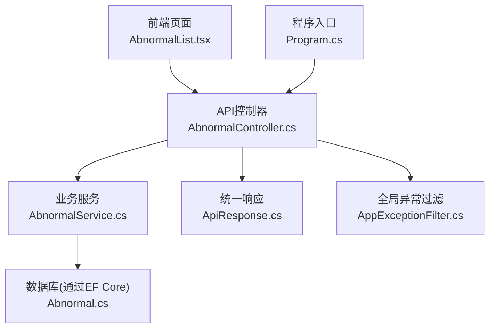
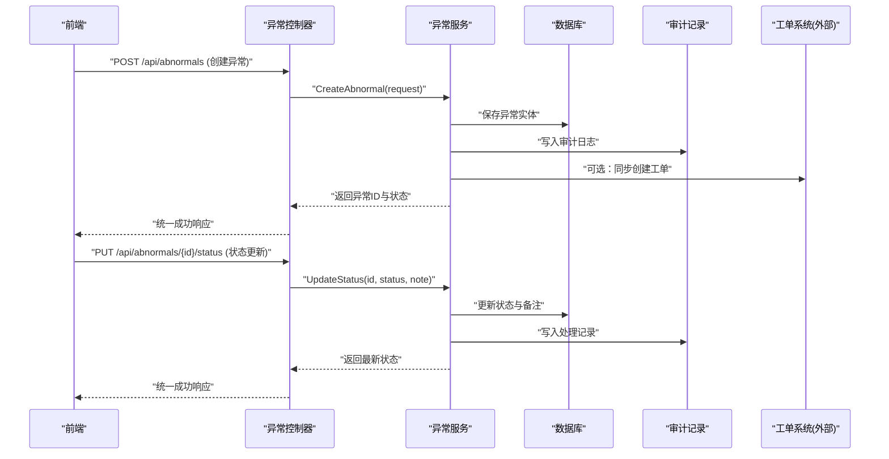
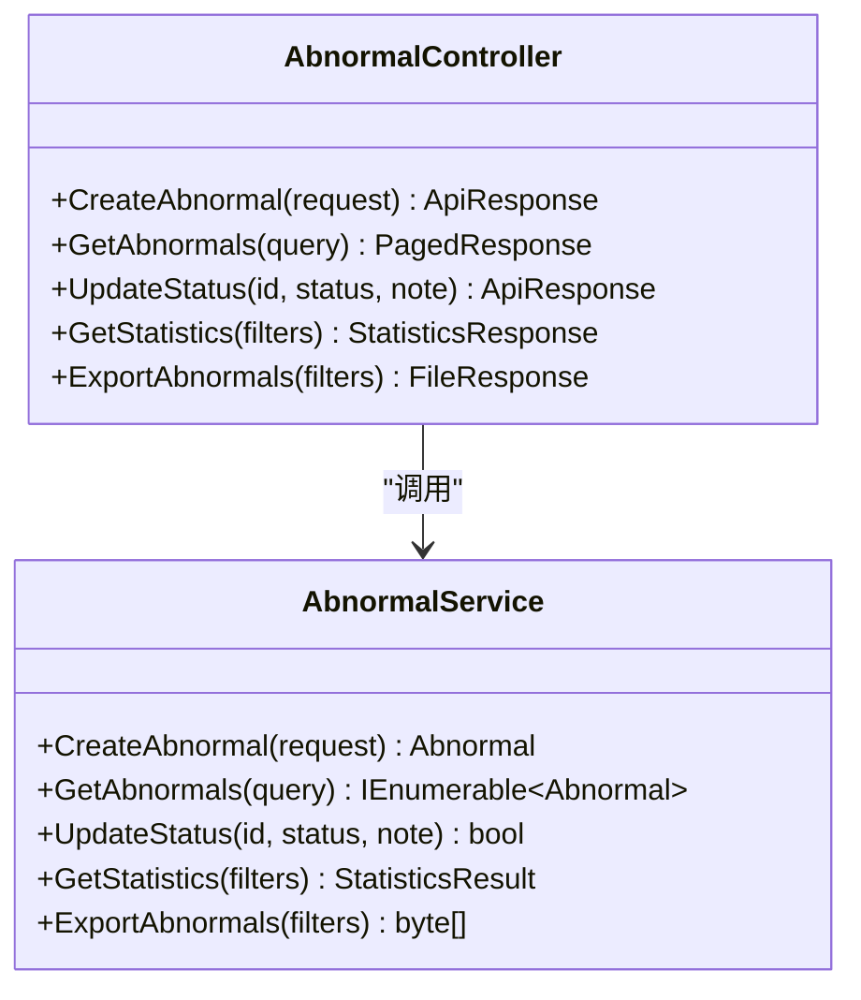
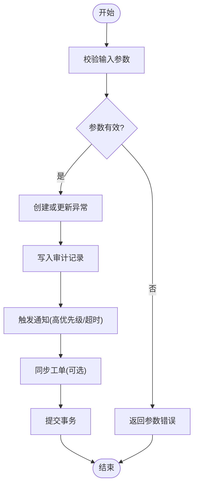
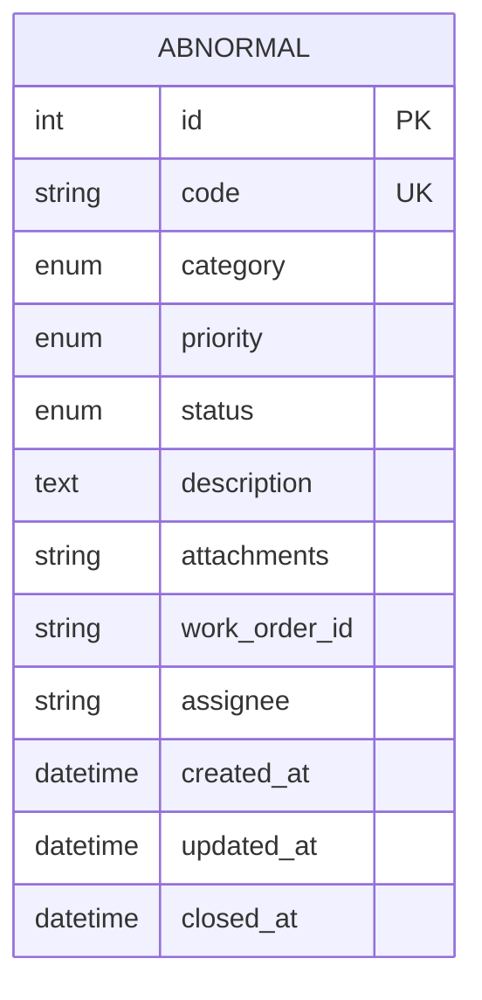
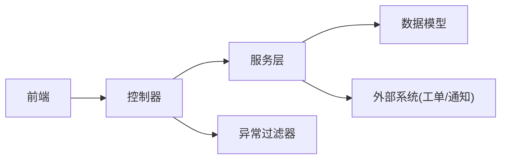

# 异常管理控制器

<cite>
**本文引用的文件**   
- [AbnormalController.cs](file://dip-system/api/Controllers/AbnormalController.cs)
- [AbnormalService.cs](file://dip-system/api/Services/AbnormalService.cs)
- [Abnormal.cs](file://dip-system/api/Models/Abnormal.cs)
- [ApiResponse.cs](file://dip-system/api/Models/ApiResponse.cs)
- [AppExceptionFilter.cs](file://dip-system/api/Controllers/AppExceptionFilter.cs)
- [Program.cs](file://dip-system/api/Program.cs)
- [AbnormalList.tsx](file://dip-system/frontend-web/src/pages/AbnormalList.tsx)
- [api.ts](file://dip-system/frontend-web/src/lib/api.ts)
</cite>

## 目录
1. [简介](#简介)
2. [项目结构](#项目结构)
3. [核心组件](#核心组件)
4. [架构总览](#架构总览)
5. [详细组件分析](#详细组件分析)
6. [依赖关系分析](#依赖关系分析)
7. [性能考虑](#性能考虑)
8. [故障排查指南](#故障排查指南)
9. [结论](#结论)
10. [附录：API端点文档与调用示例](#附录api端点文档与调用示例)

## 简介
本文件面向DIP物料管理系统的“异常管理”模块，围绕异常上报、处理、跟踪、关闭等完整生命周期进行说明。内容涵盖异常分类与优先级、通知机制、与工单系统的集成思路、处理记录审计，以及完整的API端点说明（CRUD、状态更新、统计分析）和前端调用示例。读者可据此快速理解异常管理的业务闭环与系统实现要点。

## 项目结构
异常管理相关代码主要位于后端API层与服务层，以及前端页面与API封装中：
- 控制器：AbnormalController.cs 暴露REST接口
- 服务层：AbnormalService.cs 承载业务逻辑
- 数据模型：Abnormal.cs 定义异常实体字段与约束
- 统一响应：ApiResponse.cs 规范返回格式
- 全局异常过滤：AppExceptionFilter.cs 捕获并标准化异常
- 程序入口：Program.cs 注册中间件与路由
- 前端页面：AbnormalList.tsx 提供异常列表与操作界面
- 前端API封装：api.ts 封装HTTP请求与错误处理

**图表来源** 
- [AbnormalController.cs](file://dip-system/api/Controllers/AbnormalController.cs)
- [AbnormalService.cs](file://dip-system/api/Services/AbnormalService.cs)
- [Abnormal.cs](file://dip-system/api/Models/Abnormal.cs)
- [ApiResponse.cs](file://dip-system/api/Models/ApiResponse.cs)
- [AppExceptionFilter.cs](file://dip-system/api/Controllers/AppExceptionFilter.cs)
- [Program.cs](file://dip-system/api/Program.cs)
- [AbnormalList.tsx](file://dip-system/frontend-web/src/pages/AbnormalList.tsx)
- [api.ts](file://dip-system/frontend-web/src/lib/api.ts)

**章节来源**
- [AbnormalController.cs](file://dip-system/api/Controllers/AbnormalController.cs)
- [AbnormalService.cs](file://dip-system/api/Services/AbnormalService.cs)
- [Abnormal.cs](file://dip-system/api/Models/Abnormal.cs)
- [ApiResponse.cs](file://dip-system/api/Models/ApiResponse.cs)
- [AppExceptionFilter.cs](file://dip-system/api/Controllers/AppExceptionFilter.cs)
- [Program.cs](file://dip-system/api/Program.cs)
- [AbnormalList.tsx](file://dip-system/frontend-web/src/pages/AbnormalList.tsx)
- [api.ts](file://dip-system/frontend-web/src/lib/api.ts)

## 核心组件
- 异常控制器（AbnormalController）
  - 职责：接收HTTP请求，参数校验，调用服务层，返回统一响应
  - 关键能力：异常创建、查询、分页、状态流转（处理中、已解决、已关闭）、统计汇总、导出
- 异常服务（AbnormalService）
  - 职责：实现异常生命周期管理、分类与优先级策略、通知触发、审计记录写入、与外部系统（如工单）集成
  - 关键能力：创建异常、变更状态、关联工单、生成处理记录、统计聚合
- 异常模型（Abnormal）
  - 职责：定义异常实体的字段、枚举、约束与索引
  - 关键字段：编号、分类、优先级、状态、描述、图片附件、关联工单号、责任人、时间戳、审计字段
- 统一响应（ApiResponse）
  - 职责：标准化成功/失败响应结构，便于前后端一致交互
- 全局异常过滤（AppExceptionFilter）
  - 职责：捕获未处理异常，转换为统一错误响应，避免泄露敏感信息
- 程序入口（Program）
  - 职责：注册异常过滤器、路由、服务依赖注入、跨域与认证配置

**章节来源**
- [AbnormalController.cs](file://dip-system/api/Controllers/AbnormalController.cs)
- [AbnormalService.cs](file://dip-system/api/Services/AbnormalService.cs)
- [Abnormal.cs](file://dip-system/api/Models/Abnormal.cs)
- [ApiResponse.cs](file://dip-system/api/Models/ApiResponse.cs)
- [AppExceptionFilter.cs](file://dip-system/api/Controllers/AppExceptionFilter.cs)
- [Program.cs](file://dip-system/api/Program.cs)

## 架构总览
异常管理采用典型的三层架构：控制器负责HTTP契约，服务层承载业务规则，数据模型映射持久化结构。全局异常过滤器确保错误路径一致性；统一响应体简化前端处理。

**图表来源** 
- [AbnormalController.cs](file://dip-system/api/Controllers/AbnormalController.cs)
- [AbnormalService.cs](file://dip-system/api/Services/AbnormalService.cs)
- [Abnormal.cs](file://dip-system/api/Models/Abnormal.cs)
- [ApiResponse.cs](file://dip-system/api/Models/ApiResponse.cs)

## 详细组件分析

### 异常控制器（AbnormalController）
- 设计模式：RESTful风格，按资源命名；使用统一响应包装器
- 关键方法：
  - 创建异常：接收分类、优先级、描述、附件等，调用服务层创建并返回结果
  - 查询与分页：支持按分类、状态、优先级、时间范围筛选，返回分页数据
  - 状态更新：支持从“待处理”到“处理中”、“已解决”、“已关闭”的流转，附带处理备注
  - 统计接口：按分类、状态、时间段聚合计数，用于看板展示
  - 导出接口：将筛选结果导出为CSV或Excel（视实现而定）
- 错误处理：参数校验失败返回400；业务异常由服务层抛出，被全局过滤器捕获并转为统一错误响应

**图表来源** 
- [AbnormalController.cs](file://dip-system/api/Controllers/AbnormalController.cs)
- [AbnormalService.cs](file://dip-system/api/Services/AbnormalService.cs)

**章节来源**
- [AbnormalController.cs](file://dip-system/api/Controllers/AbnormalController.cs)

### 异常服务（AbnormalService）
- 业务规则：
  - 分类与优先级：根据分类自动设定默认优先级，或允许用户覆盖；高优先级异常需立即通知
  - 状态机：待处理 → 处理中 → 已解决 → 已关闭；每步变更需记录处理人、时间与备注
  - 审计记录：每次状态变更、重要操作均写入审计表，支持追溯
  - 工单集成：创建异常时可同步创建工单；状态变更时回写工单状态（双向同步）
  - 通知机制：高优先级或超时未处理的异常触发站内消息、邮件或短信（通过外部通知服务）
- 数据访问：通过EF Core对Abnormal实体进行增删改查；复杂查询使用LINQ优化
- 事务与并发：状态更新使用乐观锁或行级锁防止并发冲突

**图表来源** 
- [AbnormalService.cs](file://dip-system/api/Services/AbnormalService.cs)
- [Abnormal.cs](file://dip-system/api/Models/Abnormal.cs)

**章节来源**
- [AbnormalService.cs](file://dip-system/api/Services/AbnormalService.cs)

### 异常模型（Abnormal）
- 字段说明：
  - 编号：唯一标识，自动生成或业务编码
  - 分类：如设备异常、物料短缺、质量缺陷等
  - 优先级：低、中、高、紧急
  - 状态：待处理、处理中、已解决、已关闭
  - 描述：文本详情，支持富文本或Markdown
  - 附件：图片、截图、日志文件URL
  - 关联工单号：与外部工单系统对接
  - 责任人：处理人或团队
  - 时间戳：创建时间、更新时间、关闭时间
  - 审计字段：创建人、修改人、删除标记等
- 约束与索引：
  - 编号唯一索引
  - 分类、状态、优先级组合索引以优化查询
  - 时间范围查询索引提升统计性能

**图表来源** 
- [Abnormal.cs](file://dip-system/api/Models/Abnormal.cs)

**章节来源**
- [Abnormal.cs](file://dip-system/api/Models/Abnormal.cs)

### 统一响应（ApiResponse）
- 结构：包含状态码、消息、数据体三部分
- 用途：所有接口返回统一格式，便于前端解析与错误提示
- 扩展：支持分页对象、文件流、统计对象等泛型封装

**章节来源**
- [ApiResponse.cs](file://dip-system/api/Models/ApiResponse.cs)

### 全局异常过滤（AppExceptionFilter）
- 功能：捕获未处理异常，记录日志，返回统一错误响应
- 安全：屏蔽堆栈细节，仅返回友好错误信息
- 可观测性：输出结构化日志，便于监控与告警

**章节来源**
- [AppExceptionFilter.cs](file://dip-system/api/Controllers/AppExceptionFilter.cs)

### 程序入口（Program）
- 注册中间件：异常过滤器、路由、静态文件、跨域、认证
- 依赖注入：控制器与服务绑定
- 环境配置：读取appsettings.json中的数据库连接、JWT密钥等

**章节来源**
- [Program.cs](file://dip-system/api/Program.cs)

### 前端页面与API封装
- AbnormalList.tsx：展示异常列表、筛选、分页、状态操作按钮、导出
- api.ts：封装HTTP请求，统一错误处理，携带认证头

**章节来源**
- [AbnormalList.tsx](file://dip-system/frontend-web/src/pages/AbnormalList.tsx)
- [api.ts](file://dip-system/frontend-web/src/lib/api.ts)

## 依赖关系分析
- 控制器依赖服务层，服务层依赖数据模型与外部系统（工单、通知）
- 全局异常过滤器拦截控制器抛出的异常
- 前端通过api.ts调用控制器接口，统一处理响应与错误

**图表来源** 
- [AbnormalController.cs](file://dip-system/api/Controllers/AbnormalController.cs)
- [AbnormalService.cs](file://dip-system/api/Services/AbnormalService.cs)
- [Abnormal.cs](file://dip-system/api/Models/Abnormal.cs)
- [AppExceptionFilter.cs](file://dip-system/api/Controllers/AppExceptionFilter.cs)

**章节来源**
- [AbnormalController.cs](file://dip-system/api/Controllers/AbnormalController.cs)
- [AbnormalService.cs](file://dip-system/api/Services/AbnormalService.cs)
- [Abnormal.cs](file://dip-system/api/Models/Abnormal.cs)
- [AppExceptionFilter.cs](file://dip-system/api/Controllers/AppExceptionFilter.cs)

## 性能考虑
- 查询优化：对常用筛选字段建立复合索引；分页查询限制最大页大小
- 缓存策略：统计数据可短期缓存以减少数据库压力
- 异步处理：通知与工单同步采用异步任务，避免阻塞主流程
- 批量操作：导出与批量状态更新使用批量SQL或分批处理
- 连接池：合理配置数据库连接池大小与超时

[本节为通用指导，不直接分析具体文件]

## 故障排查指南
- 常见错误：
  - 参数校验失败：检查请求体字段类型与必填项
  - 权限不足：确认用户角色与授权策略
  - 数据库异常：检查连接字符串与表结构
  - 外部系统不可用：查看工单/通知服务的健康状态
- 调试建议：
  - 启用详细日志，关注异常过滤器输出的错误信息
  - 使用Postman或前端控制台观察请求与响应
  - 检查审计记录定位问题时间点
- 恢复步骤：
  - 重试幂等操作（如创建、查询）
  - 对于状态更新失败，检查并发冲突与锁等待
  - 外部系统故障时，启用降级策略（本地队列暂存）

**章节来源**
- [AppExceptionFilter.cs](file://dip-system/api/Controllers/AppExceptionFilter.cs)
- [AbnormalService.cs](file://dip-system/api/Services/AbnormalService.cs)

## 结论
异常管理控制器通过清晰的职责划分与统一的错误处理，实现了异常上报、处理、跟踪、关闭的完整闭环。结合分类与优先级、通知机制、工单集成与审计记录，为DIP物料管理系统提供了稳定可靠的异常处理能力。前端页面与API封装提升了用户体验与开发效率。建议在后续迭代中加强监控告警与性能优化，进一步提升系统健壮性与可维护性。

[本节为总结性内容，不直接分析具体文件]

## 附录：API端点文档与调用示例

### REST端点概览
- 基础路径：/api/abnormals
- 认证：需要有效的JWT令牌
- 统一响应：所有接口返回ApiResponse结构

#### 创建异常
- 方法：POST
- 路径：/api/abnormals
- 请求体：包含分类、优先级、描述、附件等字段
- 响应：返回异常ID与初始状态

#### 查询异常列表
- 方法：GET
- 路径：/api/abnormals
- 查询参数：分类、状态、优先级、时间范围、分页参数
- 响应：分页数据列表

#### 获取异常详情
- 方法：GET
- 路径：/api/abnormals/{id}
- 响应：异常详细信息

#### 更新异常状态
- 方法：PUT
- 路径：/api/abnormals/{id}/status
- 请求体：新状态、处理备注
- 响应：最新状态与审计记录

#### 关闭异常
- 方法：PUT
- 路径：/api/abnormals/{id}/close
- 请求体：关闭原因、最终备注
- 响应：关闭成功确认

#### 统计接口
- 方法：GET
- 路径：/api/abnormals/statistics
- 查询参数：时间范围、分类、状态
- 响应：聚合统计数据

#### 导出接口
- 方法：GET/POST
- 路径：/api/abnormals/export
- 查询参数：筛选条件
- 响应：文件流（CSV/Excel）

### 调用示例（前端）
- 创建异常：
  - 前端调用api.ts中的createAbnormal方法，传入表单数据
  - 成功后显示成功提示并刷新列表
- 更新状态：
  - 点击状态按钮，调用updateStatus接口
  - 根据返回结果更新UI状态
- 统计与导出：
  - 选择时间范围后调用statistics接口，渲染图表
  - 点击导出按钮，下载文件

**章节来源**
- [AbnormalController.cs](file://dip-system/api/Controllers/AbnormalController.cs)
- [AbnormalService.cs](file://dip-system/api/Services/AbnormalService.cs)
- [AbnormalList.tsx](file://dip-system/frontend-web/src/pages/AbnormalList.tsx)
- [api.ts](file://dip-system/frontend-web/src/lib/api.ts)