# 物料相关控制器

<cite>
**本文引用的文件**   
- [MaterialRequestController.cs](file://dip-system/api/Controllers/MaterialRequestController.cs)
- [PrepController.cs](file://dip-system/api/Controllers/PrepController.cs)
- [ShelvingController.cs](file://dip-system/api/Controllers/ShelvingController.cs)
- [OutboundController.cs](file://dip-system/api/Controllers/OutboundController.cs)
- [ReturnController.cs](file://dip-system/api/Controllers/ReturnController.cs)
- [TransferController.cs](file://dip-system/api/Controllers/TransferController.cs)
- [SubstituteController.cs](file://dip-system/api/Controllers/SubstituteController.cs)
- [InventoryController.cs](file://dip-system/api/Controllers/InventoryController.cs)
- [MaterialRequestService.cs](file://dip-system/api/Services/MaterialRequestService.cs)
- [PrepService.cs](file://dip-system/api/Services/PrepService.cs)
- [ShelvingService.cs](file://dip-system/api/Services/ShelvingService.cs)
- [OutboundService.cs](file://dip-system/api/Services/OutboundService.cs)
- [ReturnService.cs](file://dip-system/api/Services/ReturnService.cs)
- [TransferService.cs](file://dip-system/api/Services/TransferService.cs)
- [SubstituteService.cs](file://dip-system/api/Services/SubstituteService.cs)
- [InventoryService.cs](file://dip-system/api/Services/InventoryService.cs)
- [MaterialRequest.cs](file://dip-system/api/Models/MaterialRequest.cs)
- [Prep.cs](file://dip-system/api/Models/Prep.cs)
- [Shelving.cs](file://dip-system/api/Models/Shelving.cs)
- [Outbound.cs](file://dip-system/api/Models/Outbound.cs)
- [Return.cs](file://dip-system/api/Models/Return.cs)
- [Transfer.cs](file://dip-system/api/Models/Transfer.cs)
- [SubstituteOrder.cs](file://dip-system/api/Models/SubstituteOrder.cs)
- [SubstituteRecord.cs](file://dip-system/api/Models/SubstituteRecord.cs)
- [Inventory.cs](file://dip-system/api/Models/Inventory.cs)
- [ApiResponse.cs](file://dip-system/api/Models/ApiResponse.cs)
- [BaseEntity.cs](file://dip-system/api/Models/BaseEntity.cs)
- [AppDbContext.cs](file://dip-system/api/Data/AppDbContext.cs)
- [Program.cs](file://dip-system/api/Program.cs)
</cite>

## 目录
1. [简介](#简介)
2. [项目结构](#项目结构)
3. [核心组件](#核心组件)
4. [架构总览](#架构总览)
5. [详细组件分析](#详细组件分析)
6. [依赖关系分析](#依赖关系分析)
7. [性能考虑](#性能考虑)
8. [故障排查指南](#故障排查指南)
9. [结论](#结论)
10. [附录：接口清单与使用示例](#附录接口清单与使用示例)

## 简介
本文件面向DIP物料管理系统的“物料相关控制器”，覆盖物料需求、备料、上架、出库、退货、调拨、替代料等完整物料流转流程。文档从系统架构、数据模型、业务流程编排、状态机设计、与其他系统集成点出发，提供清晰的API设计与使用示例，并给出复杂业务场景的处理方案与最佳实践。

## 项目结构
后端采用ASP.NET Core Web API分层架构：
- Controllers层：对外暴露RESTful接口，负责请求校验、参数绑定、调用服务层。
- Services层：封装业务逻辑、事务编排、状态机推进、库存一致性校验。
- Models层：实体模型（含基础实体）、DTO、统一响应体。
- Data层：EF Core上下文与数据库映射。
- Program.cs：应用启动、中间件注册、依赖注入配置。

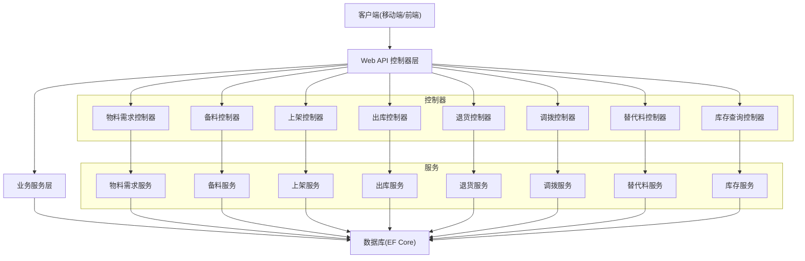

**图表来源** 
- [Program.cs](file://dip-system/api/Program.cs)
- [AppDbContext.cs](file://dip-system/api/Data/AppDbContext.cs)

**章节来源**
- [Program.cs](file://dip-system/api/Program.cs)
- [AppDbContext.cs](file://dip-system/api/Data/AppDbContext.cs)

## 核心组件
- 物料需求控制器：接收生产计划或工单触发的物料需求，创建需求单，进入待备料状态。
- 备料控制器：根据需求单生成备料任务，支持按库位拣选、批次/序列号追踪，完成后进入待上架。
- 上架控制器：将已备料物料上架至指定库位，更新可用库存，进入可出库状态。
- 出库控制器：按工单/需求单扣减库存，生成出库记录，支持先进先出、批次锁定。
- 退货控制器：处理不良品或多余物料退回，增加回退库存或转入不良品仓。
- 调拨控制器：在仓库/库位间转移库存，生成调拨单，支持在途状态。
- 替代料控制器：当主料不足时启用替代料策略，记录替代订单与执行明细。
- 库存查询控制器：提供实时库存、在途库存、锁定库存、可用库存的查询能力。

**章节来源**
- [MaterialRequestController.cs](file://dip-system/api/Controllers/MaterialRequestController.cs)
- [PrepController.cs](file://dip-system/api/Controllers/PrepController.cs)
- [ShelvingController.cs](file://dip-system/api/Controllers/ShelvingController.cs)
- [OutboundController.cs](file://dip-system/api/Controllers/OutboundController.cs)
- [ReturnController.cs](file://dip-system/api/Controllers/ReturnController.cs)
- [TransferController.cs](file://dip-system/api/Controllers/TransferController.cs)
- [SubstituteController.cs](file://dip-system/api/Controllers/SubstituteController.cs)
- [InventoryController.cs](file://dip-system/api/Controllers/InventoryController.cs)

## 架构总览
整体采用“控制器→服务→仓储”的分层模式，通过统一响应体封装返回结果，错误由全局异常过滤器捕获。关键集成点包括：
- 与MES/ERP对接：通过外部服务或消息队列触发需求单与出库确认。
- 与WMS对接：库位管理与库存同步。
- 与条码/扫码设备：移动端扫描入库、拣货、出库。

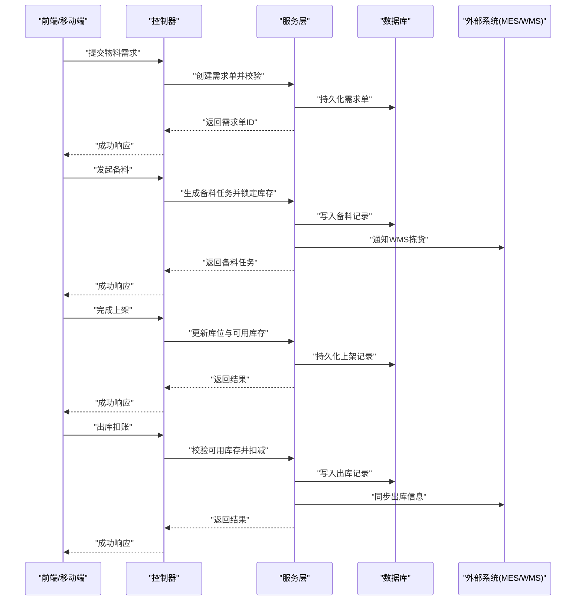

**图表来源** 
- [MaterialRequestController.cs](file://dip-system/api/Controllers/MaterialRequestController.cs)
- [PrepController.cs](file://dip-system/api/Controllers/PrepController.cs)
- [ShelvingController.cs](file://dip-system/api/Controllers/ShelvingController.cs)
- [OutboundController.cs](file://dip-system/api/Controllers/OutboundController.cs)
- [MaterialRequestService.cs](file://dip-system/api/Services/MaterialRequestService.cs)
- [PrepService.cs](file://dip-system/api/Services/PrepService.cs)
- [ShelvingService.cs](file://dip-system/api/Services/ShelvingService.cs)
- [OutboundService.cs](file://dip-system/api/Services/OutboundService.cs)

## 详细组件分析

### 物料需求控制器与服务
- 职责：接收需求源（工单/计划），创建需求单，维护需求状态（新建、待备料、部分备料、已完成）。
- 关键流程：
  - 校验需求数量与BOM匹配性。
  - 生成唯一需求单号，落库。
  - 触发备料任务（异步或同步）。
- 状态机：新建 → 待备料 → 部分备料 → 已完成；异常分支可回滚至待备料。

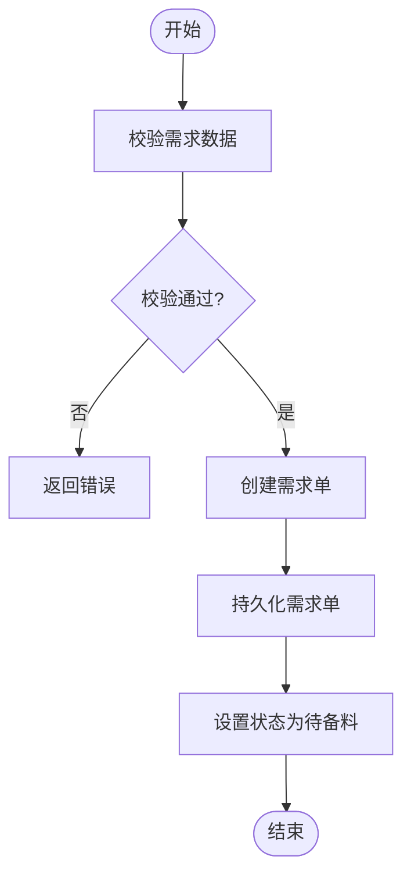

**图表来源** 
- [MaterialRequestController.cs](file://dip-system/api/Controllers/MaterialRequestController.cs)
- [MaterialRequestService.cs](file://dip-system/api/Services/MaterialRequestService.cs)
- [MaterialRequest.cs](file://dip-system/api/Models/MaterialRequest.cs)

**章节来源**
- [MaterialRequestController.cs](file://dip-system/api/Controllers/MaterialRequestController.cs)
- [MaterialRequestService.cs](file://dip-system/api/Services/MaterialRequestService.cs)
- [MaterialRequest.cs](file://dip-system/api/Models/MaterialRequest.cs)

### 备料控制器与服务
- 职责：根据需求单生成备料任务，支持按库位拣选、批次/序列号管理，完成后进入待上架。
- 关键流程：
  - 校验需求单是否可备料。
  - 锁定可用库存，生成备料明细。
  - 记录拣货路径与库位，支持分批备料。
- 状态机：待备料 → 备料中 → 待上架；异常分支可回滚库存锁定。

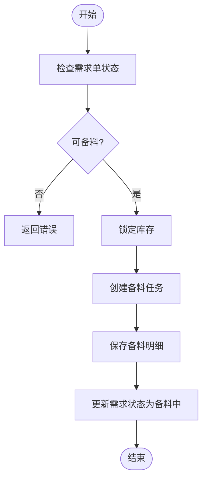

**图表来源** 
- [PrepController.cs](file://dip-system/api/Controllers/PrepController.cs)
- [PrepService.cs](file://dip-system/api/Services/PrepService.cs)
- [Prep.cs](file://dip-system/api/Models/Prep.cs)

**章节来源**
- [PrepController.cs](file://dip-system/api/Controllers/PrepController.cs)
- [PrepService.cs](file://dip-system/api/Services/PrepService.cs)
- [Prep.cs](file://dip-system/api/Models/Prep.cs)

### 上架控制器与服务
- 职责：将已备料物料上架至目标库位，更新可用库存，进入可出库状态。
- 关键流程：
  - 校验备料任务是否完成。
  - 校验目标库位容量与兼容性。
  - 更新库存位置与可用量。
- 状态机：待上架 → 上架中 → 已上架；异常分支可回滚库位变更。

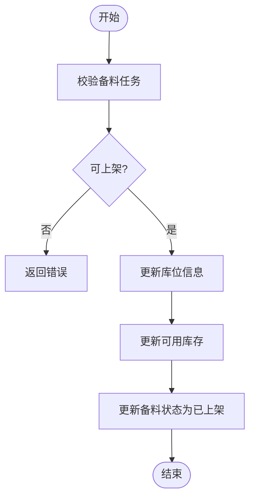

**图表来源** 
- [ShelvingController.cs](file://dip-system/api/Controllers/ShelvingController.cs)
- [ShelvingService.cs](file://dip-system/api/Services/ShelvingService.cs)
- [Shelving.cs](file://dip-system/api/Models/Shelving.cs)

**章节来源**
- [ShelvingController.cs](file://dip-system/api/Controllers/ShelvingController.cs)
- [ShelvingService.cs](file://dip-system/api/Services/ShelvingService.cs)
- [Shelving.cs](file://dip-system/api/Models/Shelving.cs)

### 出库控制器与服务
- 职责：按需求单或工单扣减库存，生成出库记录，支持先进先出、批次锁定。
- 关键流程：
  - 校验可用库存是否充足。
  - 选择出库批次（FIFO/FEFO）。
  - 扣减库存并记录出库明细。
- 状态机：可出库 → 出库中 → 已出库；异常分支可回滚库存扣减。

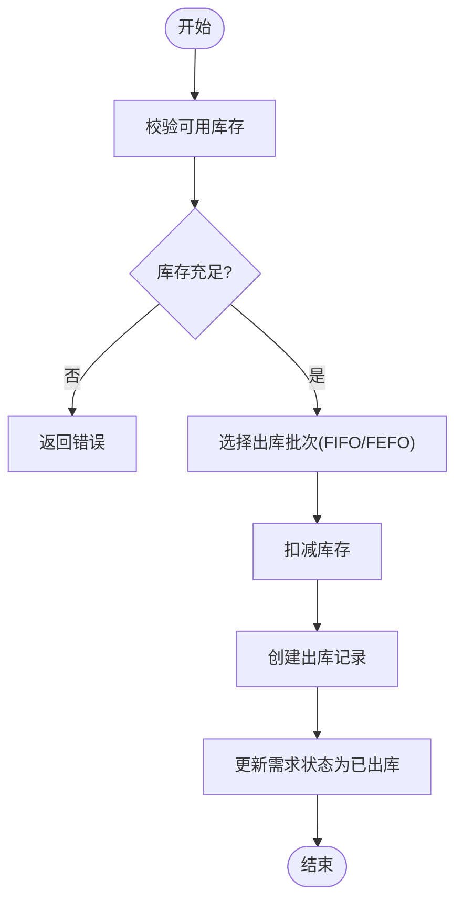

**图表来源** 
- [OutboundController.cs](file://dip-system/api/Controllers/OutboundController.cs)
- [OutboundService.cs](file://dip-system/api/Services/OutboundService.cs)
- [Outbound.cs](file://dip-system/api/Models/Outbound.cs)

**章节来源**
- [OutboundController.cs](file://dip-system/api/Controllers/OutboundController.cs)
- [OutboundService.cs](file://dip-system/api/Services/OutboundService.cs)
- [Outbound.cs](file://dip-system/api/Models/Outbound.cs)

### 退货控制器与服务
- 职责：处理不良品或多余物料退回，增加回退库存或转入不良品仓。
- 关键流程：
  - 校验退货原因与数量。
  - 决定入库类型（良品仓/不良品仓）。
  - 更新库存与退货记录。
- 状态机：待退货 → 退货中 → 已退货；异常分支可回滚库存。

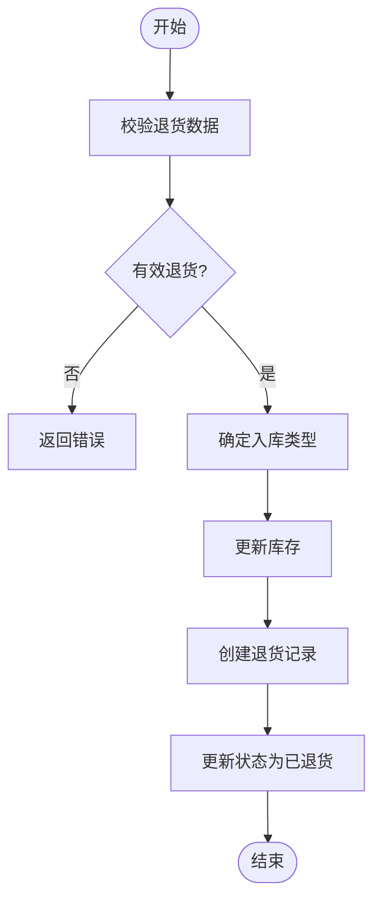

**图表来源** 
- [ReturnController.cs](file://dip-system/api/Controllers/ReturnController.cs)
- [ReturnService.cs](file://dip-system/api/Services/ReturnService.cs)
- [Return.cs](file://dip-system/api/Models/Return.cs)

**章节来源**
- [ReturnController.cs](file://dip-system/api/Controllers/ReturnController.cs)
- [ReturnService.cs](file://dip-system/api/Services/ReturnService.cs)
- [Return.cs](file://dip-system/api/Models/Return.cs)

### 调拨控制器与服务
- 职责：在仓库/库位间转移库存，生成调拨单，支持在途状态。
- 关键流程：
  - 校验源库位库存充足。
  - 创建调拨单，标记在途。
  - 目标库位收货后更新库存。
- 状态机：待调拨 → 在途 → 已调拨；异常分支可回滚库存。

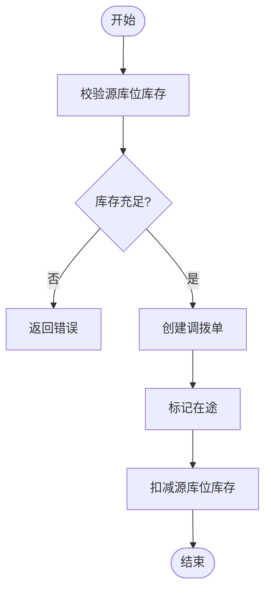

**图表来源** 
- [TransferController.cs](file://dip-system/api/Controllers/TransferController.cs)
- [TransferService.cs](file://dip-system/api/Services/TransferService.cs)
- [Transfer.cs](file://dip-system/api/Models/Transfer.cs)

**章节来源**
- [TransferController.cs](file://dip-system/api/Controllers/TransferController.cs)
- [TransferService.cs](file://dip-system/api/Services/TransferService.cs)
- [Transfer.cs](file://dip-system/api/Models/Transfer.cs)

### 替代料控制器与服务
- 职责：当主料不足时启用替代料策略，记录替代订单与执行明细。
- 关键流程：
  - 校验主料可用性。
  - 匹配替代料规则（优先级、有效期）。
  - 创建替代订单与执行记录。
- 状态机：待替代 → 替代中 → 已替代；异常分支可回滚替代记录。

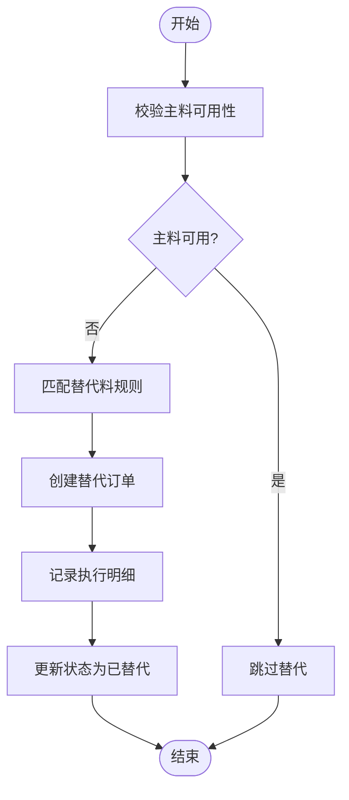

**图表来源** 
- [SubstituteController.cs](file://dip-system/api/Controllers/SubstituteController.cs)
- [SubstituteService.cs](file://dip-system/api/Services/SubstituteService.cs)
- [SubstituteOrder.cs](file://dip-system/api/Models/SubstituteOrder.cs)
- [SubstituteRecord.cs](file://dip-system/api/Models/SubstituteRecord.cs)

**章节来源**
- [SubstituteController.cs](file://dip-system/api/Controllers/SubstituteController.cs)
- [SubstituteService.cs](file://dip-system/api/Services/SubstituteService.cs)
- [SubstituteOrder.cs](file://dip-system/api/Models/SubstituteOrder.cs)
- [SubstituteRecord.cs](file://dip-system/api/Models/SubstituteRecord.cs)

### 库存查询控制器与服务
- 职责：提供实时库存、在途库存、锁定库存、可用库存的查询能力。
- 关键流程：
  - 聚合各业务单据的库存影响。
  - 计算可用库存（总库存 - 锁定 - 在途）。
  - 返回分页结果与汇总统计。

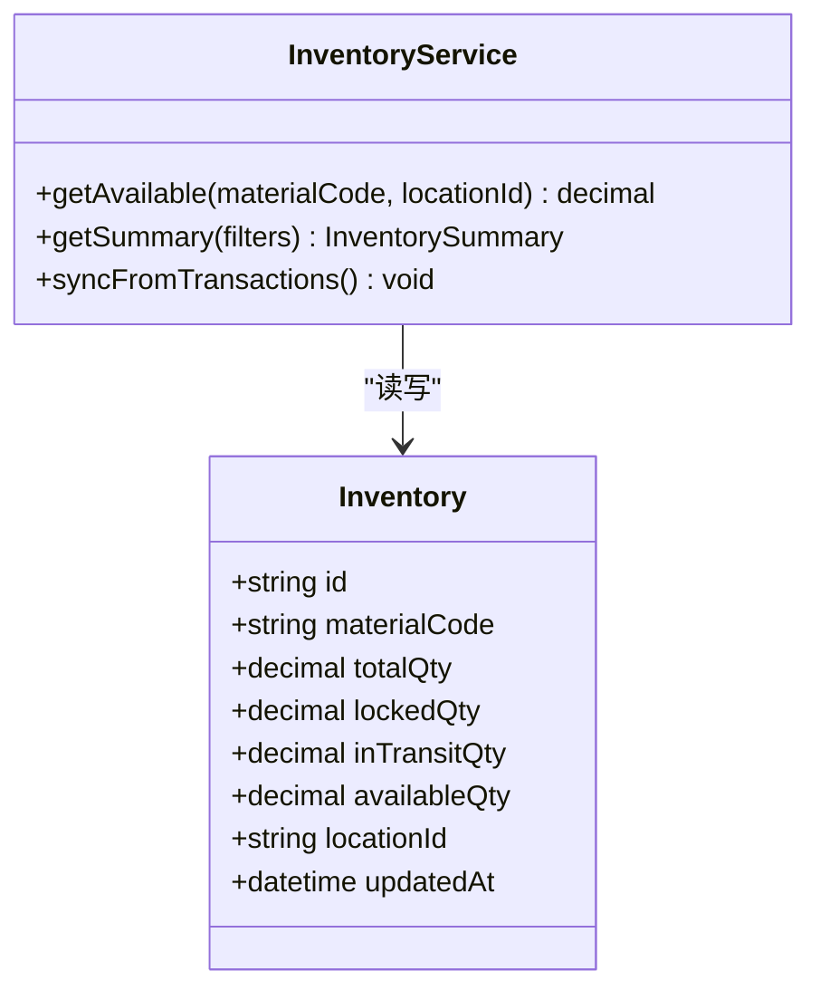

**图表来源** 
- [InventoryController.cs](file://dip-system/api/Controllers/InventoryController.cs)
- [InventoryService.cs](file://dip-system/api/Services/InventoryService.cs)
- [Inventory.cs](file://dip-system/api/Models/Inventory.cs)

**章节来源**
- [InventoryController.cs](file://dip-system/api/Controllers/InventoryController.cs)
- [InventoryService.cs](file://dip-system/api/Services/InventoryService.cs)
- [Inventory.cs](file://dip-system/api/Models/Inventory.cs)

## 依赖关系分析
- 控制器依赖服务层，服务层依赖数据访问层（EF Core）。
- 统一响应体ApiResponse用于标准化返回格式。
- BaseEntity为基础实体，包含通用字段（如ID、时间戳）。
- AppDbContext统一管理实体映射与数据库连接。

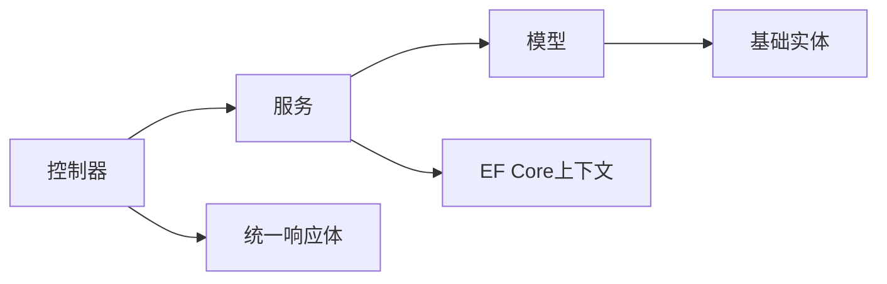

**图表来源** 
- [ApiResponse.cs](file://dip-system/api/Models/ApiResponse.cs)
- [BaseEntity.cs](file://dip-system/api/Models/BaseEntity.cs)
- [AppDbContext.cs](file://dip-system/api/Data/AppDbContext.cs)

**章节来源**
- [ApiResponse.cs](file://dip-system/api/Models/ApiResponse.cs)
- [BaseEntity.cs](file://dip-system/api/Models/BaseEntity.cs)
- [AppDbContext.cs](file://dip-system/api/Data/AppDbContext.cs)

## 性能考虑
- 批量操作：对大量物料需求、备料、出库建议采用批量接口，减少网络往返。
- 索引优化：对物料编码、库位ID、状态字段建立索引，提升查询效率。
- 缓存策略：对热点库存数据使用内存缓存，降低数据库压力。
- 异步处理：非关键路径（如通知外部系统）采用异步消息队列。

[本节为通用指导，无需特定文件引用]

## 故障排查指南
- 常见错误：
  - 库存不足：检查可用库存计算逻辑与锁定状态。
  - 状态冲突：核对状态机转换条件与并发控制。
  - 数据不一致：检查事务边界与回滚机制。
- 调试建议：
  - 启用详细日志，记录关键步骤输入输出。
  - 使用数据库审计表追踪变更历史。
  - 模拟极端场景（高并发、长事务）进行压测。

[本节为通用指导，无需特定文件引用]

## 结论
本系统通过清晰的分层架构与状态机设计，实现了物料从需求到出库、退货、调拨、替代的完整闭环。API设计遵循RESTful原则，服务层确保业务一致性与扩展性。建议在生产环境加强监控与告警，持续优化性能与稳定性。

[本节为总结，无需特定文件引用]

## 附录：接口清单与使用示例
以下为各控制器的主要接口概览（方法名与路径基于命名约定，具体实现请参考对应控制器文件）：

- 物料需求
  - POST /api/material-request/create
  - GET /api/material-request/{id}
  - PUT /api/material-request/{id}/status
- 备料
  - POST /api/prep/create
  - GET /api/prep/{taskId}
  - PUT /api/prep/{taskId}/complete
- 上架
  - POST /api/shelving/create
  - GET /api/shelving/{taskId}
  - PUT /api/shelving/{taskId}/confirm
- 出库
  - POST /api/outbound/create
  - GET /api/outbound/{orderId}
  - PUT /api/outbound/{orderId}/confirm
- 退货
  - POST /api/return/create
  - GET /api/return/{returnId}
  - PUT /api/return/{returnId}/confirm
- 调拨
  - POST /api/transfer/create
  - GET /api/transfer/{transferId}
  - PUT /api/transfer/{transferId}/receive
- 替代料
  - POST /api/substitute/create
  - GET /api/substitute/{orderId}
  - PUT /api/substitute/{orderId}/execute
- 库存查询
  - GET /api/inventory/available?materialCode=&locationId=
  - GET /api/inventory/summary?filters=

使用示例（以物料需求为例）：
- 请求体：包含物料编码、需求数量、工单号、期望时间等。
- 响应体：统一ApiResponse，包含状态码、消息、数据对象（需求单ID）。
- 错误处理：参数校验失败返回400，业务异常返回500，具体错误信息在响应体中。

**章节来源**
- [MaterialRequestController.cs](file://dip-system/api/Controllers/MaterialRequestController.cs)
- [PrepController.cs](file://dip-system/api/Controllers/PrepController.cs)
- [ShelvingController.cs](file://dip-system/api/Controllers/ShelvingController.cs)
- [OutboundController.cs](file://dip-system/api/Controllers/OutboundController.cs)
- [ReturnController.cs](file://dip-system/api/Controllers/ReturnController.cs)
- [TransferController.cs](file://dip-system/api/Controllers/TransferController.cs)
- [SubstituteController.cs](file://dip-system/api/Controllers/SubstituteController.cs)
- [InventoryController.cs](file://dip-system/api/Controllers/InventoryController.cs)
- [ApiResponse.cs](file://dip-system/api/Models/ApiResponse.cs)