# 系统管理控制器

<cite>
**本文档引用的文件**   
- [SystemController.cs](file://dip-system/api/Controllers/SystemController.cs)
- [UserController.cs](file://dip-system/api/Controllers/UserController.cs)
- [LocationsController.cs](file://dip-system/api/Controllers/LocationsController.cs)
- [PartsController.cs](file://dip-system/api/Controllers/PartsController.cs)
- [StockCountController.cs](file://dip-system/api/Controllers/StockCountController.cs)
- [ReportController.cs](file://dip-system/api/Controllers/ReportController.cs)
- [OnlineController.cs](file://dip-system/api/Controllers/OnlineController.cs)
- [AuthService.cs](file://dip-system/api/Services/AuthService.cs)
- [UserService.cs](file://dip-system/api/Services/UserService.cs)
- [LocationService.cs](file://dip-system/api/Services/LocationService.cs)
- [PartService.cs](file://dip-system/api/Services/PartService.cs)
- [StockCountService.cs](file://dip-system/api/Services/StockCountService.cs)
- [ReportService.cs](file://dip-system/api/Services/ReportService.cs)
- [OnlineService.cs](file://dip-system/api/Services/OnlineService.cs)
- [DictHelper.cs](file://dip-system/api/Services/DictHelper.cs)
- [JwtTokenService.cs](file://dip-system/api/Services/JwtTokenService.cs)
- [AppDbContext.cs](file://dip-system/api/Data/AppDbContext.cs)
- [ApiResponse.cs](file://dip-system/api/Models/ApiResponse.cs)
- [Auth.cs](file://dip-system/api/Models/Auth.cs)
- [BaseEntity.cs](file://dip-system/api/Models/BaseEntity.cs)
- [Program.cs](file://dip-system/api/Program.cs)
- [appsettings.json](file://dip-system/api/appsettings.json)
</cite>

## 目录
1. [简介](#简介)
2. [项目结构](#项目结构)
3. [核心组件](#核心组件)
4. [架构总览](#架构总览)
5. [详细组件分析](#详细组件分析)
6. [依赖关系分析](#依赖关系分析)
7. [性能考虑](#性能考虑)
8. [故障排查指南](#故障排查指南)
9. [结论](#结论)
10. [附录：API文档与操作示例](#附录api文档与操作示例)

## 简介
本文件面向DIP物料管理系统的“系统管理”域，聚焦系统级功能与基础支撑能力。内容覆盖用户管理、系统配置、库位管理、零件管理、盘点管理、报表生成、在线监控等；并阐述权限控制、数据字典、系统参数等基础能力；同时给出系统监控、日志记录、性能分析等运维特性说明，并提供完整的API文档与管理员常用操作示例及配置指南。

## 项目结构
系统后端采用ASP.NET Core Web API分层架构：
- Controllers：HTTP接口层，负责请求路由、参数校验、响应封装
- Services：业务逻辑层，封装领域规则与流程编排
- Data：数据访问层（EF Core DbContext）
- Models：实体模型、DTO、统一响应体
- Program与appsettings：应用启动与配置

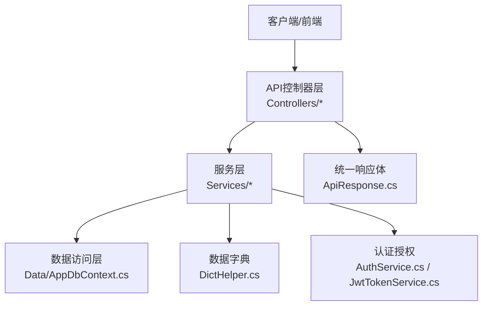

**图示来源** 
- [Program.cs](file://dip-system/api/Program.cs)
- [SystemController.cs](file://dip-system/api/Controllers/SystemController.cs)
- [AuthService.cs](file://dip-system/api/Services/AuthService.cs)
- [AppDbContext.cs](file://dip-system/api/Data/AppDbContext.cs)
- [ApiResponse.cs](file://dip-system/api/Models/ApiResponse.cs)

**章节来源**
- [Program.cs](file://dip-system/api/Program.cs)
- [appsettings.json](file://dip-system/api/appsettings.json)

## 核心组件
- 系统管理控制器（SystemController）：提供系统级配置查询/更新、健康检查、元数据获取等入口
- 用户管理控制器（UserController）：用户CRUD、角色/权限分配、密码重置、状态管理
- 库位管理控制器（LocationsController）：仓库/库区/库位层级维护、启用禁用、容量与路径
- 零件管理控制器（PartsController）：物料主数据、分类、条码、规格、替代料
- 盘点管理控制器（StockCountController）：盘点计划、任务下发、差异处理、复盘
- 报表控制器（ReportController）：库存、出入库、异常、效率等报表导出
- 在线监控控制器（OnlineController）：设备/终端在线状态、心跳、告警
- 认证服务（AuthService）：登录、令牌签发与刷新、会话管理
- 数据字典（DictHelper）：全局枚举、下拉选项、翻译映射
- JWT令牌服务（JwtTokenService）：签名、过期、角色声明注入
- 统一响应（ApiResponse）：标准返回结构与错误码

**章节来源**
- [SystemController.cs](file://dip-system/api/Controllers/SystemController.cs)
- [UserController.cs](file://dip-system/api/Controllers/UserController.cs)
- [LocationsController.cs](file://dip-system/api/Controllers/LocationsController.cs)
- [PartsController.cs](file://dip-system/api/Controllers/PartsController.cs)
- [StockCountController.cs](file://dip-system/api/Controllers/StockCountController.cs)
- [ReportController.cs](file://dip-system/api/Controllers/ReportController.cs)
- [OnlineController.cs](file://dip-system/api/Controllers/OnlineController.cs)
- [AuthService.cs](file://dip-system/api/Services/AuthService.cs)
- [DictHelper.cs](file://dip-system/api/Services/DictHelper.cs)
- [JwtTokenService.cs](file://dip-system/api/Services/JwtTokenService.cs)
- [ApiResponse.cs](file://dip-system/api/Models/ApiResponse.cs)

## 架构总览
系统以控制器为入口，调用对应服务完成业务编排，服务通过DbContext访问数据库，并通过JWT进行鉴权。数据字典与统一响应贯穿全链路，确保一致性与可观测性。

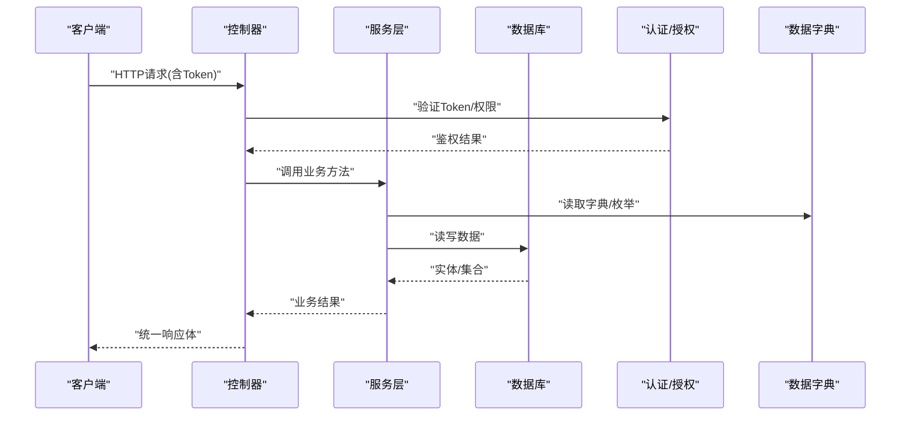

**图示来源** 
- [SystemController.cs](file://dip-system/api/Controllers/SystemController.cs)
- [AuthService.cs](file://dip-system/api/Services/AuthService.cs)
- [DictHelper.cs](file://dip-system/api/Services/DictHelper.cs)
- [AppDbContext.cs](file://dip-system/api/Data/AppDbContext.cs)
- [ApiResponse.cs](file://dip-system/api/Models/ApiResponse.cs)

## 详细组件分析

### 系统管理控制器（SystemController）
职责
- 系统配置项的查询与更新（键值对形式）
- 系统健康检查与版本信息
- 元数据（如字典、菜单、权限点）加载

关键交互
- 通过AuthService校验管理员权限
- 使用DictHelper获取系统字典与常量
- 通过AppDbContext持久化配置变更

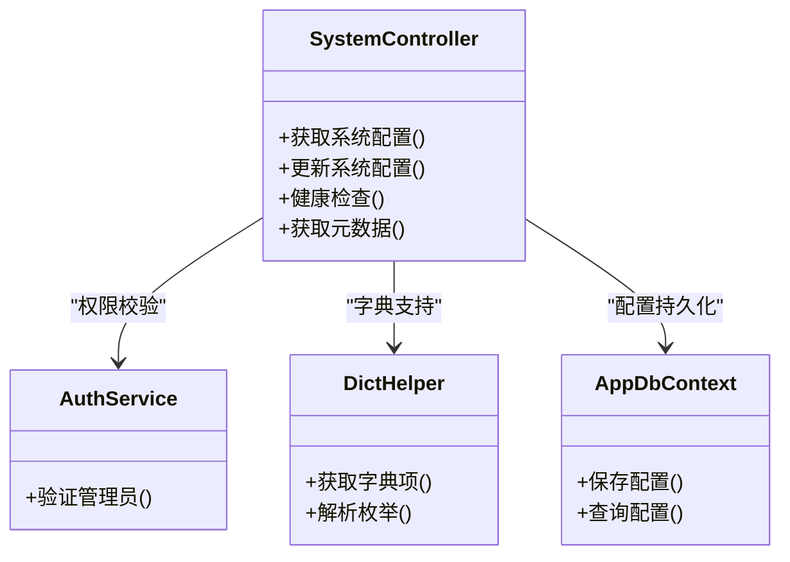

**图示来源** 
- [SystemController.cs](file://dip-system/api/Controllers/SystemController.cs)
- [AuthService.cs](file://dip-system/api/Services/AuthService.cs)
- [DictHelper.cs](file://dip-system/api/Services/DictHelper.cs)
- [AppDbContext.cs](file://dip-system/api/Data/AppDbContext.cs)

**章节来源**
- [SystemController.cs](file://dip-system/api/Controllers/SystemController.cs)

### 用户管理（UserController + UserService）
职责
- 用户增删改查、分页检索、批量导入/导出
- 角色与权限分配、密码策略、锁定/解锁
- 登录态与会话管理（与AuthService协作）

权限控制
- 基于角色的访问控制（RBAC），管理员可管理所有用户
- 敏感操作需二次确认或审计日志

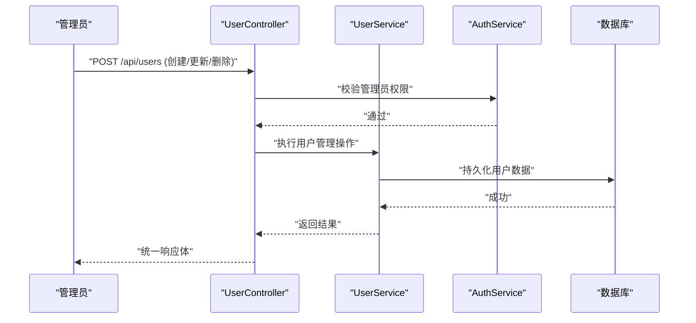

**图示来源** 
- [UserController.cs](file://dip-system/api/Controllers/UserController.cs)
- [UserService.cs](file://dip-system/api/Services/UserService.cs)
- [AuthService.cs](file://dip-system/api/Services/AuthService.cs)
- [AppDbContext.cs](file://dip-system/api/Data/AppDbContext.cs)

**章节来源**
- [UserController.cs](file://dip-system/api/Controllers/UserController.cs)
- [UserService.cs](file://dip-system/api/Services/UserService.cs)

### 库位管理（LocationsController + LocationService）
职责
- 仓库/库区/库位三级结构维护
- 库位属性（类型、容量、是否启用、路径编码）
- 批量导入、树形结构查询

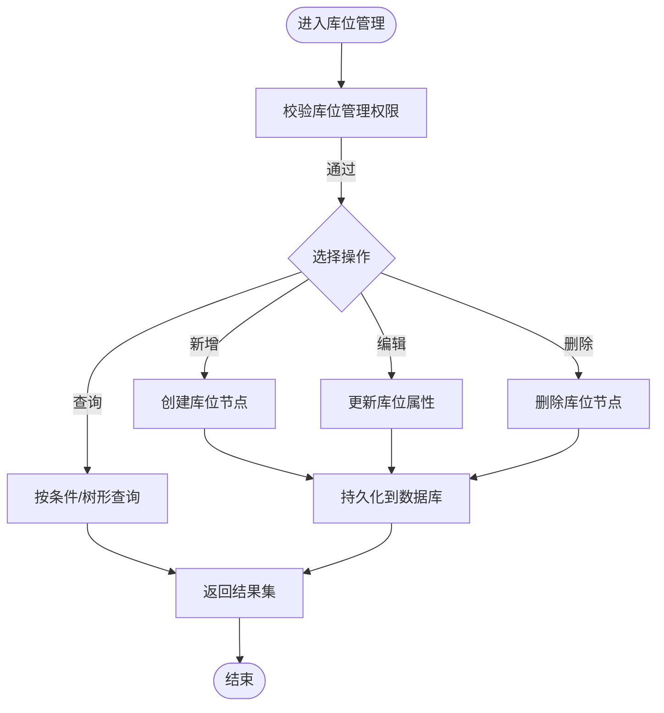

**图示来源** 
- [LocationsController.cs](file://dip-system/api/Controllers/LocationsController.cs)
- [LocationService.cs](file://dip-system/api/Services/LocationService.cs)
- [AppDbContext.cs](file://dip-system/api/Data/AppDbContext.cs)

**章节来源**
- [LocationsController.cs](file://dip-system/api/Controllers/LocationsController.cs)
- [LocationService.cs](file://dip-system/api/Services/LocationService.cs)

### 零件管理（PartsController + PartService）
职责
- 物料主数据维护（编码、名称、规格、单位、分类、条码）
- 替代料关系、BOM关联、供应商信息
- 批量导入/导出、版本管理

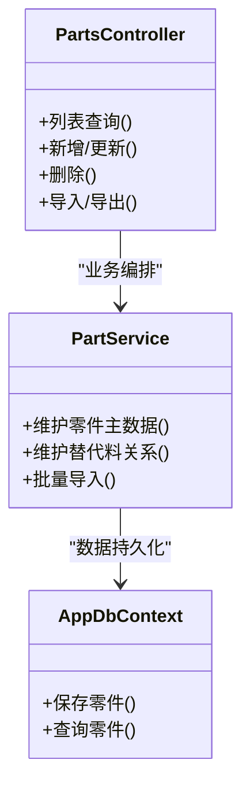

**图示来源** 
- [PartsController.cs](file://dip-system/api/Controllers/PartsController.cs)
- [PartService.cs](file://dip-system/api/Services/PartService.cs)
- [AppDbContext.cs](file://dip-system/api/Data/AppDbContext.cs)

**章节来源**
- [PartsController.cs](file://dip-system/api/Controllers/PartsController.cs)
- [PartService.cs](file://dip-system/api/Services/PartService.cs)

### 盘点管理（StockCountController + StockCountService）
职责
- 盘点计划创建、任务下发、现场扫码录入
- 差异分析与审批、复盘与调整过账
- 盘点报表与追溯

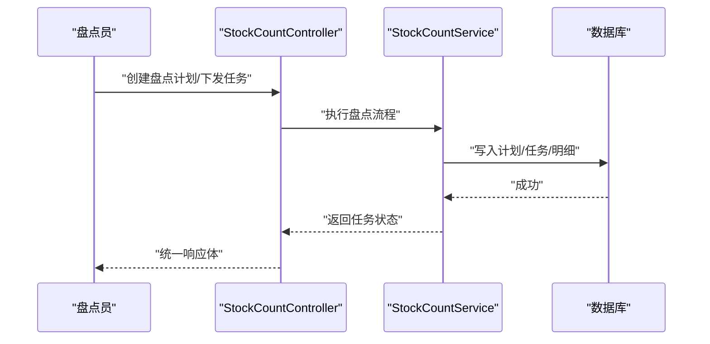

**图示来源** 
- [StockCountController.cs](file://dip-system/api/Controllers/StockCountController.cs)
- [StockCountService.cs](file://dip-system/api/Services/StockCountService.cs)
- [AppDbContext.cs](file://dip-system/api/Data/AppDbContext.cs)

**章节来源**
- [StockCountController.cs](file://dip-system/api/Controllers/StockCountController.cs)
- [StockCountService.cs](file://dip-system/api/Services/StockCountService.cs)

### 报表生成（ReportController + ReportService）
职责
- 库存快照、出入库流水、异常统计、效率指标
- 多格式导出（PDF/Excel）、定时任务触发

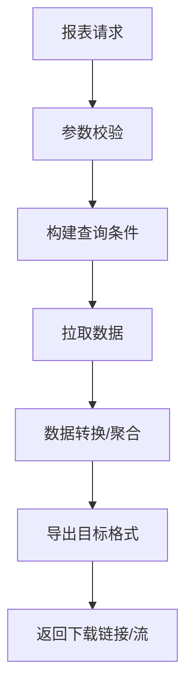

**图示来源** 
- [ReportController.cs](file://dip-system/api/Controllers/ReportController.cs)
- [ReportService.cs](file://dip-system/api/Services/ReportService.cs)
- [AppDbContext.cs](file://dip-system/api/Data/AppDbContext.cs)

**章节来源**
- [ReportController.cs](file://dip-system/api/Controllers/ReportController.cs)
- [ReportService.cs](file://dip-system/api/Services/ReportService.cs)

### 在线监控（OnlineController + OnlineService）
职责
- 终端/设备心跳上报、在线状态维护
- 离线告警、连接质量统计、远程诊断

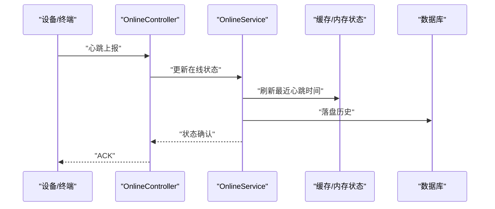

**图示来源** 
- [OnlineController.cs](file://dip-system/api/Controllers/OnlineController.cs)
- [OnlineService.cs](file://dip-system/api/Services/OnlineService.cs)
- [AppDbContext.cs](file://dip-system/api/Data/AppDbContext.cs)

**章节来源**
- [OnlineController.cs](file://dip-system/api/Controllers/OnlineController.cs)
- [OnlineService.cs](file://dip-system/api/Services/OnlineService.cs)

### 认证与权限（AuthService + JwtTokenService）
职责
- 用户名/密码登录、令牌签发与刷新
- 角色与权限点校验、敏感操作审计
- 会话管理与黑名单（可选）

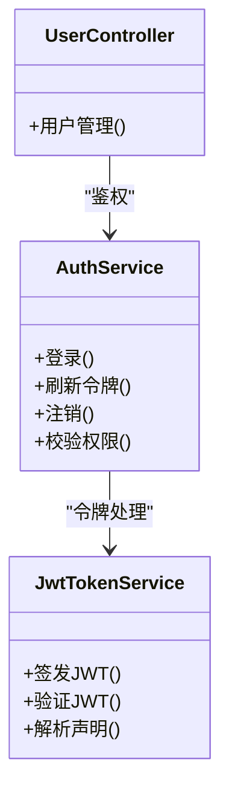

**图示来源** 
- [AuthService.cs](file://dip-system/api/Services/AuthService.cs)
- [JwtTokenService.cs](file://dip-system/api/Services/JwtTokenService.cs)
- [UserController.cs](file://dip-system/api/Controllers/UserController.cs)

**章节来源**
- [AuthService.cs](file://dip-system/api/Services/AuthService.cs)
- [JwtTokenService.cs](file://dip-system/api/Services/JwtTokenService.cs)

### 数据字典（DictHelper）
职责
- 全局枚举、下拉选项、翻译映射
- 运行时动态扩展（键值对存储）

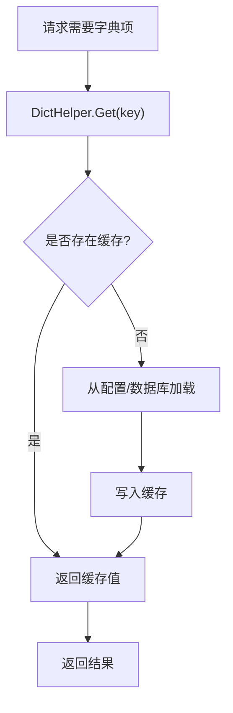

**图示来源** 
- [DictHelper.cs](file://dip-system/api/Services/DictHelper.cs)

**章节来源**
- [DictHelper.cs](file://dip-system/api/Services/DictHelper.cs)

## 依赖关系分析
- 控制器与服务解耦：每个控制器仅做路由与参数处理，业务在Service中实现
- 数据访问集中：通过AppDbContext统一管理实体与关系
- 鉴权贯穿：AuthService与JwtTokenService为各控制器提供统一鉴权能力
- 字典与配置：DictHelper与appsettings.json提供运行时配置与字典支持

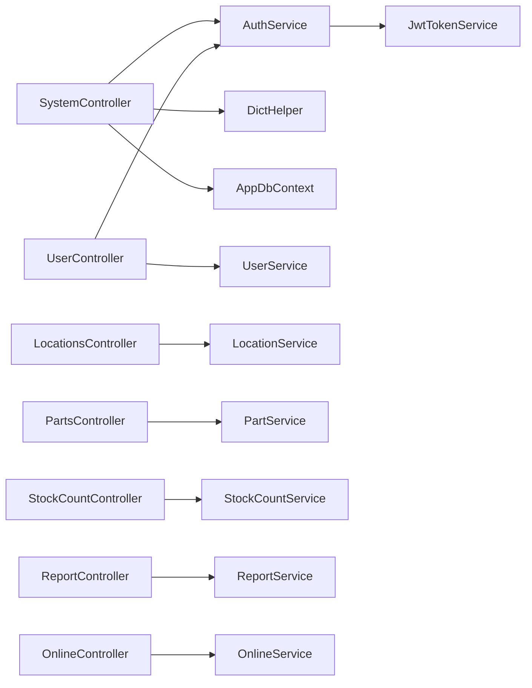

**图示来源** 
- [SystemController.cs](file://dip-system/api/Controllers/SystemController.cs)
- [UserController.cs](file://dip-system/api/Controllers/UserController.cs)
- [LocationsController.cs](file://dip-system/api/Controllers/LocationsController.cs)
- [PartsController.cs](file://dip-system/api/Controllers/PartsController.cs)
- [StockCountController.cs](file://dip-system/api/Controllers/StockCountController.cs)
- [ReportController.cs](file://dip-system/api/Controllers/ReportController.cs)
- [OnlineController.cs](file://dip-system/api/Controllers/OnlineController.cs)
- [AuthService.cs](file://dip-system/api/Services/AuthService.cs)
- [JwtTokenService.cs](file://dip-system/api/Services/JwtTokenService.cs)
- [AppDbContext.cs](file://dip-system/api/Data/AppDbContext.cs)

**章节来源**
- [Program.cs](file://dip-system/api/Program.cs)
- [appsettings.json](file://dip-system/api/appsettings.json)

## 性能考虑
- 缓存策略：字典与热点配置使用内存缓存，降低数据库压力
- 分页与筛选：列表接口默认分页，避免一次性加载大数据集
- 异步IO：数据库与外部依赖采用异步模式，提升吞吐
- 连接池：合理设置数据库连接池大小，避免资源耗尽
- 导出优化：大报表采用流式导出，减少内存峰值

[本节为通用指导，不直接分析具体文件]

## 故障排查指南
常见问题与定位
- 401/403：检查JWT有效性、角色权限、Token过期
- 500：查看服务端日志、异常过滤器输出、数据库连接状态
- 慢查询：开启SQL日志、分析索引、优化分页与过滤条件
- 字典缺失：检查DictHelper初始化与配置项是否生效

建议措施
- 启用结构化日志与TraceId追踪
- 增加健康检查端点与指标采集
- 对关键操作添加审计日志与幂等保护

**章节来源**
- [ApiResponse.cs](file://dip-system/api/Models/ApiResponse.cs)
- [AppDbContext.cs](file://dip-system/api/Data/AppDbContext.cs)

## 结论
系统管理控制器围绕“用户、配置、库位、零件、盘点、报表、在线监控”七大系统级能力展开，配合认证授权、数据字典与统一响应，形成稳定可扩展的后端基座。通过分层架构与清晰的依赖关系，便于后续功能扩展与运维治理。

[本节为总结性内容，不直接分析具体文件]

## 附录：API文档与操作示例

### 通用约定
- 鉴权：除公开接口外，均需携带Authorization: Bearer <token>
- 请求体：JSON格式，字段命名遵循驼峰或下划线（依接口定义）
- 响应体：统一 ApiResponse 结构，包含code、message、data

**章节来源**
- [ApiResponse.cs](file://dip-system/api/Models/ApiResponse.cs)

### 系统配置（SystemController）
- 获取系统配置
  - 方法：GET
  - 路径：/api/system/config
  - 说明：返回系统键值对配置
- 更新系统配置
  - 方法：PUT
  - 路径：/api/system/config
  - 说明：管理员更新配置项

示例（管理员）
- 请求头：Authorization: Bearer <admin-token>
- 请求体：{"key":"system.maxRetry","value":"3"}
- 预期响应：{code:200,message:"成功",data:null}

**章节来源**
- [SystemController.cs](file://dip-system/api/Controllers/SystemController.cs)

### 用户管理（UserController）
- 用户列表
  - 方法：GET
  - 路径：/api/users
  - 参数：page, size, keyword
- 新增用户
  - 方法：POST
  - 路径：/api/users
  - 说明：管理员创建用户并分配角色
- 更新用户
  - 方法：PUT
  - 路径：/api/users/{id}
- 删除用户
  - 方法：DELETE
  - 路径：/api/users/{id}
- 重置密码
  - 方法：POST
  - 路径：/api/users/{id}/reset-password

示例（新增用户）
- 请求头：Authorization: Bearer <admin-token>
- 请求体：{"username":"zhangsan","role":"operator","enabled":true}
- 预期响应：{code:200,message:"创建成功",data:{id:...}}

**章节来源**
- [UserController.cs](file://dip-system/api/Controllers/UserController.cs)
- [UserService.cs](file://dip-system/api/Services/UserService.cs)

### 库位管理（LocationsController）
- 库位树查询
  - 方法：GET
  - 路径：/api/locations/tree
- 新增库位
  - 方法：POST
  - 路径：/api/locations
- 更新库位
  - 方法：PUT
  - 路径：/api/locations/{id}
- 删除库位
  - 方法：DELETE
  - 路径：/api/locations/{id}

示例（新增库位）
- 请求头：Authorization: Bearer <admin-token>
- 请求体：{"parentId":null,"name":"A区","type":"shelf","capacity":100}
- 预期响应：{code:200,message:"创建成功",data:{id:...}}

**章节来源**
- [LocationsController.cs](file://dip-system/api/Controllers/LocationsController.cs)
- [LocationService.cs](file://dip-system/api/Services/LocationService.cs)

### 零件管理（PartsController）
- 零件列表
  - 方法：GET
  - 路径：/api/parts
- 新增零件
  - 方法：POST
  - 路径：/api/parts
- 更新零件
  - 方法：PUT
  - 路径：/api/parts/{id}
- 删除零件
  - 方法：DELETE
  - 路径：/api/parts/{id}
- 导入零件
  - 方法：POST
  - 路径：/api/parts/import

示例（导入零件）
- 请求头：Authorization: Bearer <admin-token>, Content-Type: multipart/form-data
- 表单字段：file=parts.xlsx
- 预期响应：{code:200,message:"导入成功",data:{success:100,fail:0}}

**章节来源**
- [PartsController.cs](file://dip-system/api/Controllers/PartsController.cs)
- [PartService.cs](file://dip-system/api/Services/PartService.cs)

### 盘点管理（StockCountController）
- 创建盘点计划
  - 方法：POST
  - 路径：/api/stockcount/plans
- 下发盘点任务
  - 方法：POST
  - 路径：/api/stockcount/tasks
- 提交盘点结果
  - 方法：POST
  - 路径：/api/stockcount/results
- 差异审批
  - 方法：POST
  - 路径：/api/stockcount/approve

示例（提交盘点结果）
- 请求头：Authorization: Bearer <worker-token>
- 请求体：{"taskId":123,"items":[{"partCode":"P001","actualQty":100}]}
- 预期响应：{code:200,message:"提交成功",data:{status:"pending"}}

**章节来源**
- [StockCountController.cs](file://dip-system/api/Controllers/StockCountController.cs)
- [StockCountService.cs](file://dip-system/api/Services/StockCountService.cs)

### 报表生成（ReportController）
- 库存报表
  - 方法：GET
  - 路径：/api/report/inventory?date=YYYY-MM-DD
- 出入库流水
  - 方法：GET
  - 路径：/api/report/inout?startDate=&endDate=
- 导出PDF
  - 方法：GET
  - 路径：/api/report/export/pdf?template=inventory&params=...

示例（导出PDF）
- 请求头：Authorization: Bearer <admin-token>
- 响应：二进制流（application/pdf）

**章节来源**
- [ReportController.cs](file://dip-system/api/Controllers/ReportController.cs)
- [ReportService.cs](file://dip-system/api/Services/ReportService.cs)

### 在线监控（OnlineController）
- 心跳上报
  - 方法：POST
  - 路径：/api/online/heartbeat
- 查询在线状态
  - 方法：GET
  - 路径：/api/online/status
- 获取告警列表
  - 方法：GET
  - 路径：/api/online/alerts

示例（心跳上报）
- 请求头：Authorization: Bearer <device-token>
- 请求体：{"deviceId":"DEV001","battery":85,"signal":90}
- 预期响应：{code:200,message:"已接收",data:{ack:true}}

**章节来源**
- [OnlineController.cs](file://dip-system/api/Controllers/OnlineController.cs)
- [OnlineService.cs](file://dip-system/api/Services/OnlineService.cs)

### 认证与权限（AuthService）
- 登录
  - 方法：POST
  - 路径：/api/auth/login
  - 请求体：{"username":"","password":""}
- 刷新令牌
  - 方法：POST
  - 路径：/api/auth/refresh
  - 请求体：{"refreshToken":""}
- 注销
  - 方法：POST
  - 路径：/api/auth/logout

示例（登录）
- 请求体：{"username":"admin","password":"***"}
- 预期响应：{code:200,message:"登录成功",data:{accessToken:"",refreshToken:"",expiresIn:3600}}

**章节来源**
- [AuthService.cs](file://dip-system/api/Services/AuthService.cs)
- [JwtTokenService.cs](file://dip-system/api/Services/JwtTokenService.cs)

### 数据字典（DictHelper）
- 获取字典项
  - 方法：GET
  - 路径：/api/dict/{key}
- 刷新字典缓存
  - 方法：POST
  - 路径：/api/dict/refresh

示例（获取字典）
- 请求头：Authorization: Bearer <token>
- 预期响应：{code:200,message:"成功",data:[{"code":"A","name":"A类"},...]}

**章节来源**
- [DictHelper.cs](file://dip-system/api/Services/DictHelper.cs)

### 管理员常用操作示例
- 创建管理员账户并授予系统管理角色
- 初始化系统配置（最大重试次数、超时时间、导出模板）
- 导入库位树与零件主数据
- 创建首次盘点计划并下发任务
- 导出库存报表并归档

[本节为操作指南，不直接分析具体文件]

### 配置指南（appsettings.json）
- 数据库连接字符串
- JWT密钥与过期时间
- 缓存与日志级别
- 第三方服务地址（如需）

示例键名（示意）
- ConnectionStrings:DIPDb
- Jwt:Secret
- Jwt:ExpireMinutes
- Logging:LogLevel
- Cache:Enabled

**章节来源**
- [appsettings.json](file://dip-system/api/appsettings.json)