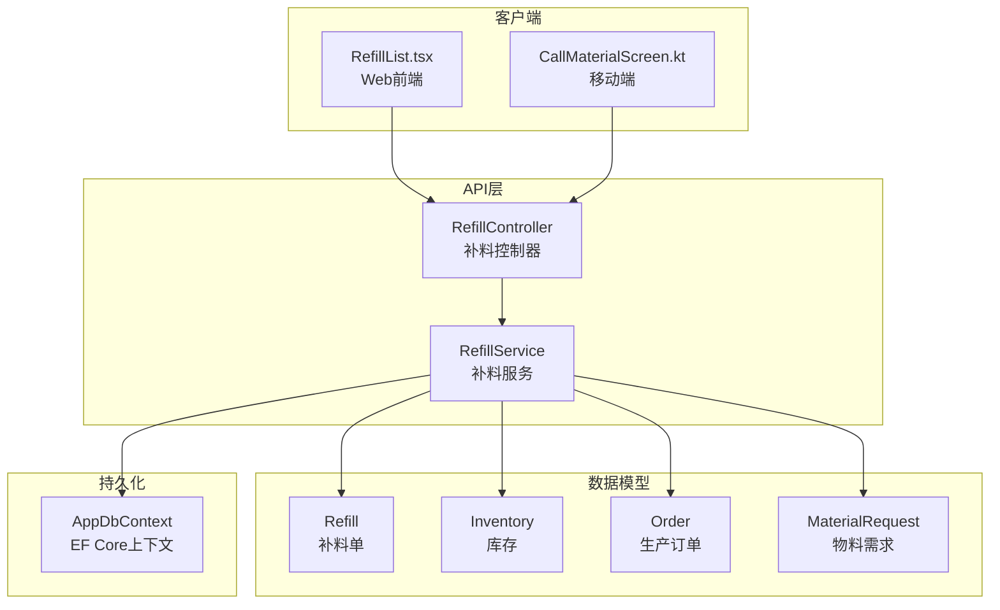
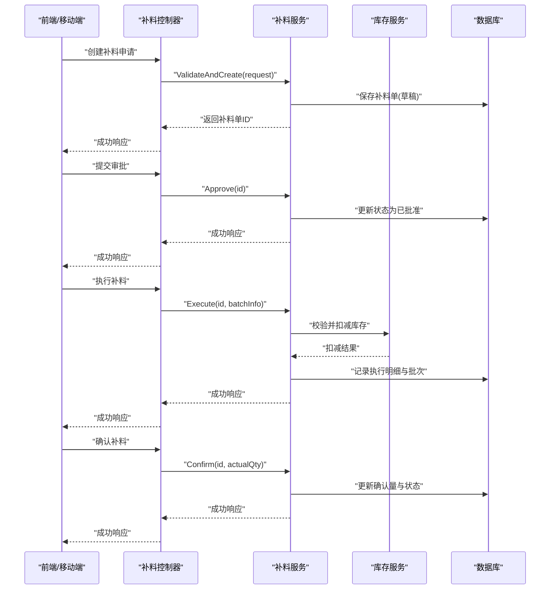
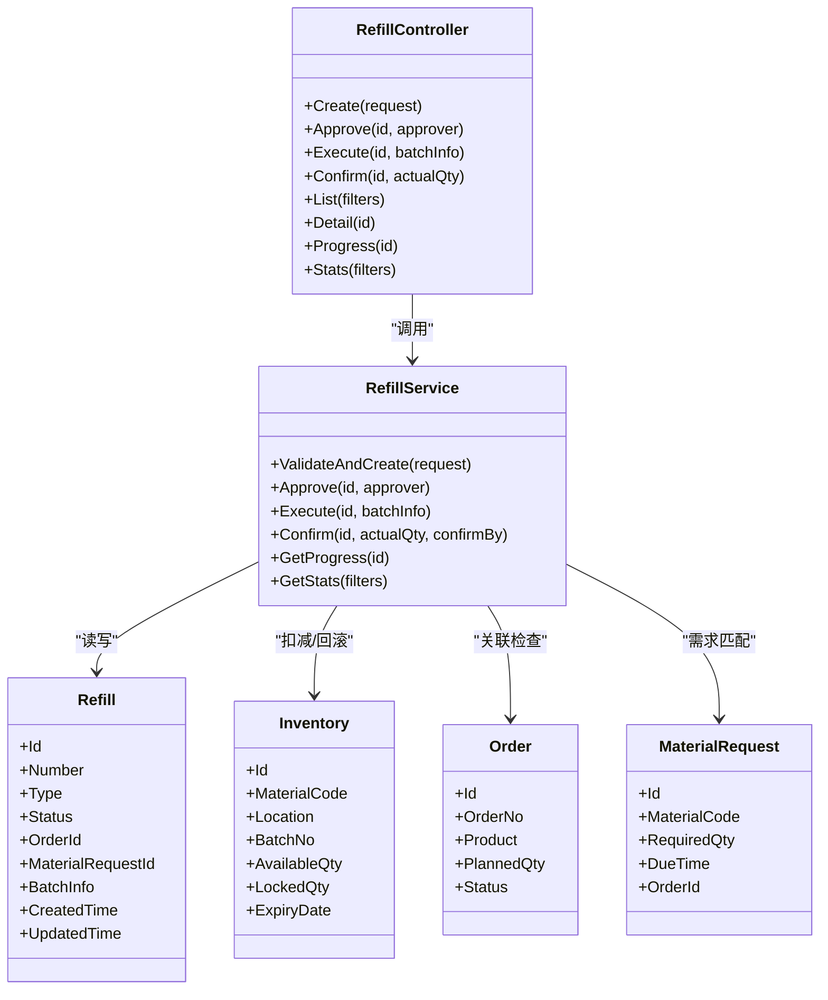

# 补料管理控制器

<cite>
**本文引用的文件**   
- [RefillController.cs](file://dip-system/api/Controllers/RefillController.cs)
- [RefillService.cs](file://dip-system/api/Services/RefillService.cs)
- [Refill.cs](file://dip-system/api/Models/Refill.cs)
- [Inventory.cs](file://dip-system/api/Models/Inventory.cs)
- [Order.cs](file://dip-system/api/Models/Order.cs)
- [MaterialRequest.cs](file://dip-system/api/Models/MaterialRequest.cs)
- [AppDbContext.cs](file://dip-system/api/Data/AppDbContext.cs)
- [Program.cs](file://dip-system/api/Program.cs)
- [appsettings.json](file://dip-system/api/appsettings.json)
- [RefillList.tsx](file://dip-system/frontend-web/src/pages/RefillList.tsx)
- [api.ts](file://dip-system/frontend-web/src/lib/api.ts)
- [CallMaterialScreen.kt](file://mobile-android/app/src/main/java/com/dip/material/ui/callmaterial/CallMaterialScreen.kt)
- [CallMaterialViewModel.kt](file://mobile-android/app/src/main/java/com/dip/material/ui/callmaterial/CallMaterialViewModel.kt)
- [ApiService.kt](file://mobile-android/app/src/main/java/com/dip/material/data/network/ApiService.kt)
</cite>

## 目录
1. [简介](#简介)
2. [项目结构](#项目结构)
3. [核心组件](#核心组件)
4. [架构总览](#架构总览)
5. [详细组件分析](#详细组件分析)
6. [依赖关系分析](#依赖关系分析)
7. [性能考虑](#性能考虑)
8. [故障排查指南](#故障排查指南)
9. [结论](#结论)
10. [附录：API 文档与调用示例](#附录api-文档与调用示例)

## 简介
本文件面向DIP物料管理系统的“补料管理”模块，围绕补料申请、审批、执行、确认等完整流程进行系统化说明。内容涵盖补料类型、数量计算、批次管理规则，以及与生产计划（订单）和库存状态的关联关系；同时提供完整的API接口说明、前端与移动端调用示例以及异常处理策略，帮助开发者快速理解并正确集成补料功能。

## 项目结构
补料管理在系统中采用典型的分层架构：
- API层：控制器暴露REST接口，负责请求校验、参数绑定与响应封装。
- 服务层：实现业务逻辑，包括补料单生命周期管理、库存扣减/回滚、批次追溯、状态流转与审计记录。
- 数据模型：定义补料单、库存、订单、物料需求等实体及关系。
- 持久化：通过EF Core上下文访问数据库。
- 前端与移动端：Web端页面与API交互，移动端扫码触发补料申请与进度跟踪。

图表来源
- [RefillController.cs](file://dip-system/api/Controllers/RefillController.cs)
- [RefillService.cs](file://dip-system/api/Services/RefillService.cs)
- [Refill.cs](file://dip-system/api/Models/Refill.cs)
- [Inventory.cs](file://dip-system/api/Models/Inventory.cs)
- [Order.cs](file://dip-system/api/Models/Order.cs)
- [MaterialRequest.cs](file://dip-system/api/Models/MaterialRequest.cs)
- [AppDbContext.cs](file://dip-system/api/Data/AppDbContext.cs)
- [RefillList.tsx](file://dip-system/frontend-web/src/pages/RefillList.tsx)
- [CallMaterialScreen.kt](file://mobile-android/app/src/main/java/com/dip/material/ui/callmaterial/CallMaterialScreen.kt)

章节来源
- [Program.cs](file://dip-system/api/Program.cs)
- [appsettings.json](file://dip-system/api/appsettings.json)

## 核心组件
- 补料控制器（RefillController）：对外暴露补料相关REST接口，包括创建补料申请、查询列表与详情、审批、执行、确认、取消、统计等。
- 补料服务（RefillService）：封装补料业务逻辑，如补料类型判定、数量计算、批次分配、库存校验与扣减、状态机流转、审计日志。
- 数据模型（Refill/Inventory/Order/MaterialRequest）：描述补料单、库存、订单、物料需求的字段与关系，支撑业务流程与报表统计。
- 数据访问（AppDbContext）：基于EF Core的数据库上下文，提供实体集合与事务支持。

章节来源
- [RefillController.cs](file://dip-system/api/Controllers/RefillController.cs)
- [RefillService.cs](file://dip-system/api/Services/RefillService.cs)
- [Refill.cs](file://dip-system/api/Models/Refill.cs)
- [Inventory.cs](file://dip-system/api/Models/Inventory.cs)
- [Order.cs](file://dip-system/api/Models/Order.cs)
- [MaterialRequest.cs](file://dip-system/api/Models/MaterialRequest.cs)
- [AppDbContext.cs](file://dip-system/api/Data/AppDbContext.cs)

## 架构总览
补料管理的端到端流程如下：
- 触发来源：生产订单缺料或物料需求不足时，由前端或移动端发起补料申请。
- 审批流程：系统根据权限与规则进行审批，通过后进入可执行状态。
- 执行阶段：仓库人员按批次拣货并扣减库存，生成执行记录。
- 确认阶段：生产现场确认实际使用量，完成批次追溯与对账。
- 统计归档：汇总补料效率、缺货率、批次周转等指标，用于持续改进。

图表来源
- [RefillController.cs](file://dip-system/api/Controllers/RefillController.cs)
- [RefillService.cs](file://dip-system/api/Services/RefillService.cs)
- [AppDbContext.cs](file://dip-system/api/Data/AppDbContext.cs)

## 详细组件分析

### 补料控制器（RefillController）
职责与能力：
- 接收并校验补料申请、审批、执行、确认等请求参数。
- 调用服务层完成业务处理，统一返回标准响应体。
- 提供补料单列表查询、详情获取、进度跟踪与统计分析接口。

关键接口（概念性说明）：
- 创建补料申请：POST /api/refill/create
- 提交审批：POST /api/refill/{id}/approve
- 执行补料：POST /api/refill/{id}/execute
- 确认补料：POST /api/refill/{id}/confirm
- 查询列表：GET /api/refill/list?filters...
- 查询详情：GET /api/refill/{id}
- 进度跟踪：GET /api/refill/{id}/progress
- 统计分析：GET /api/refill/stats?period=...

错误处理要点：
- 参数缺失或格式错误：返回400并附带错误信息。
- 资源不存在：返回404。
- 权限不足：返回403。
- 业务冲突（如库存不足、重复执行）：返回422并给出明确原因。
- 服务器内部错误：返回500并记录日志。

章节来源
- [RefillController.cs](file://dip-system/api/Controllers/RefillController.cs)

### 补料服务（RefillService）
职责与能力：
- 补料类型判定：依据物料属性、订单类型、库存阈值等确定补料类型（紧急、常规、替代等）。
- 数量计算：结合BOM用量、损耗率、安全库存、在途库存计算应补数量。
- 批次管理：按FIFO/FEFO策略分配批次，记录批次号、供应商、有效期等信息。
- 库存联动：在执行与确认阶段扣减库存，失败时回滚并提示具体原因。
- 状态机：草稿→已批准→执行中→已确认→已完成/已取消，确保状态转换合法。
- 审计记录：记录操作人、时间、变更前后值，便于追溯。

核心方法（概念性说明）：
- ValidateAndCreate(request) → RefillId
- Approve(id, approver) → bool
- Execute(id, batchInfo) → ExecutionRecord
- Confirm(id, actualQty, confirmBy) → bool
- GetProgress(id) → ProgressDTO
- GetStats(filters) → StatsDTO

章节来源
- [RefillService.cs](file://dip-system/api/Services/RefillService.cs)

### 数据模型（Refill/Inventory/Order/MaterialRequest）
- 补料单（Refill）：包含补料编号、类型、状态、申请/审批/执行/确认人、时间戳、关联订单与物料需求、批次信息等。
- 库存（Inventory）：包含物料编码、库位、批次、可用量、锁定量、有效期等。
- 订单（Order）：包含订单号、产品、计划数量、状态、关联物料需求等。
- 物料需求（MaterialRequest）：包含需求物料、需求量、需求时间、来源订单等。

关系说明：
- 一个补料单可关联多个物料需求行项。
- 执行与确认阶段会更新对应库存批次的可用量。
- 补料单状态变化需与订单进度协调，避免超发或缺料。

章节来源
- [Refill.cs](file://dip-system/api/Models/Refill.cs)
- [Inventory.cs](file://dip-system/api/Models/Inventory.cs)
- [Order.cs](file://dip-system/api/Models/Order.cs)
- [MaterialRequest.cs](file://dip-system/api/Models/MaterialRequest.cs)

### 数据访问（AppDbContext）
- 提供实体集合与查询构建器，支持分页、过滤、排序。
- 在补料执行与确认过程中使用事务保证一致性。
- 支持并发控制与乐观锁（版本号），防止覆盖写入。

章节来源
- [AppDbContext.cs](file://dip-system/api/Data/AppDbContext.cs)

## 依赖关系分析
补料模块的依赖关系清晰且内聚：
- 控制器依赖服务，不直接访问数据库。
- 服务依赖数据模型与上下文，封装业务规则。
- 前端与移动端仅依赖HTTP接口，降低耦合度。

图表来源
- [RefillController.cs](file://dip-system/api/Controllers/RefillController.cs)
- [RefillService.cs](file://dip-system/api/Services/RefillService.cs)
- [Refill.cs](file://dip-system/api/Models/Refill.cs)
- [Inventory.cs](file://dip-system/api/Models/Inventory.cs)
- [Order.cs](file://dip-system/api/Models/Order.cs)
- [MaterialRequest.cs](file://dip-system/api/Models/MaterialRequest.cs)

章节来源
- [RefillController.cs](file://dip-system/api/Controllers/RefillController.cs)
- [RefillService.cs](file://dip-system/api/Services/RefillService.cs)

## 性能考虑
- 批量操作：对于大批量补料申请，建议服务端提供批量创建接口以减少网络往返。
- 索引优化：对补料单号、物料编码、订单号、状态等高频查询字段建立索引。
- 分页与过滤：列表接口默认分页，支持按时间、状态、物料等多维度过滤。
- 缓存策略：对字典数据（如补料类型、库位信息）进行短期缓存，减少数据库压力。
- 事务边界：将库存扣减与状态更新置于同一事务，避免部分成功导致的数据不一致。

[本节为通用指导，无需特定文件引用]

## 故障排查指南
常见问题与处理建议：
- 库存不足：检查库存可用量与锁定量，确认是否有未释放的锁定；必要时调整安全库存或延迟执行。
- 批次过期：校验批次有效期，优先使用FEFO策略；过期批次禁止出库。
- 重复执行：通过幂等键或唯一约束防止重复提交；若发生重试，服务端需返回幂等结果。
- 审批失败：检查审批人权限与审批规则配置；查看审计日志定位问题。
- 确认量差异：对比执行量与确认量，记录差异原因并生成差异报告。

章节来源
- [RefillService.cs](file://dip-system/api/Services/RefillService.cs)

## 结论
补料管理控制器与服务共同构建了从申请到确认的闭环流程，结合严格的库存与批次管理，保障生产计划的稳定执行。通过清晰的API设计与完善的异常处理，前端与移动端可高效集成，提升整体物料管理效率与可追溯性。

[本节为总结性内容，无需特定文件引用]

## 附录：API 文档与调用示例

### REST 接口清单
- 创建补料申请
  - 方法：POST
  - 路径：/api/refill/create
  - 请求体：补料申请信息（物料、数量、来源订单、需求时间等）
  - 响应：补料单ID与状态
- 提交审批
  - 方法：POST
  - 路径：/api/refill/{id}/approve
  - 请求体：审批人信息
  - 响应：审批结果与状态
- 执行补料
  - 方法：POST
  - 路径：/api/refill/{id}/execute
  - 请求体：批次信息与执行数量
  - 响应：执行记录与库存扣减结果
- 确认补料
  - 方法：POST
  - 路径：/api/refill/{id}/confirm
  - 请求体：实际使用量与确认人
  - 响应：确认结果与最终状态
- 查询列表
  - 方法：GET
  - 路径：/api/refill/list
  - 查询参数：分页、过滤（状态、物料、时间范围）
  - 响应：补料单列表
- 查询详情
  - 方法：GET
  - 路径：/api/refill/{id}
  - 响应：补料单详情与历史轨迹
- 进度跟踪
  - 方法：GET
  - 路径：/api/refill/{id}/progress
  - 响应：当前状态、各阶段时间与责任人
- 统计分析
  - 方法：GET
  - 路径：/api/refill/stats
  - 查询参数：时间段、物料、订单等
  - 响应：补料效率、缺货率、批次周转等指标

### Web 前端调用示例
- 页面：RefillList.tsx
- 工具：api.ts
- 典型流程：
  - 初始化加载补料列表（分页+过滤）
  - 点击“新建补料”弹出表单，提交后刷新列表
  - 点击“审批”调用审批接口，成功后更新状态
  - 点击“执行”填写批次信息，调用执行接口并显示库存扣减结果
  - 点击“确认”输入实际使用量，调用确认接口并归档

章节来源
- [RefillList.tsx](file://dip-system/frontend-web/src/pages/RefillList.tsx)
- [api.ts](file://dip-system/frontend-web/src/lib/api.ts)

### 移动端调用示例
- 页面：CallMaterialScreen.kt
- ViewModel：CallMaterialViewModel.kt
- 网络：ApiService.kt
- 典型流程：
  - 扫描条码获取物料信息，自动填充补料申请
  - 选择来源订单与需求时间，提交申请
  - 查看补料进度，实时刷新状态
  - 执行与确认环节支持扫码批次与数量录入

章节来源
- [CallMaterialScreen.kt](file://mobile-android/app/src/main/java/com/dip/material/ui/callmaterial/CallMaterialScreen.kt)
- [CallMaterialViewModel.kt](file://mobile-android/app/src/main/java/com/dip/material/ui/callmaterial/CallMaterialViewModel.kt)
- [ApiService.kt](file://mobile-android/app/src/main/java/com/dip/material/data/network/ApiService.kt)

### 异常处理策略
- 客户端重试：对网络超时与5xx错误进行指数退避重试，限制最大重试次数。
- 幂等保护：为创建与执行接口提供幂等键，避免重复提交造成数据异常。
- 错误码映射：服务端返回标准化错误码与消息，客户端统一展示友好提示。
- 审计追踪：所有异常操作记录审计日志，便于问题定位与责任追溯。

章节来源
- [RefillController.cs](file://dip-system/api/Controllers/RefillController.cs)
- [RefillService.cs](file://dip-system/api/Services/RefillService.cs)