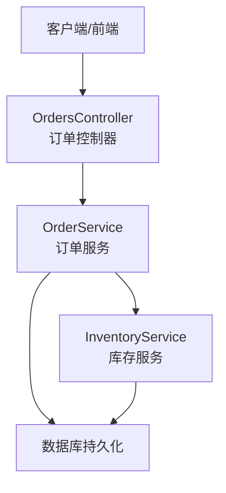
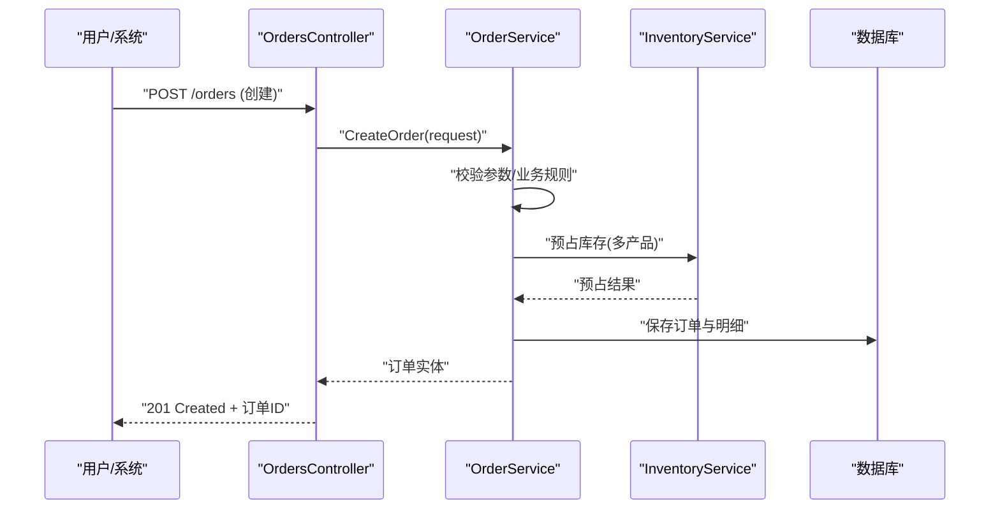
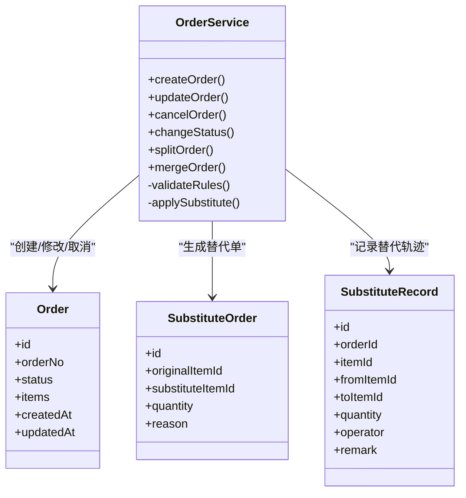
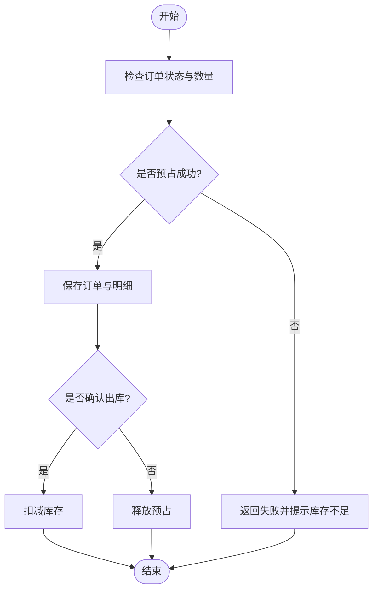
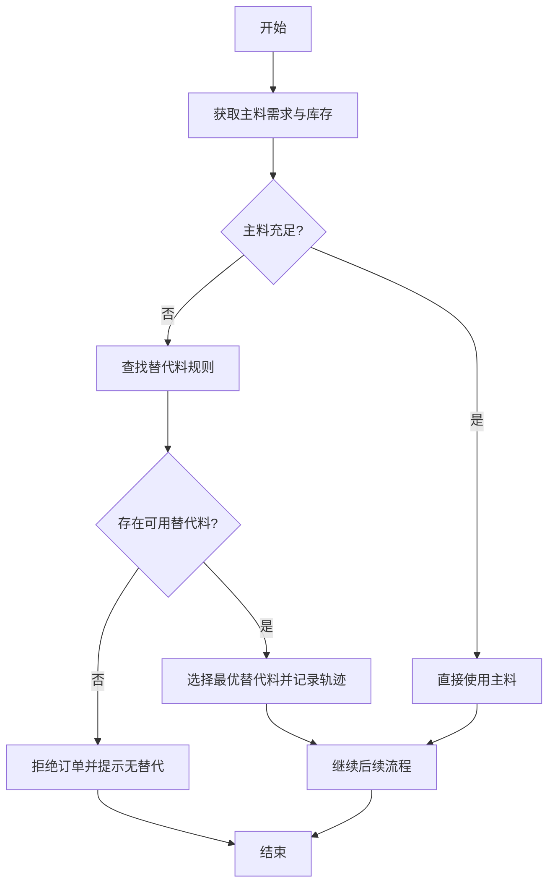
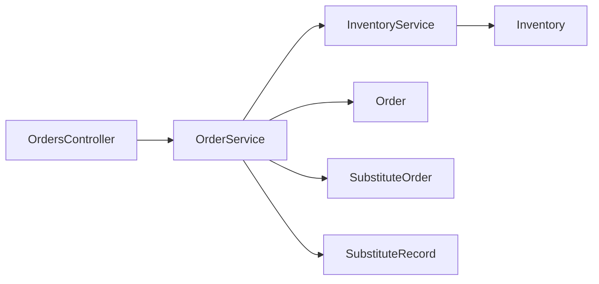

# 订单处理控制器

<cite>
**本文引用的文件**   
- [OrdersController.cs](file://dip-system/api/Controllers/OrdersController.cs)
- [OrderService.cs](file://dip-system/api/Services/OrderService.cs)
- [Order.cs](file://dip-system/api/Models/Order.cs)
- [SubstituteOrder.cs](file://dip-system/api/Models/SubstituteOrder.cs)
- [SubstituteRecord.cs](file://dip-system/api/Models/SubstituteRecord.cs)
- [InventoryService.cs](file://dip-system/api/Services/InventoryService.cs)
- [Inventory.cs](file://dip-system/api/Models/Inventory.cs)
- [MultiProductOrderPlan.md](file://dip-system/docs/superpowers/plans/2026-07-17-multi-product-order-plan.md)
- [MultiProductOrderDesign.md](file://dip-system/docs/superpowers/specs/2026-07-17-multi-product-order-design.md)
</cite>

## 目录
1. [简介](#简介)
2. [项目结构](#项目结构)
3. [核心组件](#核心组件)
4. [架构总览](#架构总览)
5. [详细组件分析](#详细组件分析)
6. [依赖关系分析](#依赖关系分析)
7. [性能考虑](#性能考虑)
8. [故障排查指南](#故障排查指南)
9. [结论](#结论)
10. [附录：API 文档](#附录api-文档)

## 简介
本文件面向DIP物料管理系统的“订单处理控制器”模块，围绕订单的创建、修改、取消与状态流转等全生命周期进行系统化说明。重点覆盖多产品订单支持、替代料处理、订单拆分与合并、以及与库存联动和状态同步机制，并提供完整的API文档、复杂业务场景示例与异常处理方案，帮助开发者快速理解并正确扩展该模块。

## 项目结构
订单处理相关代码主要位于后端API层（控制器与服务）、数据模型层以及设计文档中：
- 控制器层：OrdersController.cs 暴露订单相关的HTTP接口
- 服务层：OrderService.cs 封装订单业务逻辑；InventoryService.cs 负责库存操作
- 模型层：Order.cs、SubstituteOrder.cs、SubstituteRecord.cs、Inventory.cs 定义数据结构
- 设计文档：multi-product-order-plan.md 与 multi-product-order-design.md 描述多产品订单与替代料的设计思路

图表来源
- [OrdersController.cs](file://dip-system/api/Controllers/OrdersController.cs)
- [OrderService.cs](file://dip-system/api/Services/OrderService.cs)
- [InventoryService.cs](file://dip-system/api/Services/InventoryService.cs)

章节来源
- [OrdersController.cs](file://dip-system/api/Controllers/OrdersController.cs)
- [OrderService.cs](file://dip-system/api/Services/OrderService.cs)
- [InventoryService.cs](file://dip-system/api/Services/InventoryService.cs)

## 核心组件
- OrdersController：对外提供订单查询、创建、修改、取消、批量操作、状态变更等REST接口
- OrderService：实现订单生命周期管理、多产品订单组装、替代料策略、拆分合并、校验与事务控制
- InventoryService：提供库存查询、预占、扣减、释放等操作，保障订单与库存一致性
- 数据模型：Order、SubstituteOrder、SubstituteRecord、Inventory 承载订单、替代料与库存信息

章节来源
- [OrdersController.cs](file://dip-system/api/Controllers/OrdersController.cs)
- [OrderService.cs](file://dip-system/api/Services/OrderService.cs)
- [InventoryService.cs](file://dip-system/api/Services/InventoryService.cs)
- [Order.cs](file://dip-system/api/Models/Order.cs)
- [SubstituteOrder.cs](file://dip-system/api/Models/SubstituteOrder.cs)
- [SubstituteRecord.cs](file://dip-system/api/Models/SubstituteRecord.cs)
- [Inventory.cs](file://dip-system/api/Models/Inventory.cs)

## 架构总览
订单处理采用典型的分层架构：控制器接收请求，调用服务层完成业务编排，服务层再调用库存服务与数据访问层。关键流程包括：
- 订单创建：参数校验 → 多产品订单构建 → 库存预占 → 生成订单与明细 → 返回结果
- 订单修改：权限与状态校验 → 增量更新 → 库存差异调整 → 记录审计
- 订单取消：状态机校验 → 库存释放 → 状态回滚 → 审计记录
- 状态流转：受状态机约束，确保不可逆或受限转换

图表来源
- [OrdersController.cs](file://dip-system/api/Controllers/OrdersController.cs)
- [OrderService.cs](file://dip-system/api/Services/OrderService.cs)
- [InventoryService.cs](file://dip-system/api/Services/InventoryService.cs)

章节来源
- [OrdersController.cs](file://dip-system/api/Controllers/OrdersController.cs)
- [OrderService.cs](file://dip-system/api/Services/OrderService.cs)
- [InventoryService.cs](file://dip-system/api/Services/InventoryService.cs)

## 详细组件分析

### 订单控制器（OrdersController）
职责与能力：
- 提供订单CRUD与批量操作接口
- 统一输入输出格式与错误响应
- 路由到OrderService执行具体业务

关键点：
- 请求参数校验由控制器或服务层完成，保证幂等性与安全性
- 批量操作需考虑事务边界与部分失败处理策略
- 状态变更接口需结合状态机校验，避免非法转换

章节来源
- [OrdersController.cs](file://dip-system/api/Controllers/OrdersController.cs)

### 订单服务（OrderService）
职责与能力：
- 订单生命周期管理：创建、修改、取消、状态流转
- 多产品订单支持：按产品维度聚合需求、计算总量与批次
- 替代料处理：依据替代策略选择替代料，记录替代轨迹
- 订单拆分与合并：按库存、仓库、优先级等规则拆分；按订单号、时间窗口等合并
- 库存联动：预占、扣减、释放，确保一致性
- 业务规则验证：数量、交期、替代关系、状态机约束

复杂度与优化：
- 多产品订单聚合的时间复杂度与产品数量线性相关，建议分页与缓存热点数据
- 替代料匹配可采用索引与规则表驱动，减少条件分支
- 拆分/合并使用批处理与事务，避免中间态不一致

章节来源
- [OrderService.cs](file://dip-system/api/Services/OrderService.cs)
- [Order.cs](file://dip-system/api/Models/Order.cs)
- [SubstituteOrder.cs](file://dip-system/api/Models/SubstituteOrder.cs)
- [SubstituteRecord.cs](file://dip-system/api/Models/SubstituteRecord.cs)

#### 类关系图（代码级）

图表来源
- [Order.cs](file://dip-system/api/Models/Order.cs)
- [SubstituteOrder.cs](file://dip-system/api/Models/SubstituteOrder.cs)
- [SubstituteRecord.cs](file://dip-system/api/Models/SubstituteRecord.cs)
- [OrderService.cs](file://dip-system/api/Services/OrderService.cs)

### 库存服务（InventoryService）
职责与能力：
- 库存查询：可用量、在途量、锁定量
- 库存预占：为订单创建临时占用，防止超卖
- 库存扣减：订单确认后扣减可用量
- 库存释放：订单取消或失败时释放预占
- 并发控制：基于行锁或版本号保证一致性

章节来源
- [InventoryService.cs](file://dip-system/api/Services/InventoryService.cs)
- [Inventory.cs](file://dip-system/api/Models/Inventory.cs)

#### 库存联动流程图（代码级）

图表来源
- [OrderService.cs](file://dip-system/api/Services/OrderService.cs)
- [InventoryService.cs](file://dip-system/api/Services/InventoryService.cs)

### 多产品订单与替代料处理
- 多产品订单：支持一个订单包含多个产品项，每项独立数量、单位、批次与替代策略
- 替代料处理：当主料不足或禁用时，按替代规则选择次优料，并记录替代轨迹
- 拆分与合并：根据库存分布、仓库策略、优先级与交期进行智能拆分；按业务规则合并相近订单

章节来源
- [OrderService.cs](file://dip-system/api/Services/OrderService.cs)
- [SubstituteOrder.cs](file://dip-system/api/Models/SubstituteOrder.cs)
- [SubstituteRecord.cs](file://dip-system/api/Models/SubstituteRecord.cs)
- [MultiProductOrderPlan.md](file://dip-system/docs/superpowers/plans/2026-07-17-multi-product-order-plan.md)
- [MultiProductOrderDesign.md](file://dip-system/docs/superpowers/specs/2026-07-17-multi-product-order-design.md)

#### 替代料决策流程图（代码级）

图表来源
- [OrderService.cs](file://dip-system/api/Services/OrderService.cs)
- [SubstituteOrder.cs](file://dip-system/api/Models/SubstituteOrder.cs)
- [SubstituteRecord.cs](file://dip-system/api/Models/SubstituteRecord.cs)

## 依赖关系分析
- OrdersController 依赖 OrderService 完成业务编排
- OrderService 依赖 InventoryService 进行库存操作
- 数据模型之间通过外键与业务字段关联，如订单明细与替代记录
- 外部依赖可能包括消息队列（异步通知）、缓存（热点数据）等

图表来源
- [OrdersController.cs](file://dip-system/api/Controllers/OrdersController.cs)
- [OrderService.cs](file://dip-system/api/Services/OrderService.cs)
- [InventoryService.cs](file://dip-system/api/Services/InventoryService.cs)
- [Order.cs](file://dip-system/api/Models/Order.cs)
- [SubstituteOrder.cs](file://dip-system/api/Models/SubstituteOrder.cs)
- [SubstituteRecord.cs](file://dip-system/api/Models/SubstituteRecord.cs)
- [Inventory.cs](file://dip-system/api/Models/Inventory.cs)

章节来源
- [OrdersController.cs](file://dip-system/api/Controllers/OrdersController.cs)
- [OrderService.cs](file://dip-system/api/Services/OrderService.cs)
- [InventoryService.cs](file://dip-system/api/Services/InventoryService.cs)

## 性能考虑
- 批量操作：使用事务与批处理降低IO次数，避免长事务导致锁竞争
- 库存预占：采用乐观锁或版本号避免超卖，必要时引入分布式锁
- 替代料匹配：建立规则索引与缓存，减少重复计算
- 分页与过滤：对订单列表与明细查询提供分页与高效索引
- 异步化：将非关键路径（如通知、报表）异步处理，缩短响应时间

[本节为通用指导，不直接分析具体文件]

## 故障排查指南
常见问题与定位方法：
- 库存不足：检查预占与扣减逻辑，确认并发冲突与锁策略
- 替代料未生效：核对替代规则配置与优先级，查看替代记录
- 状态流转异常：检查状态机约束与前置条件，确认权限与审计日志
- 批量操作失败：定位失败条目，检查事务回滚与补偿逻辑

章节来源
- [OrderService.cs](file://dip-system/api/Services/OrderService.cs)
- [InventoryService.cs](file://dip-system/api/Services/InventoryService.cs)

## 结论
订单处理控制器作为DIP物料管理系统的核心入口，通过清晰的分层设计与严谨的状态机约束，实现了多产品订单、替代料处理、拆分合并与库存联动的完整生命周期管理。建议在现有基础上进一步完善规则引擎与监控告警，提升可观测性与可扩展性。

[本节为总结性内容，不直接分析具体文件]

## 附录：API 文档
以下接口均通过 OrdersController 暴露，请求与响应遵循统一的 ApiResponse 格式。

- 创建订单
  - 方法：POST
  - 路径：/api/orders
  - 请求体：包含订单头与多产品明细（产品编码、数量、单位、批次、替代策略）
  - 响应：订单ID、状态、明细清单
  - 业务规则：参数校验、库存预占、替代料匹配、状态初始化

- 查询订单
  - 方法：GET
  - 路径：/api/orders/{id}
  - 查询参数：可选明细展开、替代记录
  - 响应：订单详情与关联数据

- 修改订单
  - 方法：PUT
  - 路径：/api/orders/{id}
  - 请求体：增量字段（数量、交期、替代策略等）
  - 响应：更新后的订单与差异说明
  - 业务规则：状态允许修改、库存差异调整、审计记录

- 取消订单
  - 方法：DELETE 或 POST /api/orders/{id}/cancel
  - 请求体：取消原因（可选）
  - 响应：订单新状态与库存释放结果
  - 业务规则：状态机校验、库存释放、审计记录

- 批量操作
  - 方法：POST
  - 路径：/api/orders/batch
  - 请求体：操作类型（创建/修改/取消）、目标订单集合
  - 响应：各条目的处理结果与错误信息
  - 业务规则：事务边界、部分失败策略、补偿机制

- 状态变更
  - 方法：POST
  - 路径：/api/orders/{id}/status
  - 请求体：目标状态、变更原因
  - 响应：新状态与状态历史
  - 业务规则：状态机约束、权限校验、审计记录

- 替代料查询
  - 方法：GET
  - 路径：/api/orders/{id}/substitutes
  - 响应：替代记录与替代单信息

- 拆分与合并
  - 方法：POST
  - 路径：/api/orders/{id}/split 或 /api/orders/merge
  - 请求体：拆分规则或合并条件
  - 响应：新订单集合与合并结果

章节来源
- [OrdersController.cs](file://dip-system/api/Controllers/OrdersController.cs)
- [OrderService.cs](file://dip-system/api/Services/OrderService.cs)
- [SubstituteOrder.cs](file://dip-system/api/Models/SubstituteOrder.cs)
- [SubstituteRecord.cs](file://dip-system/api/Models/SubstituteRecord.cs)