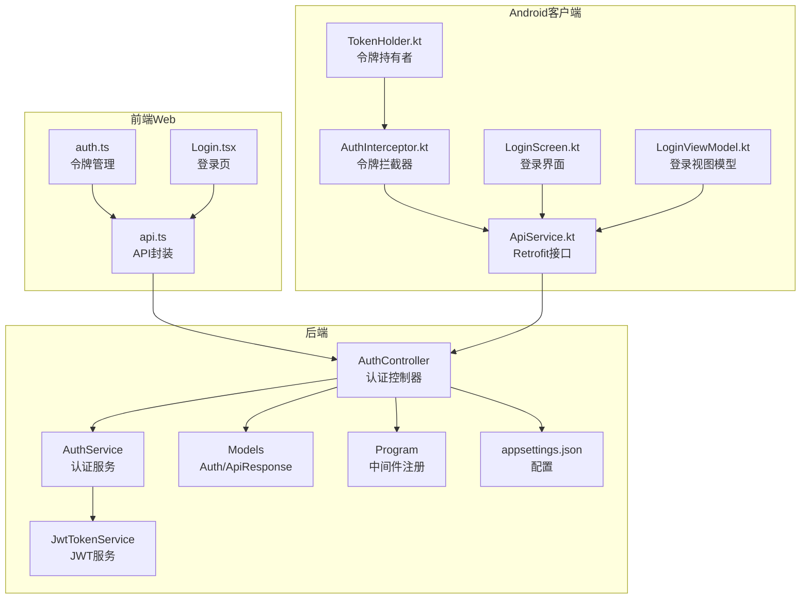
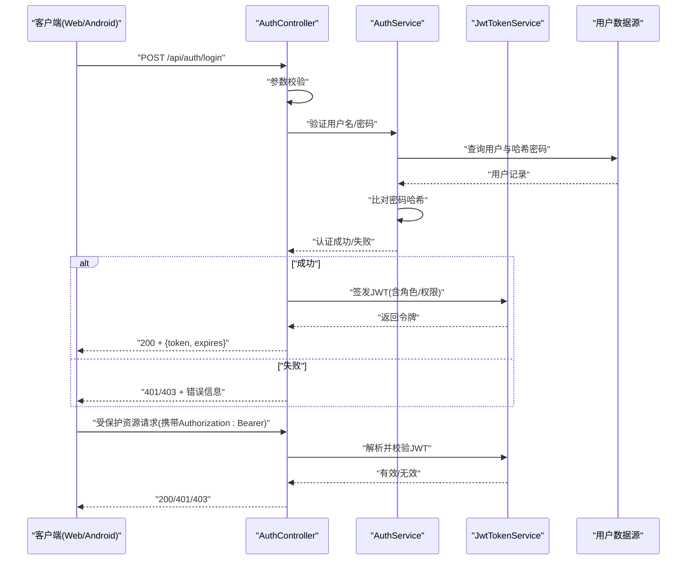
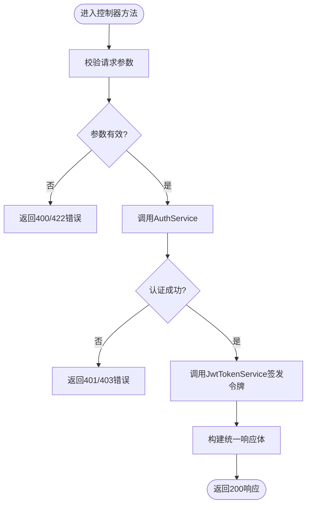
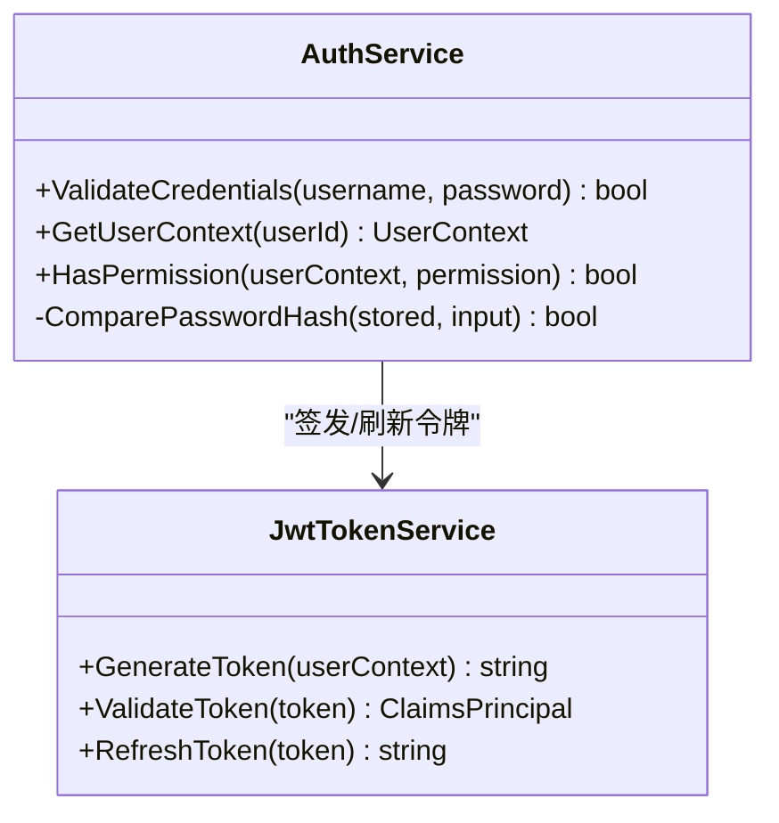
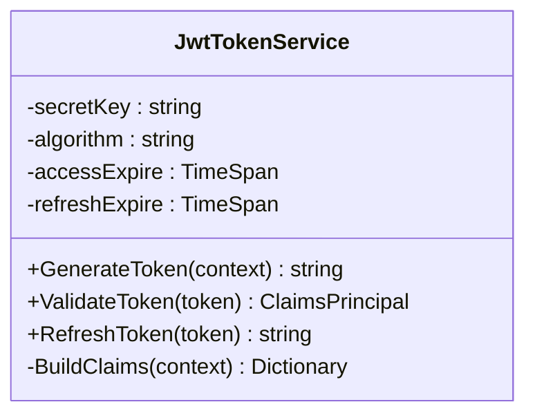
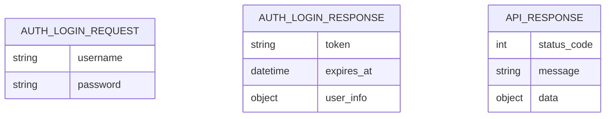
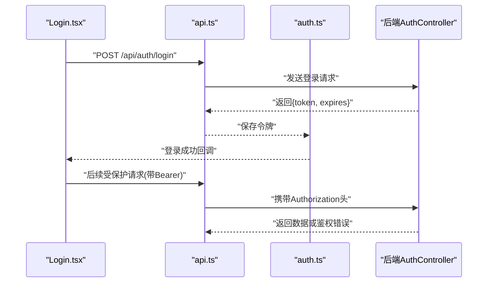
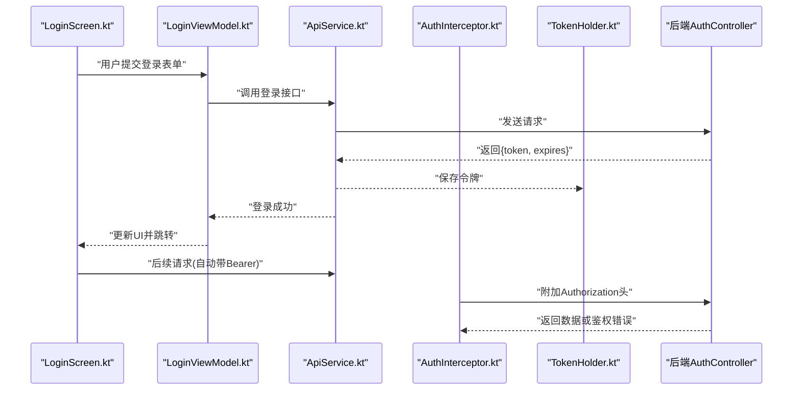
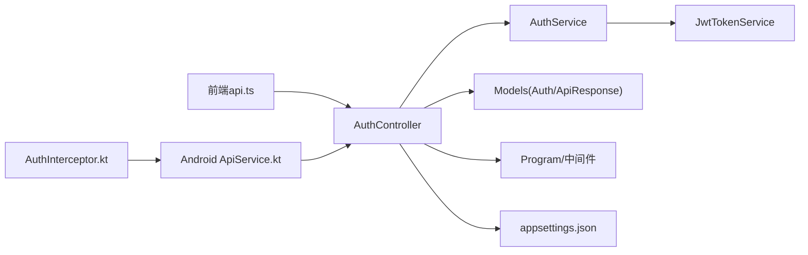

# 认证授权控制器

<cite>
**本文引用的文件**   
- [AuthController.cs](file://dip-system/api/Controllers/AuthController.cs)
- [AuthService.cs](file://dip-system/api/Services/AuthService.cs)
- [JwtTokenService.cs](file://dip-system/api/Services/JwtTokenService.cs)
- [Auth.cs](file://dip-system/api/Models/Auth.cs)
- [ApiResponse.cs](file://dip-system/api/Models/ApiResponse.cs)
- [AppExceptionFilter.cs](file://dip-system/api/Controllers/AppExceptionFilter.cs)
- [Program.cs](file://dip-system/api/Program.cs)
- [appsettings.json](file://dip-system/api/appsettings.json)
- [api.ts](file://dip-system/frontend-web/src/lib/api.ts)
- [auth.ts](file://dip-system/frontend-web/src/lib/auth.ts)
- [Login.tsx](file://dip-system/frontend-web/src/pages/Login.tsx)
- [ApiService.kt](file://mobile-android/app/src/main/java/com/dip/material/data/network/ApiService.kt)
- [AuthInterceptor.kt](file://mobile-android/app/src/main/java/com/dip/material/data/network/AuthInterceptor.kt)
- [TokenHolder.kt](file://mobile-android/app/src/main/java/com/dip/material/data/network/TokenHolder.kt)
- [LoginScreen.kt](file://mobile-android/app/src/main/java/com/dip/material/ui/login/LoginScreen.kt)
- [LoginViewModel.kt](file://mobile-android/app/src/main/java/com/dip/material/ui/login/LoginViewModel.kt)
</cite>

## 目录
1. [简介](#简介)
2. [项目结构](#项目结构)
3. [核心组件](#核心组件)
4. [架构总览](#架构总览)
5. [详细组件分析](#详细组件分析)
6. [依赖关系分析](#依赖关系分析)
7. [性能考虑](#性能考虑)
8. [故障排查指南](#故障排查指南)
9. [结论](#结论)
10. [附录](#附录)

## 简介
本文件为DIP物料管理系统的认证授权控制器提供完整技术文档，覆盖用户登录、登出、权限验证等核心能力；详细说明JWT令牌生成与校验机制（令牌结构、过期时间、刷新策略）；阐述密码加密存储、会话管理与安全最佳实践；并提供完整的API端点说明（请求参数、响应格式、错误码）、调用示例与安全配置指南。读者可据此快速集成前后端客户端并正确实现鉴权流程。

## 项目结构
认证授权相关代码主要分布在后端API层、服务层、模型定义以及前端Web与Android客户端的认证模块中：
- 后端API控制器与服务：处理HTTP请求、业务逻辑与JWT签发/校验
- 模型：统一请求/响应结构与认证数据载体
- 前端Web：封装API调用、本地令牌存储与路由守卫
- Android客户端：网络拦截器自动附加令牌、本地持久化与登录界面交互

**图表来源** 
- [AuthController.cs](file://dip-system/api/Controllers/AuthController.cs)
- [AuthService.cs](file://dip-system/api/Services/AuthService.cs)
- [JwtTokenService.cs](file://dip-system/api/Services/JwtTokenService.cs)
- [Auth.cs](file://dip-system/api/Models/Auth.cs)
- [ApiResponse.cs](file://dip-system/api/Models/ApiResponse.cs)
- [Program.cs](file://dip-system/api/Program.cs)
- [appsettings.json](file://dip-system/api/appsettings.json)
- [api.ts](file://dip-system/frontend-web/src/lib/api.ts)
- [auth.ts](file://dip-system/frontend-web/src/lib/auth.ts)
- [Login.tsx](file://dip-system/frontend-web/src/pages/Login.tsx)
- [ApiService.kt](file://mobile-android/app/src/main/java/com/dip/material/data/network/ApiService.kt)
- [AuthInterceptor.kt](file://mobile-android/app/src/main/java/com/dip/material/data/network/AuthInterceptor.kt)
- [TokenHolder.kt](file://mobile-android/app/src/main/java/com/dip/material/data/network/TokenHolder.kt)
- [LoginScreen.kt](file://mobile-android/app/src/main/java/com/dip/material/ui/login/LoginScreen.kt)
- [LoginViewModel.kt](file://mobile-android/app/src/main/java/com/dip/material/ui/login/LoginViewModel.kt)

**章节来源**
- [AuthController.cs](file://dip-system/api/Controllers/AuthController.cs)
- [AuthService.cs](file://dip-system/api/Services/AuthService.cs)
- [JwtTokenService.cs](file://dip-system/api/Services/JwtTokenService.cs)
- [Auth.cs](file://dip-system/api/Models/Auth.cs)
- [ApiResponse.cs](file://dip-system/api/Models/ApiResponse.cs)
- [Program.cs](file://dip-system/api/Program.cs)
- [appsettings.json](file://dip-system/api/appsettings.json)
- [api.ts](file://dip-system/frontend-web/src/lib/api.ts)
- [auth.ts](file://dip-system/frontend-web/src/lib/auth.ts)
- [Login.tsx](file://dip-system/frontend-web/src/pages/Login.tsx)
- [ApiService.kt](file://mobile-android/app/src/main/java/com/dip/material/data/network/ApiService.kt)
- [AuthInterceptor.kt](file://mobile-android/app/src/main/java/com/dip/material/data/network/AuthInterceptor.kt)
- [TokenHolder.kt](file://mobile-android/app/src/main/java/com/dip/material/data/network/TokenHolder.kt)
- [LoginScreen.kt](file://mobile-android/app/src/main/java/com/dip/material/ui/login/LoginScreen.kt)
- [LoginViewModel.kt](file://mobile-android/app/src/main/java/com/dip/material/ui/login/LoginViewModel.kt)

## 核心组件
- 认证控制器（AuthController）
  - 暴露登录、登出、获取当前用户信息、刷新令牌等HTTP端点
  - 负责输入校验、调用服务层、返回统一响应体
- 认证服务（AuthService）
  - 封装用户凭证校验、角色/权限查询、会话状态判断
  - 协调数据库访问与缓存（如有）
- JWT令牌服务（JwtTokenService）
  - 负责令牌签发、解析、校验、续期与撤销（如支持）
  - 维护密钥、算法、过期时间与声明映射
- 模型（Auth、ApiResponse）
  - 统一登录请求/响应结构、令牌对象、通用API响应包装
- 异常过滤器（AppExceptionFilter）
  - 全局异常捕获与标准化错误响应
- 程序入口与配置（Program、appsettings.json）
  - 注册认证中间件、CORS、JWT选项、日志与错误处理

**章节来源**
- [AuthController.cs](file://dip-system/api/Controllers/AuthController.cs)
- [AuthService.cs](file://dip-system/api/Services/AuthService.cs)
- [JwtTokenService.cs](file://dip-system/api/Services/JwtTokenService.cs)
- [Auth.cs](file://dip-system/api/Models/Auth.cs)
- [ApiResponse.cs](file://dip-system/api/Models/ApiResponse.cs)
- [AppExceptionFilter.cs](file://dip-system/api/Controllers/AppExceptionFilter.cs)
- [Program.cs](file://dip-system/api/Program.cs)
- [appsettings.json](file://dip-system/api/appsettings.json)

## 架构总览
认证授权整体流程如下：客户端发起登录请求，控制器校验输入后交由服务层验证用户身份；成功后由JWT服务签发令牌并返回给客户端；后续请求通过中间件或客户端拦截器携带令牌进行鉴权；服务端解析并校验令牌，基于声明决定访问权限。

**图表来源** 
- [AuthController.cs](file://dip-system/api/Controllers/AuthController.cs)
- [AuthService.cs](file://dip-system/api/Services/AuthService.cs)
- [JwtTokenService.cs](file://dip-system/api/Services/JwtTokenService.cs)

## 详细组件分析

### 认证控制器（AuthController）
- 职责
  - 提供登录、登出、获取当前用户、刷新令牌等端点
  - 统一输入校验、错误响应与权限控制
- 关键行为
  - 登录：接收用户名/密码，调用AuthService校验，成功后返回JWT
  - 登出：清除本地会话或使令牌失效（若支持黑名单）
  - 权限：基于角色/权限声明进行访问控制
- 错误处理
  - 使用统一异常过滤器返回标准错误结构

**图表来源** 
- [AuthController.cs](file://dip-system/api/Controllers/AuthController.cs)
- [AuthService.cs](file://dip-system/api/Services/AuthService.cs)
- [JwtTokenService.cs](file://dip-system/api/Services/JwtTokenService.cs)
- [ApiResponse.cs](file://dip-system/api/Models/ApiResponse.cs)

**章节来源**
- [AuthController.cs](file://dip-system/api/Controllers/AuthController.cs)
- [ApiResponse.cs](file://dip-system/api/Models/ApiResponse.cs)

### 认证服务（AuthService）
- 职责
  - 用户凭证校验、角色/权限加载、会话状态判断
- 关键行为
  - 根据用户名查找用户记录
  - 比对密码哈希（PBKDF2/BCrypt等）
  - 返回用户上下文（ID、角色、权限集合）
- 安全要点
  - 禁止明文比较密码
  - 对频繁失败尝试进行限流（建议）

**图表来源** 
- [AuthService.cs](file://dip-system/api/Services/AuthService.cs)
- [JwtTokenService.cs](file://dip-system/api/Services/JwtTokenService.cs)

**章节来源**
- [AuthService.cs](file://dip-system/api/Services/AuthService.cs)

### JWT令牌服务（JwtTokenService）
- 职责
  - 生成、解析、校验、刷新JWT
  - 管理密钥、算法、过期时间、声明映射
- 令牌结构（典型）
  - Header：算法与类型
  - Payload：用户标识、角色、权限、签发时间、过期时间、唯一ID
  - Signature：签名确保完整性
- 过期与刷新
  - Access Token短过期（例如分钟级）
  - Refresh Token长过期（例如天级），用于无感续期
  - 支持令牌撤销（可选黑名单/白名单）

**图表来源** 
- [JwtTokenService.cs](file://dip-system/api/Services/JwtTokenService.cs)

**章节来源**
- [JwtTokenService.cs](file://dip-system/api/Services/JwtTokenService.cs)

### 模型（Auth、ApiResponse）
- Auth
  - 登录请求：用户名、密码
  - 登录响应：令牌、过期时间、用户基本信息
- ApiResponse
  - 统一包装：状态码、消息、数据体
  - 便于前后端一致的错误处理

**图表来源** 
- [Auth.cs](file://dip-system/api/Models/Auth.cs)
- [ApiResponse.cs](file://dip-system/api/Models/ApiResponse.cs)

**章节来源**
- [Auth.cs](file://dip-system/api/Models/Auth.cs)
- [ApiResponse.cs](file://dip-system/api/Models/ApiResponse.cs)

### 前端Web集成（api.ts、auth.ts、Login.tsx）
- api.ts
  - 封装HTTP请求，统一添加Authorization头
  - 处理401/403跳转登录或刷新令牌
- auth.ts
  - 本地存储令牌（localStorage/sessionStorage）
  - 提供获取/设置/清除令牌的方法
- Login.tsx
  - 调用登录接口，成功后保存令牌并跳转

**图表来源** 
- [api.ts](file://dip-system/frontend-web/src/lib/api.ts)
- [auth.ts](file://dip-system/frontend-web/src/lib/auth.ts)
- [Login.tsx](file://dip-system/frontend-web/src/pages/Login.tsx)
- [AuthController.cs](file://dip-system/api/Controllers/AuthController.cs)

**章节来源**
- [api.ts](file://dip-system/frontend-web/src/lib/api.ts)
- [auth.ts](file://dip-system/frontend-web/src/lib/auth.ts)
- [Login.tsx](file://dip-system/frontend-web/src/pages/Login.tsx)

### Android客户端集成（ApiService.kt、AuthInterceptor.kt、TokenHolder.kt、LoginScreen.kt、LoginViewModel.kt）
- ApiService.kt
  - Retrofit接口定义，包含登录与受保护资源接口
- AuthInterceptor.kt
  - OkHttp拦截器，自动附加Authorization头
  - 处理401时尝试刷新令牌或跳转登录
- TokenHolder.kt
  - 本地持久化令牌（SharedPreferences/EncryptedPrefs）
- LoginScreen.kt / LoginViewModel.kt
  - 登录界面与业务逻辑，调用登录接口并保存令牌

**图表来源** 
- [ApiService.kt](file://mobile-android/app/src/main/java/com/dip/material/data/network/ApiService.kt)
- [AuthInterceptor.kt](file://mobile-android/app/src/main/java/com/dip/material/data/network/AuthInterceptor.kt)
- [TokenHolder.kt](file://mobile-android/app/src/main/java/com/dip/material/data/network/TokenHolder.kt)
- [LoginScreen.kt](file://mobile-android/app/src/main/java/com/dip/material/ui/login/LoginScreen.kt)
- [LoginViewModel.kt](file://mobile-android/app/src/main/java/com/dip/material/ui/login/LoginViewModel.kt)
- [AuthController.cs](file://dip-system/api/Controllers/AuthController.cs)

**章节来源**
- [ApiService.kt](file://mobile-android/app/src/main/java/com/dip/material/data/network/ApiService.kt)
- [AuthInterceptor.kt](file://mobile-android/app/src/main/java/com/dip/material/data/network/AuthInterceptor.kt)
- [TokenHolder.kt](file://mobile-android/app/src/main/java/com/dip/material/data/network/TokenHolder.kt)
- [LoginScreen.kt](file://mobile-android/app/src/main/java/com/dip/material/ui/login/LoginScreen.kt)
- [LoginViewModel.kt](file://mobile-android/app/src/main/java/com/dip/material/ui/login/LoginViewModel.kt)

## 依赖关系分析
- 控制器依赖服务层，服务层依赖JWT服务与数据源
- 前端与Android客户端依赖统一的API契约
- 中间件与配置在Program与appsettings.json中集中管理

**图表来源** 
- [AuthController.cs](file://dip-system/api/Controllers/AuthController.cs)
- [AuthService.cs](file://dip-system/api/Services/AuthService.cs)
- [JwtTokenService.cs](file://dip-system/api/Services/JwtTokenService.cs)
- [Auth.cs](file://dip-system/api/Models/Auth.cs)
- [ApiResponse.cs](file://dip-system/api/Models/ApiResponse.cs)
- [Program.cs](file://dip-system/api/Program.cs)
- [appsettings.json](file://dip-system/api/appsettings.json)
- [api.ts](file://dip-system/frontend-web/src/lib/api.ts)
- [ApiService.kt](file://mobile-android/app/src/main/java/com/dip/material/data/network/ApiService.kt)
- [AuthInterceptor.kt](file://mobile-android/app/src/main/java/com/dip/material/data/network/AuthInterceptor.kt)

**章节来源**
- [AuthController.cs](file://dip-system/api/Controllers/AuthController.cs)
- [AuthService.cs](file://dip-system/api/Services/AuthService.cs)
- [JwtTokenService.cs](file://dip-system/api/Services/JwtTokenService.cs)
- [Auth.cs](file://dip-system/api/Models/Auth.cs)
- [ApiResponse.cs](file://dip-system/api/Models/ApiResponse.cs)
- [Program.cs](file://dip-system/api/Program.cs)
- [appsettings.json](file://dip-system/api/appsettings.json)
- [api.ts](file://dip-system/frontend-web/src/lib/api.ts)
- [ApiService.kt](file://mobile-android/app/src/main/java/com/dip/material/data/network/ApiService.kt)
- [AuthInterceptor.kt](file://mobile-android/app/src/main/java/com/dip/material/data/network/AuthInterceptor.kt)

## 性能考虑
- 令牌签发与校验应使用高效算法（如HS256/RS256），避免CPU热点
- 用户密码哈希选择合适迭代次数，平衡安全性与响应时间
- 对登录接口实施速率限制，防止暴力破解
- 前端/客户端缓存令牌，减少重复登录
- 必要时引入Redis缓存用户上下文或令牌黑名单

[本节为通用指导，不直接分析具体文件]

## 故障排查指南
- 常见错误码
  - 400/422：请求参数校验失败
  - 401：未认证或令牌无效/过期
  - 403：已认证但权限不足
  - 500：服务器内部错误
- 排查步骤
  - 检查请求头是否携带正确的Authorization头
  - 确认令牌未过期且未被撤销
  - 查看服务端日志与异常过滤器输出
  - 核对appsettings.json中的JWT配置（密钥、算法、过期时间）

**章节来源**
- [AppExceptionFilter.cs](file://dip-system/api/Controllers/AppExceptionFilter.cs)
- [ApiResponse.cs](file://dip-system/api/Models/ApiResponse.cs)
- [appsettings.json](file://dip-system/api/appsettings.json)

## 结论
本系统采用控制器-服务-令牌服务的分层架构，结合统一响应体与全局异常过滤，提供稳定可靠的认证授权能力。JWT令牌机制清晰明确，支持短效Access Token与长效Refresh Token的组合策略。前后端客户端均实现了令牌管理与自动附加，保障端到端的鉴权一致性。建议在生产环境启用HTTPS、严格密钥管理、速率限制与审计日志，以进一步提升安全性与可观测性。

[本节为总结性内容，不直接分析具体文件]

## 附录

### API端点文档
- 登录
  - 方法：POST
  - 路径：/api/auth/login
  - 请求体：用户名、密码
  - 响应：令牌、过期时间、用户信息
  - 错误：400/401/403/500
- 登出
  - 方法：POST
  - 路径：/api/auth/logout
  - 请求体：无或令牌
  - 响应：成功/失败
  - 错误：401/500
- 获取当前用户
  - 方法：GET
  - 路径：/api/auth/me
  - 请求头：Authorization: Bearer <token>
  - 响应：用户信息与权限
  - 错误：401/403/500
- 刷新令牌
  - 方法：POST
  - 路径：/api/auth/refresh
  - 请求体：刷新令牌
  - 响应：新Access Token
  - 错误：401/403/500

**章节来源**
- [AuthController.cs](file://dip-system/api/Controllers/AuthController.cs)
- [ApiResponse.cs](file://dip-system/api/Models/ApiResponse.cs)

### 调用示例（概念性）
- Web前端
  - 登录：调用登录接口，保存令牌到本地存储，后续请求自动附加Authorization头
  - 刷新：当Access Token过期时，使用Refresh Token换取新的Access Token
- Android客户端
  - 登录：通过Retrofit接口调用登录，成功后写入TokenHolder
  - 拦截器：OkHttp拦截器自动附加Authorization头，处理401重试或跳转登录

[本节为概念性示例，不直接分析具体文件]

### 安全配置指南
- 使用强随机密钥与合适的算法（推荐非对称算法）
- 合理设置Access Token与Refresh Token过期时间
- 启用HTTPS，禁用明文传输
- 实施登录失败次数限制与账户锁定策略
- 记录认证事件审计日志
- 定期轮换密钥与令牌黑名单策略

**章节来源**
- [appsettings.json](file://dip-system/api/appsettings.json)
- [Program.cs](file://dip-system/api/Program.cs)
- [AppExceptionFilter.cs](file://dip-system/api/Controllers/AppExceptionFilter.cs)