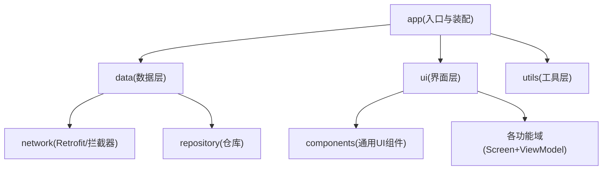
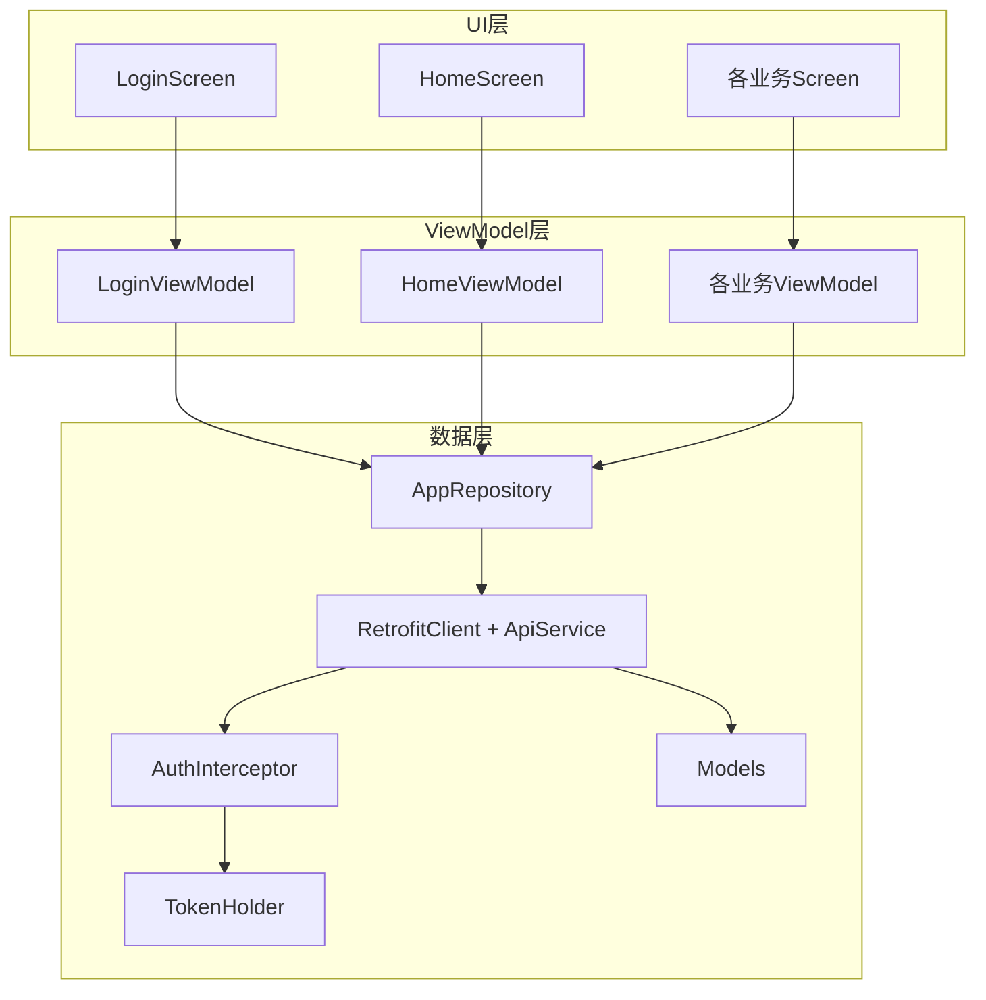
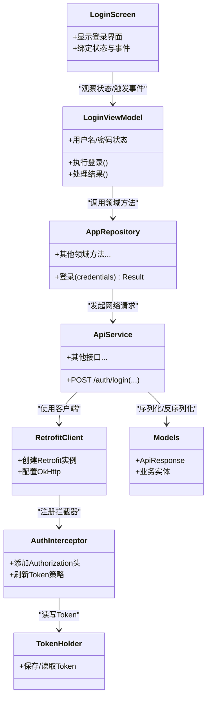
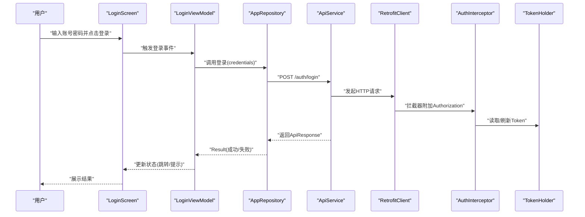
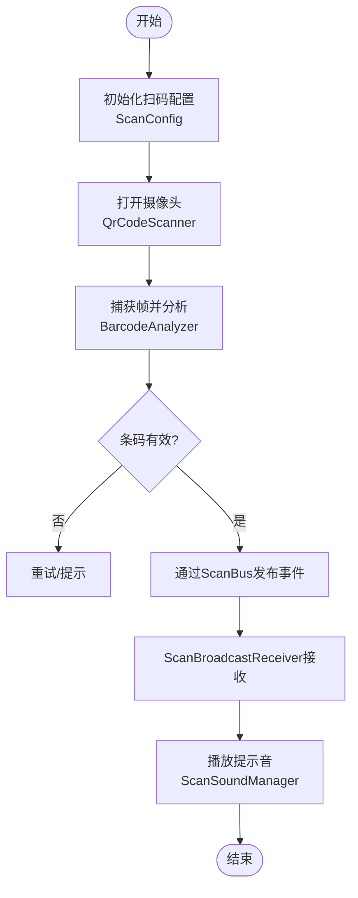
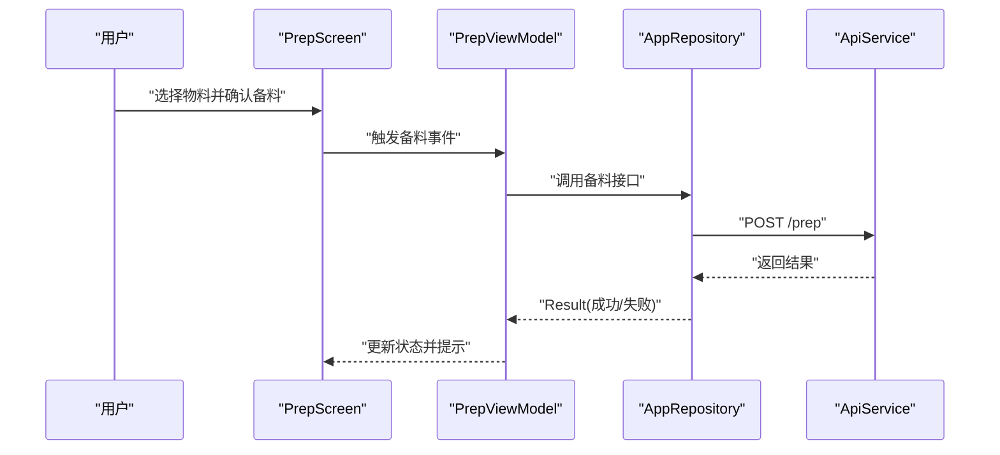
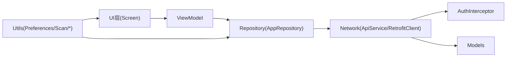

# Android应用模块架构

<cite>
**本文引用的文件**
- [MainActivity.kt](file://mobile-android/app/src/main/java/com/dip/material/MainActivity.kt)
- [DIPApplication.kt](file://mobile-android/app/src/main/java/com/dip/material/DIPApplication.kt)
- [Models.kt](file://mobile-android/app/src/main/java/com/dip/material/data/models/Models.kt)
- [ApiService.kt](file://mobile-android/app/src/main/java/com/dip/material/data/network/ApiService.kt)
- [RetrofitClient.kt](file://mobile-android/app/src/main/java/com/dip/material/data/network/RetrofitClient.kt)
- [AuthInterceptor.kt](file://mobile-android/app/src/main/java/com/dip/material/data/network/AuthInterceptor.kt)
- [TokenHolder.kt](file://mobile-android/app/src/main/java/com/dip/material/data/network/TokenHolder.kt)
- [AppRepository.kt](file://mobile-android/app/src/main/java/com/dip/material/data/repository/AppRepository.kt)
- [LoginScreen.kt](file://mobile-android/app/src/main/java/com/dip/material/ui/login/LoginScreen.kt)
- [LoginViewModel.kt](file://mobile-android/app/src/main/java/com/dip/material/ui/login/LoginViewModel.kt)
- [HomeScreen.kt](file://mobile-android/app/src/main/java/com/dip/material/ui/home/HomeScreen.kt)
- [HomeViewModel.kt](file://mobile-android/app/src/main/java/com/dip/material/ui/home/HomeViewModel.kt)
- [CallMaterialScreen.kt](file://mobile-android/app/src/main/java/com/dip/material/ui/callmaterial/CallMaterialScreen.kt)
- [CallMaterialViewModel.kt](file://mobile-android/app/src/main/java/com/dip/material/ui/callmaterial/CallMaterialViewModel.kt)
- [ChangeoverScreen.kt](file://mobile-android/app/src/main/java/com/dip/material/ui/changeover/ChangeoverScreen.kt)
- [ChangeoverViewModel.kt](file://mobile-android/app/src/main/java/com/dip/material/ui/changeover/ChangeoverViewModel.kt)
- [OnlineScreen.kt](file://mobile-android/app/src/main/java/com/dip/material/ui/online/OnlineScreen.kt)
- [OnlineViewModel.kt](file://mobile-android/app/src/main/java/com/dip/material/ui/online/OnlineViewModel.kt)
- [OutboundScreen.kt](file://mobile-android/app/src/main/java/com/dip/material/ui/outbound/OutboundScreen.kt)
- [OutboundViewModel.kt](file://mobile-android/app/src/main/java/com/dip/material/ui/outbound/OutboundViewModel.kt)
- [PrepScreen.kt](file://mobile-android/app/src/main/java/com/dip/material/ui/prep/PrepScreen.kt)
- [PrepViewModel.kt](file://mobile-android/app/src/main/java/com/dip/material/ui/prep/PrepViewModel.kt)
- [RefillScreen.kt](file://mobile-android/app/src/main/java/com/dip/material/ui/refill/RefillScreen.kt)
- [RefillViewModel.kt](file://mobile-android/app/src/main/java/com/dip/material/ui/refill/RefillViewModel.kt)
- [ReturnScreen.kt](file://mobile-android/app/src/main/java/com/dip/material/ui/return_/ReturnScreen.kt)
- [ReturnViewModel.kt](file://mobile-android/app/src/main/java/com/dip/material/ui/return_/ReturnViewModel.kt)
- [ShelvingScreen.kt](file://mobile-android/app/src/main/java/com/dip/material/ui/shelving/ShelvingScreen.kt)
- [ShelvingViewModel.kt](file://mobile-android/app/src/main/java/com/dip/material/ui/shelving/ShelvingViewModel.kt)
- [SubstituteScreen.kt](file://mobile-android/app/src/main/java/com/dip/material/ui/substitute/SubstituteScreen.kt)
- [SubstituteViewModel.kt](file://mobile-android/app/src/main/java/com/dip/material/ui/substitute/SubstituteViewModel.kt)
- [BarcodeAnalyzer.kt](file://mobile-android/app/src/main/java/com/dip/material/ui/components/BarcodeAnalyzer.kt)
- [BarcodeTextField.kt](file://mobile-android/app/src/main/java/com/dip/material/ui/components/BarcodeTextField.kt)
- [ImageUtils.kt](file://mobile-android/app/src/main/java/com/dip/material/ui/components/ImageUtils.kt)
- [PcbTuneParams.kt](file://mobile-android/app/src/main/java/com/dip/material/ui/components/PcbTuneParams.kt)
- [QrCodeScanner.kt](file://mobile-android/app/src/main/java/com/dip/material/ui/components/QrCodeScanner.kt)
- [ScannerOverlay.kt](file://mobile-android/app/src/main/java/com/dip/material/ui/components/ScannerOverlay.kt)
- [PreferencesManager.kt](file://mobile-android/app/src/main/java/com/dip/material/utils/PreferencesManager.kt)
- [ScanBroadcastReceiver.kt](file://mobile-android/app/src/main/java/com/dip/material/utils/ScanBroadcastReceiver.kt)
- [ScanBus.kt](file://mobile-android/app/src/main/java/com/dip/material/utils/ScanBus.kt)
- [ScanConfig.kt](file://mobile-android/app/src/main/java/com/dip/material/utils/ScanConfig.kt)
- [ScanSoundManager.kt](file://mobile-android/app/src/main/java/com/dip/material/utils/ScanSoundManager.kt)
- [build.gradle.kts](file://mobile-android/app/build.gradle.kts)
- [AndroidManifest.xml](file://mobile-android/app/src/main/AndroidManifest.xml)
</cite>

## 目录
1. [简介](#简介)
2. [项目结构](#项目结构)
3. [核心组件](#核心组件)
4. [架构总览](#架构总览)
5. [详细组件分析](#详细组件分析)
6. [依赖关系分析](#依赖关系分析)
7. [性能考量](#性能考量)
8. [故障排查指南](#故障排查指南)
9. [结论](#结论)
10. [附录](#附录)

## 简介
本文件面向DIP物料管理系统的Android应用模块，系统性阐述基于MVVM的架构实现与模块化组织方式。内容覆盖UI层、ViewModel层、数据层的职责分离；登录、首页、扫码、业务操作等功能模块的组织；数据层Repository模式与网络请求封装；工具模块的复用性设计；并提供模块依赖图与组件交互流程图，辅以模块化开发最佳实践，帮助开发者快速理解与扩展系统。

## 项目结构
Android端采用“按功能域分包 + 分层”的组织方式：
- app模块为入口与应用装配中心，包含Activity、主题、清单等
- data层负责数据模型、网络接口与仓库抽象
- ui层按功能域划分（login、home、callmaterial、changeover、online、outbound、prep、refill、return_、shelving、substitute），每个功能域包含Screen与ViewModel
- components子包提供可复用的UI组件（扫码、条码输入、图像工具等）
- utils子包提供跨模块工具（偏好存储、扫码广播、总线、声音管理等）

图表来源
- [MainActivity.kt:1-200](file://mobile-android/app/src/main/java/com/dip/material/MainActivity.kt#L1-L200)
- [DIPApplication.kt:1-200](file://mobile-android/app/src/main/java/com/dip/material/DIPApplication.kt#L1-L200)
- [build.gradle.kts:1-200](file://mobile-android/app/build.gradle.kts#L1-L200)

章节来源
- [MainActivity.kt:1-200](file://mobile-android/app/src/main/java/com/dip/material/MainActivity.kt#L1-L200)
- [DIPApplication.kt:1-200](file://mobile-android/app/src/main/java/com/dip/material/DIPApplication.kt#L1-L200)
- [build.gradle.kts:1-200](file://mobile-android/app/build.gradle.kts#L1-L200)

## 核心组件
- 应用入口与初始化：DIPApplication负责全局配置与依赖注入准备；MainActivity作为导航与路由容器
- 数据层：
  - network：RetrofitClient统一构建OkHttp与Retrofit实例，AuthInterceptor处理鉴权头，TokenHolder集中管理令牌
  - models：定义统一的API响应与业务实体
  - repository：AppRepository对外暴露领域级数据访问方法，屏蔽底层网络与缓存细节
- UI层：
  - 各功能域Screen使用Stateless Composable或传统View，通过ViewModel驱动状态更新
  - components提供扫码、条码输入、图像工具等可复用组件
- 工具层：
  - PreferencesManager持久化用户设置与令牌
  - ScanBroadcastReceiver/ScanBus/ScanConfig/ScanSoundManager构成扫码子系统

章节来源
- [DIPApplication.kt:1-200](file://mobile-android/app/src/main/java/com/dip/material/DIPApplication.kt#L1-L200)
- [MainActivity.kt:1-200](file://mobile-android/app/src/main/java/com/dip/material/MainActivity.kt#L1-L200)
- [RetrofitClient.kt:1-200](file://mobile-android/app/src/main/java/com/dip/material/data/network/RetrofitClient.kt#L1-L200)
- [AuthInterceptor.kt:1-200](file://mobile-android/app/src/main/java/com/dip/material/data/network/AuthInterceptor.kt#L1-L200)
- [TokenHolder.kt:1-200](file://mobile-android/app/src/main/java/com/dip/material/data/network/TokenHolder.kt#L1-L200)
- [Models.kt:1-200](file://mobile-android/app/src/main/java/com/dip/material/data/models/Models.kt#L1-L200)
- [AppRepository.kt:1-200](file://mobile-android/app/src/main/java/com/dip/material/data/repository/AppRepository.kt#L1-L200)

## 架构总览
整体采用MVVM + Repository + Retrofit的经典分层：
- UI层仅持有状态与展示逻辑，不直接访问网络或数据库
- ViewModel负责业务编排、状态管理与生命周期感知
- Repository聚合数据源（网络、本地缓存），向上提供领域接口
- network层通过Retrofit与OkHttp完成HTTP通信，拦截器统一处理鉴权与错误

图表来源
- [LoginScreen.kt:1-200](file://mobile-android/app/src/main/java/com/dip/material/ui/login/LoginScreen.kt#L1-L200)
- [LoginViewModel.kt:1-200](file://mobile-android/app/src/main/java/com/dip/material/ui/login/LoginViewModel.kt#L1-L200)
- [HomeScreen.kt:1-200](file://mobile-android/app/src/main/java/com/dip/material/ui/home/HomeScreen.kt#L1-L200)
- [HomeViewModel.kt:1-200](file://mobile-android/app/src/main/java/com/dip/material/ui/home/HomeViewModel.kt#L1-L200)
- [AppRepository.kt:1-200](file://mobile-android/app/src/main/java/com/dip/material/data/repository/AppRepository.kt#L1-L200)
- [ApiService.kt:1-200](file://mobile-android/app/src/main/java/com/dip/material/data/network/ApiService.kt#L1-L200)
- [RetrofitClient.kt:1-200](file://mobile-android/app/src/main/java/com/dip/material/data/network/RetrofitClient.kt#L1-L200)
- [AuthInterceptor.kt:1-200](file://mobile-android/app/src/main/java/com/dip/material/data/network/AuthInterceptor.kt#L1-L200)
- [TokenHolder.kt:1-200](file://mobile-android/app/src/main/java/com/dip/material/data/network/TokenHolder.kt#L1-L200)
- [Models.kt:1-200](file://mobile-android/app/src/main/java/com/dip/material/data/models/Models.kt#L1-L200)

## 详细组件分析

### MVVM与Repository实现
- UI层：各Screen通过State收集ViewModel暴露的状态，事件回调触发ViewModel动作
- ViewModel：封装业务逻辑，调用Repository获取数据，处理加载/错误/成功状态
- Repository：对外暴露领域方法，内部协调网络与缓存，统一异常转换

图表来源
- [LoginScreen.kt:1-200](file://mobile-android/app/src/main/java/com/dip/material/ui/login/LoginScreen.kt#L1-L200)
- [LoginViewModel.kt:1-200](file://mobile-android/app/src/main/java/com/dip/material/ui/login/LoginViewModel.kt#L1-L200)
- [AppRepository.kt:1-200](file://mobile-android/app/src/main/java/com/dip/material/data/repository/AppRepository.kt#L1-L200)
- [ApiService.kt:1-200](file://mobile-android/app/src/main/java/com/dip/material/data/network/ApiService.kt#L1-L200)
- [RetrofitClient.kt:1-200](file://mobile-android/app/src/main/java/com/dip/material/data/network/RetrofitClient.kt#L1-L200)
- [AuthInterceptor.kt:1-200](file://mobile-android/app/src/main/java/com/dip/material/data/network/AuthInterceptor.kt#L1-L200)
- [TokenHolder.kt:1-200](file://mobile-android/app/src/main/java/com/dip/material/data/network/TokenHolder.kt#L1-L200)
- [Models.kt:1-200](file://mobile-android/app/src/main/java/com/dip/material/data/models/Models.kt#L1-L200)

章节来源
- [LoginScreen.kt:1-200](file://mobile-android/app/src/main/java/com/dip/material/ui/login/LoginScreen.kt#L1-L200)
- [LoginViewModel.kt:1-200](file://mobile-android/app/src/main/java/com/dip/material/ui/login/LoginViewModel.kt#L1-L200)
- [AppRepository.kt:1-200](file://mobile-android/app/src/main/java/com/dip/material/data/repository/AppRepository.kt#L1-L200)
- [ApiService.kt:1-200](file://mobile-android/app/src/main/java/com/dip/material/data/network/ApiService.kt#L1-L200)
- [RetrofitClient.kt:1-200](file://mobile-android/app/src/main/java/com/dip/material/data/network/RetrofitClient.kt#L1-L200)
- [AuthInterceptor.kt:1-200](file://mobile-android/app/src/main/java/com/dip/material/data/network/AuthInterceptor.kt#L1-L200)
- [TokenHolder.kt:1-200](file://mobile-android/app/src/main/java/com/dip/material/data/network/TokenHolder.kt#L1-L200)
- [Models.kt:1-200](file://mobile-android/app/src/main/java/com/dip/material/data/models/Models.kt#L1-L200)

### 登录流程（序列图）

图表来源
- [LoginScreen.kt:1-200](file://mobile-android/app/src/main/java/com/dip/material/ui/login/LoginScreen.kt#L1-L200)
- [LoginViewModel.kt:1-200](file://mobile-android/app/src/main/java/com/dip/material/ui/login/LoginViewModel.kt#L1-L200)
- [AppRepository.kt:1-200](file://mobile-android/app/src/main/java/com/dip/material/data/repository/AppRepository.kt#L1-L200)
- [ApiService.kt:1-200](file://mobile-android/app/src/main/java/com/dip/material/data/network/ApiService.kt#L1-L200)
- [RetrofitClient.kt:1-200](file://mobile-android/app/src/main/java/com/dip/material/data/network/RetrofitClient.kt#L1-L200)
- [AuthInterceptor.kt:1-200](file://mobile-android/app/src/main/java/com/dip/material/data/network/AuthInterceptor.kt#L1-L200)
- [TokenHolder.kt:1-200](file://mobile-android/app/src/main/java/com/dip/material/data/network/TokenHolder.kt#L1-L200)

章节来源
- [LoginScreen.kt:1-200](file://mobile-android/app/src/main/java/com/dip/material/ui/login/LoginScreen.kt#L1-L200)
- [LoginViewModel.kt:1-200](file://mobile-android/app/src/main/java/com/dip/material/ui/login/LoginViewModel.kt#L1-L200)
- [AppRepository.kt:1-200](file://mobile-android/app/src/main/java/com/dip/material/data/repository/AppRepository.kt#L1-L200)
- [ApiService.kt:1-200](file://mobile-android/app/src/main/java/com/dip/material/data/network/ApiService.kt#L1-L200)
- [RetrofitClient.kt:1-200](file://mobile-android/app/src/main/java/com/dip/material/data/network/RetrofitClient.kt#L1-L200)
- [AuthInterceptor.kt:1-200](file://mobile-android/app/src/main/java/com/dip/material/data/network/AuthInterceptor.kt#L1-L200)
- [TokenHolder.kt:1-200](file://mobile-android/app/src/main/java/com/dip/material/data/network/TokenHolder.kt#L1-L200)

### 扫码模块（组件与流程）
扫码子系统由多个组件协作完成：
- QrCodeScanner：相机扫描与解码
- ScannerOverlay：扫描框与遮罩绘制
- BarcodeAnalyzer：条码解析与校验
- BarcodeTextField：条码输入与粘贴
- ScanBroadcastReceiver/ScanBus/ScanConfig/ScanSoundManager：硬件广播接收、事件总线、配置与提示音

图表来源
- [QrCodeScanner.kt:1-200](file://mobile-android/app/src/main/java/com/dip/material/ui/components/QrCodeScanner.kt#L1-L200)
- [ScannerOverlay.kt:1-200](file://mobile-android/app/src/main/java/com/dip/material/ui/components/ScannerOverlay.kt#L1-L200)
- [BarcodeAnalyzer.kt:1-200](file://mobile-android/app/src/main/java/com/dip/material/ui/components/BarcodeAnalyzer.kt#L1-L200)
- [BarcodeTextField.kt:1-200](file://mobile-android/app/src/main/java/com/dip/material/ui/components/BarcodeTextField.kt#L1-L200)
- [ScanBroadcastReceiver.kt:1-200](file://mobile-android/app/src/main/java/com/dip/material/utils/ScanBroadcastReceiver.kt#L1-L200)
- [ScanBus.kt:1-200](file://mobile-android/app/src/main/java/com/dip/material/utils/ScanBus.kt#L1-L200)
- [ScanConfig.kt:1-200](file://mobile-android/app/src/main/java/com/dip/material/utils/ScanConfig.kt#L1-L200)
- [ScanSoundManager.kt:1-200](file://mobile-android/app/src/main/java/com/dip/material/utils/ScanSoundManager.kt#L1-L200)

章节来源
- [QrCodeScanner.kt:1-200](file://mobile-android/app/src/main/java/com/dip/material/ui/components/QrCodeScanner.kt#L1-L200)
- [ScannerOverlay.kt:1-200](file://mobile-android/app/src/main/java/com/dip/material/ui/components/ScannerOverlay.kt#L1-L200)
- [BarcodeAnalyzer.kt:1-200](file://mobile-android/app/src/main/java/com/dip/material/ui/components/BarcodeAnalyzer.kt#L1-L200)
- [BarcodeTextField.kt:1-200](file://mobile-android/app/src/main/java/com/dip/material/ui/components/BarcodeTextField.kt#L1-L200)
- [ScanBroadcastReceiver.kt:1-200](file://mobile-android/app/src/main/java/com/dip/material/utils/ScanBroadcastReceiver.kt#L1-L200)
- [ScanBus.kt:1-200](file://mobile-android/app/src/main/java/com/dip/material/utils/ScanBus.kt#L1-L200)
- [ScanConfig.kt:1-200](file://mobile-android/app/src/main/java/com/dip/material/utils/ScanConfig.kt#L1-L200)
- [ScanSoundManager.kt:1-200](file://mobile-android/app/src/main/java/com/dip/material/utils/ScanSoundManager.kt#L1-L200)

### 业务操作模块（示例：备料/补料/出库/上架/替代等）
各业务模块遵循统一模式：
- Screen：负责页面布局与用户交互
- ViewModel：维护业务状态，调用Repository执行业务
- Repository：聚合网络与缓存，提供领域方法

以备料为例：

图表来源
- [PrepScreen.kt:1-200](file://mobile-android/app/src/main/java/com/dip/material/ui/prep/PrepScreen.kt#L1-L200)
- [PrepViewModel.kt:1-200](file://mobile-android/app/src/main/java/com/dip/material/ui/prep/PrepViewModel.kt#L1-L200)
- [AppRepository.kt:1-200](file://mobile-android/app/src/main/java/com/dip/material/data/repository/AppRepository.kt#L1-L200)
- [ApiService.kt:1-200](file://mobile-android/app/src/main/java/com/dip/material/data/network/ApiService.kt#L1-L200)

章节来源
- [PrepScreen.kt:1-200](file://mobile-android/app/src/main/java/com/dip/material/ui/prep/PrepScreen.kt#L1-L200)
- [PrepViewModel.kt:1-200](file://mobile-android/app/src/main/java/com/dip/material/ui/prep/PrepViewModel.kt#L1-L200)
- [AppRepository.kt:1-200](file://mobile-android/app/src/main/java/com/dip/material/data/repository/AppRepository.kt#L1-L200)
- [ApiService.kt:1-200](file://mobile-android/app/src/main/java/com/dip/material/data/network/ApiService.kt#L1-L200)

### 工具模块复用性设计
- 偏好存储：PreferencesManager统一存取键值对，支持默认值与类型安全
- 扫码子系统：ScanBroadcastReceiver监听硬件广播，ScanBus解耦发布订阅，ScanConfig集中配置，ScanSoundManager控制提示音
- UI组件：BarcodeTextField、BarcodeAnalyzer、QrCodeScanner、ScannerOverlay等可被多业务复用

章节来源
- [PreferencesManager.kt:1-200](file://mobile-android/app/src/main/java/com/dip/material/utils/PreferencesManager.kt#L1-L200)
- [ScanBroadcastReceiver.kt:1-200](file://mobile-android/app/src/main/java/com/dip/material/utils/ScanBroadcastReceiver.kt#L1-L200)
- [ScanBus.kt:1-200](file://mobile-android/app/src/main/java/com/dip/material/utils/ScanBus.kt#L1-L200)
- [ScanConfig.kt:1-200](file://mobile-android/app/src/main/java/com/dip/material/utils/ScanConfig.kt#L1-L200)
- [ScanSoundManager.kt:1-200](file://mobile-android/app/src/main/java/com/dip/material/utils/ScanSoundManager.kt#L1-L200)
- [BarcodeTextField.kt:1-200](file://mobile-android/app/src/main/java/com/dip/material/ui/components/BarcodeTextField.kt#L1-L200)
- [BarcodeAnalyzer.kt:1-200](file://mobile-android/app/src/main/java/com/dip/material/ui/components/BarcodeAnalyzer.kt#L1-L200)
- [QrCodeScanner.kt:1-200](file://mobile-android/app/src/main/java/com/dip/material/ui/components/QrCodeScanner.kt#L1-L200)
- [ScannerOverlay.kt:1-200](file://mobile-android/app/src/main/java/com/dip/material/ui/components/ScannerOverlay.kt#L1-L200)

## 依赖关系分析
模块间依赖清晰，单向依赖降低耦合：
- UI依赖ViewModel，ViewModel依赖Repository
- Repository依赖network与models
- network依赖Retrofit/OkHttp与拦截器
- 工具模块被UI与数据层共同引用

图表来源
- [build.gradle.kts:1-200](file://mobile-android/app/build.gradle.kts#L1-L200)
- [AndroidManifest.xml:1-200](file://mobile-android/app/src/main/AndroidManifest.xml#L1-L200)
- [AppRepository.kt:1-200](file://mobile-android/app/src/main/java/com/dip/material/data/repository/AppRepository.kt#L1-L200)
- [ApiService.kt:1-200](file://mobile-android/app/src/main/java/com/dip/material/data/network/ApiService.kt#L1-L200)
- [RetrofitClient.kt:1-200](file://mobile-android/app/src/main/java/com/dip/material/data/network/RetrofitClient.kt#L1-L200)
- [AuthInterceptor.kt:1-200](file://mobile-android/app/src/main/java/com/dip/material/data/network/AuthInterceptor.kt#L1-L200)
- [Models.kt:1-200](file://mobile-android/app/src/main/java/com/dip/material/data/models/Models.kt#L1-L200)

章节来源
- [build.gradle.kts:1-200](file://mobile-android/app/build.gradle.kts#L1-L200)
- [AndroidManifest.xml:1-200](file://mobile-android/app/src/main/AndroidManifest.xml#L1-L200)
- [AppRepository.kt:1-200](file://mobile-android/app/src/main/java/com/dip/material/data/repository/AppRepository.kt#L1-L200)
- [ApiService.kt:1-200](file://mobile-android/app/src/main/java/com/dip/material/data/network/ApiService.kt#L1-L200)
- [RetrofitClient.kt:1-200](file://mobile-android/app/src/main/java/com/dip/material/data/network/RetrofitClient.kt#L1-L200)
- [AuthInterceptor.kt:1-200](file://mobile-android/app/src/main/java/com/dip/material/data/network/AuthInterceptor.kt#L1-L200)
- [Models.kt:1-200](file://mobile-android/app/src/main/java/com/dip/material/data/models/Models.kt#L1-L200)

## 性能考量
- 网络层：
  - 合理设置OkHttp连接池与超时，避免频繁建立连接
  - 使用Gson/Moshi进行高效序列化，减少GC压力
  - 在必要时启用缓存策略（ETag/Cache-Control）
- UI层：
  - 使用不可变State与LaunchedEffect，避免不必要的重组
  - 列表使用分页与懒加载，减少首屏渲染时间
- 扫码子系统：
  - 控制相机分辨率与帧率，平衡识别速度与功耗
  - 使用轻量级解码库，避免主线程阻塞
- 数据层：
  - 将耗时IO放在后台线程，避免阻塞主线程
  - 合并重复请求，去抖与节流

[本节为通用指导，无需特定文件来源]

## 故障排查指南
- 登录失败：
  - 检查Token是否过期或无效，查看AuthInterceptor与TokenHolder行为
  - 核对ApiService接口路径与参数
- 扫码无响应：
  - 确认权限申请与相机可用
  - 检查ScanBroadcastReceiver是否正确注册与广播格式
  - 验证ScanBus订阅是否生效
- 网络异常：
  - 查看RetrofitClient的OkHttp配置与日志
  - 检查服务端返回码与错误体结构
- 状态不同步：
  - 检查ViewModel中状态更新时机与副作用处理
  - 确保UI只读状态，避免直接修改

章节来源
- [AuthInterceptor.kt:1-200](file://mobile-android/app/src/main/java/com/dip/material/data/network/AuthInterceptor.kt#L1-L200)
- [TokenHolder.kt:1-200](file://mobile-android/app/src/main/java/com/dip/material/data/network/TokenHolder.kt#L1-L200)
- [ApiService.kt:1-200](file://mobile-android/app/src/main/java/com/dip/material/data/network/ApiService.kt#L1-L200)
- [ScanBroadcastReceiver.kt:1-200](file://mobile-android/app/src/main/java/com/dip/material/utils/ScanBroadcastReceiver.kt#L1-L200)
- [ScanBus.kt:1-200](file://mobile-android/app/src/main/java/com/dip/material/utils/ScanBus.kt#L1-L200)
- [RetrofitClient.kt:1-200](file://mobile-android/app/src/main/java/com/dip/material/data/network/RetrofitClient.kt#L1-L200)

## 结论
本项目采用清晰的MVVM与Repository分层，结合模块化与工具复用，实现了高内聚低耦合的Android应用架构。通过统一的网络封装、鉴权拦截与扫码子系统，提升了可维护性与可扩展性。建议后续继续完善单元测试、接口契约测试与性能监控，进一步提升质量与稳定性。

[本节为总结，无需特定文件来源]

## 附录
- 模块化开发最佳实践
  - 单一职责：每个模块只做一件事，边界清晰
  - 依赖倒置：上层定义接口，下层实现具体逻辑
  - 最小权限：按需暴露API，避免过度耦合
  - 可测试性：隔离外部依赖，便于Mock与单测
  - 版本兼容：接口变更保持向后兼容，渐进式迁移
  - 文档先行：关键接口与数据结构需有明确说明

[本节为通用指导，无需特定文件来源]