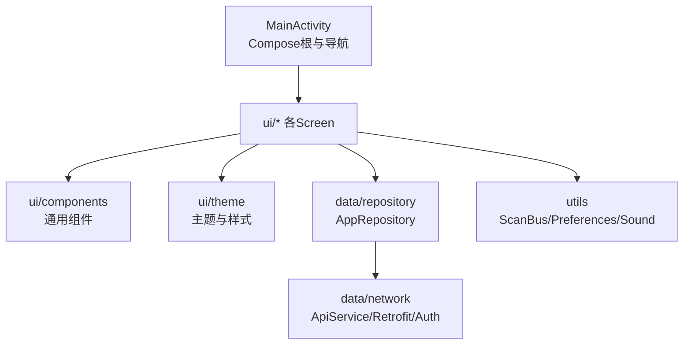
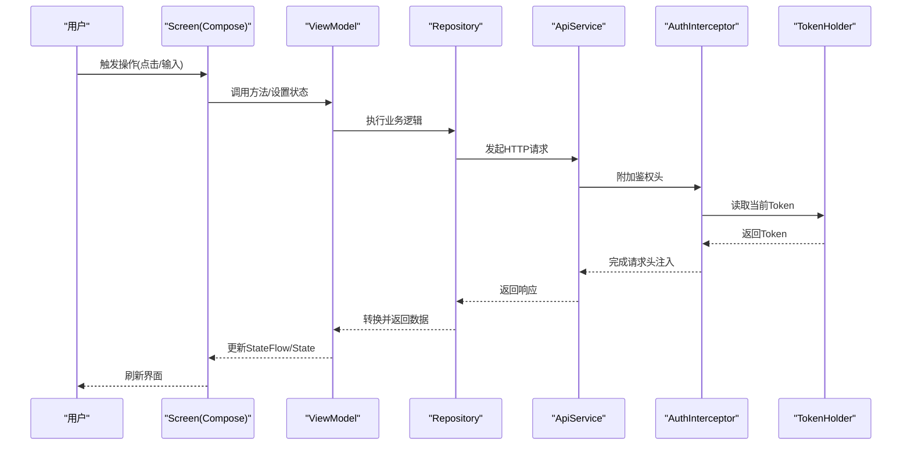
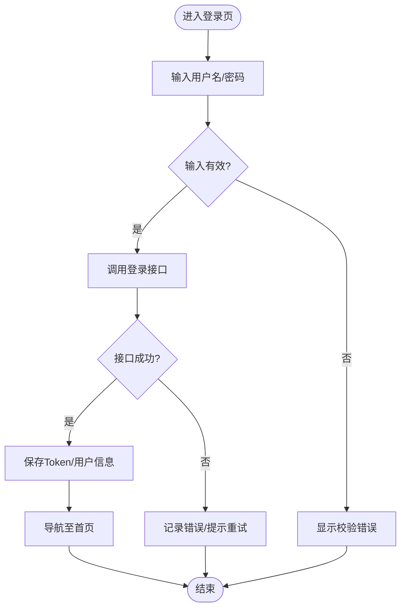
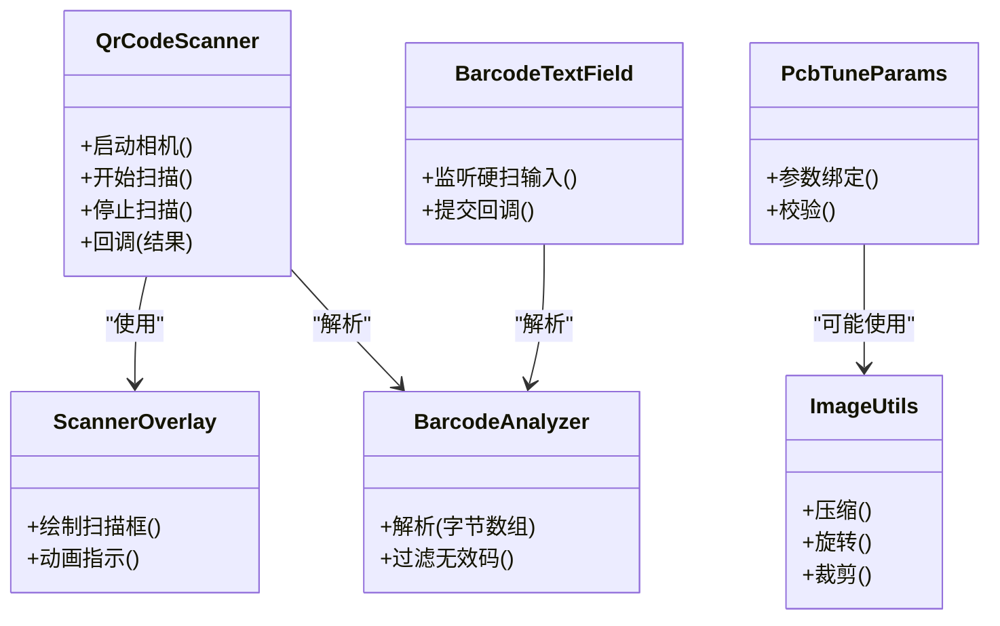
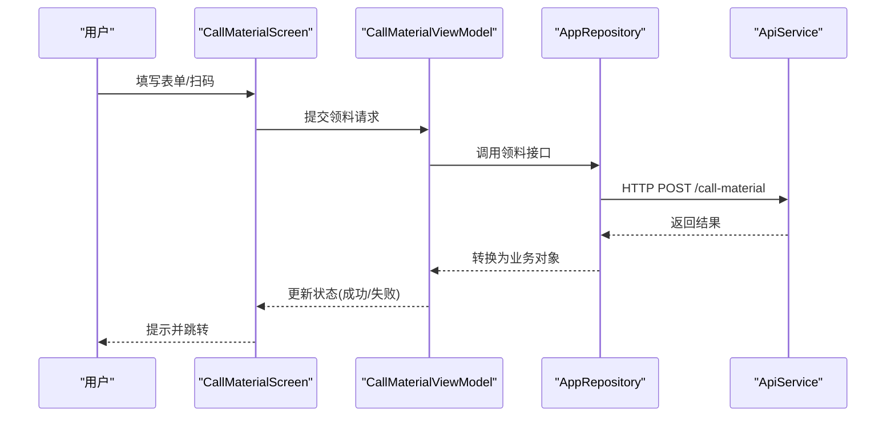
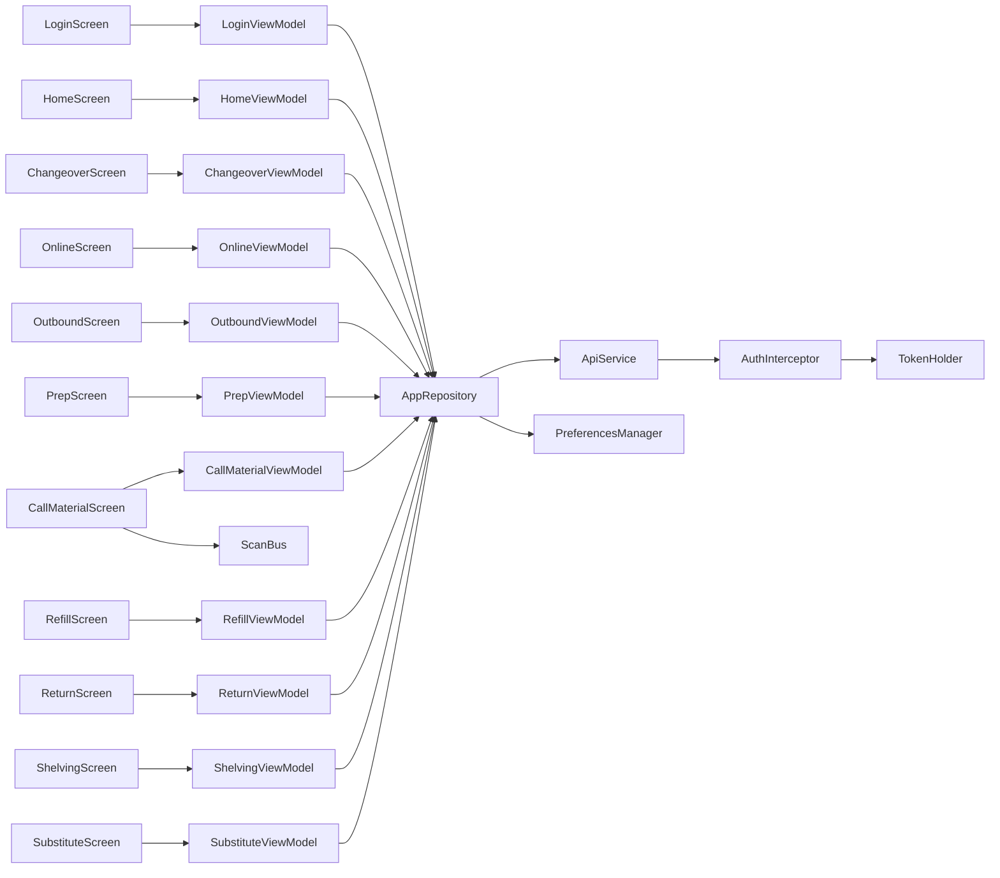

# UI层架构设计

<cite>
**本文引用的文件**   
- [MainActivity.kt](file://mobile-android/app/src/main/java/com/dip/material/MainActivity.kt)
- [DIPApplication.kt](file://mobile-android/app/src/main/java/com/dip/material/DIPApplication.kt)
- [LoginScreen.kt](file://mobile-android/app/src/main/java/com/dip/material/ui/login/LoginScreen.kt)
- [LoginViewModel.kt](file://mobile-android/app/src/main/java/com/dip/material/ui/login/LoginViewModel.kt)
- [HomeScreen.kt](file://mobile-android/app/src/main/java/com/dip/material/ui/home/HomeScreen.kt)
- [HomeViewModel.kt](file://mobile-android/app/src/main/java/com/dip/material/ui/home/HomeViewModel.kt)
- [CallMaterialScreen.kt](file://mobile-android/app/src/main/java/com/dip/material/ui/callmaterial/CallMaterialScreen.kt)
- [CallMaterialViewModel.kt](file://mobile-android/app/src/main/java/com/dip/material/ui/callmaterial/CallMaterialViewModel.kt)
- [ChangeoverScreen.kt](file://mobile-android/app/src/main/java/com/dip/material/ui/changeover/ChangeoverScreen.kt)
- [ChangeoverViewModel.kt](file://mobile-android/app/src/main/java/com/dip/material/ui/changeover/ChangeoverViewModel.kt)
- [OnlineScreen.kt](file://mobile-android/app/src/main/java/com/dip/material/ui/online/OnlineScreen.kt)
- [OnlineViewModel.kt](file://mobile-android/app/src/main/java/com/dip/material/ui/online/OnlineViewModel.kt)
- [OutboundScreen.kt](file://mobile-android/app/src/main/java/com/dip/material/ui/outbound/OutboundScreen.kt)
- [OutboundViewModel.kt](file://mobile-android/app/src/main/java/com/dip/material/ui/outbound/OutboundViewModel.kt)
- [PrepScreen.kt](file://mobile-android/app/src/main/java/com/dip/material/ui/prep/PrepScreen.kt)
- [PrepViewModel.kt](file://mobile-android/app/src/main/java/com/dip/material/ui/prep/PrepViewModel.kt)
- [RefillScreen.kt](file://mobile-android/app/src/main/java/com/dip/material/ui/refill/RefillScreen.kt)
- [RefillViewModel.kt](file://mobile-android/app/src/main/java/com/dip/material/ui/refill/RefillViewModel.kt)
- [ReturnScreen.kt](file://mobile-android/app/src/main/java/com/dip/material/ui/return_/ReturnScreen.kt)
- [ReturnViewModel.kt](file://mobile-android/app/src/main/java/com/dip/material/ui/return_/ReturnViewModel.kt)
- [ShelvingScreen.kt](file://mobile-android/app/src/main/java/com/dip/material/ui/shelving/ShelvingScreen.kt)
- [ShelvingViewModel.kt](file://mobile-android/app/src/main/java/com/dip/material/ui/shelving/ShelvingViewModel.kt)
- [SubstituteScreen.kt](file://mobile-android/app/src/main/java/com/dip/material/ui/substitute/SubstituteScreen.kt)
- [SubstituteViewModel.kt](file://mobile-android/app/src/main/java/com/dip/material/ui/substitute/SubstituteViewModel.kt)
- [BarcodeAnalyzer.kt](file://mobile-android/app/src/main/java/com/dip/material/ui/components/BarcodeAnalyzer.kt)
- [BarcodeTextField.kt](file://mobile-android/app/src/main/java/com/dip/material/ui/components/BarcodeTextField.kt)
- [QrCodeScanner.kt](file://mobile-android/app/src/main/java/com/dip/material/ui/components/QrCodeScanner.kt)
- [ScannerOverlay.kt](file://mobile-android/app/src/main/java/com/dip/material/ui/components/ScannerOverlay.kt)
- [ImageUtils.kt](file://mobile-android/app/src/main/java/com/dip/material/ui/components/ImageUtils.kt)
- [PcbTuneParams.kt](file://mobile-android/app/src/main/java/com/dip/material/ui/components/PcbTuneParams.kt)
- [Color.kt](file://mobile-android/app/src/main/java/com/dip/material/ui/theme/Color.kt)
- [Theme.kt](file://mobile-android/app/src/main/java/com/dip/material/ui/theme/Theme.kt)
- [Type.kt](file://mobile-android/app/src/main/java/com/dip/material/ui/theme/Type.kt)
- [ApiService.kt](file://mobile-android/app/src/main/java/com/dip/material/data/network/ApiService.kt)
- [RetrofitClient.kt](file://mobile-android/app/src/main/java/com/dip/material/data/network/RetrofitClient.kt)
- [AuthInterceptor.kt](file://mobile-android/app/src/main/java/com/dip/material/data/network/AuthInterceptor.kt)
- [TokenHolder.kt](file://mobile-android/app/src/main/java/com/dip/material/data/network/TokenHolder.kt)
- [AppRepository.kt](file://mobile-android/app/src/main/java/com/dip/material/data/repository/AppRepository.kt)
- [Models.kt](file://mobile-android/app/src/main/java/com/dip/material/data/models/Models.kt)
- [PreferencesManager.kt](file://mobile-android/app/src/main/java/com/dip/material/utils/PreferencesManager.kt)
- [ScanBus.kt](file://mobile-android/app/src/main/java/com/dip/material/utils/ScanBus.kt)
- [ScanConfig.kt](file://mobile-android/app/src/main/java/com/dip/material/utils/ScanConfig.kt)
- [ScanSoundManager.kt](file://mobile-android/app/src/main/java/com/dip/material/utils/ScanSoundManager.kt)
- [ScanBroadcastReceiver.kt](file://mobile-android/app/src/main/java/com/dip/material/utils/ScanBroadcastReceiver.kt)
</cite>

## 目录
1. [简介](#简介)
2. [项目结构](#项目结构)
3. [核心组件](#核心组件)
4. [架构总览](#架构总览)
5. [详细组件分析](#详细组件分析)
6. [依赖关系分析](#依赖关系分析)
7. [性能考量](#性能考量)
8. [故障排查指南](#故障排查指南)
9. [结论](#结论)
10. [附录](#附录)

## 简介
本文件面向DIP物料管理系统Android应用的UI层架构，聚焦基于Jetpack Compose的现代化实现。文档围绕以下目标展开：
- Screen组件的设计模式与职责边界
- 状态管理策略（State Hoisting、ViewModel、Flow）
- 导航机制（单Activity多Screen、路由组织）
- 功能模块的UI组织（登录、首页仪表盘、扫码、业务操作界面等）
- Compose组件复用性与主题系统
- UI状态管理最佳实践、响应式更新机制与用户交互处理
- 可维护UI组件构建示例（以代码片段路径引用代替直接贴出代码）

## 项目结构
Android端采用“按功能域分包 + 共享组件”的组织方式：
- ui/login、ui/home、ui/callmaterial、ui/changeover、ui/online、ui/outbound、ui/prep、ui/refill、ui/return_、ui/shelving、ui/substitute：各业务Screen与其对应的ViewModel成对出现，遵循单一职责
- ui/components：跨屏幕复用的UI组件（条码输入、二维码扫描、图像工具、参数面板等）
- ui/theme：Compose主题定义（颜色、字体、类型）
- data：网络、仓库、数据模型
- utils：扫描总线、广播接收器、偏好存储、声音管理等
- MainActivity与DIPApplication：应用入口、全局初始化、Compose根节点与导航容器

图表来源
- [MainActivity.kt:1-200](file://mobile-android/app/src/main/java/com/dip/material/MainActivity.kt#L1-L200)
- [DIPApplication.kt:1-200](file://mobile-android/app/src/main/java/com/dip/material/DIPApplication.kt#L1-L200)

章节来源
- [MainActivity.kt:1-200](file://mobile-android/app/src/main/java/com/dip/material/MainActivity.kt#L1-L200)
- [DIPApplication.kt:1-200](file://mobile-android/app/src/main/java/com/dip/material/DIPApplication.kt#L1-L200)

## 核心组件
- Screen组件：每个业务域一个Screen，负责渲染与用户交互事件收集，不持有复杂状态
- ViewModel：封装业务状态与副作用，暴露StateFlow/State给UI消费
- Repository：统一数据访问，聚合网络与本地缓存
- Network：Retrofit+OkHttp拦截器，集中处理鉴权与错误
- Components：可复用UI构件（如条码输入框、扫码预览、扫描遮罩）
- Theme：统一的色彩、排版与组件样式

章节来源
- [LoginScreen.kt:1-200](file://mobile-android/app/src/main/java/com/dip/material/ui/login/LoginScreen.kt#L1-L200)
- [LoginViewModel.kt:1-200](file://mobile-android/app/src/main/java/com/dip/material/ui/login/LoginViewModel.kt#L1-L200)
- [HomeScreen.kt:1-200](file://mobile-android/app/src/main/java/com/dip/material/ui/home/HomeScreen.kt#L1-L200)
- [HomeViewModel.kt:1-200](file://mobile-android/app/src/main/java/com/dip/material/ui/home/HomeViewModel.kt#L1-L200)
- [AppRepository.kt:1-200](file://mobile-android/app/src/main/java/com/dip/material/data/repository/AppRepository.kt#L1-L200)
- [ApiService.kt:1-200](file://mobile-android/app/src/main/java/com/dip/material/data/network/ApiService.kt#L1-L200)
- [RetrofitClient.kt:1-200](file://mobile-android/app/src/main/java/com/dip/material/data/network/RetrofitClient.kt#L1-L200)
- [AuthInterceptor.kt:1-200](file://mobile-android/app/src/main/java/com/dip/material/data/network/AuthInterceptor.kt#L1-L200)
- [TokenHolder.kt:1-200](file://mobile-android/app/src/main/java/com/dip/material/data/network/TokenHolder.kt#L1-L200)
- [Color.kt:1-200](file://mobile-android/app/src/main/java/com/dip/material/ui/theme/Color.kt#L1-L200)
- [Theme.kt:1-200](file://mobile-android/app/src/main/java/com/dip/material/ui/theme/Theme.kt#L1-L200)
- [Type.kt:1-200](file://mobile-android/app/src/main/java/com/dip/material/ui/theme/Type.kt#L1-L200)

## 架构总览
整体采用“单向数据流 + 响应式状态”的架构：
- UI层通过StateFlow/State订阅ViewModel中的状态变化
- ViewModel调用Repository进行数据获取与变更
- Repository通过ApiService发起网络请求，使用AuthInterceptor注入鉴权头
- 扫描结果通过ScanBus在组件间传递，避免紧耦合
- 导航由MainActivity统一管理，Screen之间通过路由跳转

图表来源
- [LoginScreen.kt:1-200](file://mobile-android/app/src/main/java/com/dip/material/ui/login/LoginScreen.kt#L1-L200)
- [LoginViewModel.kt:1-200](file://mobile-android/app/src/main/java/com/dip/material/ui/login/LoginViewModel.kt#L1-L200)
- [AppRepository.kt:1-200](file://mobile-android/app/src/main/java/com/dip/material/data/repository/AppRepository.kt#L1-L200)
- [ApiService.kt:1-200](file://mobile-android/app/src/main/java/com/dip/material/data/network/ApiService.kt#L1-L200)
- [AuthInterceptor.kt:1-200](file://mobile-android/app/src/main/java/com/dip/material/data/network/AuthInterceptor.kt#L1-L200)
- [TokenHolder.kt:1-200](file://mobile-android/app/src/main/java/com/dip/material/data/network/TokenHolder.kt#L1-L200)

## 详细组件分析

### 登录界面（Login）
- Screen职责：表单输入、校验提示、登录按钮交互、错误展示
- ViewModel职责：用户名密码校验、调用登录接口、保存Token、失败重试
- 导航：登录成功后跳转到首页或上次停留页面
- 状态管理：使用StateFlow暴露登录状态、错误信息、加载态

图表来源
- [LoginScreen.kt:1-200](file://mobile-android/app/src/main/java/com/dip/material/ui/login/LoginScreen.kt#L1-L200)
- [LoginViewModel.kt:1-200](file://mobile-android/app/src/main/java/com/dip/material/ui/login/LoginViewModel.kt#L1-L200)

章节来源
- [LoginScreen.kt:1-200](file://mobile-android/app/src/main/java/com/dip/material/ui/login/LoginScreen.kt#L1-L200)
- [LoginViewModel.kt:1-200](file://mobile-android/app/src/main/java/com/dip/material/ui/login/LoginViewModel.kt#L1-L200)

### 首页仪表盘（Home）
- Screen职责：展示关键指标、快捷入口、最近动态
- ViewModel职责：聚合Dashboard数据、错误与加载状态、下拉刷新
- 导航：点击卡片跳转到对应业务Screen
- 状态管理：列表/卡片状态、分页、刷新态

章节来源
- [HomeScreen.kt:1-200](file://mobile-android/app/src/main/java/com/dip/material/ui/home/HomeScreen.kt#L1-L200)
- [HomeViewModel.kt:1-200](file://mobile-android/app/src/main/java/com/dip/material/ui/home/HomeViewModel.kt#L1-L200)

### 扫码界面（Components）
- QrCodeScanner：相机预览、扫描区域绘制、解码回调
- ScannerOverlay：扫描框遮罩与动画
- BarcodeAnalyzer：条码解析与过滤
- BarcodeTextField：支持硬件扫码输入的文本框
- ImageUtils：图片压缩/旋转/裁剪工具
- PcbTuneParams：PCB调参相关参数面板

图表来源
- [QrCodeScanner.kt:1-200](file://mobile-android/app/src/main/java/com/dip/material/ui/components/QrCodeScanner.kt#L1-L200)
- [ScannerOverlay.kt:1-200](file://mobile-android/app/src/main/java/com/dip/material/ui/components/ScannerOverlay.kt#L1-L200)
- [BarcodeAnalyzer.kt:1-200](file://mobile-android/app/src/main/java/com/dip/material/ui/components/BarcodeAnalyzer.kt#L1-L200)
- [BarcodeTextField.kt:1-200](file://mobile-android/app/src/main/java/com/dip/material/ui/components/BarcodeTextField.kt#L1-L200)
- [ImageUtils.kt:1-200](file://mobile-android/app/src/main/java/com/dip/material/ui/components/ImageUtils.kt#L1-L200)
- [PcbTuneParams.kt:1-200](file://mobile-android/app/src/main/java/com/dip/material/ui/components/PcbTuneParams.kt#L1-L200)

章节来源
- [QrCodeScanner.kt:1-200](file://mobile-android/app/src/main/java/com/dip/material/ui/components/QrCodeScanner.kt#L1-L200)
- [ScannerOverlay.kt:1-200](file://mobile-android/app/src/main/java/com/dip/material/ui/components/ScannerOverlay.kt#L1-L200)
- [BarcodeAnalyzer.kt:1-200](file://mobile-android/app/src/main/java/com/dip/material/ui/components/BarcodeAnalyzer.kt#L1-L200)
- [BarcodeTextField.kt:1-200](file://mobile-android/app/src/main/java/com/dip/material/ui/components/BarcodeTextField.kt#L1-L200)
- [ImageUtils.kt:1-200](file://mobile-android/app/src/main/java/com/dip/material/ui/components/ImageUtils.kt#L1-L200)
- [PcbTuneParams.kt:1-200](file://mobile-android/app/src/main/java/com/dip/material/ui/components/PcbTuneParams.kt#L1-L200)

### 业务操作界面（以领料为例）
- CallMaterialScreen：领料表单、扫码入库、批量操作、确认提交
- CallMaterialViewModel：表单状态、校验、调用仓库服务、提交反馈
- 其他业务Screen（换线、在线、出库、备料、补料、退料、上架、替代）均遵循相同模式

图表来源
- [CallMaterialScreen.kt:1-200](file://mobile-android/app/src/main/java/com/dip/material/ui/callmaterial/CallMaterialScreen.kt#L1-L200)
- [CallMaterialViewModel.kt:1-200](file://mobile-android/app/src/main/java/com/dip/material/ui/callmaterial/CallMaterialViewModel.kt#L1-L200)
- [AppRepository.kt:1-200](file://mobile-android/app/src/main/java/com/dip/material/data/repository/AppRepository.kt#L1-L200)
- [ApiService.kt:1-200](file://mobile-android/app/src/main/java/com/dip/material/data/network/ApiService.kt#L1-L200)

章节来源
- [CallMaterialScreen.kt:1-200](file://mobile-android/app/src/main/java/com/dip/material/ui/callmaterial/CallMaterialScreen.kt#L1-L200)
- [CallMaterialViewModel.kt:1-200](file://mobile-android/app/src/main/java/com/dip/material/ui/callmaterial/CallMaterialViewModel.kt#L1-L200)
- [ChangeoverScreen.kt:1-200](file://mobile-android/app/src/main/java/com/dip/material/ui/changeover/ChangeoverScreen.kt#L1-L200)
- [ChangeoverViewModel.kt:1-200](file://mobile-android/app/src/main/java/com/dip/material/ui/changeover/ChangeoverViewModel.kt#L1-L200)
- [OnlineScreen.kt:1-200](file://mobile-android/app/src/main/java/com/dip/material/ui/online/OnlineScreen.kt#L1-L200)
- [OnlineViewModel.kt:1-200](file://mobile-android/app/src/main/java/com/dip/material/ui/online/OnlineViewModel.kt#L1-L200)
- [OutboundScreen.kt:1-200](file://mobile-android/app/src/main/java/com/dip/material/ui/outbound/OutboundScreen.kt#L1-L200)
- [OutboundViewModel.kt:1-200](file://mobile-android/app/src/main/java/com/dip/material/ui/outbound/OutboundViewModel.kt#L1-L200)
- [PrepScreen.kt:1-200](file://mobile-android/app/src/main/java/com/dip/material/ui/prep/PrepScreen.kt#L1-L200)
- [PrepViewModel.kt:1-200](file://mobile-android/app/src/main/java/com/dip/material/ui/prep/PrepViewModel.kt#L1-L200)
- [RefillScreen.kt:1-200](file://mobile-android/app/src/main/java/com/dip/material/ui/refill/RefillScreen.kt#L1-L200)
- [RefillViewModel.kt:1-200](file://mobile-android/app/src/main/java/com/dip/material/ui/refill/RefillViewModel.kt#L1-L200)
- [ReturnScreen.kt:1-200](file://mobile-android/app/src/main/java/com/dip/material/ui/return_/ReturnScreen.kt#L1-L200)
- [ReturnViewModel.kt:1-200](file://mobile-android/app/src/main/java/com/dip/material/ui/return_/ReturnViewModel.kt#L1-L200)
- [ShelvingScreen.kt:1-200](file://mobile-android/app/src/main/java/com/dip/material/ui/shelving/ShelvingScreen.kt#L1-L200)
- [ShelvingViewModel.kt:1-200](file://mobile-android/app/src/main/java/com/dip/material/ui/shelving/ShelvingViewModel.kt#L1-L200)
- [SubstituteScreen.kt:1-200](file://mobile-android/app/src/main/java/com/dip/material/ui/substitute/SubstituteScreen.kt#L1-L200)
- [SubstituteViewModel.kt:1-200](file://mobile-android/app/src/main/java/com/dip/material/ui/substitute/SubstituteViewModel.kt#L1-L200)

### 主题系统（Theme）
- Color.kt：定义主色、辅助色、语义色（成功/警告/错误）
- Type.kt：字体族、字号、字重规范
- Theme.kt：组合颜色与字体，提供Light/Dark主题切换能力

章节来源
- [Color.kt:1-200](file://mobile-android/app/src/main/java/com/dip/material/ui/theme/Color.kt#L1-L200)
- [Type.kt:1-200](file://mobile-android/app/src/main/java/com/dip/material/ui/theme/Type.kt#L1-L200)
- [Theme.kt:1-200](file://mobile-android/app/src/main/java/com/dip/material/ui/theme/Theme.kt#L1-L200)

## 依赖关系分析
- Screen依赖ViewModel，ViewModel依赖Repository
- Repository依赖ApiService与本地存储（TokenHolder/PreferencesManager）
- AuthInterceptor依赖TokenHolder注入鉴权头
- ScanBus用于组件间解耦的消息传递

图表来源
- [LoginScreen.kt:1-200](file://mobile-android/app/src/main/java/com/dip/material/ui/login/LoginScreen.kt#L1-L200)
- [LoginViewModel.kt:1-200](file://mobile-android/app/src/main/java/com/dip/material/ui/login/LoginViewModel.kt#L1-L200)
- [HomeScreen.kt:1-200](file://mobile-android/app/src/main/java/com/dip/material/ui/home/HomeScreen.kt#L1-L200)
- [HomeViewModel.kt:1-200](file://mobile-android/app/src/main/java/com/dip/material/ui/home/HomeViewModel.kt#L1-L200)
- [CallMaterialScreen.kt:1-200](file://mobile-android/app/src/main/java/com/dip/material/ui/callmaterial/CallMaterialScreen.kt#L1-L200)
- [CallMaterialViewModel.kt:1-200](file://mobile-android/app/src/main/java/com/dip/material/ui/callmaterial/CallMaterialViewModel.kt#L1-L200)
- [AppRepository.kt:1-200](file://mobile-android/app/src/main/java/com/dip/material/data/repository/AppRepository.kt#L1-L200)
- [ApiService.kt:1-200](file://mobile-android/app/src/main/java/com/dip/material/data/network/ApiService.kt#L1-L200)
- [AuthInterceptor.kt:1-200](file://mobile-android/app/src/main/java/com/dip/material/data/network/AuthInterceptor.kt#L1-L200)
- [TokenHolder.kt:1-200](file://mobile-android/app/src/main/java/com/dip/material/data/network/TokenHolder.kt#L1-L200)
- [PreferencesManager.kt:1-200](file://mobile-android/app/src/main/java/com/dip/material/utils/PreferencesManager.kt#L1-L200)
- [ScanBus.kt:1-200](file://mobile-android/app/src/main/java/com/dip/material/utils/ScanBus.kt#L1-L200)

章节来源
- [AppRepository.kt:1-200](file://mobile-android/app/src/main/java/com/dip/material/data/repository/AppRepository.kt#L1-L200)
- [ApiService.kt:1-200](file://mobile-android/app/src/main/java/com/dip/material/data/network/ApiService.kt#L1-L200)
- [AuthInterceptor.kt:1-200](file://mobile-android/app/src/main/java/com/dip/material/data/network/AuthInterceptor.kt#L1-L200)
- [TokenHolder.kt:1-200](file://mobile-android/app/src/main/java/com/dip/material/data/network/TokenHolder.kt#L1-L200)
- [PreferencesManager.kt:1-200](file://mobile-android/app/src/main/java/com/dip/material/utils/PreferencesManager.kt#L1-L200)
- [ScanBus.kt:1-200](file://mobile-android/app/src/main/java/com/dip/material/utils/ScanBus.kt#L1-L200)

## 性能考量
- 状态最小化：仅将必要状态提升到Screen，避免过度重组
- 懒加载与分页：列表数据按需加载，减少首屏压力
- 图片优化：使用ImageUtils进行压缩与尺寸适配，避免OOM
- 网络优化：合理设置超时与重试，利用缓存策略
- 扫描性能：相机预览分辨率与解码线程分离，避免阻塞UI线程
- 主题切换：使用CompositionLocal避免不必要的重建

[本节为通用指导，不直接分析具体文件]

## 故障排查指南
- 登录失败：检查AuthInterceptor是否正确注入Token；查看TokenHolder是否持久化成功
- 扫码无结果：确认权限申请、相机初始化、解码回调链路；检查ScanBus订阅是否生效
- 界面卡顿：检查是否存在大对象重组、主线程IO；使用Profiler定位热点
- 网络异常：查看ApiService错误处理与日志；确认后端接口与域名配置
- 主题错乱：核对Theme中颜色与字体定义是否一致；检查深色模式切换逻辑

章节来源
- [AuthInterceptor.kt:1-200](file://mobile-android/app/src/main/java/com/dip/material/data/network/AuthInterceptor.kt#L1-L200)
- [TokenHolder.kt:1-200](file://mobile-android/app/src/main/java/com/dip/material/data/network/TokenHolder.kt#L1-L200)
- [ScanBus.kt:1-200](file://mobile-android/app/src/main/java/com/dip/material/utils/ScanBus.kt#L1-L200)
- [ApiService.kt:1-200](file://mobile-android/app/src/main/java/com/dip/material/data/network/ApiService.kt#L1-L200)
- [Theme.kt:1-200](file://mobile-android/app/src/main/java/com/dip/material/ui/theme/Theme.kt#L1-L200)

## 结论
本项目采用清晰的Screen-ViewModel-Repository分层，结合Compose的状态提升与响应式更新，实现了高内聚、低耦合的UI架构。通过统一的组件库与主题系统，提升了可复用性与一致性。建议在后续迭代中继续完善错误处理、可测试性与性能监控，确保大规模业务扩展下的可维护性。

[本节为总结，不直接分析具体文件]

## 附录
- 可维护UI组件构建要点（以路径引用代替代码）
  - 表单输入与校验：参考 [LoginScreen.kt:1-200](file://mobile-android/app/src/main/java/com/dip/material/ui/login/LoginScreen.kt#L1-L200)、[LoginViewModel.kt:1-200](file://mobile-android/app/src/main/java/com/dip/material/ui/login/LoginViewModel.kt#L1-L200)
  - 扫码输入：参考 [BarcodeTextField.kt:1-200](file://mobile-android/app/src/main/java/com/dip/material/ui/components/BarcodeTextField.kt#L1-L200)、[BarcodeAnalyzer.kt:1-200](file://mobile-android/app/src/main/java/com/dip/material/ui/components/BarcodeAnalyzer.kt#L1-L200)
  - 相机扫描：参考 [QrCodeScanner.kt:1-200](file://mobile-android/app/src/main/java/com/dip/material/ui/components/QrCodeScanner.kt#L1-L200)、[ScannerOverlay.kt:1-200](file://mobile-android/app/src/main/java/com/dip/material/ui/components/ScannerOverlay.kt#L1-L200)
  - 图片处理：参考 [ImageUtils.kt:1-200](file://mobile-android/app/src/main/java/com/dip/material/ui/components/ImageUtils.kt#L1-L200)
  - 参数面板：参考 [PcbTuneParams.kt:1-200](file://mobile-android/app/src/main/java/com/dip/material/ui/components/PcbTuneParams.kt#L1-L200)
  - 主题定制：参考 [Color.kt:1-200](file://mobile-android/app/src/main/java/com/dip/material/ui/theme/Color.kt#L1-L200)、[Type.kt:1-200](file://mobile-android/app/src/main/java/com/dip/material/ui/theme/Type.kt#L1-L200)、[Theme.kt:1-200](file://mobile-android/app/src/main/java/com/dip/material/ui/theme/Theme.kt#L1-L200)