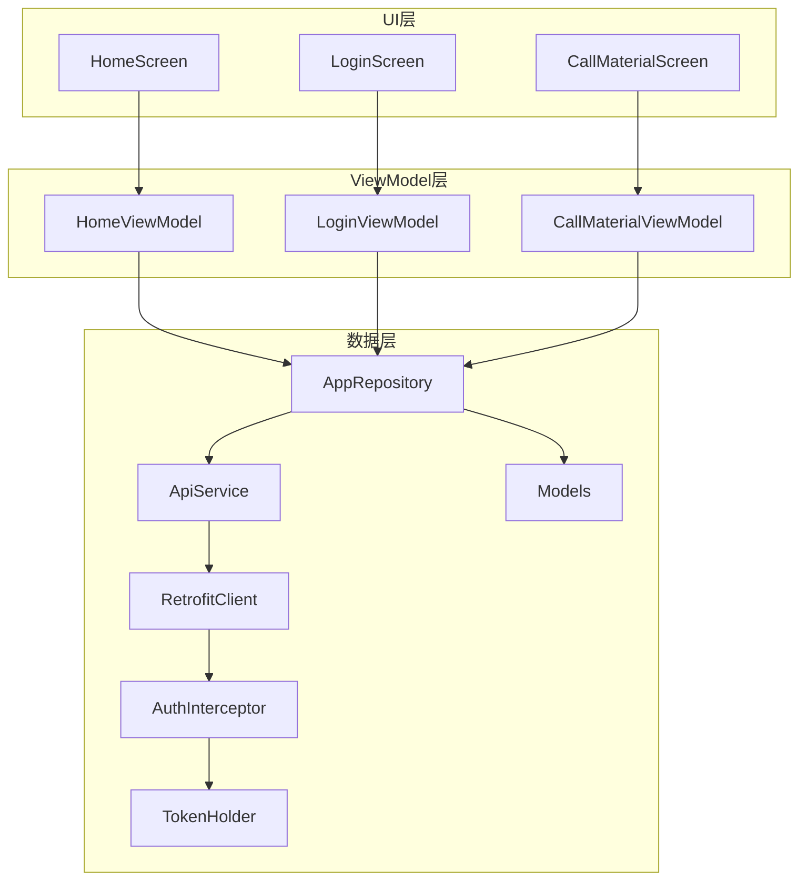
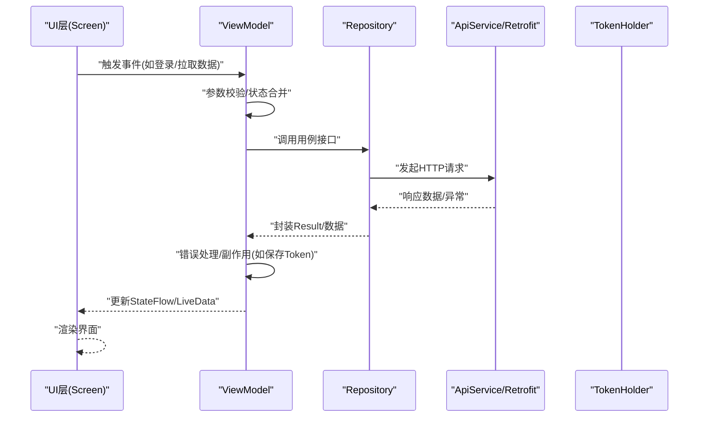
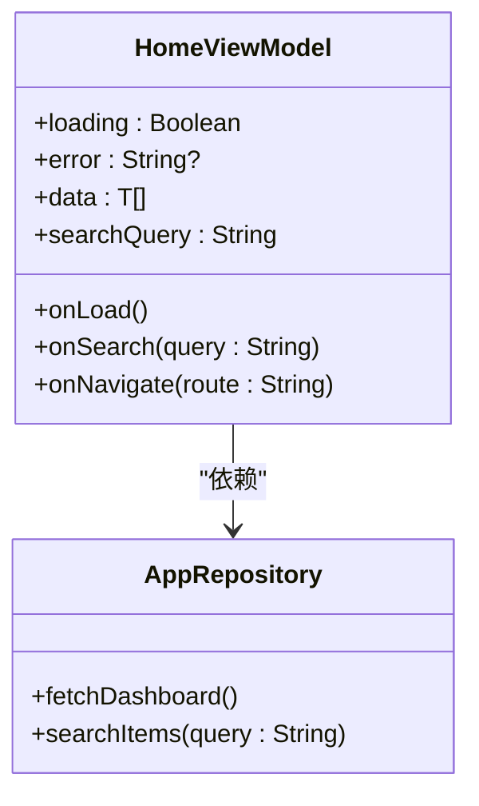
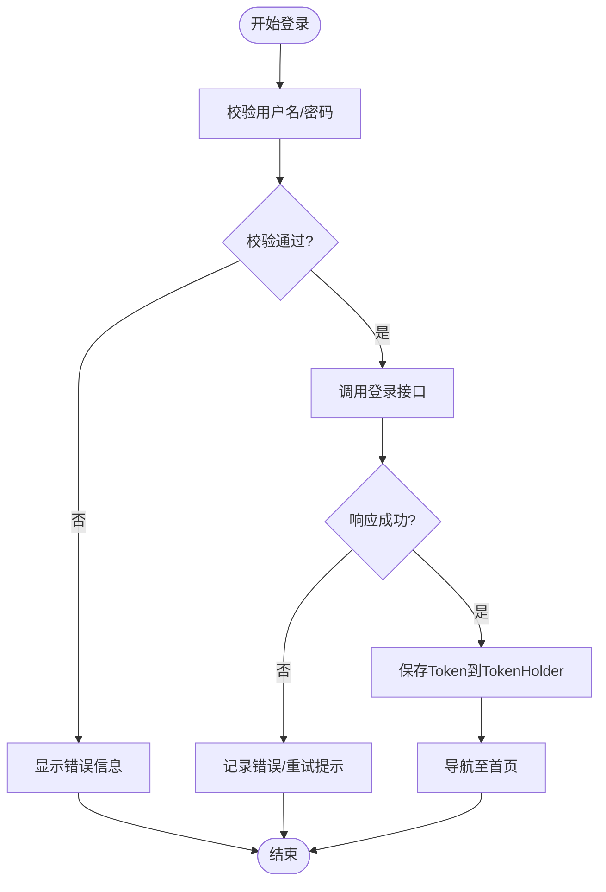
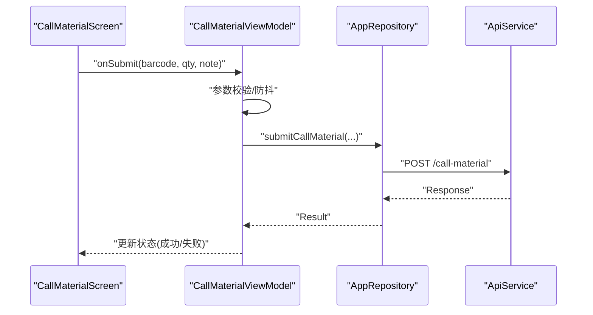
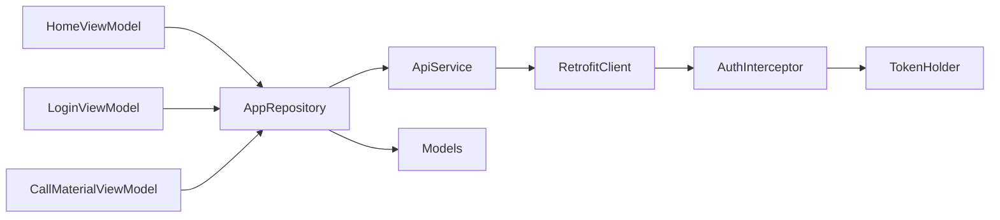

# ViewModel层设计模式

<cite>
**本文引用的文件**   
- [HomeViewModel.kt](file://mobile-android/app/src/main/java/com/dip/material/ui/home/HomeViewModel.kt)
- [LoginViewModel.kt](file://mobile-android/app/src/main/java/com/dip/material/ui/login/LoginViewModel.kt)
- [CallMaterialViewModel.kt](file://mobile-android/app/src/main/java/com/dip/material/ui/callmaterial/CallMaterialViewModel.kt)
- [AppRepository.kt](file://mobile-android/app/src/main/java/com/dip/material/data/repository/AppRepository.kt)
- [ApiService.kt](file://mobile-android/app/src/main/java/com/dip/material/data/network/ApiService.kt)
- [RetrofitClient.kt](file://mobile-android/app/src/main/java/com/dip/material/data/network/RetrofitClient.kt)
- [AuthInterceptor.kt](file://mobile-android/app/src/main/java/com/dip/material/data/network/AuthInterceptor.kt)
- [TokenHolder.kt](file://mobile-android/app/src/main/java/com/dip/material/data/network/TokenHolder.kt)
- [Models.kt](file://mobile-android/app/src/main/java/com/dip/material/data/models/Models.kt)
- [HomeScreen.kt](file://mobile-android/app/src/main/java/com/dip/material/ui/home/HomeScreen.kt)
- [LoginScreen.kt](file://mobile-android/app/src/main/java/com/dip/material/ui/login/LoginScreen.kt)
- [CallMaterialScreen.kt](file://mobile-android/app/src/main/java/com/dip/material/ui/callmaterial/CallMaterialScreen.kt)
</cite>

## 目录
1. [简介](#简介)
2. [项目结构](#项目结构)
3. [核心组件](#核心组件)
4. [架构总览](#架构总览)
5. [详细组件分析](#详细组件分析)
6. [依赖关系分析](#依赖关系分析)
7. [性能考量](#性能考量)
8. [故障排查指南](#故障排查指南)
9. [结论](#结论)
10. [附录](#附录)

## 简介
本文件面向DIP物料管理系统Android应用的ViewModel层，聚焦MVVM架构中的职责分离与生命周期管理。文档围绕HomeViewModel、LoginViewModel、CallMaterialViewModel等关键业务ViewModel展开，阐述状态提升、副作用处理、错误处理的最佳实践；对比LiveData与StateFlow的使用场景；说明ViewModel与UI层的通信模式和数据流设计；并给出单元测试与依赖注入的实践建议。

## 项目结构
Android端采用典型的MVVM分层：
- UI层（Compose Screen）：负责展示与用户交互，订阅ViewModel暴露的状态。
- ViewModel层：封装业务逻辑、协调数据源、维护UI状态，承担生命周期感知。
- 数据层（Repository + Network）：统一对外提供数据访问能力，屏蔽网络、缓存、本地存储细节。

图表来源
- [HomeScreen.kt](file://mobile-android/app/src/main/java/com/dip/material/ui/home/HomeScreen.kt)
- [LoginScreen.kt](file://mobile-android/app/src/main/java/com/dip/material/ui/login/LoginScreen.kt)
- [CallMaterialScreen.kt](file://mobile-android/app/src/main/java/com/dip/material/ui/callmaterial/CallMaterialScreen.kt)
- [HomeViewModel.kt](file://mobile-android/app/src/main/java/com/dip/material/ui/home/HomeViewModel.kt)
- [LoginViewModel.kt](file://mobile-android/app/src/main/java/com/dip/material/ui/login/LoginViewModel.kt)
- [CallMaterialViewModel.kt](file://mobile-android/app/src/main/java/com/dip/material/ui/callmaterial/CallMaterialViewModel.kt)
- [AppRepository.kt](file://mobile-android/app/src/main/java/com/dip/material/data/repository/AppRepository.kt)
- [ApiService.kt](file://mobile-android/app/src/main/java/com/dip/material/data/network/ApiService.kt)
- [RetrofitClient.kt](file://mobile-android/app/src/main/java/com/dip/material/data/network/RetrofitClient.kt)
- [AuthInterceptor.kt](file://mobile-android/app/src/main/java/com/dip/material/data/network/AuthInterceptor.kt)
- [TokenHolder.kt](file://mobile-android/app/src/main/java/com/dip/material/data/network/TokenHolder.kt)
- [Models.kt](file://mobile-android/app/src/main/java/com/dip/material/data/models/Models.kt)

章节来源
- [HomeViewModel.kt](file://mobile-android/app/src/main/java/com/dip/material/ui/home/HomeViewModel.kt)
- [LoginViewModel.kt](file://mobile-android/app/src/main/java/com/dip/material/ui/login/LoginViewModel.kt)
- [CallMaterialViewModel.kt](file://mobile-android/app/src/main/java/com/dip/material/ui/callmaterial/CallMaterialViewModel.kt)
- [AppRepository.kt](file://mobile-android/app/src/main/java/com/dip/material/data/repository/AppRepository.kt)
- [ApiService.kt](file://mobile-android/app/src/main/java/com/dip/material/data/network/ApiService.kt)
- [RetrofitClient.kt](file://mobile-android/app/src/main/java/com/dip/material/data/network/RetrofitClient.kt)
- [AuthInterceptor.kt](file://mobile-android/app/src/main/java/com/dip/material/data/network/AuthInterceptor.kt)
- [TokenHolder.kt](file://mobile-android/app/src/main/java/com/dip/material/data/network/TokenHolder.kt)
- [Models.kt](file://mobile-android/app/src/main/java/com/dip/material/data/models/Models.kt)

## 核心组件
- HomeViewModel：首页聚合状态与操作入口，负责加载仪表盘、跳转导航、基础查询等。
- LoginViewModel：登录流程编排，包含输入校验、鉴权调用、令牌持久化、错误提示。
- CallMaterialViewModel：物料呼叫业务，涵盖扫码/输入、请求生成、提交与结果反馈。

职责边界
- UI层仅持有状态与事件回调，不直接发起网络或IO。
- ViewModel集中编排业务用例，使用协程进行异步任务调度，通过StateFlow/LiveData暴露状态。
- Repository统一抽象数据源，向上返回可组合的Result或数据模型。

章节来源
- [HomeViewModel.kt](file://mobile-android/app/src/main/java/com/dip/material/ui/home/HomeViewModel.kt)
- [LoginViewModel.kt](file://mobile-android/app/src/main/java/com/dip/material/ui/login/LoginViewModel.kt)
- [CallMaterialViewModel.kt](file://mobile-android/app/src/main/java/com/dip/material/ui/callmaterial/CallMaterialViewModel.kt)

## 架构总览
MVVM在DIP Android端的典型数据流如下：
- UI层收集用户事件，调用ViewModel方法。
- ViewModel执行校验、调用Repository、处理异常，更新StateFlow/LiveData状态。
- UI层观察状态变化，驱动界面刷新。

图表来源
- [LoginViewModel.kt](file://mobile-android/app/src/main/java/com/dip/material/ui/login/LoginViewModel.kt)
- [CallMaterialViewModel.kt](file://mobile-android/app/src/main/java/com/dip/material/ui/callmaterial/CallMaterialViewModel.kt)
- [AppRepository.kt](file://mobile-android/app/src/main/java/com/dip/material/data/repository/AppRepository.kt)
- [ApiService.kt](file://mobile-android/app/src/main/java/com/dip/material/data/network/ApiService.kt)
- [RetrofitClient.kt](file://mobile-android/app/src/main/java/com/dip/material/data/network/RetrofitClient.kt)
- [TokenHolder.kt](file://mobile-android/app/src/main/java/com/dip/material/data/network/TokenHolder.kt)

## 详细组件分析

### HomeViewModel分析
职责
- 聚合首页所需状态（加载中、错误、数据集合）。
- 编排数据加载、分页、筛选等操作。
- 与导航/路由模块协作，触发页面跳转。

状态与事件
- 状态：loading、error、列表数据、搜索条件等。
- 事件：onLoad、onSearch、onNavigate等。

数据流
- UI触发事件 -> ViewModel执行业务 -> Repository获取数据 -> StateFlow/LiveData推送新状态 -> UI刷新。

图表来源
- [HomeViewModel.kt](file://mobile-android/app/src/main/java/com/dip/material/ui/home/HomeViewModel.kt)
- [AppRepository.kt](file://mobile-android/app/src/main/java/com/dip/material/data/repository/AppRepository.kt)

章节来源
- [HomeViewModel.kt](file://mobile-android/app/src/main/java/com/dip/material/ui/home/HomeViewModel.kt)
- [HomeScreen.kt](file://mobile-android/app/src/main/java/com/dip/material/ui/home/HomeScreen.kt)

### LoginViewModel分析
职责
- 管理登录表单状态与校验。
- 调用鉴权接口，处理成功/失败分支。
- 成功后持久化Token，并通知UI跳转。

副作用处理
- 成功时写入Token到TokenHolder。
- 失败时设置错误消息，避免重复提交。

图表来源
- [LoginViewModel.kt](file://mobile-android/app/src/main/java/com/dip/material/ui/login/LoginViewModel.kt)
- [ApiService.kt](file://mobile-android/app/src/main/java/com/dip/material/data/network/ApiService.kt)
- [TokenHolder.kt](file://mobile-android/app/src/main/java/com/dip/material/data/network/TokenHolder.kt)

章节来源
- [LoginViewModel.kt](file://mobile-android/app/src/main/java/com/dip/material/ui/login/LoginViewModel.kt)
- [LoginScreen.kt](file://mobile-android/app/src/main/java/com/dip/material/ui/login/LoginScreen.kt)

### CallMaterialViewModel分析
职责
- 管理物料呼叫的输入状态（条码/数量/备注）。
- 组装请求参数，调用仓库服务完成提交。
- 处理提交结果（成功提示、失败重试、错误码映射）。

数据流与状态提升
- 将表单字段、提交中状态、结果消息全部提升到ViewModel状态。
- UI只负责渲染与派发事件，保证可测试性与一致性。

图表来源
- [CallMaterialViewModel.kt](file://mobile-android/app/src/main/java/com/dip/material/ui/callmaterial/CallMaterialViewModel.kt)
- [CallMaterialScreen.kt](file://mobile-android/app/src/main/java/com/dip/material/ui/callmaterial/CallMaterialScreen.kt)
- [AppRepository.kt](file://mobile-android/app/src/main/java/com/dip/material/data/repository/AppRepository.kt)
- [ApiService.kt](file://mobile-android/app/src/main/java/com/dip/material/data/network/ApiService.kt)

章节来源
- [CallMaterialViewModel.kt](file://mobile-android/app/src/main/java/com/dip/material/ui/callmaterial/CallMaterialViewModel.kt)
- [CallMaterialScreen.kt](file://mobile-android/app/src/main/java/com/dip/material/ui/callmaterial/CallMaterialScreen.kt)

### LiveData与StateFlow使用场景对比
- LiveData
  - 适合与Activity/Fragment生命周期绑定的场景，自动取消订阅。
  - 适用于简单状态共享、一次性事件分发（需配合SingleLiveEvent模式）。
- StateFlow
  - 更适合现代Compose/协程生态，支持背压、冷流、幂等更新。
  - 推荐用于复杂状态机、跨进程/跨组件状态同步、需要精确控制更新频率的场景。

最佳实践
- 优先使用StateFlow表达可变状态，结合collectAsStateIn在Compose中消费。
- 对一次性事件（如Toast、导航）可使用StateFlow的单值事件或LiveData+SingleLiveEvent。
- 避免在ViewModel中持有UI相关引用，保持纯函数式状态转换。

章节来源
- [HomeViewModel.kt](file://mobile-android/app/src/main/java/com/dip/material/ui/home/HomeViewModel.kt)
- [LoginViewModel.kt](file://mobile-android/app/src/main/java/com/dip/material/ui/login/LoginViewModel.kt)
- [CallMaterialViewModel.kt](file://mobile-android/app/src/main/java/com/dip/material/ui/callmaterial/CallMaterialViewModel.kt)

### ViewModel与UI层通信模式与数据流设计
- 单向数据流：UI -> 事件 -> ViewModel -> 状态 -> UI。
- 状态提升：所有影响UI的可变状态上移至ViewModel，确保可预测性。
- 副作用隔离：网络、I/O、导航等副作用集中在ViewModel内处理，UI仅消费状态。
- 错误处理：统一Result包装，区分业务错误与系统错误，UI侧做友好提示。

章节来源
- [HomeViewModel.kt](file://mobile-android/app/src/main/java/com/dip/material/ui/home/HomeViewModel.kt)
- [LoginViewModel.kt](file://mobile-android/app/src/main/java/com/dip/material/ui/login/LoginViewModel.kt)
- [CallMaterialViewModel.kt](file://mobile-android/app/src/main/java/com/dip/material/ui/callmaterial/CallMaterialViewModel.kt)

## 依赖关系分析
- ViewModel依赖Repository，不直接依赖网络库。
- Repository依赖ApiService与数据模型，封装网络与缓存策略。
- AuthInterceptor在Retrofit链中注入Token，Token由TokenHolder统一管理。

图表来源
- [HomeViewModel.kt](file://mobile-android/app/src/main/java/com/dip/material/ui/home/HomeViewModel.kt)
- [LoginViewModel.kt](file://mobile-android/app/src/main/java/com/dip/material/ui/login/LoginViewModel.kt)
- [CallMaterialViewModel.kt](file://mobile-android/app/src/main/java/com/dip/material/ui/callmaterial/CallMaterialViewModel.kt)
- [AppRepository.kt](file://mobile-android/app/src/main/java/com/dip/material/data/repository/AppRepository.kt)
- [ApiService.kt](file://mobile-android/app/src/main/java/com/dip/material/data/network/ApiService.kt)
- [RetrofitClient.kt](file://mobile-android/app/src/main/java/com/dip/material/data/network/RetrofitClient.kt)
- [AuthInterceptor.kt](file://mobile-android/app/src/main/java/com/dip/material/data/network/AuthInterceptor.kt)
- [TokenHolder.kt](file://mobile-android/app/src/main/java/com/dip/material/data/network/TokenHolder.kt)
- [Models.kt](file://mobile-android/app/src/main/java/com/dip/material/data/models/Models.kt)

章节来源
- [AppRepository.kt](file://mobile-android/app/src/main/java/com/dip/material/data/repository/AppRepository.kt)
- [ApiService.kt](file://mobile-android/app/src/main/java/com/dip/material/data/network/ApiService.kt)
- [RetrofitClient.kt](file://mobile-android/app/src/main/java/com/dip/material/data/network/RetrofitClient.kt)
- [AuthInterceptor.kt](file://mobile-android/app/src/main/java/com/dip/material/data/network/AuthInterceptor.kt)
- [TokenHolder.kt](file://mobile-android/app/src/main/java/com/dip/material/data/network/TokenHolder.kt)
- [Models.kt](file://mobile-android/app/src/main/java/com/dip/material/data/models/Models.kt)

## 性能考量
- 使用StateFlow替代频繁LiveData发射，减少不必要的重组。
- 在ViewModel中使用协程作用域（viewModelScope），避免泄漏与重复请求。
- 对高频输入（如搜索）增加防抖与节流，降低网络压力。
- 合理分页与增量更新，避免全量刷新导致卡顿。
- 复用Retrofit实例与OkHttp连接池，减少握手开销。

[本节为通用指导，无需特定文件来源]

## 故障排查指南
常见问题与定位思路
- 登录失败但无提示：检查LoginViewModel的错误分支与UI是否消费错误状态。
- 网络请求未携带Token：确认AuthInterceptor是否正确从TokenHolder读取并注入Header。
- 页面崩溃或白屏：检查ViewModel状态初始化与空安全处理。
- 重复提交：在CallMaterialViewModel中添加防抖与提交锁。

调试建议
- 在Repository层打印请求/响应摘要，便于定位问题。
- 使用日志级别区分调试与生产环境。
- 对关键路径添加断言与单元测试覆盖。

章节来源
- [LoginViewModel.kt](file://mobile-android/app/src/main/java/com/dip/material/ui/login/LoginViewModel.kt)
- [CallMaterialViewModel.kt](file://mobile-android/app/src/main/java/com/dip/material/ui/callmaterial/CallMaterialViewModel.kt)
- [AuthInterceptor.kt](file://mobile-android/app/src/main/java/com/dip/material/data/network/AuthInterceptor.kt)
- [TokenHolder.kt](file://mobile-android/app/src/main/java/com/dip/material/data/network/TokenHolder.kt)

## 结论
通过清晰的MVVM分层与职责分离，DIP Android应用实现了可维护、可测试、可扩展的ViewModel层。以状态提升为核心，结合StateFlow/LiveData的合理使用，保证了UI与业务解耦。统一的错误处理与副作用管理提升了稳定性与用户体验。后续可进一步完善依赖注入与测试框架，持续提升代码质量与交付效率。

[本节为总结性内容，无需特定文件来源]

## 附录

### 单元测试与依赖注入实践建议
- 单元测试
  - 使用MockK/Mockito模拟Repository与外部依赖。
  - 验证状态流转与副作用（如Token保存、错误提示）。
  - 针对协程使用TestDispatcher进行确定性测试。
- 依赖注入
  - 推荐使用Hilt或Koin，将Repository、ApiService、TokenHolder注入ViewModel。
  - 在测试中替换为Fake实现，提高可测性。

章节来源
- [AppRepository.kt](file://mobile-android/app/src/main/java/com/dip/material/data/repository/AppRepository.kt)
- [ApiService.kt](file://mobile-android/app/src/main/java/com/dip/material/data/network/ApiService.kt)
- [TokenHolder.kt](file://mobile-android/app/src/main/java/com/dip/material/data/network/TokenHolder.kt)