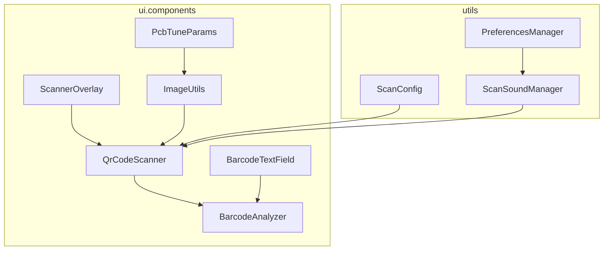
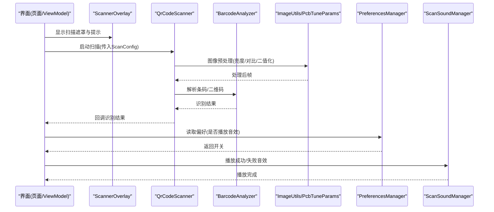
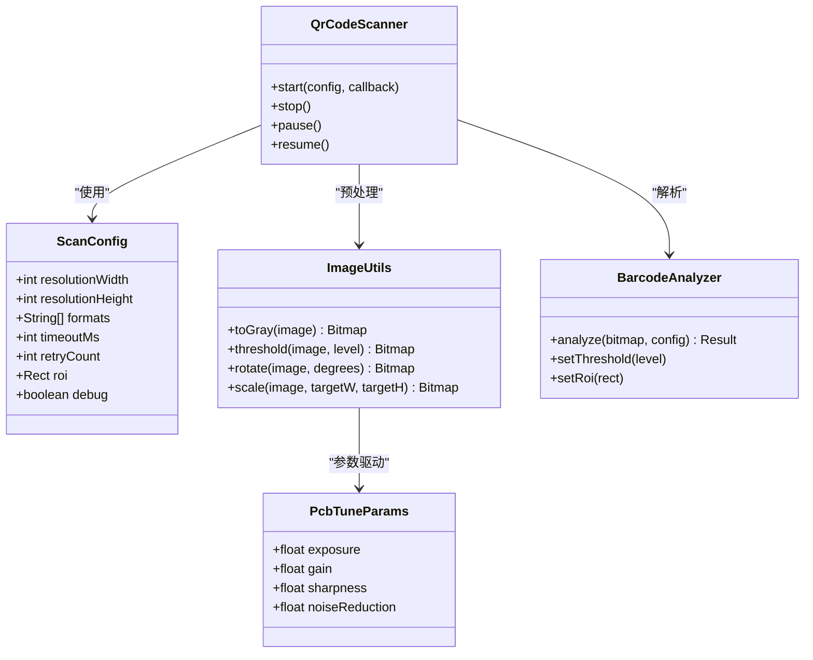
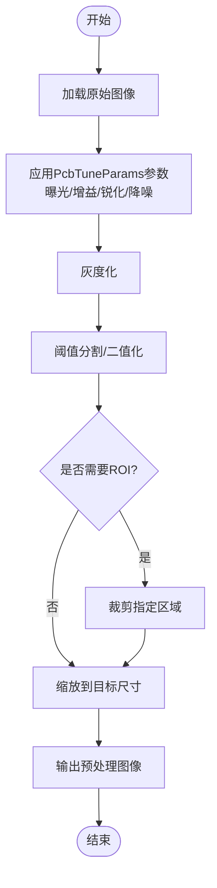
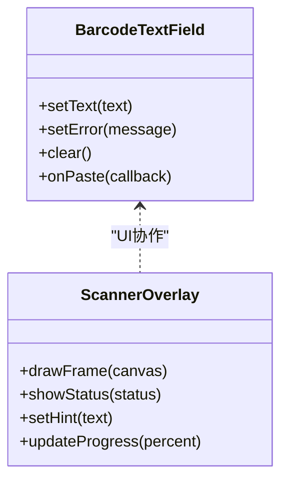
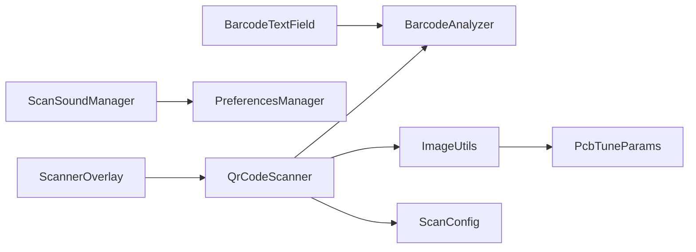

# 工具模块设计

<cite>
**本文引用的文件**   
- [BarcodeAnalyzer.kt](file://mobile-android/app/src/main/java/com/dip/material/ui/components/BarcodeAnalyzer.kt)
- [QrCodeScanner.kt](file://mobile-android/app/src/main/java/com/dip/material/ui/components/QrCodeScanner.kt)
- [ScanConfig.kt](file://mobile-android/app/src/main/java/com/dip/material/utils/ScanConfig.kt)
- [ImageUtils.kt](file://mobile-android/app/src/main/java/com/dip/material/ui/components/ImageUtils.kt)
- [PcbTuneParams.kt](file://mobile-android/app/src/main/java/com/dip/material/ui/components/PcbTuneParams.kt)
- [PreferencesManager.kt](file://mobile-android/app/src/main/java/com/dip/material/utils/PreferencesManager.kt)
- [ScanSoundManager.kt](file://mobile-android/app/src/main/java/com/dip/material/utils/ScanSoundManager.kt)
- [BarcodeTextField.kt](file://mobile-android/app/src/main/java/com/dip/material/ui/components/BarcodeTextField.kt)
- [ScannerOverlay.kt](file://mobile-android/app/src/main/java/com/dip/material/ui/components/ScannerOverlay.kt)
</cite>

## 目录
1. [简介](#简介)
2. [项目结构](#项目结构)
3. [核心组件](#核心组件)
4. [架构总览](#架构总览)
5. [详细组件分析](#详细组件分析)
6. [依赖关系分析](#依赖关系分析)
7. [性能考虑](#性能考虑)
8. [故障排查指南](#故障排查指南)
9. [结论](#结论)
10. [附录](#附录)

## 简介
本文件面向DIP物料管理系统Android应用的“工具模块”，聚焦通用工具类的设计与复用性原则，并围绕扫描、图片处理、用户偏好设置、音频播放控制以及自定义组件库进行系统化说明。文档旨在帮助开发者快速理解各工具的职责边界、调用方式、数据流与错误处理策略，同时提供测试与性能优化建议，便于在实际业务中高效集成与扩展。

## 项目结构
工具模块主要分布在以下两个包：
- ui.components：包含扫描相关UI与解析组件（如二维码扫描器、条码输入框、扫描遮罩、图像工具、PCB调参参数等）
- utils：包含通用配置与系统能力封装（如扫描配置、偏好设置、声音管理、广播接收器等）

图表来源
- [BarcodeAnalyzer.kt](file://mobile-android/app/src/main/java/com/dip/material/ui/components/BarcodeAnalyzer.kt)
- [QrCodeScanner.kt](file://mobile-android/app/src/main/java/com/dip/material/ui/components/QrCodeScanner.kt)
- [BarcodeTextField.kt](file://mobile-android/app/src/main/java/com/dip/material/ui/components/BarcodeTextField.kt)
- [ScannerOverlay.kt](file://mobile-android/app/src/main/java/com/dip/material/ui/components/ScannerOverlay.kt)
- [ImageUtils.kt](file://mobile-android/app/src/main/java/com/dip/material/ui/components/ImageUtils.kt)
- [PcbTuneParams.kt](file://mobile-android/app/src/main/java/com/dip/material/ui/components/PcbTuneParams.kt)
- [ScanConfig.kt](file://mobile-android/app/src/main/java/com/dip/material/utils/ScanConfig.kt)
- [PreferencesManager.kt](file://mobile-android/app/src/main/java/com/dip/material/utils/PreferencesManager.kt)
- [ScanSoundManager.kt](file://mobile-android/app/src/main/java/com/dip/material/utils/ScanSoundManager.kt)

章节来源
- [BarcodeAnalyzer.kt](file://mobile-android/app/src/main/java/com/dip/material/ui/components/BarcodeAnalyzer.kt)
- [QrCodeScanner.kt](file://mobile-android/app/src/main/java/com/dip/material/ui/components/QrCodeScanner.kt)
- [ScanConfig.kt](file://mobile-android/app/src/main/java/com/dip/material/utils/ScanConfig.kt)
- [ImageUtils.kt](file://mobile-android/app/src/main/java/com/dip/material/ui/components/ImageUtils.kt)
- [PcbTuneParams.kt](file://mobile-android/app/src/main/java/com/dip/material/ui/components/PcbTuneParams.kt)
- [PreferencesManager.kt](file://mobile-android/app/src/main/java/com/dip/material/utils/PreferencesManager.kt)
- [ScanSoundManager.kt](file://mobile-android/app/src/main/java/com/dip/material/utils/ScanSoundManager.kt)
- [BarcodeTextField.kt](file://mobile-android/app/src/main/java/com/dip/material/ui/components/BarcodeTextField.kt)
- [ScannerOverlay.kt](file://mobile-android/app/src/main/java/com/dip/material/ui/components/ScannerOverlay.kt)

## 核心组件
- 扫描解析与分析
  - BarcodeAnalyzer：负责将原始图像或帧数据转换为可识别的条码/二维码结果，支持多格式、容错与阈值调节。
  - QrCodeScanner：封装摄像头预览、帧回调、解码流程与结果回调，提供启动/停止/暂停等生命周期管理。
  - ScanConfig：集中管理扫描相关配置（分辨率、格式、超时、重试、区域裁剪等），便于统一注入与切换。
- 图像处理与参数
  - ImageUtils：提供图像缩放、旋转、亮度对比度调整、灰度化、二值化等常用操作，服务于扫描质量提升。
  - PcbTuneParams：定义PCB相关图像调优参数（曝光、增益、锐化、降噪等），配合ImageUtils实现稳定识别。
- 用户偏好与音频
  - PreferencesManager：基于SharedPreferences的键值存取封装，提供类型安全与默认值管理。
  - ScanSoundManager：封装扫描成功/失败音效播放，支持音量、循环、资源校验与异常兜底。
- 自定义组件
  - BarcodeTextField：带自动聚焦、输入法过滤、粘贴监听与即时校验的条码输入框。
  - ScannerOverlay：绘制扫描框、引导线、提示文案与状态指示，增强扫码体验。

章节来源
- [BarcodeAnalyzer.kt](file://mobile-android/app/src/main/java/com/dip/material/ui/components/BarcodeAnalyzer.kt)
- [QrCodeScanner.kt](file://mobile-android/app/src/main/java/com/dip/material/ui/components/QrCodeScanner.kt)
- [ScanConfig.kt](file://mobile-android/app/src/main/java/com/dip/material/utils/ScanConfig.kt)
- [ImageUtils.kt](file://mobile-android/app/src/main/java/com/dip/material/ui/components/ImageUtils.kt)
- [PcbTuneParams.kt](file://mobile-android/app/src/main/java/com/dip/material/ui/components/PcbTuneParams.kt)
- [PreferencesManager.kt](file://mobile-android/app/src/main/java/com/dip/material/utils/PreferencesManager.kt)
- [ScanSoundManager.kt](file://mobile-android/app/src/main/java/com/dip/material/utils/ScanSoundManager.kt)
- [BarcodeTextField.kt](file://mobile-android/app/src/main/java/com/dip/material/ui/components/BarcodeTextField.kt)
- [ScannerOverlay.kt](file://mobile-android/app/src/main/java/com/dip/material/ui/components/ScannerOverlay.kt)

## 架构总览
工具模块采用“职责分离 + 组合”的设计：
- 扫描链路：QrCodeScanner 负责采集与解码，BarcodeAnalyzer 负责预处理与解析，ScanConfig 提供全局配置，ImageUtils/PcbTuneParams 提升图像质量。
- UI交互层：BarcodeTextField 与 ScannerOverlay 分别承担输入与视觉反馈，与扫描逻辑解耦。
- 系统与用户偏好：PreferencesManager 统一管理用户设置；ScanSoundManager 提供一致的听觉反馈。

图表来源
- [QrCodeScanner.kt](file://mobile-android/app/src/main/java/com/dip/material/ui/components/QrCodeScanner.kt)
- [BarcodeAnalyzer.kt](file://mobile-android/app/src/main/java/com/dip/material/ui/components/BarcodeAnalyzer.kt)
- [ImageUtils.kt](file://mobile-android/app/src/main/java/com/dip/material/ui/components/ImageUtils.kt)
- [PcbTuneParams.kt](file://mobile-android/app/src/main/java/com/dip/material/ui/components/PcbTuneParams.kt)
- [ScanConfig.kt](file://mobile-android/app/src/main/java/com/dip/material/utils/ScanConfig.kt)
- [PreferencesManager.kt](file://mobile-android/app/src/main/java/com/dip/material/utils/PreferencesManager.kt)
- [ScanSoundManager.kt](file://mobile-android/app/src/main/java/com/dip/material/utils/ScanSoundManager.kt)
- [ScannerOverlay.kt](file://mobile-android/app/src/main/java/com/dip/material/ui/components/ScannerOverlay.kt)

## 详细组件分析

### 扫描相关工具：BarcodeAnalyzer、QrCodeScanner、ScanConfig
- BarcodeAnalyzer
  - 职责：对输入图像进行预处理（灰度、二值化、边缘增强），调用解码器生成条码/二维码结果，支持多格式与容错。
  - 关键特性：可配置阈值、ROI区域裁剪、结果去重与时间戳标记。
  - 错误处理：无效图像、解码超时、格式不支持时返回明确错误码。
- QrCodeScanner
  - 职责：管理相机生命周期、预览帧回调、解码线程调度、结果回调与状态机（空闲/预览/解码/失败）。
  - 关键特性：与ScanConfig联动，支持动态切换分辨率与格式；提供暂停/恢复以节省功耗。
  - 错误处理：权限缺失、相机占用、帧率过低时的降级策略与提示。
- ScanConfig
  - 职责：集中管理扫描参数（分辨率、帧率、编码格式、超时、重试次数、ROI、调试开关）。
  - 关键特性：不可变配置对象，便于在不同场景间切换；支持运行时覆盖部分字段。

图表来源
- [ScanConfig.kt](file://mobile-android/app/src/main/java/com/dip/material/utils/ScanConfig.kt)
- [ImageUtils.kt](file://mobile-android/app/src/main/java/com/dip/material/ui/components/ImageUtils.kt)
- [PcbTuneParams.kt](file://mobile-android/app/src/main/java/com/dip/material/ui/components/PcbTuneParams.kt)
- [BarcodeAnalyzer.kt](file://mobile-android/app/src/main/java/com/dip/material/ui/components/BarcodeAnalyzer.kt)
- [QrCodeScanner.kt](file://mobile-android/app/src/main/java/com/dip/material/ui/components/QrCodeScanner.kt)

章节来源
- [BarcodeAnalyzer.kt](file://mobile-android/app/src/main/java/com/dip/material/ui/components/BarcodeAnalyzer.kt)
- [QrCodeScanner.kt](file://mobile-android/app/src/main/java/com/dip/material/ui/components/QrCodeScanner.kt)
- [ScanConfig.kt](file://mobile-android/app/src/main/java/com/dip/material/utils/ScanConfig.kt)
- [ImageUtils.kt](file://mobile-android/app/src/main/java/com/dip/material/ui/components/ImageUtils.kt)
- [PcbTuneParams.kt](file://mobile-android/app/src/main/java/com/dip/material/ui/components/PcbTuneParams.kt)

### 图片处理工具：ImageUtils、PcbTuneParams
- ImageUtils
  - 功能：灰度化、阈值分割、旋转、缩放、亮度/对比度调整、噪声抑制。
  - 复杂度：常见操作为O(W×H)，注意避免频繁创建中间Bitmap，尽量复用缓冲。
  - 优化：按需裁剪ROI、限制目标尺寸、使用硬件加速位图。
- PcbTuneParams
  - 作用：为PCB图像提供曝光、增益、锐化、降噪等参数，配合ImageUtils形成稳定的识别流水线。
  - 使用建议：根据环境光与设备差异动态调整，提供预设模板与自适应算法入口。

图表来源
- [ImageUtils.kt](file://mobile-android/app/src/main/java/com/dip/material/ui/components/ImageUtils.kt)
- [PcbTuneParams.kt](file://mobile-android/app/src/main/java/com/dip/material/ui/components/PcbTuneParams.kt)

章节来源
- [ImageUtils.kt](file://mobile-android/app/src/main/java/com/dip/material/ui/components/ImageUtils.kt)
- [PcbTuneParams.kt](file://mobile-android/app/src/main/java/com/dip/material/ui/components/PcbTuneParams.kt)

### 用户偏好设置管理：PreferencesManager
- 职责：封装SharedPreferences读写，提供类型安全的get/set方法，支持默认值与命名空间隔离。
- 最佳实践：
  - 使用常量Key集中管理，避免硬编码字符串。
  - 对敏感信息加密存储（如需）。
  - 在应用启动时加载必要配置到内存缓存，减少IO开销。
- 错误处理：读写异常时回退到默认值并记录日志。

章节来源
- [PreferencesManager.kt](file://mobile-android/app/src/main/java/com/dip/material/utils/PreferencesManager.kt)

### 音频播放控制：ScanSoundManager
- 职责：封装音效播放（成功/失败/提示音），支持音量控制、循环播放、资源校验与异常兜底。
- 使用建议：
  - 通过PreferencesManager读取用户偏好决定是否播放。
  - 在后台线程播放以避免阻塞主线程。
  - 对无音效资源或媒体服务异常进行降级处理。

章节来源
- [ScanSoundManager.kt](file://mobile-android/app/src/main/java/com/dip/material/utils/ScanSoundManager.kt)
- [PreferencesManager.kt](file://mobile-android/app/src/main/java/com/dip/material/utils/PreferencesManager.kt)

### 自定义组件库：BarcodeTextField、ScannerOverlay
- BarcodeTextField
  - 功能：条码输入框，支持自动聚焦、输入法过滤、粘贴监听、即时校验与错误提示。
  - 使用要点：绑定ViewModel状态，避免在onTextChanged中进行耗时操作；提供clear/reset接口。
- ScannerOverlay
  - 功能：绘制扫描框、引导线、提示文案、状态指示（扫描中/失败/成功）。
  - 使用要点：与QrCodeScanner生命周期同步；根据屏幕密度适配绘制尺寸；避免过度重绘。

图表来源
- [BarcodeTextField.kt](file://mobile-android/app/src/main/java/com/dip/material/ui/components/BarcodeTextField.kt)
- [ScannerOverlay.kt](file://mobile-android/app/src/main/java/com/dip/material/ui/components/ScannerOverlay.kt)

章节来源
- [BarcodeTextField.kt](file://mobile-android/app/src/main/java/com/dip/material/ui/components/BarcodeTextField.kt)
- [ScannerOverlay.kt](file://mobile-android/app/src/main/java/com/dip/material/ui/components/ScannerOverlay.kt)

## 依赖关系分析
- 低耦合高内聚：每个工具类职责单一，通过接口或参数注入依赖（如ScanConfig、PcbTuneParams）。
- 外部依赖：
  - 相机与解码：由QrCodeScanner封装，对外暴露简洁API。
  - SharedPreferences：由PreferencesManager统一访问。
  - 媒体播放：由ScanSoundManager封装。
- 潜在循环依赖：应避免UI组件直接依赖底层解码器，通过回调或事件总线解耦。

图表来源
- [QrCodeScanner.kt](file://mobile-android/app/src/main/java/com/dip/material/ui/components/QrCodeScanner.kt)
- [BarcodeAnalyzer.kt](file://mobile-android/app/src/main/java/com/dip/material/ui/components/BarcodeAnalyzer.kt)
- [ImageUtils.kt](file://mobile-android/app/src/main/java/com/dip/material/ui/components/ImageUtils.kt)
- [PcbTuneParams.kt](file://mobile-android/app/src/main/java/com/dip/material/ui/components/PcbTuneParams.kt)
- [ScanConfig.kt](file://mobile-android/app/src/main/java/com/dip/material/utils/ScanConfig.kt)
- [ScanSoundManager.kt](file://mobile-android/app/src/main/java/com/dip/material/utils/ScanSoundManager.kt)
- [PreferencesManager.kt](file://mobile-android/app/src/main/java/com/dip/material/utils/PreferencesManager.kt)
- [BarcodeTextField.kt](file://mobile-android/app/src/main/java/com/dip/material/ui/components/BarcodeTextField.kt)
- [ScannerOverlay.kt](file://mobile-android/app/src/main/java/com/dip/material/ui/components/ScannerOverlay.kt)

章节来源
- [QrCodeScanner.kt](file://mobile-android/app/src/main/java/com/dip/material/ui/components/QrCodeScanner.kt)
- [BarcodeAnalyzer.kt](file://mobile-android/app/src/main/java/com/dip/material/ui/components/BarcodeAnalyzer.kt)
- [ImageUtils.kt](file://mobile-android/app/src/main/java/com/dip/material/ui/components/ImageUtils.kt)
- [PcbTuneParams.kt](file://mobile-android/app/src/main/java/com/dip/material/ui/components/PcbTuneParams.kt)
- [ScanConfig.kt](file://mobile-android/app/src/main/java/com/dip/material/utils/ScanConfig.kt)
- [ScanSoundManager.kt](file://mobile-android/app/src/main/java/com/dip/material/utils/ScanSoundManager.kt)
- [PreferencesManager.kt](file://mobile-android/app/src/main/java/com/dip/material/utils/PreferencesManager.kt)
- [BarcodeTextField.kt](file://mobile-android/app/src/main/java/com/dip/material/ui/components/BarcodeTextField.kt)
- [ScannerOverlay.kt](file://mobile-android/app/src/main/java/com/dip/material/ui/components/ScannerOverlay.kt)

## 性能考虑
- 图像预处理
  - 限制目标尺寸与ROI裁剪，减少像素级计算量。
  - 复用Bitmap缓冲，避免频繁分配导致GC抖动。
  - 使用硬件加速与批量操作，降低CPU占用。
- 扫描流程
  - 合理设置超时与重试次数，避免无限等待。
  - 在预览阶段进行轻量检测，仅在满足条件时进入深度解码。
  - 动态调整分辨率与帧率，平衡识别率与功耗。
- 偏好与音频
  - 偏好设置缓存到内存，减少磁盘IO。
  - 音效播放异步执行，避免阻塞UI线程。

[本节为通用指导，不直接分析具体文件]

## 故障排查指南
- 扫描失败
  - 检查相机权限与设备可用性。
  - 确认ScanConfig中的分辨率与格式是否受支持。
  - 查看图像预处理参数是否过激导致失真。
- 识别率低
  - 调整PcbTuneParams曝光与锐化参数。
  - 增加二值化阈值范围与ROI精度。
  - 增加重试次数与超时时间。
- 音效不播放
  - 验证PreferencesManager中的开关设置。
  - 检查音效资源是否存在与路径是否正确。
  - 捕获媒体服务异常并降级提示。

章节来源
- [QrCodeScanner.kt](file://mobile-android/app/src/main/java/com/dip/material/ui/components/QrCodeScanner.kt)
- [ScanConfig.kt](file://mobile-android/app/src/main/java/com/dip/material/utils/ScanConfig.kt)
- [ImageUtils.kt](file://mobile-android/app/src/main/java/com/dip/material/ui/components/ImageUtils.kt)
- [PcbTuneParams.kt](file://mobile-android/app/src/main/java/com/dip/material/ui/components/PcbTuneParams.kt)
- [PreferencesManager.kt](file://mobile-android/app/src/main/java/com/dip/material/utils/PreferencesManager.kt)
- [ScanSoundManager.kt](file://mobile-android/app/src/main/java/com/dip/material/utils/ScanSoundManager.kt)

## 结论
工具模块通过清晰的职责划分与良好的封装，提供了稳定高效的扫描、图像处理、偏好管理与音频控制能力。建议在业务层仅依赖其公开接口，避免直接侵入内部实现；同时结合测试与性能监控持续优化，确保在不同设备与环境下的鲁棒性与用户体验。

[本节为总结性内容，不直接分析具体文件]

## 附录
- 测试策略建议
  - 单元测试：对ImageUtils、PcbTuneParams、PreferencesManager进行纯函数或轻量依赖的测试，覆盖边界条件与异常路径。
  - 集成测试：对QrCodeScanner与BarcodeAnalyzer进行端到端扫描流程测试，模拟不同光照与条码类型。
  - UI测试：对BarcodeTextField与ScannerOverlay进行交互测试，验证输入过滤、状态更新与绘制正确性。
- 性能优化技巧
  - 使用协程或线程池管理解码任务，避免主线程阻塞。
  - 对图像预处理进行批量化与并行化处理（注意内存峰值）。
  - 引入缓存机制（如最近N次识别结果）以减少重复计算。

[本节为通用指导，不直接分析具体文件]