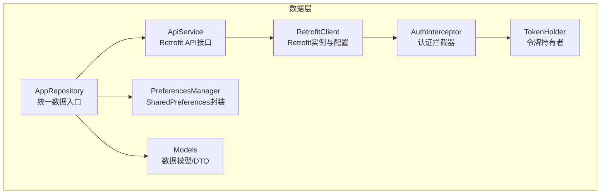
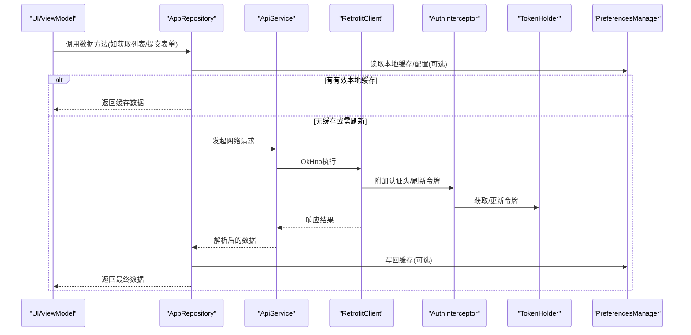
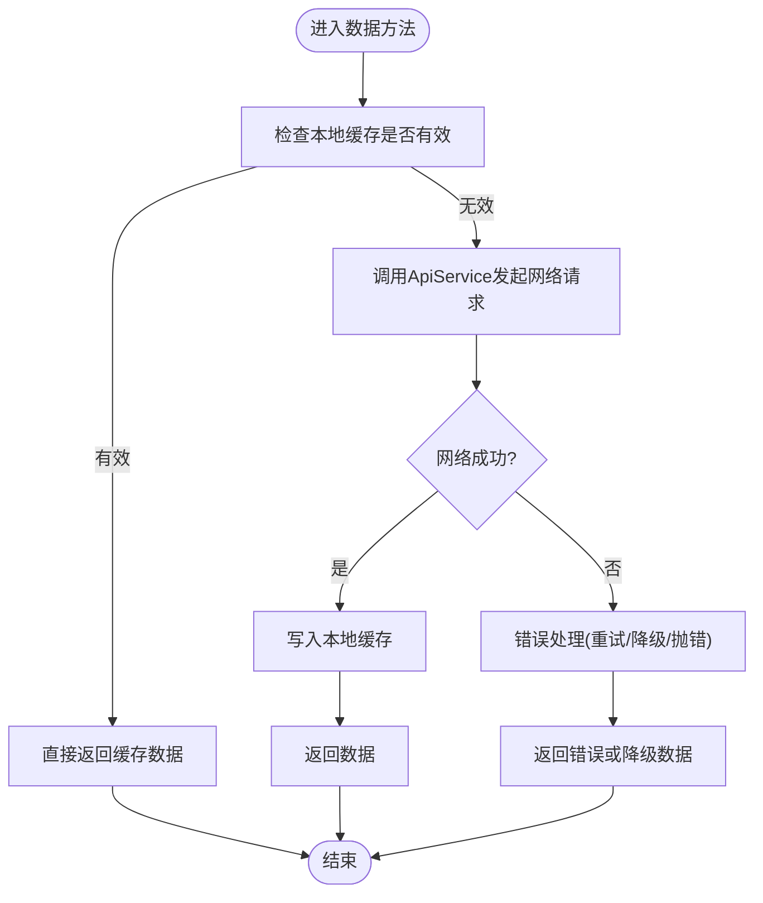
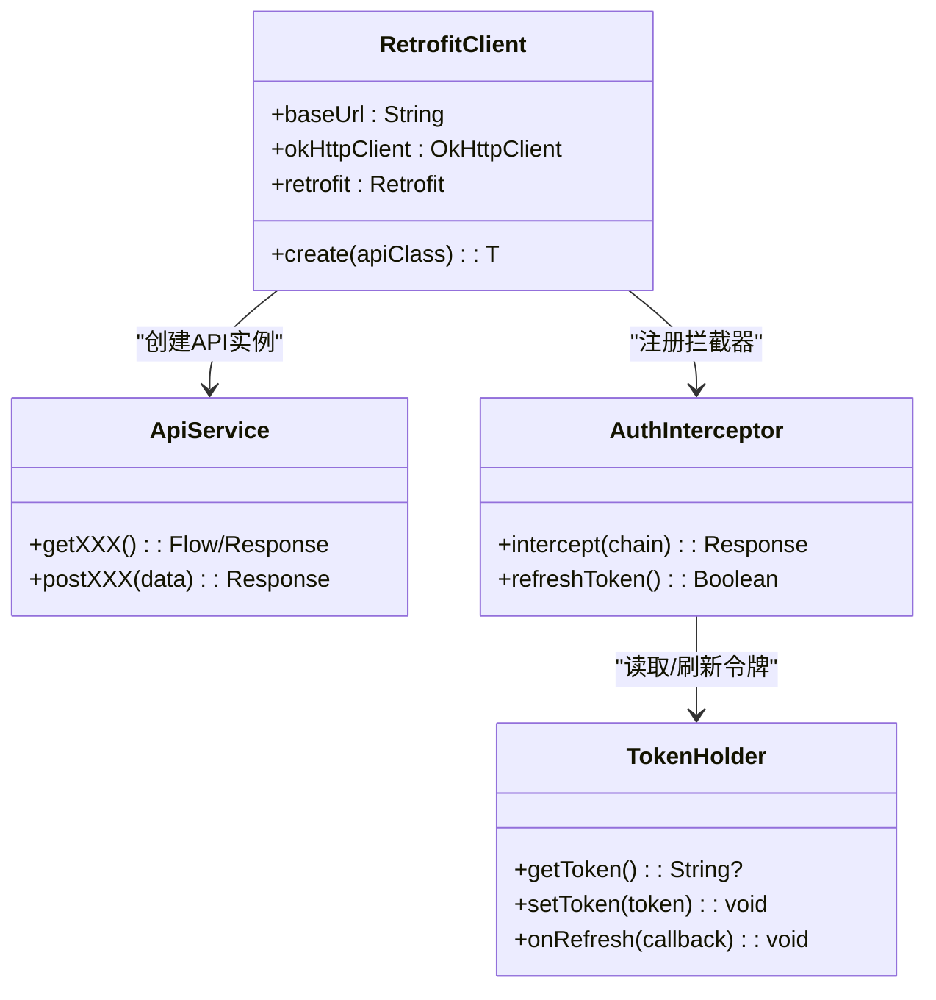
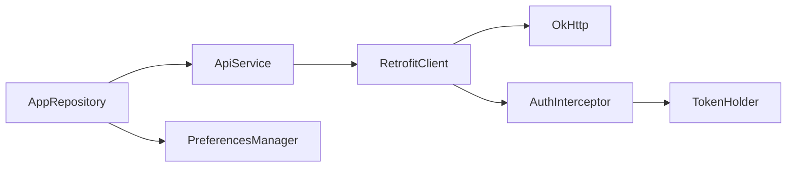

# 数据层Repository模式

<cite>
**本文引用的文件**   
- [AppRepository.kt](file://mobile-android/app/src/main/java/com/dip/material/data/repository/AppRepository.kt)
- [ApiService.kt](file://mobile-android/app/src/main/java/com/dip/material/data/network/ApiService.kt)
- [RetrofitClient.kt](file://mobile-android/app/src/main/java/com/dip/material/data/network/RetrofitClient.kt)
- [AuthInterceptor.kt](file://mobile-android/app/src/main/java/com/dip/material/data/network/AuthInterceptor.kt)
- [TokenHolder.kt](file://mobile-android/app/src/main/java/com/dip/material/data/network/TokenHolder.kt)
- [Models.kt](file://mobile-android/app/src/main/java/com/dip/material/data/models/Models.kt)
- [PreferencesManager.kt](file://mobile-android/app/src/main/java/com/dip/material/utils/PreferencesManager.kt)
</cite>

## 目录
1. [简介](#简介)
2. [项目结构](#项目结构)
3. [核心组件](#核心组件)
4. [架构总览](#架构总览)
5. [详细组件分析](#详细组件分析)
6. [依赖关系分析](#依赖关系分析)
7. [性能考量](#性能考量)
8. [故障排查指南](#故障排查指南)
9. [结论](#结论)
10. [附录](#附录)

## 简介
本文件面向DIP物料管理系统Android应用的数据层，聚焦Repository模式的实现与数据抽象设计。内容涵盖网络请求封装（Retrofit配置、API接口定义、拦截器链）、本地数据存储策略（SharedPreferences与Room的使用场景）、缓存机制、离线数据处理与数据同步策略、错误处理与重试、超时控制、数据验证与转换，以及性能优化与内存管理最佳实践。文档以仓库源码为依据，提供可追溯的章节来源与图示来源，帮助开发者快速理解并扩展数据层能力。

## 项目结构
Android端数据层位于 mobile-android/app/src/main/java/com/dip/material 下，关键目录与职责如下：
- data/network：网络层，包含Retrofit客户端、API接口定义、认证拦截器与令牌持有者
- data/repository：数据仓库层，统一对外暴露数据获取与写入接口，协调网络与本地存储
- data/models：数据模型与DTO映射
- utils：工具类，如SharedPreferences封装等

**图示来源**
- [AppRepository.kt](file://mobile-android/app/src/main/java/com/dip/material/data/repository/AppRepository.kt)
- [ApiService.kt](file://mobile-android/app/src/main/java/com/dip/material/data/network/ApiService.kt)
- [RetrofitClient.kt](file://mobile-android/app/src/main/java/com/dip/material/data/network/RetrofitClient.kt)
- [AuthInterceptor.kt](file://mobile-android/app/src/main/java/com/dip/material/data/network/AuthInterceptor.kt)
- [TokenHolder.kt](file://mobile-android/app/src/main/java/com/dip/material/data/network/TokenHolder.kt)
- [Models.kt](file://mobile-android/app/src/main/java/com/dip/material/data/models/Models.kt)
- [PreferencesManager.kt](file://mobile-android/app/src/main/java/com/dip/material/utils/PreferencesManager.kt)

**章节来源**
- [AppRepository.kt](file://mobile-android/app/src/main/java/com/dip/material/data/repository/AppRepository.kt)
- [ApiService.kt](file://mobile-android/app/src/main/java/com/dip/material/data/network/ApiService.kt)
- [RetrofitClient.kt](file://mobile-android/app/src/main/java/com/dip/material/data/network/RetrofitClient.kt)
- [AuthInterceptor.kt](file://mobile-android/app/src/main/java/com/dip/material/data/network/AuthInterceptor.kt)
- [TokenHolder.kt](file://mobile-android/app/src/main/java/com/dip/material/data/network/TokenHolder.kt)
- [Models.kt](file://mobile-android/app/src/main/java/com/dip/material/data/models/Models.kt)
- [PreferencesManager.kt](file://mobile-android/app/src/main/java/com/dip/material/utils/PreferencesManager.kt)

## 核心组件
- Repository（AppRepository）
  - 职责：对外暴露统一的数据访问接口；协调网络与本地存储；实现缓存与离线策略；聚合错误处理与重试逻辑
  - 关键点：通过单例或依赖注入持有 ApiService 与 PreferencesManager；对上层屏蔽底层数据源差异
- 网络层（ApiService、RetrofitClient、AuthInterceptor、TokenHolder）
  - RetrofitClient：集中配置OkHttp、Retrofit、序列化器、超时、日志与拦截器链
  - ApiService：声明式API接口，使用Kotlin协程返回Flow/Result或挂起函数
  - AuthInterceptor：为请求附加鉴权头，处理令牌刷新流程
  - TokenHolder：线程安全的令牌存取与刷新回调
- 数据模型（Models）
  - 定义与后端一致的DTO与实体映射，便于JSON序列化和校验
- 本地存储（PreferencesManager）
  - 封装SharedPreferences读写，用于保存用户会话、基础配置与轻量缓存

**章节来源**
- [AppRepository.kt](file://mobile-android/app/src/main/java/com/dip/material/data/repository/AppRepository.kt)
- [ApiService.kt](file://mobile-android/app/src/main/java/com/dip/material/data/network/ApiService.kt)
- [RetrofitClient.kt](file://mobile-android/app/src/main/java/com/dip/material/data/network/RetrofitClient.kt)
- [AuthInterceptor.kt](file://mobile-android/app/src/main/java/com/dip/material/data/network/AuthInterceptor.kt)
- [TokenHolder.kt](file://mobile-android/app/src/main/java/com/dip/material/data/network/TokenHolder.kt)
- [Models.kt](file://mobile-android/app/src/main/java/com/dip/material/data/models/Models.kt)
- [PreferencesManager.kt](file://mobile-android/app/src/main/java/com/dip/material/utils/PreferencesManager.kt)

## 架构总览
数据层采用Repository模式作为单一数据入口，向上屏蔽网络与本地存储细节，向下统一管理Retrofit网络请求与SharedPreferences持久化。整体流程如下：

**图示来源**
- [AppRepository.kt](file://mobile-android/app/src/main/java/com/dip/material/data/repository/AppRepository.kt)
- [ApiService.kt](file://mobile-android/app/src/main/java/com/dip/material/data/network/ApiService.kt)
- [RetrofitClient.kt](file://mobile-android/app/src/main/java/com/dip/material/data/network/RetrofitClient.kt)
- [AuthInterceptor.kt](file://mobile-android/app/src/main/java/com/dip/material/data/network/AuthInterceptor.kt)
- [TokenHolder.kt](file://mobile-android/app/src/main/java/com/dip/material/data/network/TokenHolder.kt)
- [PreferencesManager.kt](file://mobile-android/app/src/main/java/com/dip/material/utils/PreferencesManager.kt)

## 详细组件分析

### Repository（AppRepository）
- 设计要点
  - 统一数据入口：对外暴露清晰的方法签名，隐藏网络与本地存储实现
  - 缓存策略：优先读取本地缓存，必要时触发网络刷新，并将结果写回缓存
  - 离线支持：在网络不可用时返回本地数据或明确错误状态
  - 错误处理：将网络异常、业务异常转换为统一的Result或错误类型
  - 重试机制：对瞬时失败进行有限次重试，避免雪崩
- 典型流程
  - 读取缓存 -> 判断有效性 -> 若无效则发起网络请求 -> 成功后写回缓存 -> 返回数据
  - 失败时根据错误类型决定降级策略（返回旧缓存、提示用户或重试）

**图示来源**
- [AppRepository.kt](file://mobile-android/app/src/main/java/com/dip/material/data/repository/AppRepository.kt)
- [PreferencesManager.kt](file://mobile-android/app/src/main/java/com/dip/material/utils/PreferencesManager.kt)
- [ApiService.kt](file://mobile-android/app/src/main/java/com/dip/material/data/network/ApiService.kt)

**章节来源**
- [AppRepository.kt](file://mobile-android/app/src/main/java/com/dip/material/data/repository/AppRepository.kt)
- [PreferencesManager.kt](file://mobile-android/app/src/main/java/com/dip/material/utils/PreferencesManager.kt)

### 网络层（ApiService、RetrofitClient、AuthInterceptor、TokenHolder）
- RetrofitClient
  - 负责构建Retrofit实例，配置Base URL、序列化器、OkHttp拦截器链、超时参数与日志打印
  - 建议：合理设置连接/读/写超时；启用Gzip压缩；按需开启HTTP日志
- ApiService
  - 使用注解声明REST接口，返回类型建议使用协程挂起函数或Flow
  - 建议：对分页、排序、过滤参数进行统一封装；对响应体进行统一包装
- AuthInterceptor
  - 在请求前附加Authorization头；当收到401时尝试刷新令牌并重试一次
  - 建议：令牌刷新需加锁防抖，避免并发多次刷新
- TokenHolder
  - 提供线程安全的令牌存取与刷新回调；与AuthInterceptor协作完成自动续期

**图示来源**
- [RetrofitClient.kt](file://mobile-android/app/src/main/java/com/dip/material/data/network/RetrofitClient.kt)
- [ApiService.kt](file://mobile-android/app/src/main/java/com/dip/material/data/network/ApiService.kt)
- [AuthInterceptor.kt](file://mobile-android/app/src/main/java/com/dip/material/data/network/AuthInterceptor.kt)
- [TokenHolder.kt](file://mobile-android/app/src/main/java/com/dip/material/data/network/TokenHolder.kt)

**章节来源**
- [RetrofitClient.kt](file://mobile-android/app/src/main/java/com/dip/material/data/network/RetrofitClient.kt)
- [ApiService.kt](file://mobile-android/app/src/main/java/com/dip/material/data/network/ApiService.kt)
- [AuthInterceptor.kt](file://mobile-android/app/src/main/java/com/dip/material/data/network/AuthInterceptor.kt)
- [TokenHolder.kt](file://mobile-android/app/src/main/java/com/dip/material/data/network/TokenHolder.kt)

### 数据模型（Models）
- 作用：定义与后端一致的DTO与实体，确保JSON序列化/反序列化正确
- 建议：
  - 使用data class简化样板代码
  - 对必填字段进行空值保护与默认值处理
  - 对枚举字段使用Kotlin enum或sealed class提升类型安全

**章节来源**
- [Models.kt](file://mobile-android/app/src/main/java/com/dip/material/data/models/Models.kt)

### 本地存储（PreferencesManager）
- 作用：封装SharedPreferences读写，用于保存用户会话、基础配置与轻量缓存
- 建议：
  - 对敏感信息加密存储
  - 提供统一的键名管理与版本迁移
  - 避免在主线程频繁读写，必要时使用协程或异步任务

**章节来源**
- [PreferencesManager.kt](file://mobile-android/app/src/main/java/com/dip/material/utils/PreferencesManager.kt)

## 依赖关系分析
- 耦合与内聚
  - Repository高内聚：聚合网络与本地存储逻辑，降低上层复杂度
  - 网络层低耦合：通过RetrofitClient集中配置，ApiService仅关注接口定义
  - 拦截器与令牌解耦：AuthInterceptor通过TokenHolder访问令牌，便于替换实现
- 外部依赖
  - Retrofit/OkHttp：网络通信与拦截器链
  - Kotlin协程：异步编程与背压支持
  - SharedPreferences：轻量级本地存储

**图示来源**
- [AppRepository.kt](file://mobile-android/app/src/main/java/com/dip/material/data/repository/AppRepository.kt)
- [ApiService.kt](file://mobile-android/app/src/main/java/com/dip/material/data/network/ApiService.kt)
- [RetrofitClient.kt](file://mobile-android/app/src/main/java/com/dip/material/data/network/RetrofitClient.kt)
- [AuthInterceptor.kt](file://mobile-android/app/src/main/java/com/dip/material/data/network/AuthInterceptor.kt)
- [TokenHolder.kt](file://mobile-android/app/src/main/java/com/dip/material/data/network/TokenHolder.kt)
- [PreferencesManager.kt](file://mobile-android/app/src/main/java/com/dip/material/utils/PreferencesManager.kt)

**章节来源**
- [AppRepository.kt](file://mobile-android/app/src/main/java/com/dip/material/data/repository/AppRepository.kt)
- [ApiService.kt](file://mobile-android/app/src/main/java/com/dip/material/data/network/ApiService.kt)
- [RetrofitClient.kt](file://mobile-android/app/src/main/java/com/dip/material/data/network/RetrofitClient.kt)
- [AuthInterceptor.kt](file://mobile-android/app/src/main/java/com/dip/material/data/network/AuthInterceptor.kt)
- [TokenHolder.kt](file://mobile-android/app/src/main/java/com/dip/material/data/network/TokenHolder.kt)
- [PreferencesManager.kt](file://mobile-android/app/src/main/java/com/dip/material/utils/PreferencesManager.kt)

## 性能考量
- 网络请求
  - 合理设置超时：连接超时、读超时、写超时按业务场景调优
  - 启用Gzip压缩与连接池复用，减少握手开销
  - 使用Flow进行流式处理，避免一次性加载大数据集
- 缓存策略
  - 本地缓存优先，设置合理的过期时间与失效策略
  - 对热点数据使用内存缓存（如ConcurrentHashMap），注意弱引用避免内存泄漏
- 序列化
  - 选择合适的JSON库与配置，避免不必要的反射
  - 对大对象进行分片传输或分页加载
- 内存管理
  - 避免在Repository中持有Activity/Fragment引用
  - 及时释放协程与观察者，防止内存泄漏
  - 对图片等大资源使用专用加载库并设置尺寸限制

[本节为通用指导，不直接分析具体文件]

## 故障排查指南
- 常见问题
  - 401未授权：检查TokenHolder是否正确设置与刷新；确认AuthInterceptor是否重试成功
  - 网络超时：调整RetrofitClient超时参数；检查服务端响应时间
  - JSON解析失败：核对Models字段与后端响应一致；启用日志查看原始响应
  - 缓存不一致：检查缓存键与过期策略；清理缓存后重试
- 定位手段
  - 启用OkHttp日志打印请求与响应
  - 在Repository层添加错误分类与日志输出
  - 使用调试工具观察协程调度与线程切换

**章节来源**
- [RetrofitClient.kt](file://mobile-android/app/src/main/java/com/dip/material/data/network/RetrofitClient.kt)
- [AuthInterceptor.kt](file://mobile-android/app/src/main/java/com/dip/material/data/network/AuthInterceptor.kt)
- [TokenHolder.kt](file://mobile-android/app/src/main/java/com/dip/material/data/network/TokenHolder.kt)
- [ApiService.kt](file://mobile-android/app/src/main/java/com/dip/material/data/network/ApiService.kt)
- [Models.kt](file://mobile-android/app/src/main/java/com/dip/material/data/models/Models.kt)

## 结论
通过Repository模式，数据层实现了清晰的职责分离与统一的数据访问入口。结合Retrofit网络封装、拦截器链与令牌管理，提供了健壮的在线能力；借助SharedPreferences与未来可扩展的Room数据库，满足离线与缓存需求。建议在后续迭代中引入Room进行结构化数据存储，完善错误分类与重试策略，持续优化性能与内存占用。

[本节为总结性内容，不直接分析具体文件]

## 附录
- Room数据库使用场景建议
  - 结构化数据、复杂查询、事务操作、跨进程共享数据
  - 与Repository集成：网络数据落库，UI从Room读取，后台定时同步
- 数据验证与转换
  - 在Models层进行字段校验与默认值处理
  - 在Repository层进行领域模型与DTO之间的转换
- 数据同步策略
  - 增量同步：基于时间戳或版本号
  - 冲突解决：最后写入优先或合并策略
  - 后台同步：WorkManager或JobScheduler

[本节为概念性内容，不直接分析具体文件]