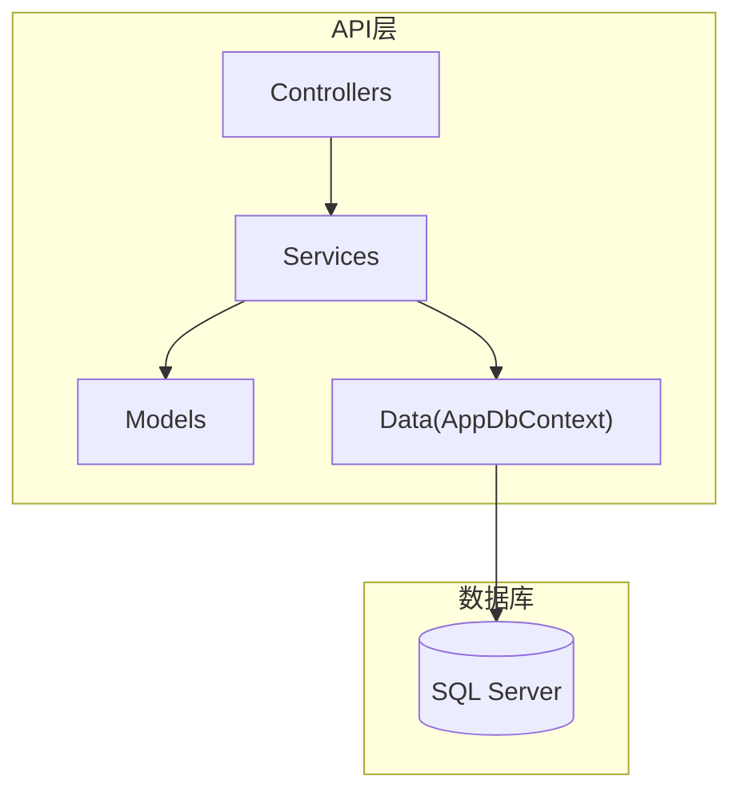
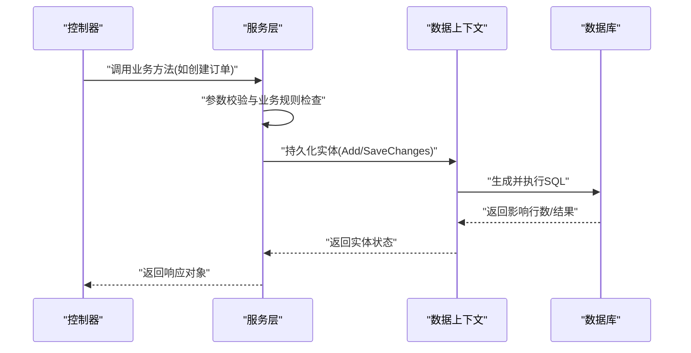
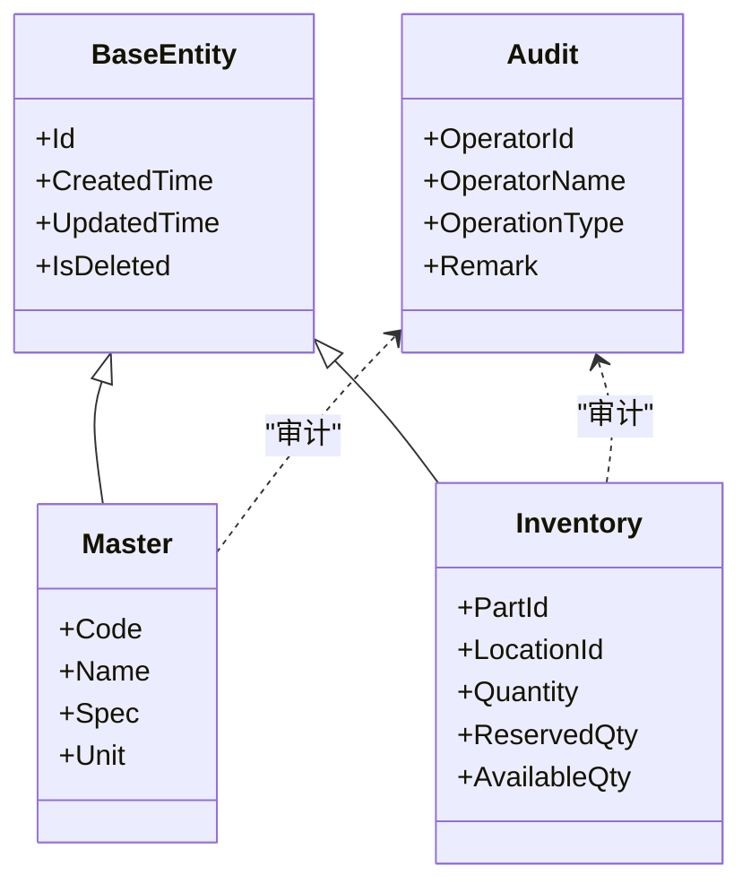
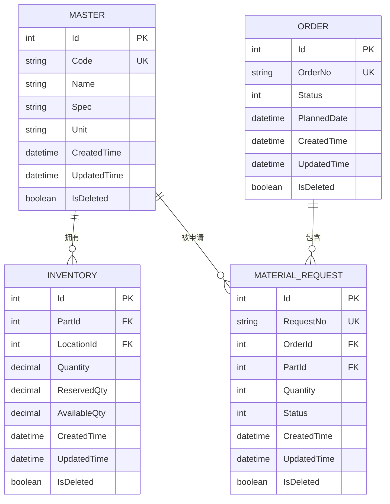
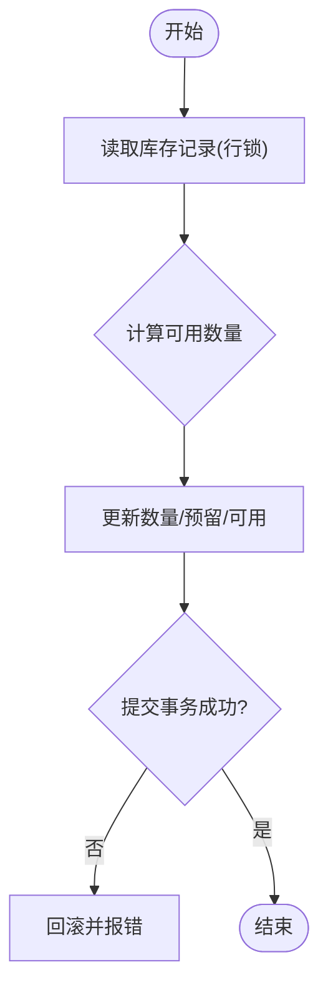
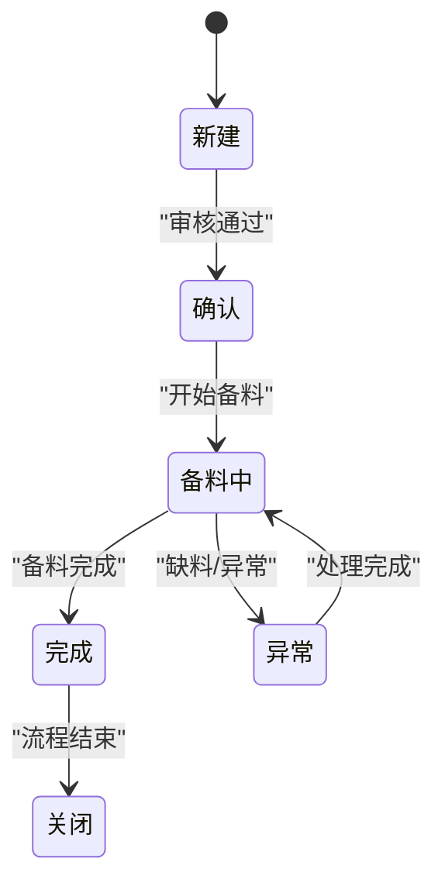
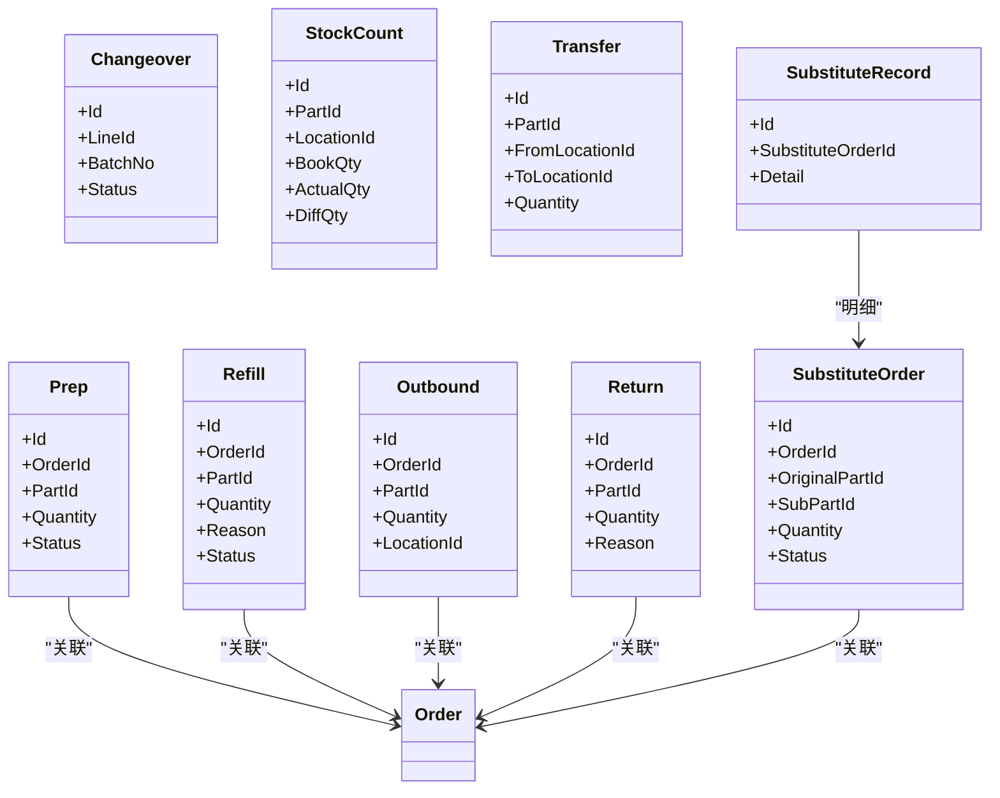
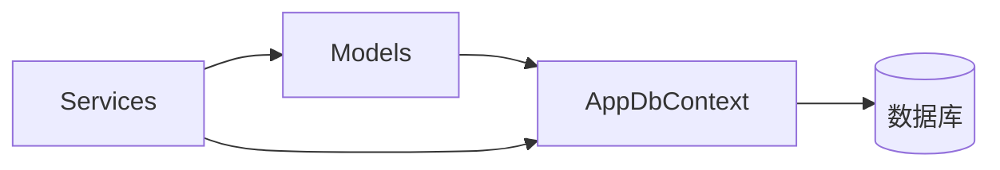

# 数据模型设计

<cite>
**本文引用的文件**   
- [BaseEntity.cs](file://dip-system/api/Models/BaseEntity.cs)
- [Audit.cs](file://dip-system/api/Models/Audit.cs)
- [AppDbContext.cs](file://dip-system/api/Data/AppDbContext.cs)
- [Master.cs](file://dip-system/api/Models/Master.cs)
- [Inventory.cs](file://dip-system/api/Models/Inventory.cs)
- [Order.cs](file://dip-system/api/Models/Order.cs)
- [MaterialRequest.cs](file://dip-system/api/Models/MaterialRequest.cs)
- [Abnormal.cs](file://dip-system/api/Models/Abnormal.cs)
- [Changeover.cs](file://dip-system/api/Models/Changeover.cs)
- [Outbound.cs](file://dip-system/api/Models/Outbound.cs)
- [Prep.cs](file://dip-system/api/Models/Prep.cs)
- [Refill.cs](file://dip-system/api/Models/Refill.cs)
- [Return.cs](file://dip-system/api/Models/Return.cs)
- [Shelving.cs](file://dip-system/api/Models/Shelving.cs)
- [StockCount.cs](file://dip-system/api/Models/StockCount.cs)
- [Transfer.cs](file://dip-system/api/Models/Transfer.cs)
- [SubstituteOrder.cs](file://dip-system/api/Models/SubstituteOrder.cs)
- [SubstituteRecord.cs](file://dip-system/api/Models/SubstituteRecord.cs)
- [InitDB.sql](file://scripts/init-db.sql)
</cite>

## 目录
1. [引言](#引言)
2. [项目结构](#项目结构)
3. [核心组件](#核心组件)
4. [架构总览](#架构总览)
5. [详细组件分析](#详细组件分析)
6. [依赖关系分析](#依赖关系分析)
7. [性能考虑](#性能考虑)
8. [故障排查指南](#故障排查指南)
9. [结论](#结论)
10. [附录](#附录)

## 引言
本文件面向DIP物料管理系统的数据模型设计，聚焦实体类的设计原则（基础实体继承、审计字段、软删除机制）、领域模型的映射关系与业务规则、数据验证与约束、数据库表结构与索引策略、实体关系图与ER图，以及数据迁移与版本管理方案。文档旨在为后端开发、数据库设计与运维提供统一参考，帮助团队在扩展与维护过程中保持一致性与可演进性。

## 项目结构
- 后端采用C# ASP.NET Core，数据模型位于 Models 目录，上下文与EF配置位于 Data 目录。
- 关键模型包括基础实体、主数据、库存、订单、备料、补料、出库、退料、换线、盘点、调拨、替代等。
- 数据库初始化脚本位于 scripts 目录，用于创建初始表结构与基础数据。



图表来源
- [AppDbContext.cs](file://dip-system/api/Data/AppDbContext.cs)
- [Master.cs](file://dip-system/api/Models/Master.cs)
- [Inventory.cs](file://dip-system/api/Models/Inventory.cs)
- [Order.cs](file://dip-system/api/Models/Order.cs)

章节来源
- [AppDbContext.cs](file://dip-system/api/Data/AppDbContext.cs)
- [Master.cs](file://dip-system/api/Models/Master.cs)
- [Inventory.cs](file://dip-system/api/Models/Inventory.cs)
- [Order.cs](file://dip-system/api/Models/Order.cs)

## 核心组件
- 基础实体与审计：通过基础实体统一标识、时间戳与审计信息；审计字段记录操作人、时间与备注，便于追溯。
- 软删除机制：对易丢失或需历史追溯的实体引入软删除标记，查询时默认过滤已删除记录，保留完整审计轨迹。
- 领域模型：围绕“主数据—库存—订单—作业”主线组织实体，明确边界与职责，避免跨域耦合。
- 数据验证：在模型层定义必填、长度、格式等约束，在服务层进行业务校验，确保一致性。

章节来源
- [BaseEntity.cs](file://dip-system/api/Models/BaseEntity.cs)
- [Audit.cs](file://dip-system/api/Models/Audit.cs)
- [Master.cs](file://dip-system/api/Models/Master.cs)
- [Inventory.cs](file://dip-system/api/Models/Inventory.cs)
- [Order.cs](file://dip-system/api/Models/Order.cs)
- [MaterialRequest.cs](file://dip-system/api/Models/MaterialRequest.cs)

## 架构总览
下图展示数据访问与领域模型之间的关系，体现从控制器到服务再到数据上下文的调用链，以及模型与数据库表的映射。



图表来源
- [AppDbContext.cs](file://dip-system/api/Data/AppDbContext.cs)
- [Order.cs](file://dip-system/api/Models/Order.cs)
- [Inventory.cs](file://dip-system/api/Models/Inventory.cs)

## 详细组件分析

### 基础实体与审计
- 基础实体提供统一的标识、创建/更新时间等公共属性，所有业务实体继承该基类，保证一致性与可维护性。
- 审计字段包含操作人、操作时间、操作类型等，支持对关键变更进行追踪。
- 软删除通过布尔标记实现，查询时自动过滤已删除记录，删除操作不物理移除数据。



图表来源
- [BaseEntity.cs](file://dip-system/api/Models/BaseEntity.cs)
- [Audit.cs](file://dip-system/api/Models/Audit.cs)
- [Master.cs](file://dip-system/api/Models/Master.cs)
- [Inventory.cs](file://dip-system/api/Models/Inventory.cs)

章节来源
- [BaseEntity.cs](file://dip-system/api/Models/BaseEntity.cs)
- [Audit.cs](file://dip-system/api/Models/Audit.cs)

### 主数据模型（物料）
- 物料主数据包含编码、名称、规格、单位等核心属性，作为库存、订单、备料等业务实体的基础。
- 编码唯一性、名称非空、单位标准化是基本约束。
- 与库存、订单、备料等存在一对多或多对多关联。



图表来源
- [Master.cs](file://dip-system/api/Models/Master.cs)
- [Inventory.cs](file://dip-system/api/Models/Inventory.cs)
- [Order.cs](file://dip-system/api/Models/Order.cs)
- [MaterialRequest.cs](file://dip-system/api/Models/MaterialRequest.cs)

章节来源
- [Master.cs](file://dip-system/api/Models/Master.cs)
- [Inventory.cs](file://dip-system/api/Models/Inventory.cs)
- [Order.cs](file://dip-system/api/Models/Order.cs)
- [MaterialRequest.cs](file://dip-system/api/Models/MaterialRequest.cs)

### 库存与可用量计算
- 库存实体记录某物料在某库位的数量、预留数量与可用数量。
- 可用数量通常由“现有数量 - 预留数量”推导，需在写入时保持计算一致性。
- 并发场景下需使用事务与行级锁保障扣减正确性。



图表来源
- [Inventory.cs](file://dip-system/api/Models/Inventory.cs)

章节来源
- [Inventory.cs](file://dip-system/api/Models/Inventory.cs)

### 订单与物料需求
- 订单实体承载生产计划与状态流转，物料需求记录每个订单对物料的明细需求。
- 需求数量需与库存可用量校验，不足时需触发预警或替代策略。
- 订单状态机驱动业务流程推进（如新建、确认、备料中、完成、关闭）。



图表来源
- [Order.cs](file://dip-system/api/Models/Order.cs)
- [MaterialRequest.cs](file://dip-system/api/Models/MaterialRequest.cs)

章节来源
- [Order.cs](file://dip-system/api/Models/Order.cs)
- [MaterialRequest.cs](file://dip-system/api/Models/MaterialRequest.cs)

### 备料、补料、出库、退料、换线、盘点、调拨、替代
- 备料：根据订单需求生成备料任务，关联物料与库位，支持分批备料。
- 补料：针对异常或缺料场景发起补料流程，记录原因与审批。
- 出库：按备料结果执行出库，扣减库存并记录流水。
- 退料：将未用物料退回库位，增加库存并记录原因。
- 换线：切换产线或批次，影响库存归属与计划。
- 盘点：定期核对账实差异，生成调整单。
- 调拨：在不同库位或仓库间转移库存。
- 替代：当主物料不可用时，按策略启用替代物料，记录替代关系与审批。



图表来源
- [Prep.cs](file://dip-system/api/Models/Prep.cs)
- [Refill.cs](file://dip-system/api/Models/Refill.cs)
- [Outbound.cs](file://dip-system/api/Models/Outbound.cs)
- [Return.cs](file://dip-system/api/Models/Return.cs)
- [Changeover.cs](file://dip-system/api/Models/Changeover.cs)
- [StockCount.cs](file://dip-system/api/Models/StockCount.cs)
- [Transfer.cs](file://dip-system/api/Models/Transfer.cs)
- [SubstituteOrder.cs](file://dip-system/api/Models/SubstituteOrder.cs)
- [SubstituteRecord.cs](file://dip-system/api/Models/SubstituteRecord.cs)

章节来源
- [Prep.cs](file://dip-system/api/Models/Prep.cs)
- [Refill.cs](file://dip-system/api/Models/Refill.cs)
- [Outbound.cs](file://dip-system/api/Models/Outbound.cs)
- [Return.cs](file://dip-system/api/Models/Return.cs)
- [Changeover.cs](file://dip-system/api/Models/Changeover.cs)
- [StockCount.cs](file://dip-system/api/Models/StockCount.cs)
- [Transfer.cs](file://dip-system/api/Models/Transfer.cs)
- [SubstituteOrder.cs](file://dip-system/api/Models/SubstituteOrder.cs)
- [SubstituteRecord.cs](file://dip-system/api/Models/SubstituteRecord.cs)

### 数据验证与约束
- 必填字段：编码、名称、数量、状态等关键字段必须非空且符合业务语义。
- 长度与格式：编码遵循规范（如字母数字组合），数量大于等于零，日期合法。
- 唯一性：物料编码、订单号、申请单号等全局唯一。
- 业务规则：可用量不足禁止出库；替代需经审批；异常需记录原因与处理结果。

章节来源
- [Master.cs](file://dip-system/api/Models/Master.cs)
- [Inventory.cs](file://dip-system/api/Models/Inventory.cs)
- [Order.cs](file://dip-system/api/Models/Order.cs)
- [MaterialRequest.cs](file://dip-system/api/Models/MaterialRequest.cs)

### 数据库表结构与索引策略
- 表结构：以实体为单位映射表，包含主键、外键、审计字段与软删除标记。
- 索引策略：
  - 主键索引：所有表的主键列。
  - 唯一索引：编码、单号等唯一字段。
  - 查询索引：常用筛选与排序字段（如订单号、物料编码、库位、状态、时间范围）。
  - 复合索引：高频联合查询（如订单+物料、库位+物料）。
- 分区与归档：历史数据可按时间分区，提升查询性能与归档效率。

章节来源
- [AppDbContext.cs](file://dip-system/api/Data/AppDbContext.cs)
- [InitDB.sql](file://scripts/init-db.sql)

### 实体关系图（代码级）
```mermaid
classDiagram
class BaseEntity
class Audit
class Master
class Inventory
class Order
class MaterialRequest
class Prep
class Refill
class Outbound
class Return
class Changeover
class StockCount
class Transfer
class SubstituteOrder
class SubstituteRecord
BaseEntity <|-- Master
BaseEntity <|-- Inventory
BaseEntity <|-- Order
BaseEntity <|-- MaterialRequest
BaseEntity <|-- Prep
BaseEntity <|-- Refill
BaseEntity <|-- Outbound
BaseEntity <|-- Return
BaseEntity <|-- Changeover
BaseEntity <|-- StockCount
BaseEntity <|-- Transfer
BaseEntity <|-- SubstituteOrder
BaseEntity <|-- SubstituteRecord
Master ||--o{ Inventory : "拥有"
Master ||--o{ MaterialRequest : "被申请"
Master ||--o{ Prep : "被备料"
Master ||--o{ Refill : "被补料"
Master ||--o{ Outbound : "被出库"
Master ||--o{ Return : "被退料"
Master ||--o{ StockCount : "被盘点"
Master ||--o{ Transfer : "被调拨"
Order ||--o{ MaterialRequest : "包含"
Order ||--o{ Prep : "包含"
Order ||--o{ Refill : "包含"
Order ||--o{ Outbound : "包含"
Order ||--o{ Return : "包含"
Order ||--o{ SubstituteOrder : "包含"
SubstituteOrder ||--o{ SubstituteRecord : "明细"
```

图表来源
- [BaseEntity.cs](file://dip-system/api/Models/BaseEntity.cs)
- [Audit.cs](file://dip-system/api/Models/Audit.cs)
- [Master.cs](file://dip-system/api/Models/Master.cs)
- [Inventory.cs](file://dip-system/api/Models/Inventory.cs)
- [Order.cs](file://dip-system/api/Models/Order.cs)
- [MaterialRequest.cs](file://dip-system/api/Models/MaterialRequest.cs)
- [Prep.cs](file://dip-system/api/Models/Prep.cs)
- [Refill.cs](file://dip-system/api/Models/Refill.cs)
- [Outbound.cs](file://dip-system/api/Models/Outbound.cs)
- [Return.cs](file://dip-system/api/Models/Return.cs)
- [Changeover.cs](file://dip-system/api/Models/Changeover.cs)
- [StockCount.cs](file://dip-system/api/Models/StockCount.cs)
- [Transfer.cs](file://dip-system/api/Models/Transfer.cs)
- [SubstituteOrder.cs](file://dip-system/api/Models/SubstituteOrder.cs)
- [SubstituteRecord.cs](file://dip-system/api/Models/SubstituteRecord.cs)

## 依赖关系分析
- 模型层依赖基础实体与审计，确保一致性。
- 服务层依赖模型与上下文，负责业务规则与事务控制。
- 上下文集中配置实体映射、关系与索引，减少分散配置带来的不一致。



图表来源
- [AppDbContext.cs](file://dip-system/api/Data/AppDbContext.cs)
- [Master.cs](file://dip-system/api/Models/Master.cs)
- [Inventory.cs](file://dip-system/api/Models/Inventory.cs)
- [Order.cs](file://dip-system/api/Models/Order.cs)

章节来源
- [AppDbContext.cs](file://dip-system/api/Data/AppDbContext.cs)

## 性能考虑
- 查询优化：合理使用索引，避免全表扫描；分页查询限制返回条数。
- 事务与锁：库存扣减、订单状态变更等关键路径使用短事务与行级锁，降低死锁风险。
- 读写分离：读多写少场景可引入缓存或只读副本。
- 批量操作：大批量插入/更新使用批量接口，减少往返开销。
- 监控与诊断：慢查询日志、执行计划分析，持续优化热点SQL。

## 故障排查指南
- 常见错误：
  - 唯一约束冲突：检查编码、单号是否重复。
  - 可用量为负：核对并发扣减逻辑与事务隔离级别。
  - 软删除误删：确认查询条件是否包含 IsDeleted 过滤。
  - 外键约束失败：检查关联实体是否存在及状态。
- 定位手段：
  - 查看审计字段与日志，还原操作轨迹。
  - 使用上下文生成的SQL进行分析与优化。
  - 对热点表添加或调整索引，观察性能变化。

章节来源
- [AppDbContext.cs](file://dip-system/api/Data/AppDbContext.cs)
- [InitDB.sql](file://scripts/init-db.sql)

## 结论
本数据模型设计以基础实体与审计为核心，结合软删除与严格的验证约束，构建了清晰、可扩展的领域模型。通过合理的表结构与索引策略，保障了系统在高并发与大数据量下的稳定性与性能。建议在后续迭代中持续完善业务规则与监控体系，确保数据一致性与可追溯性。

## 附录
- 数据迁移与版本管理建议：
  - 使用迁移脚本管理DDL变更，每次变更附带版本号与说明。
  - 变更前评估影响面，准备回滚方案。
  - 在测试环境充分验证后再发布至生产。
  - 对历史数据进行归档与清理，控制表规模。

章节来源
- [InitDB.sql](file://scripts/init-db.sql)