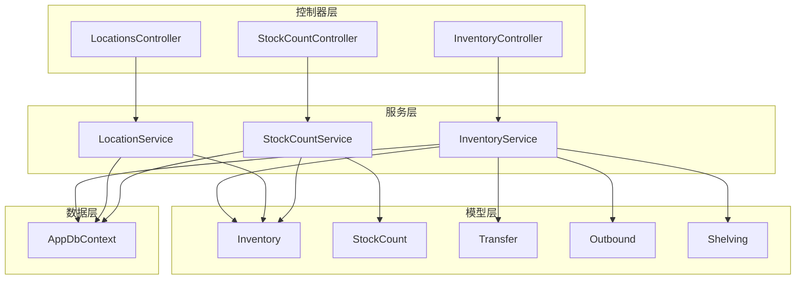
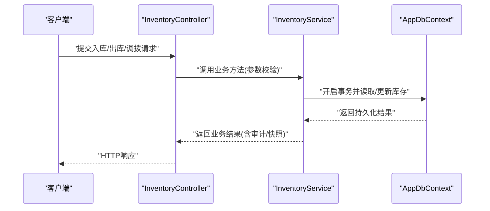
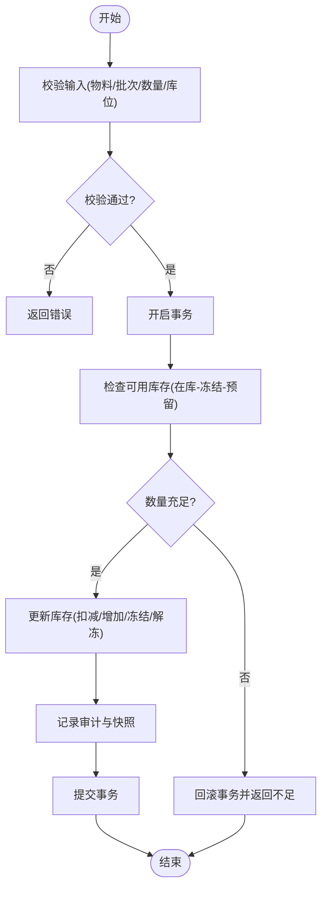
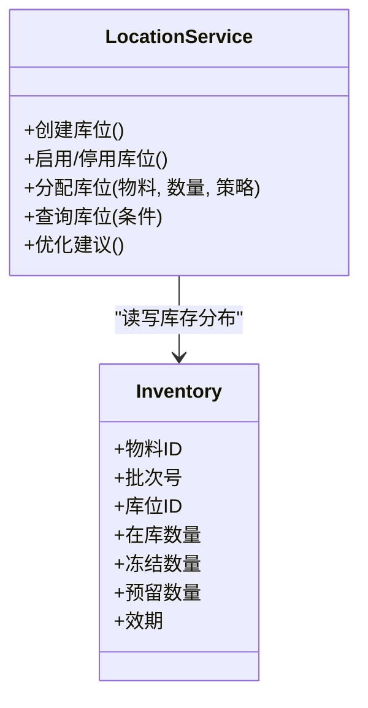
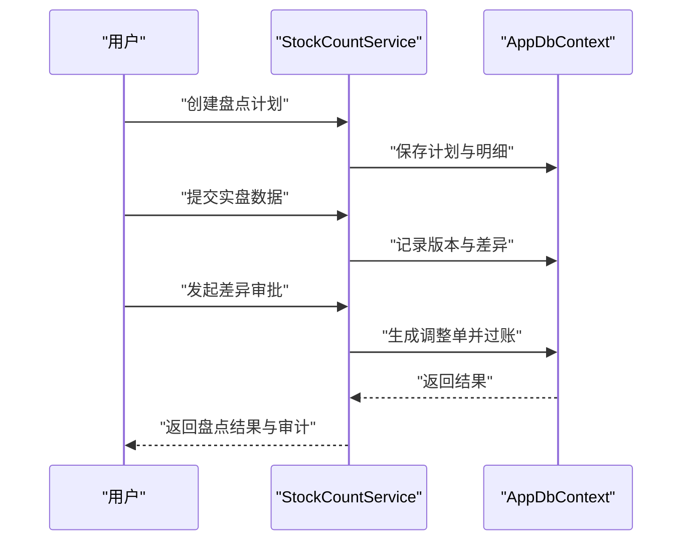
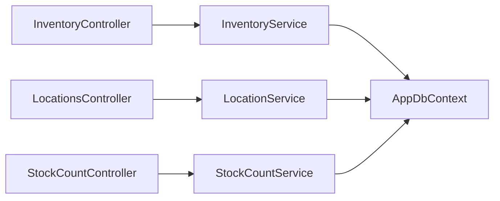

# 库存管理服务

<cite>
**本文档引用的文件**   
- [InventoryService.cs](file://dip-system/api/Services/InventoryService.cs)
- [LocationService.cs](file://dip-system/api/Services/LocationService.cs)
- [StockCountService.cs](file://dip-system/api/Services/StockCountService.cs)
- [InventoryController.cs](file://dip-system/api/Controllers/InventoryController.cs)
- [LocationsController.cs](file://dip-system/api/Controllers/LocationsController.cs)
- [StockCountController.cs](file://dip-system/api/Controllers/StockCountController.cs)
- [Inventory.cs](file://dip-system/api/Models/Inventory.cs)
- [StockCount.cs](file://dip-system/api/Models/StockCount.cs)
- [Transfer.cs](file://dip-system/api/Models/Transfer.cs)
- [Outbound.cs](file://dip-system/api/Models/Outbound.cs)
- [Shelving.cs](file://dip-system/api/Models/Shelving.cs)
- [AppDbContext.cs](file://dip-system/api/Data/AppDbContext.cs)
</cite>

## 目录
1. [简介](#简介)
2. [项目结构](#项目结构)
3. [核心组件](#核心组件)
4. [架构总览](#架构总览)
5. [详细组件分析](#详细组件分析)
6. [依赖关系分析](#依赖关系分析)
7. [性能考虑](#性能考虑)
8. [故障排查指南](#故障排查指南)
9. [结论](#结论)
10. [附录](#附录)

## 简介
本文件面向DIP物料管理系统的库存管理服务，聚焦以下目标：
- 详细说明库存服务(InventoryService)的入库、出库、调拨、盘点等核心业务流程。
- 描述位置服务(LocationService)的库位管理与货位分配策略、库存分布优化。
- 解释盘点服务(StockCountService)的盘点计划、差异处理与库存调整机制。
- 阐述库存一致性保证、并发控制与数据同步策略。
- 提供库存查询优化与性能调优建议。

## 项目结构
后端采用ASP.NET Core分层架构：
- Controllers层暴露REST接口，负责请求校验与响应封装。
- Services层实现业务逻辑（库存、位置、盘点、调拨、出库等）。
- Models层定义领域模型（库存、盘点、调拨、出库、上架等）。
- Data层通过EF Core上下文访问数据库。

图表来源
- [InventoryController.cs](file://dip-system/api/Controllers/InventoryController.cs)
- [LocationsController.cs](file://dip-system/api/Controllers/LocationsController.cs)
- [StockCountController.cs](file://dip-system/api/Controllers/StockCountController.cs)
- [InventoryService.cs](file://dip-system/api/Services/InventoryService.cs)
- [LocationService.cs](file://dip-system/api/Services/LocationService.cs)
- [StockCountService.cs](file://dip-system/api/Services/StockCountService.cs)
- [Inventory.cs](file://dip-system/api/Models/Inventory.cs)
- [StockCount.cs](file://dip-system/api/Models/StockCount.cs)
- [Transfer.cs](file://dip-system/api/Models/Transfer.cs)
- [Outbound.cs](file://dip-system/api/Models/Outbound.cs)
- [Shelving.cs](file://dip-system/api/Models/Shelving.cs)
- [AppDbContext.cs](file://dip-system/api/Data/AppDbContext.cs)

章节来源
- [InventoryController.cs](file://dip-system/api/Controllers/InventoryController.cs)
- [LocationsController.cs](file://dip-system/api/Controllers/LocationsController.cs)
- [StockCountController.cs](file://dip-system/api/Controllers/StockCountController.cs)
- [InventoryService.cs](file://dip-system/api/Services/InventoryService.cs)
- [LocationService.cs](file://dip-system/api/Services/LocationService.cs)
- [StockCountService.cs](file://dip-system/api/Services/StockCountService.cs)
- [Inventory.cs](file://dip-system/api/Models/Inventory.cs)
- [StockCount.cs](file://dip-system/api/Models/StockCount.cs)
- [Transfer.cs](file://dip-system/api/Models/Transfer.cs)
- [Outbound.cs](file://dip-system/api/Models/Outbound.cs)
- [Shelving.cs](file://dip-system/api/Models/Shelving.cs)
- [AppDbContext.cs](file://dip-system/api/Data/AppDbContext.cs)

## 核心组件
- InventoryService：负责库存主数据的增删改查、入库、出库、调拨、上架、批次与效期管理、库存快照与审计记录。
- LocationService：负责库位生命周期管理、库位容量与状态控制、货位分配策略（按物料属性、周转率、批次等）、库存分布优化建议。
- StockCountService：负责盘点计划创建与执行、差异采集与审批、库存调整过账、盘点审计追踪。

章节来源
- [InventoryService.cs](file://dip-system/api/Services/InventoryService.cs)
- [LocationService.cs](file://dip-system/api/Services/LocationService.cs)
- [StockCountService.cs](file://dip-system/api/Services/StockCountService.cs)

## 架构总览
库存相关操作由控制器接收请求，委托对应服务完成事务性业务逻辑，并通过EF Core持久化到数据库。关键交互如下：

图表来源
- [InventoryController.cs](file://dip-system/api/Controllers/InventoryController.cs)
- [InventoryService.cs](file://dip-system/api/Services/InventoryService.cs)
- [AppDbContext.cs](file://dip-system/api/Data/AppDbContext.cs)

## 详细组件分析

### 库存服务(InventoryService)
职责范围：
- 入库流程：校验物料与批次信息、选择或创建库位、扣减供应方库存、增加目标库位库存、生成入库单与审计记录。
- 出库流程：校验需求、锁定可用库存（按先进先出/批次优先策略）、扣减库存、生成出库单与审计记录。
- 调拨流程：校验源库位与目标库位、冻结源库存、解冻并计入目标库存、生成调拨单与审计记录。
- 上架流程：将待上架批次分配到具体库位，更新库位占用与库存分布。
- 查询与统计：多维度库存查询（物料、库位、批次、效期）、在途与冻结库存汇总、库存快照与报表。

关键数据流与约束：
- 库存变更必须原子性，使用事务包裹读-改-写，避免竞态条件。
- 出库遵循可用量计算：可用=在库-冻结-预留；支持批次与效期优先级。
- 所有变更需写入审计日志，便于追溯与对账。

图表来源
- [InventoryService.cs](file://dip-system/api/Services/InventoryService.cs)
- [Inventory.cs](file://dip-system/api/Models/Inventory.cs)
- [Outbound.cs](file://dip-system/api/Models/Outbound.cs)
- [Transfer.cs](file://dip-system/api/Models/Transfer.cs)
- [Shelving.cs](file://dip-system/api/Models/Shelving.cs)
- [AppDbContext.cs](file://dip-system/api/Data/AppDbContext.cs)

章节来源
- [InventoryService.cs](file://dip-system/api/Services/InventoryService.cs)
- [Inventory.cs](file://dip-system/api/Models/Inventory.cs)
- [Outbound.cs](file://dip-system/api/Models/Outbound.cs)
- [Transfer.cs](file://dip-system/api/Models/Transfer.cs)
- [Shelving.cs](file://dip-system/api/Models/Shelving.cs)

### 位置服务(LocationService)
职责范围：
- 库位CRUD：创建、启用/停用、容量配置、类型与温区/防静电等属性。
- 货位分配策略：基于物料尺寸/重量/批次/效期/周转率进行推荐与自动分配。
- 库存分布优化：识别热点库位、建议移库与合并，降低拣货路径成本。
- 占用与状态：维护库位占用率、冻结/可用状态，防止超卖与冲突。

分配策略要点：
- 首选同批次就近库位，减少拆包与拣选次数。
- 高周转物料靠近拣货通道，低周转下沉存储区。
- 特殊属性（如温控）强制匹配库位属性。

图表来源
- [LocationService.cs](file://dip-system/api/Services/LocationService.cs)
- [Inventory.cs](file://dip-system/api/Models/Inventory.cs)

章节来源
- [LocationService.cs](file://dip-system/api/Services/LocationService.cs)
- [Inventory.cs](file://dip-system/api/Models/Inventory.cs)

### 盘点服务(StockCountService)
职责范围：
- 盘点计划：创建计划、选择范围（仓库/库位/物料/批次）、设定截止时间与责任人。
- 盘点执行：下发任务、采集实盘数量、支持多次修正与版本控制。
- 差异处理：自动生成差异报告、审批流程、差异原因分类。
- 库存调整：依据审批结果过账调整，生成调整单与审计记录。

图表来源
- [StockCountService.cs](file://dip-system/api/Services/StockCountService.cs)
- [StockCount.cs](file://dip-system/api/Models/StockCount.cs)
- [AppDbContext.cs](file://dip-system/api/Data/AppDbContext.cs)

章节来源
- [StockCountService.cs](file://dip-system/api/Services/StockCountService.cs)
- [StockCount.cs](file://dip-system/api/Models/StockCount.cs)

## 依赖关系分析
- 控制器与服务：控制器仅做参数校验与响应封装，业务逻辑集中在服务层，保持高内聚低耦合。
- 服务与模型：服务直接操作领域模型，确保业务语义清晰。
- 服务与数据层：通过EF Core上下文统一事务与变更跟踪，避免分散的SQL拼接。

图表来源
- [InventoryController.cs](file://dip-system/api/Controllers/InventoryController.cs)
- [LocationsController.cs](file://dip-system/api/Controllers/LocationsController.cs)
- [StockCountController.cs](file://dip-system/api/Controllers/StockCountController.cs)
- [InventoryService.cs](file://dip-system/api/Services/InventoryService.cs)
- [LocationService.cs](file://dip-system/api/Services/LocationService.cs)
- [StockCountService.cs](file://dip-system/api/Services/StockCountService.cs)
- [AppDbContext.cs](file://dip-system/api/Data/AppDbContext.cs)

章节来源
- [InventoryController.cs](file://dip-system/api/Controllers/InventoryController.cs)
- [LocationsController.cs](file://dip-system/api/Controllers/LocationsController.cs)
- [StockCountController.cs](file://dip-system/api/Controllers/StockCountController.cs)
- [InventoryService.cs](file://dip-system/api/Services/InventoryService.cs)
- [LocationService.cs](file://dip-system/api/Services/LocationService.cs)
- [StockCountService.cs](file://dip-system/api/Services/StockCountService.cs)
- [AppDbContext.cs](file://dip-system/api/Data/AppDbContext.cs)

## 性能考虑
- 查询优化
  - 为常用过滤字段建立索引（物料ID、库位ID、批次号、效期、状态）。
  - 分页与投影查询，避免全表扫描与大对象加载。
  - 聚合查询尽量在数据库侧完成，减少内存压力。
- 事务与锁
  - 短事务、最小化锁范围，避免长事务阻塞。
  - 出库/调拨等写操作使用行级锁或乐观并发控制，防止超卖。
- 缓存策略
  - 热点库位与物料主数据可加入内存缓存，缩短读取延迟。
  - 缓存失效策略与一致性校验（如版本号或时间戳）。
- I/O与批处理
  - 批量插入/更新审计与快照，减少往返次数。
  - 盘点差异过账采用批处理，提升吞吐。
- 监控与诊断
  - 记录慢查询与热点接口耗时，定位瓶颈。
  - 关键指标：库存变更成功率、平均事务时长、锁等待时间。

[本节为通用指导，不直接分析具体文件]

## 故障排查指南
- 库存不一致
  - 检查事务是否成功提交，是否存在未捕获异常导致回滚。
  - 核对审计日志与库存快照，定位差异发生点。
- 并发冲突
  - 观察锁等待与超时日志，确认是否缺少并发控制。
  - 复核出库/调拨的可用量计算与锁定逻辑。
- 盘点差异大
  - 检查盘点版本与审批流，确认是否有重复提交或未审批过账。
  - 核查库位分配策略是否合理导致拣错或混放。
- 性能问题
  - 查看慢查询日志与索引命中情况，补充缺失索引。
  - 评估缓存命中率与失效策略，避免雪崩。

章节来源
- [InventoryService.cs](file://dip-system/api/Services/InventoryService.cs)
- [StockCountService.cs](file://dip-system/api/Services/StockCountService.cs)
- [AppDbContext.cs](file://dip-system/api/Data/AppDbContext.cs)

## 结论
本库存管理服务以清晰的分层架构与强一致的事务保障为核心，结合科学的库位分配与盘点流程，实现了从入库、出库、调拨到盘点的完整闭环。通过合理的索引、缓存与批处理策略，可在高并发场景下保持稳定与高效。后续可进一步引入事件驱动与异步消息，增强系统扩展性与容错能力。

[本节为总结性内容，不直接分析具体文件]

## 附录
- 术语说明
  - 可用库存：在库数量减去冻结与预留数量。
  - 批次优先：出库时优先消耗早到或近效期批次。
  - 库位属性：包括类型、温区、防静电、容量等。
- 最佳实践
  - 所有库存变动必须伴随审计记录与快照。
  - 出库与调拨务必在事务中完成，避免部分成功。
  - 盘点差异必须经过审批后过账，确保可追溯。

[本节为补充信息，不直接分析具体文件]