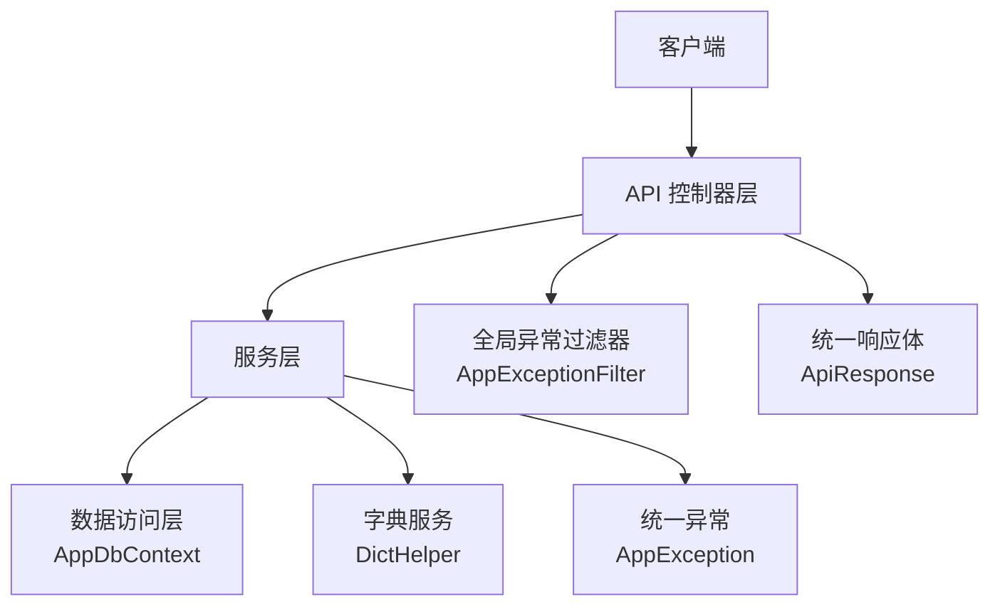
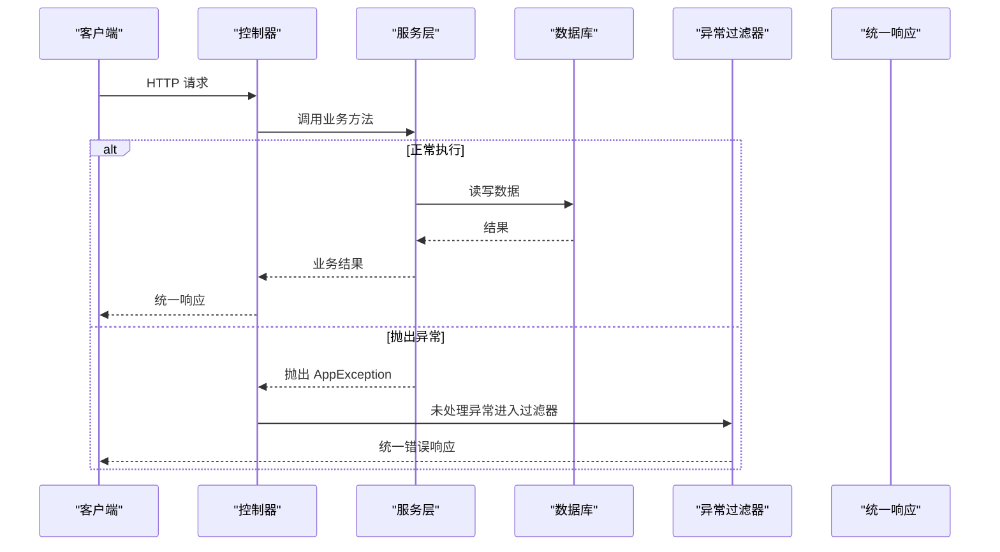
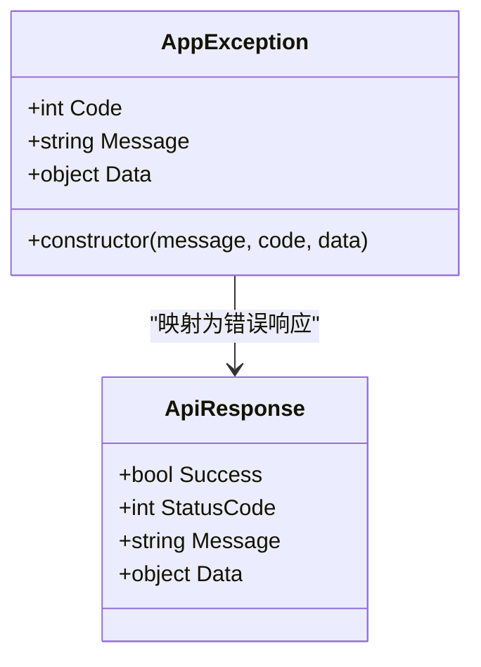
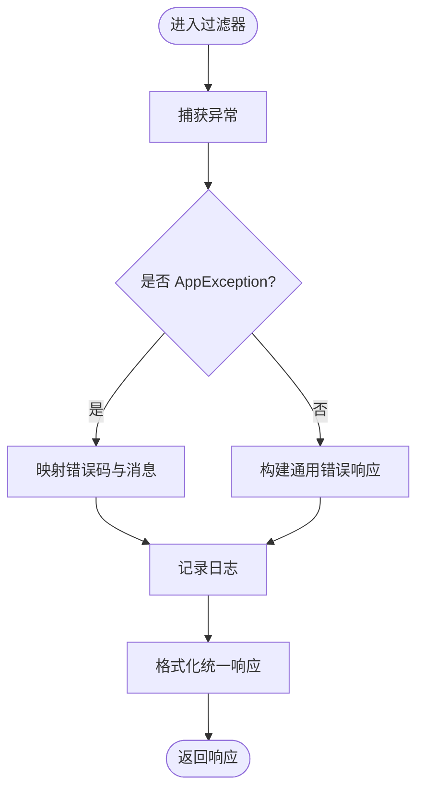
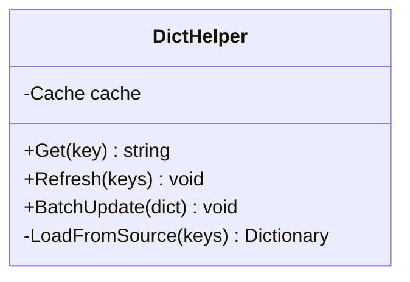
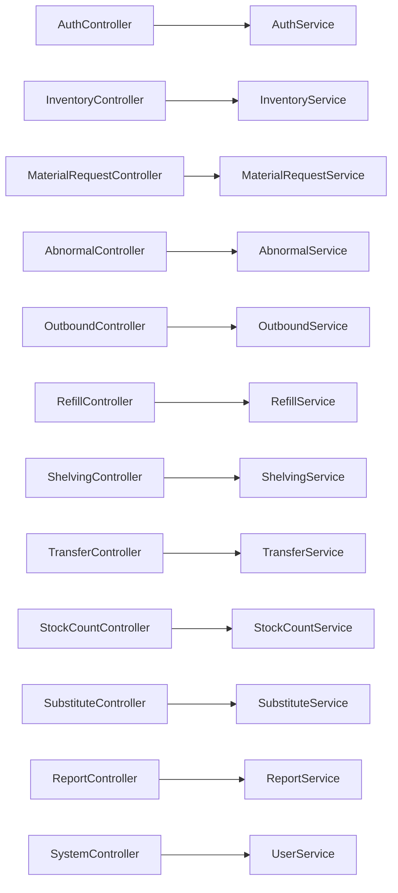
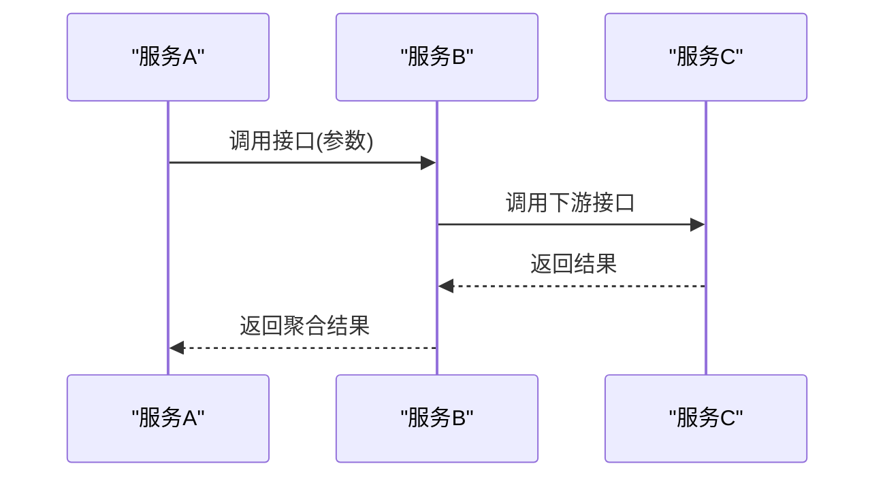
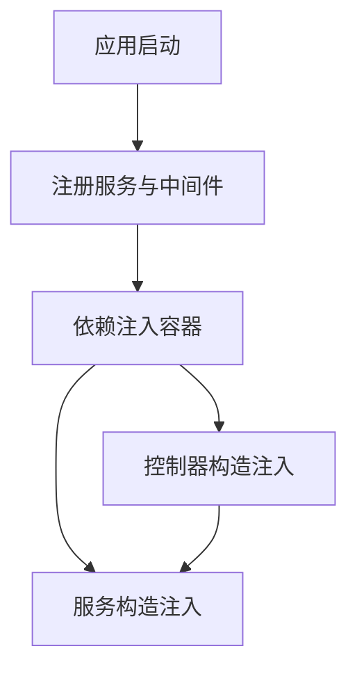
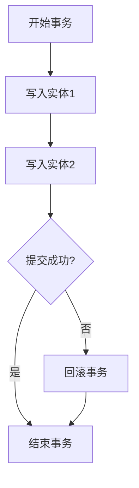
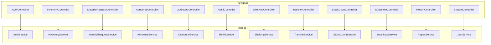

# 服务层架构模式

<cite>
**本文引用的文件**   
- [Program.cs](file://dip-system/api/Program.cs)
- [AppExceptionFilter.cs](file://dip-system/api/Controllers/AppExceptionFilter.cs)
- [AppException.cs](file://dip-system/api/Services/AppException.cs)
- [DictHelper.cs](file://dip-system/api/Services/DictHelper.cs)
- [AuthController.cs](file://dip-system/api/Controllers/AuthController.cs)
- [AuthService.cs](file://dip-system/api/Services/AuthService.cs)
- [JwtTokenService.cs](file://dip-system/api/Services/JwtTokenService.cs)
- [InventoryController.cs](file://dip-system/api/Controllers/InventoryController.cs)
- [InventoryService.cs](file://dip-system/api/Services/InventoryService.cs)
- [MaterialRequestController.cs](file://dip-system/api/Controllers/MaterialRequestController.cs)
- [MaterialRequestService.cs](file://dip-system/api/Services/MaterialRequestService.cs)
- [AbnormalController.cs](file://dip-system/api/Controllers/AbnormalController.cs)
- [AbnormalService.cs](file://dip-system/api/Services/AbnormalService.cs)
- [OutboundController.cs](file://dip-system/api/Controllers/OutboundController.cs)
- [OutboundService.cs](file://dip-system/api/Services/OutboundService.cs)
- [RefillController.cs](file://dip-system/api/Controllers/RefillController.cs)
- [RefillService.cs](file://dip-system/api/Services/RefillService.cs)
- [ShelvingController.cs](file://dip-system/api/Controllers/ShelvingController.cs)
- [ShelvingService.cs](file://dip-system/api/Services/ShelvingService.cs)
- [TransferController.cs](file://dip-system/api/Controllers/TransferController.cs)
- [TransferService.cs](file://dip-system/api/Services/TransferService.cs)
- [StockCountController.cs](file://dip-system/api/Controllers/StockCountController.cs)
- [StockCountService.cs](file://dip-system/api/Services/StockCountService.cs)
- [SubstituteController.cs](file://dip-system/api/Controllers/SubstituteController.cs)
- [SubstituteService.cs](file://dip-system/api/Services/SubstituteService.cs)
- [ReportController.cs](file://dip-system/api/Controllers/ReportController.cs)
- [ReportService.cs](file://dip-system/api/Services/ReportService.cs)
- [SystemController.cs](file://dip-system/api/Controllers/SystemController.cs)
- [UserService.cs](file://dip-system/api/Services/UserService.cs)
- [ApiResponse.cs](file://dip-system/api/Models/ApiResponse.cs)
- [BaseEntity.cs](file://dip-system/api/Models/BaseEntity.cs)
- [AppDbContext.cs](file://dip-system/api/Data/AppDbContext.cs)
</cite>

## 目录
1. [简介](#简介)
2. [项目结构](#项目结构)
3. [核心组件](#核心组件)
4. [架构总览](#架构总览)
5. [详细组件分析](#详细组件分析)
6. [依赖关系分析](#依赖关系分析)
7. [性能考量](#性能考量)
8. [故障排查指南](#故障排查指南)
9. [结论](#结论)
10. [附录](#附录)

## 简介
本文件面向DIP物料管理系统的服务层，系统化阐述分层设计原则、职责分离策略与接口抽象规范；统一异常处理机制（AppException）的定义、错误码管理与传播策略；字典服务（DictHelper）的字典管理、缓存策略与动态加载；全局异常过滤器（AppExceptionFilter）的捕获、日志与响应格式化。同时覆盖服务间通信模式、依赖注入配置、事务管理策略，并提供扩展点与自定义开发指南，帮助开发者快速理解并高效扩展系统。

## 项目结构
- API 层：控制器负责HTTP请求解析、参数校验、调用服务层，返回统一响应体。
- 服务层：业务编排、领域规则、跨服务协作、事务边界控制。
- 数据访问：通过EF Core上下文进行持久化操作。
- 横切关注点：全局异常过滤、认证授权、JWT令牌、字典缓存等。

**图表来源** 
- [Program.cs](file://dip-system/api/Program.cs)
- [AppExceptionFilter.cs](file://dip-system/api/Controllers/AppExceptionFilter.cs)
- [AppException.cs](file://dip-system/api/Services/AppException.cs)
- [DictHelper.cs](file://dip-system/api/Services/DictHelper.cs)
- [ApiResponse.cs](file://dip-system/api/Models/ApiResponse.cs)
- [AppDbContext.cs](file://dip-system/api/Data/AppDbContext.cs)

**章节来源**
- [Program.cs](file://dip-system/api/Program.cs)
- [AppExceptionFilter.cs](file://dip-system/api/Controllers/AppExceptionFilter.cs)
- [AppException.cs](file://dip-system/api/Services/AppException.cs)
- [DictHelper.cs](file://dip-system/api/Services/DictHelper.cs)
- [ApiResponse.cs](file://dip-system/api/Models/ApiResponse.cs)
- [AppDbContext.cs](file://dip-system/api/Data/AppDbContext.cs)

## 核心组件
- 统一异常（AppException）：定义错误码、消息、状态码及扩展字段，作为服务层抛出的标准异常类型。
- 全局异常过滤器（AppExceptionFilter）：在管道中捕获未处理异常，记录日志，转换为统一响应格式。
- 字典服务（DictHelper）：集中管理字典项，提供内存缓存与按需刷新能力，支持动态加载。
- 服务层基类/约定：每个业务域一个Service，遵循单一职责，对外暴露方法级契约。
- 统一响应（ApiResponse）：标准化成功/失败响应结构，便于前端一致处理。

**章节来源**
- [AppException.cs](file://dip-system/api/Services/AppException.cs)
- [AppExceptionFilter.cs](file://dip-system/api/Controllers/AppExceptionFilter.cs)
- [DictHelper.cs](file://dip-system/api/Services/DictHelper.cs)
- [ApiResponse.cs](file://dip-system/api/Models/ApiResponse.cs)

## 架构总览
服务层采用“控制器→服务→数据访问”的分层模式，配合全局异常过滤器与统一响应体，形成稳定的请求处理流水线。服务之间通过依赖注入解耦，关键流程使用事务保证一致性。

**图表来源** 
- [AppExceptionFilter.cs](file://dip-system/api/Controllers/AppExceptionFilter.cs)
- [AppException.cs](file://dip-system/api/Services/AppException.cs)
- [ApiResponse.cs](file://dip-system/api/Models/ApiResponse.cs)

## 详细组件分析

### 统一异常（AppException）
- 设计目标：为所有业务异常提供统一的类型、错误码、消息与可选详情，确保上层一致处理。
- 错误码管理：建议按模块划分错误码前缀，保持唯一性与可读性。
- 异常传播：服务层抛出，控制器不吞异常，交由全局过滤器统一转换。
- 扩展点：可携带额外上下文（如请求ID、用户ID、堆栈摘要），便于追踪。

**图表来源** 
- [AppException.cs](file://dip-system/api/Services/AppException.cs)
- [ApiResponse.cs](file://dip-system/api/Models/ApiResponse.cs)

**章节来源**
- [AppException.cs](file://dip-system/api/Services/AppException.cs)
- [ApiResponse.cs](file://dip-system/api/Models/ApiResponse.cs)

### 全局异常过滤器（AppExceptionFilter）
- 捕获范围：管道内未处理的异常，包括服务层抛出的AppException与其他异常。
- 日志记录：记录异常类型、消息、堆栈、请求路径与用户信息（脱敏）。
- 响应格式化：将异常转为统一响应体，设置合适的HTTP状态码。
- 安全策略：避免泄露敏感信息，仅输出必要调试信息。

**图表来源** 
- [AppExceptionFilter.cs](file://dip-system/api/Controllers/AppExceptionFilter.cs)
- [AppException.cs](file://dip-system/api/Services/AppException.cs)
- [ApiResponse.cs](file://dip-system/api/Models/ApiResponse.cs)

**章节来源**
- [AppExceptionFilter.cs](file://dip-system/api/Controllers/AppExceptionFilter.cs)
- [AppException.cs](file://dip-system/api/Services/AppException.cs)
- [ApiResponse.cs](file://dip-system/api/Models/ApiResponse.cs)

### 字典服务（DictHelper）
- 功能：集中管理字典项，提供查询、刷新、批量更新能力。
- 缓存策略：内存缓存为主，支持过期时间与懒加载；热点字典可设置更长TTL。
- 动态加载：提供刷新接口，支持后台任务或外部事件触发重新加载。
- 线程安全：读多写少场景下使用并发安全的缓存容器。

**图表来源** 
- [DictHelper.cs](file://dip-system/api/Services/DictHelper.cs)

**章节来源**
- [DictHelper.cs](file://dip-system/api/Services/DictHelper.cs)

### 服务层分层设计与职责分离
- 控制器：只负责HTTP协议相关（路由、模型绑定、校验、分页、排序），不承载业务逻辑。
- 服务：实现领域规则、业务流程编排、跨服务协作、事务边界。
- 数据访问：通过EF Core上下文封装CRUD与复杂查询，服务层不直接耦合SQL。
- 依赖注入：服务以接口形式注册，控制器通过构造函数注入，降低耦合度。

**图表来源** 
- [AuthController.cs](file://dip-system/api/Controllers/AuthController.cs)
- [AuthService.cs](file://dip-system/api/Services/AuthService.cs)
- [InventoryController.cs](file://dip-system/api/Controllers/InventoryController.cs)
- [InventoryService.cs](file://dip-system/api/Services/InventoryService.cs)
- [MaterialRequestController.cs](file://dip-system/api/Controllers/MaterialRequestController.cs)
- [MaterialRequestService.cs](file://dip-system/api/Services/MaterialRequestService.cs)
- [AbnormalController.cs](file://dip-system/api/Controllers/AbnormalController.cs)
- [AbnormalService.cs](file://dip-system/api/Services/AbnormalService.cs)
- [OutboundController.cs](file://dip-system/api/Controllers/OutboundController.cs)
- [OutboundService.cs](file://dip-system/api/Services/OutboundService.cs)
- [RefillController.cs](file://dip-system/api/Controllers/RefillController.cs)
- [RefillService.cs](file://dip-system/api/Services/RefillService.cs)
- [ShelvingController.cs](file://dip-system/api/Controllers/ShelvingController.cs)
- [ShelvingService.cs](file://dip-system/api/Services/ShelvingService.cs)
- [TransferController.cs](file://dip-system/api/Controllers/TransferController.cs)
- [TransferService.cs](file://dip-system/api/Services/TransferService.cs)
- [StockCountController.cs](file://dip-system/api/Controllers/StockCountController.cs)
- [StockCountService.cs](file://dip-system/api/Services/StockCountService.cs)
- [SubstituteController.cs](file://dip-system/api/Controllers/SubstituteController.cs)
- [SubstituteService.cs](file://dip-system/api/Services/SubstituteService.cs)
- [ReportController.cs](file://dip-system/api/Controllers/ReportController.cs)
- [ReportService.cs](file://dip-system/api/Services/ReportService.cs)
- [SystemController.cs](file://dip-system/api/Controllers/SystemController.cs)
- [UserService.cs](file://dip-system/api/Services/UserService.cs)

**章节来源**
- [AuthController.cs](file://dip-system/api/Controllers/AuthController.cs)
- [AuthService.cs](file://dip-system/api/Services/AuthService.cs)
- [InventoryController.cs](file://dip-system/api/Controllers/InventoryController.cs)
- [InventoryService.cs](file://dip-system/api/Services/InventoryService.cs)
- [MaterialRequestController.cs](file://dip-system/api/Controllers/MaterialRequestController.cs)
- [MaterialRequestService.cs](file://dip-system/api/Services/MaterialRequestService.cs)
- [AbnormalController.cs](file://dip-system/api/Controllers/AbnormalController.cs)
- [AbnormalService.cs](file://dip-system/api/Services/AbnormalService.cs)
- [OutboundController.cs](file://dip-system/api/Controllers/OutboundController.cs)
- [OutboundService.cs](file://dip-system/api/Services/OutboundService.cs)
- [RefillController.cs](file://dip-system/api/Controllers/RefillController.cs)
- [RefillService.cs](file://dip-system/api/Services/RefillService.cs)
- [ShelvingController.cs](file://dip-system/api/Controllers/ShelvingController.cs)
- [ShelvingService.cs](file://dip-system/api/Services/ShelvingService.cs)
- [TransferController.cs](file://dip-system/api/Controllers/TransferController.cs)
- [TransferService.cs](file://dip-system/api/Services/TransferService.cs)
- [StockCountController.cs](file://dip-system/api/Controllers/StockCountController.cs)
- [StockCountService.cs](file://dip-system/api/Services/StockCountService.cs)
- [SubstituteController.cs](file://dip-system/api/Controllers/SubstituteController.cs)
- [SubstituteService.cs](file://dip-system/api/Services/SubstituteService.cs)
- [ReportController.cs](file://dip-system/api/Controllers/ReportController.cs)
- [ReportService.cs](file://dip-system/api/Services/ReportService.cs)
- [SystemController.cs](file://dip-system/api/Controllers/SystemController.cs)
- [UserService.cs](file://dip-system/api/Services/UserService.cs)

### 服务间通信模式
- 同步调用：控制器调用服务方法，服务内部再调用其他服务，保持调用链清晰。
- 依赖注入：服务之间通过接口注入，避免硬编码依赖，便于替换与测试。
- 事件驱动（可选）：对异步解耦需求，可在服务层引入事件总线发布/订阅。
- 幂等与重试：对外部依赖（如仓储、第三方服务）需考虑重试与幂等策略。

[无图表来源，因为该图为概念性通信模式示意]

**章节来源**
- [AuthService.cs](file://dip-system/api/Services/AuthService.cs)
- [JwtTokenService.cs](file://dip-system/api/Services/JwtTokenService.cs)

### 依赖注入配置
- 服务注册：在启动时将所有服务以接口形式注册到DI容器。
- 生命周期：短生命周期（瞬时）、请求生命周期（作用域）、单例按需选择。
- 配置读取：从配置文件注入连接字符串、JWT密钥、缓存策略等。
- 中间件顺序：异常过滤器、认证、授权、端点映射的顺序需正确配置。

**图表来源** 
- [Program.cs](file://dip-system/api/Program.cs)

**章节来源**
- [Program.cs](file://dip-system/api/Program.cs)

### 事务管理策略
- 边界：服务方法作为事务边界，包含多个数据写入操作时使用事务。
- 传播：默认新建事务，必要时支持只读事务或参与已有事务。
- 回滚：出现异常时自动回滚，确保数据一致性。
- 最佳实践：避免长事务，拆分大事务为小步骤，减少锁竞争。

[无图表来源，因为该图为概念性事务流程示意]

**章节来源**
- [AppDbContext.cs](file://dip-system/api/Data/AppDbContext.cs)

### 扩展点与自定义开发指南
- 新增服务：定义接口与实现，注册到DI，控制器通过构造函数注入。
- 自定义异常：继承统一异常类型，设置错误码与消息，在服务层抛出。
- 字典扩展：在DictHelper中增加键值对与刷新逻辑，确保缓存一致性。
- 过滤器扩展：如需自定义行为，可添加新的中间件或过滤器，注意顺序。
- 单元测试：基于接口与服务隔离，模拟依赖，验证业务规则。

**章节来源**
- [AppException.cs](file://dip-system/api/Services/AppException.cs)
- [DictHelper.cs](file://dip-system/api/Services/DictHelper.cs)
- [Program.cs](file://dip-system/api/Program.cs)

## 依赖关系分析
- 控制器与服务：一对一映射，职责清晰，便于维护与测试。
- 服务与数据访问：通过EF Core上下文，避免SQL泄漏到服务层。
- 横切关注点：异常过滤器、认证、JWT、字典缓存等独立模块，松耦合。

**图表来源** 
- [AuthController.cs](file://dip-system/api/Controllers/AuthController.cs)
- [AuthService.cs](file://dip-system/api/Services/AuthService.cs)
- [InventoryController.cs](file://dip-system/api/Controllers/InventoryController.cs)
- [InventoryService.cs](file://dip-system/api/Services/InventoryService.cs)
- [MaterialRequestController.cs](file://dip-system/api/Controllers/MaterialRequestController.cs)
- [MaterialRequestService.cs](file://dip-system/api/Services/MaterialRequestService.cs)
- [AbnormalController.cs](file://dip-system/api/Controllers/AbnormalController.cs)
- [AbnormalService.cs](file://dip-system/api/Services/AbnormalService.cs)
- [OutboundController.cs](file://dip-system/api/Controllers/OutboundController.cs)
- [OutboundService.cs](file://dip-system/api/Services/OutboundService.cs)
- [RefillController.cs](file://dip-system/api/Controllers/RefillController.cs)
- [RefillService.cs](file://dip-system/api/Services/RefillService.cs)
- [ShelvingController.cs](file://dip-system/api/Controllers/ShelvingController.cs)
- [ShelvingService.cs](file://dip-system/api/Services/ShelvingService.cs)
- [TransferController.cs](file://dip-system/api/Controllers/TransferController.cs)
- [TransferService.cs](file://dip-system/api/Services/TransferService.cs)
- [StockCountController.cs](file://dip-system/api/Controllers/StockCountController.cs)
- [StockCountService.cs](file://dip-system/api/Services/StockCountService.cs)
- [SubstituteController.cs](file://dip-system/api/Controllers/SubstituteController.cs)
- [SubstituteService.cs](file://dip-system/api/Services/SubstituteService.cs)
- [ReportController.cs](file://dip-system/api/Controllers/ReportController.cs)
- [ReportService.cs](file://dip-system/api/Services/ReportService.cs)
- [SystemController.cs](file://dip-system/api/Controllers/SystemController.cs)
- [UserService.cs](file://dip-system/api/Services/UserService.cs)

**章节来源**
- [AuthController.cs](file://dip-system/api/Controllers/AuthController.cs)
- [AuthService.cs](file://dip-system/api/Services/AuthService.cs)
- [InventoryController.cs](file://dip-system/api/Controllers/InventoryController.cs)
- [InventoryService.cs](file://dip-system/api/Services/InventoryService.cs)
- [MaterialRequestController.cs](file://dip-system/api/Controllers/MaterialRequestController.cs)
- [MaterialRequestService.cs](file://dip-system/api/Services/MaterialRequestService.cs)
- [AbnormalController.cs](file://dip-system/api/Controllers/AbnormalController.cs)
- [AbnormalService.cs](file://dip-system/api/Services/AbnormalService.cs)
- [OutboundController.cs](file://dip-system/api/Controllers/OutboundController.cs)
- [OutboundService.cs](file://dip-system/api/Services/OutboundService.cs)
- [RefillController.cs](file://dip-system/api/Controllers/RefillController.cs)
- [RefillService.cs](file://dip-system/api/Services/RefillService.cs)
- [ShelvingController.cs](file://dip-system/api/Controllers/ShelvingController.cs)
- [ShelvingService.cs](file://dip-system/api/Services/ShelvingService.cs)
- [TransferController.cs](file://dip-system/api/Controllers/TransferController.cs)
- [TransferService.cs](file://dip-system/api/Services/TransferService.cs)
- [StockCountController.cs](file://dip-system/api/Controllers/StockCountController.cs)
- [StockCountService.cs](file://dip-system/api/Services/StockCountService.cs)
- [SubstituteController.cs](file://dip-system/api/Controllers/SubstituteController.cs)
- [SubstituteService.cs](file://dip-system/api/Services/SubstituteService.cs)
- [ReportController.cs](file://dip-system/api/Controllers/ReportController.cs)
- [ReportService.cs](file://dip-system/api/Services/ReportService.cs)
- [SystemController.cs](file://dip-system/api/Controllers/SystemController.cs)
- [UserService.cs](file://dip-system/api/Services/UserService.cs)

## 性能考量
- 缓存优先：字典、基础数据使用内存缓存，减少数据库压力。
- 分页与投影：大数据集查询使用分页与投影，避免全量传输。
- 连接池：合理配置数据库连接池大小，避免连接耗尽。
- 异步IO：I/O密集型操作使用异步，提高吞吐。
- 监控与指标：接入性能监控，识别热点与瓶颈。

[本节为通用指导，无需特定文件来源]

## 故障排查指南
- 统一异常：检查AppException的错误码与消息，定位问题模块。
- 日志记录：查看AppExceptionFilter记录的异常堆栈与请求信息。
- 字典缓存：确认DictHelper的刷新逻辑与缓存失效策略。
- 依赖注入：检查服务注册与生命周期是否正确。
- 事务回滚：核对服务方法的事务边界与异常传播。

**章节来源**
- [AppException.cs](file://dip-system/api/Services/AppException.cs)
- [AppExceptionFilter.cs](file://dip-system/api/Controllers/AppExceptionFilter.cs)
- [DictHelper.cs](file://dip-system/api/Services/DictHelper.cs)
- [Program.cs](file://dip-system/api/Program.cs)

## 结论
本架构通过清晰的分层、统一异常、字典缓存与全局过滤器，构建了稳定可扩展的服务层体系。依赖注入与事务管理保障了模块化与一致性。遵循本文档的设计原则与开发指南，可快速扩展新功能并保持系统质量。

[本节为总结，无需特定文件来源]

## 附录
- 术语表：服务层、统一异常、字典缓存、全局过滤器、依赖注入、事务边界等。
- 参考文件：见“本文引用的文件”列表。

[本节为附录，无需特定文件来源]