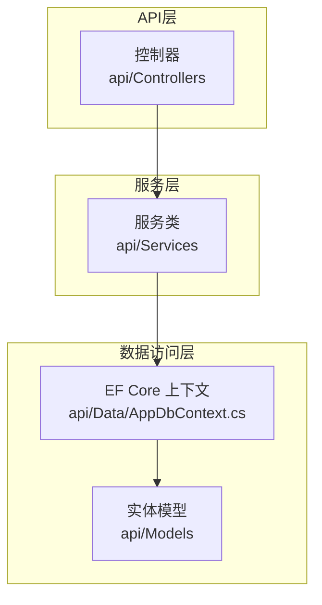
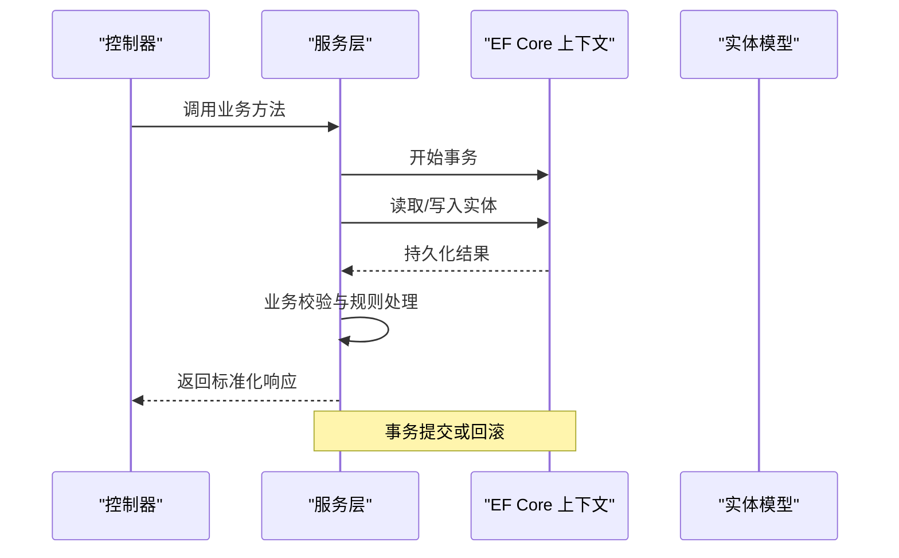
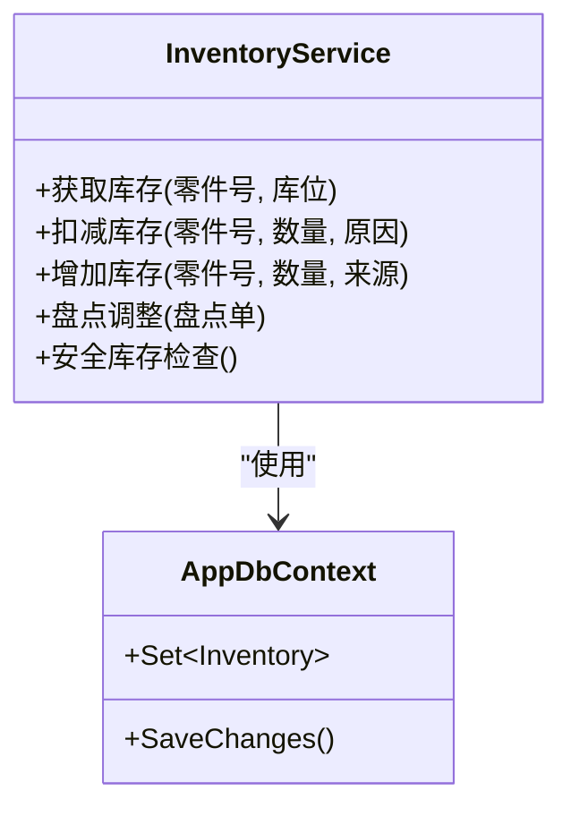
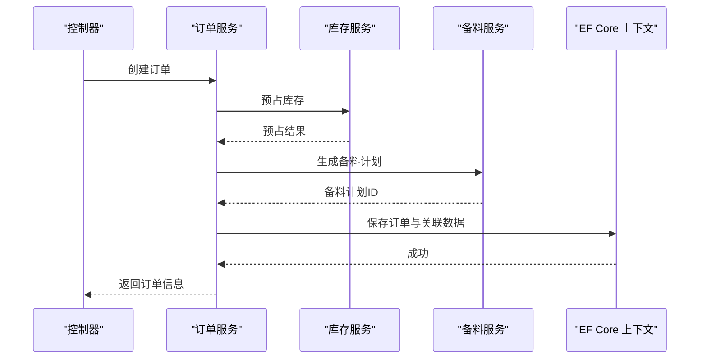
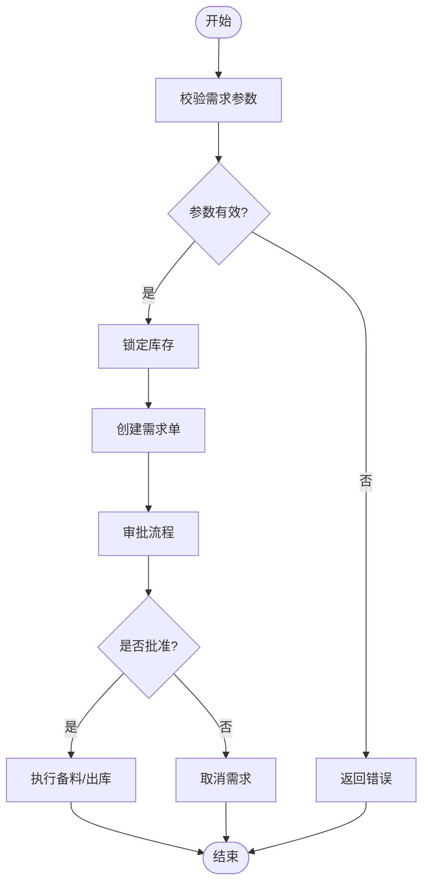
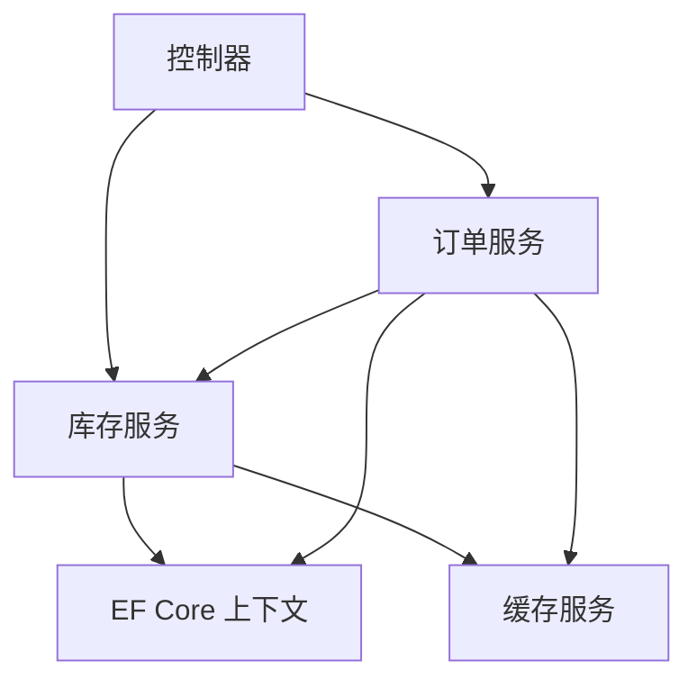

# 服务层设计

<cite>
**本文引用的文件**   
- [Program.cs](file://dip-system/api/Program.cs)
- [AppDbContext.cs](file://dip-system/api/Data/AppDbContext.cs)
- [InventoryService.cs](file://dip-system/api/Services/InventoryService.cs)
- [OrderService.cs](file://dip-system/api/Services/OrderService.cs)
- [MaterialRequestService.cs](file://dip-system/api/Services/MaterialRequestService.cs)
- [OutboundService.cs](file://dip-system/api/Services/OutboundService.cs)
- [RefillService.cs](file://dip-system/api/Services/RefillService.cs)
- [ShelvingService.cs](file://dip-system/api/Services/ShelvingService.cs)
- [TransferService.cs](file://dip-system/api/Services/TransferService.cs)
- [AbnormalService.cs](file://dip-system/api/Services/AbnormalService.cs)
- [AuthService.cs](file://dip-system/api/Services/AuthService.cs)
- [JwtTokenService.cs](file://dip-system/api/Services/JwtTokenService.cs)
- [DashboardService.cs](file://dip-system/api/Services/DashboardService.cs)
- [ReportService.cs](file://dip-system/api/Services/ReportService.cs)
- [UserService.cs](file://dip-system/api/Services/UserService.cs)
- [LocationService.cs](file://dip-system/api/Services/LocationService.cs)
- [PartService.cs](file://dip-system/api/Services/PartService.cs)
- [ChangeoverService.cs](file://dip-system/api/Services/ChangeoverService.cs)
- [PrepService.cs](file://dip-system/api/Services/PrepService.cs)
- [ReturnService.cs](file://dip-system/api/Services/ReturnService.cs)
- [StockCountService.cs](file://dip-system/api/Services/StockCountService.cs)
- [SubstituteService.cs](file://dip-system/api/Services/SubstituteService.cs)
- [OnlineService.cs](file://dip-system/api/Services/OnlineService.cs)
- [AppException.cs](file://dip-system/api/Services/AppException.cs)
- [ApiResponse.cs](file://dip-system/api/Models/ApiResponse.cs)
- [BaseEntity.cs](file://dip-system/api/Models/BaseEntity.cs)
- [Inventory.cs](file://dip-system/api/Models/Inventory.cs)
- [Order.cs](file://dip-system/api/Models/Order.cs)
- [MaterialRequest.cs](file://dip-system/api/Models/MaterialRequest.cs)
- [Outbound.cs](file://dip-system/api/Models/Outbound.cs)
- [Refill.cs](file://dip-system/api/Models/Refill.cs)
- [Shelving.cs](file://dip-system/api/Models/Shelving.cs)
- [Transfer.cs](file://dip-system/api/Models/Transfer.cs)
- [Abnormal.cs](file://dip-system/api/Models/Abnormal.cs)
- [Auth.cs](file://dip-system/api/Models/Auth.cs)
- [Master.cs](file://dip-system/api/Models/Master.cs)
- [Online.cs](file://dip-system/api/Models/Online.cs)
- [Prep.cs](file://dip-system/api/Models/Prep.cs)
- [Return.cs](file://dip-system/api/Models/Return.cs)
- [StockCount.cs](file://dip-system/api/Models/StockCount.cs)
- [SubstituteOrder.cs](file://dip-system/api/Models/SubstituteOrder.cs)
- [SubstituteRecord.cs](file://dip-system/api/Models/SubstituteRecord.cs)
</cite>

## 目录
1. [简介](#简介)
2. [项目结构](#项目结构)
3. [核心组件](#核心组件)
4. [架构总览](#架构总览)
5. [详细组件分析](#详细组件分析)
6. [依赖关系分析](#依赖关系分析)
7. [性能考虑](#性能考虑)
8. [故障排查指南](#故障排查指南)
9. [结论](#结论)
10. [附录](#附录)

## 简介
本文件面向DIP物料管理系统的服务层设计，聚焦业务逻辑封装、事务管理、异常处理与缓存策略，明确各服务类的职责边界与方法设计原则，解释服务间依赖注入与接口抽象，说明数据访问层的集成模式与ORM使用方式，并提供测试策略与性能优化建议。同时给出若干典型业务场景的实现示例，帮助读者快速理解并落地服务层最佳实践。

## 项目结构
- 后端采用ASP.NET Core Web API，服务层位于 api/Services 目录，按领域划分服务类（如库存、订单、出库、补料、上架、调拨等）。
- 数据访问通过EF Core的DbContext进行统一配置与管理，实体模型位于 api/Models。
- 控制器位于 api/Controllers，仅负责请求解析、参数校验与服务调用，不承载业务逻辑。
- 应用启动与依赖注入在 Program.cs 中完成，包括数据库上下文注册、服务注册、中间件配置等。

图表来源
- [Program.cs](file://dip-system/api/Program.cs)
- [AppDbContext.cs](file://dip-system/api/Data/AppDbContext.cs)

章节来源
- [Program.cs](file://dip-system/api/Program.cs)
- [AppDbContext.cs](file://dip-system/api/Data/AppDbContext.cs)

## 核心组件
- 服务类：每个业务域一个服务类，封装该领域的完整业务流程，对外暴露方法级契约，内部协调仓储/上下文、缓存、审计等。
- 数据访问：通过EF Core的DbContext进行CRUD、查询与事务控制；实体模型定义表结构与关联关系。
- 异常处理：统一的自定义异常类型与响应包装，便于全局异常过滤器捕获并返回标准化错误。
- 依赖注入：通过ASP.NET Core DI容器在服务间解耦，支持构造函数注入与可选依赖。
- 缓存策略：对读多写少、计算开销大的数据采用内存缓存或分布式缓存（根据部署环境选择），注意失效与一致性策略。

章节来源
- [InventoryService.cs](file://dip-system/api/Services/InventoryService.cs)
- [OrderService.cs](file://dip-system/api/Services/OrderService.cs)
- [MaterialRequestService.cs](file://dip-system/api/Services/MaterialRequestService.cs)
- [OutboundService.cs](file://dip-system/api/Services/OutboundService.cs)
- [RefillService.cs](file://dip-system/api/Services/RefillService.cs)
- [ShelvingService.cs](file://dip-system/api/Services/ShelvingService.cs)
- [TransferService.cs](file://dip-system/api/Services/TransferService.cs)
- [AbnormalService.cs](file://dip-system/api/Services/AbnormalService.cs)
- [AuthService.cs](file://dip-system/api/Services/AuthService.cs)
- [JwtTokenService.cs](file://dip-system/api/Services/JwtTokenService.cs)
- [DashboardService.cs](file://dip-system/api/Services/DashboardService.cs)
- [ReportService.cs](file://dip-system/api/Services/ReportService.cs)
- [UserService.cs](file://dip-system/api/Services/UserService.cs)
- [LocationService.cs](file://dip-system/api/Services/LocationService.cs)
- [PartService.cs](file://dip-system/api/Services/PartService.cs)
- [ChangeoverService.cs](file://dip-system/api/Services/ChangeoverService.cs)
- [PrepService.cs](file://dip-system/api/Services/PrepService.cs)
- [ReturnService.cs](file://dip-system/api/Services/ReturnService.cs)
- [StockCountService.cs](file://dip-system/api/Services/StockCountService.cs)
- [SubstituteService.cs](file://dip-system/api/Services/SubstituteService.cs)
- [OnlineService.cs](file://dip-system/api/Services/OnlineService.cs)
- [AppException.cs](file://dip-system/api/Services/AppException.cs)
- [ApiResponse.cs](file://dip-system/api/Models/ApiResponse.cs)
- [BaseEntity.cs](file://dip-system/api/Models/BaseEntity.cs)

## 架构总览
服务层采用分层架构与依赖注入模式，控制器仅做编排，服务层聚合业务规则与流程编排，数据访问层由EF Core统一管理。关键要点：
- 单一职责：每个服务类对应一个业务域，避免跨域耦合。
- 事务边界：服务方法内以显式事务包裹多个持久化操作，保证一致性。
- 异常隔离：业务异常上抛至控制器层，由全局异常过滤器统一处理。
- 缓存分层：热点查询结果缓存，写操作后及时失效或更新。
- ORM集成：通过DbContext进行实体映射、变更跟踪与批量操作。

图表来源
- [Program.cs](file://dip-system/api/Program.cs)
- [AppDbContext.cs](file://dip-system/api/Data/AppDbContext.cs)

章节来源
- [Program.cs](file://dip-system/api/Program.cs)
- [AppDbContext.cs](file://dip-system/api/Data/AppDbContext.cs)

## 详细组件分析

### 库存服务（InventoryService）
- 职责边界：库存数量维护、批次与库位管理、库存盘点与调整、安全库存预警。
- 方法设计原则：输入参数最小化、返回值标准化、异常明确、可重试与幂等性保障。
- 事务管理：库存扣减与出入库记录在同一事务中完成，防止不一致。
- 缓存策略：当前可用库存、库位占用率等热点数据缓存，写操作后失效。
- 依赖注入：注入DbContext、缓存、审计日志等服务。

图表来源
- [InventoryService.cs](file://dip-system/api/Services/InventoryService.cs)
- [AppDbContext.cs](file://dip-system/api/Data/AppDbContext.cs)
- [Inventory.cs](file://dip-system/api/Models/Inventory.cs)

章节来源
- [InventoryService.cs](file://dip-system/api/Services/InventoryService.cs)
- [Inventory.cs](file://dip-system/api/Models/Inventory.cs)

### 订单服务（OrderService）
- 职责边界：订单创建、状态流转、BOM展开、齐套检查、生产准备联动。
- 方法设计原则：状态机驱动、不可变历史事件、补偿操作与回滚机制。
- 事务管理：订单创建与预留库存、备料计划在同一事务中执行。
- 缓存策略：订单状态与汇总统计缓存，变更时失效。
- 依赖注入：注入DbContext、库存服务、备料服务等。

图表来源
- [OrderService.cs](file://dip-system/api/Services/OrderService.cs)
- [InventoryService.cs](file://dip-system/api/Services/InventoryService.cs)
- [PrepService.cs](file://dip-system/api/Services/PrepService.cs)
- [AppDbContext.cs](file://dip-system/api/Data/AppDbContext.cs)

章节来源
- [OrderService.cs](file://dip-system/api/Services/OrderService.cs)
- [Order.cs](file://dip-system/api/Models/Order.cs)

### 物料需求服务（MaterialRequestService）
- 职责边界：物料需求申请、审批流、需求合并与拆分、替代料匹配。
- 方法设计原则：审批状态机、审计追踪、并发控制（乐观锁）。
- 事务管理：需求申请与库存锁定在同一事务中。
- 缓存策略：需求清单与审批状态缓存。
- 依赖注入：注入DbContext、库存服务、替代料服务。

图表来源
- [MaterialRequestService.cs](file://dip-system/api/Services/MaterialRequestService.cs)
- [InventoryService.cs](file://dip-system/api/Services/InventoryService.cs)
- [SubstituteService.cs](file://dip-system/api/Services/SubstituteService.cs)

章节来源
- [MaterialRequestService.cs](file://dip-system/api/Services/MaterialRequestService.cs)
- [MaterialRequest.cs](file://dip-system/api/Models/MaterialRequest.cs)

### 出库服务（OutboundService）
- 职责边界：出库单创建、拣货路径优化、批次与效期管理、出库确认与过账。
- 方法设计原则：批次优先策略、先进先出（FIFO）、异常回滚。
- 事务管理：出库扣减与记录在同一事务中。
- 缓存策略：拣货任务与库存快照缓存。
- 依赖注入：注入DbContext、库存服务、位置服务。

章节来源
- [OutboundService.cs](file://dip-system/api/Services/OutboundService.cs)
- [Outbound.cs](file://dip-system/api/Models/Outbound.cs)

### 补料服务（RefillService）
- 职责边界：补料申请、供应商协同、到货验收、入库上架。
- 方法设计原则：状态机、质量检验、批次追溯。
- 事务管理：补料入库与库存增加在同一事务中。
- 缓存策略：补料计划与到货状态缓存。
- 依赖注入：注入DbContext、库存服务、位置服务。

章节来源
- [RefillService.cs](file://dip-system/api/Services/RefillService.cs)
- [Refill.cs](file://dip-system/api/Models/Refill.cs)

### 上架服务（ShelvingService）
- 职责边界：上架策略、库位分配、重量与体积约束、上架确认。
- 方法设计原则：策略模式、约束校验、冲突检测。
- 事务管理：库位占用与库存位置更新在同一事务中。
- 缓存策略：库位占用率与推荐策略缓存。
- 依赖注入：注入DbContext、库存服务、位置服务。

章节来源
- [ShelvingService.cs](file://dip-system/api/Services/ShelvingService.cs)
- [Shelving.cs](file://dip-system/api/Models/Shelving.cs)

### 调拨服务（TransferService）
- 职责边界：库间调拨、在途库存管理、调拨确认与过账。
- 方法设计原则：在途状态机、双向库存同步、异常补偿。
- 事务管理：调出与调入在同一事务中（跨库位）。
- 缓存策略：在途库存与调拨状态缓存。
- 依赖注入：注入DbContext、库存服务、位置服务。

章节来源
- [TransferService.cs](file://dip-system/api/Services/TransferService.cs)
- [Transfer.cs](file://dip-system/api/Models/Transfer.cs)

### 异常服务（AbnormalService）
- 职责边界：异常上报、分类与优先级、处理流程、闭环验证。
- 方法设计原则：事件驱动、通知机制、统计分析。
- 事务管理：异常记录与处理步骤在同一事务中。
- 缓存策略：异常统计与趋势缓存。
- 依赖注入：注入DbContext、通知服务。

章节来源
- [AbnormalService.cs](file://dip-system/api/Services/AbnormalService.cs)
- [Abnormal.cs](file://dip-system/api/Models/Abnormal.cs)

### 认证与授权（AuthService、JwtTokenService）
- 职责边界：用户登录、令牌签发与刷新、权限校验、会话管理。
- 方法设计原则：无状态令牌、密码哈希、防重放攻击。
- 事务管理：用户信息与角色权限读取无需事务。
- 缓存策略：用户角色与权限缓存。
- 依赖注入：注入DbContext、配置、加密服务。

章节来源
- [AuthService.cs](file://dip-system/api/Services/AuthService.cs)
- [JwtTokenService.cs](file://dip-system/api/Services/JwtTokenService.cs)
- [Auth.cs](file://dip-system/api/Models/Auth.cs)

### 看板与报表（DashboardService、ReportService）
- 职责边界：实时看板数据聚合、KPI计算、报表导出。
- 方法设计原则：异步聚合、分页与过滤、增量更新。
- 事务管理：只读查询，无需事务。
- 缓存策略：看板数据缓存、报表结果缓存。
- 依赖注入：注入DbContext、缓存、外部数据源。

章节来源
- [DashboardService.cs](file://dip-system/api/Services/DashboardService.cs)
- [ReportService.cs](file://dip-system/api/Services/ReportService.cs)

### 用户与位置（UserService、LocationService）
- 职责边界：用户信息管理、角色与权限、库位主数据维护。
- 方法设计原则：主数据一致性、软删除、审计日志。
- 事务管理：用户与角色关联更新在同一事务中。
- 缓存策略：用户权限与库位信息缓存。
- 依赖注入：注入DbContext、缓存。

章节来源
- [UserService.cs](file://dip-system/api/Services/UserService.cs)
- [LocationService.cs](file://dip-system/api/Services/LocationService.cs)

### 其他服务（PartService、ChangeoverService、PrepService、ReturnService、StockCountService、SubstituteService、OnlineService）
- 职责边界：零件主数据、换线管理、备料计划、退货处理、盘点作业、替代料管理、在线状态监控。
- 方法设计原则：领域内聚、状态机、审计追踪。
- 事务管理：相关实体更新在同一事务中。
- 缓存策略：主数据与状态缓存。
- 依赖注入：注入DbContext、相关服务。

章节来源
- [PartService.cs](file://dip-system/api/Services/PartService.cs)
- [ChangeoverService.cs](file://dip-system/api/Services/ChangeoverService.cs)
- [PrepService.cs](file://dip-system/api/Services/PrepService.cs)
- [ReturnService.cs](file://dip-system/api/Services/ReturnService.cs)
- [StockCountService.cs](file://dip-system/api/Services/StockCountService.cs)
- [SubstituteService.cs](file://dip-system/api/Services/SubstituteService.cs)
- [OnlineService.cs](file://dip-system/api/Services/OnlineService.cs)

## 依赖关系分析
服务层通过依赖注入解耦，控制器仅依赖服务接口，服务之间通过接口或具体实现协作，避免循环依赖。EF Core作为数据访问的统一入口，所有服务共享DbContext实例（作用域生命周期）。

图表来源
- [Program.cs](file://dip-system/api/Program.cs)
- [InventoryService.cs](file://dip-system/api/Services/InventoryService.cs)
- [OrderService.cs](file://dip-system/api/Services/OrderService.cs)
- [AppDbContext.cs](file://dip-system/api/Data/AppDbContext.cs)

章节来源
- [Program.cs](file://dip-system/api/Program.cs)
- [InventoryService.cs](file://dip-system/api/Services/InventoryService.cs)
- [OrderService.cs](file://dip-system/api/Services/OrderService.cs)
- [AppDbContext.cs](file://dip-system/api/Data/AppDbContext.cs)

## 性能考虑
- 查询优化：使用投影与选择性字段加载，避免N+1查询；合理使用索引与分页。
- 事务优化：缩小事务范围，减少锁竞争；批量操作使用批量插入/更新。
- 缓存策略：热点数据缓存（库存、主数据、看板指标），设置合理TTL与失效策略。
- 异步处理：耗时操作（报表生成、通知发送）采用异步或后台任务。
- 连接池：合理配置EF Core连接池大小与超时时间。
- 监控与诊断：启用性能计数器、日志采样与分布式追踪。

## 故障排查指南
- 异常类型：使用自定义异常类型区分业务异常与系统异常，便于上层统一处理。
- 日志记录：关键业务节点记录结构化日志，包含上下文与追踪ID。
- 事务回滚：检查事务边界与异常捕获，确保失败时正确回滚。
- 缓存一致性：缓存失效时机与更新顺序，避免脏读。
- 数据库问题：慢查询分析与索引优化，死锁与锁等待排查。

章节来源
- [AppException.cs](file://dip-system/api/Services/AppException.cs)
- [ApiResponse.cs](file://dip-system/api/Models/ApiResponse.cs)

## 结论
服务层设计以领域为中心，通过清晰的职责边界、严格的事务管理、统一的异常处理与合理的缓存策略，实现了高内聚、低耦合的业务逻辑封装。依赖注入与接口抽象确保了可扩展性与可测试性。结合EF Core的数据访问模式，系统在性能、可维护性与可靠性方面达到工业级要求。

## 附录
- 实体基类：所有实体继承自基础实体，提供通用字段（如ID、创建时间、更新时间）。
- 响应包装：统一API响应格式，便于前端处理与错误提示。
- 配置管理：通过配置文件与环境变量管理数据库连接、缓存策略与安全设置。

章节来源
- [BaseEntity.cs](file://dip-system/api/Models/BaseEntity.cs)
- [ApiResponse.cs](file://dip-system/api/Models/ApiResponse.cs)