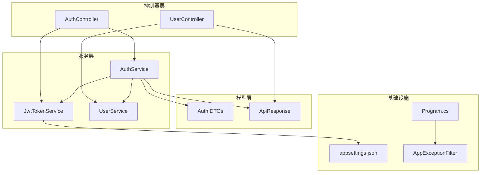
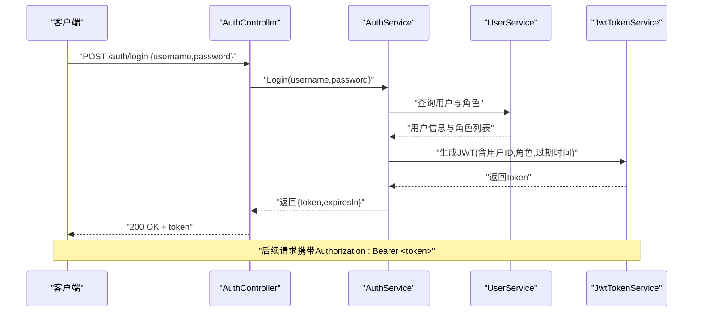
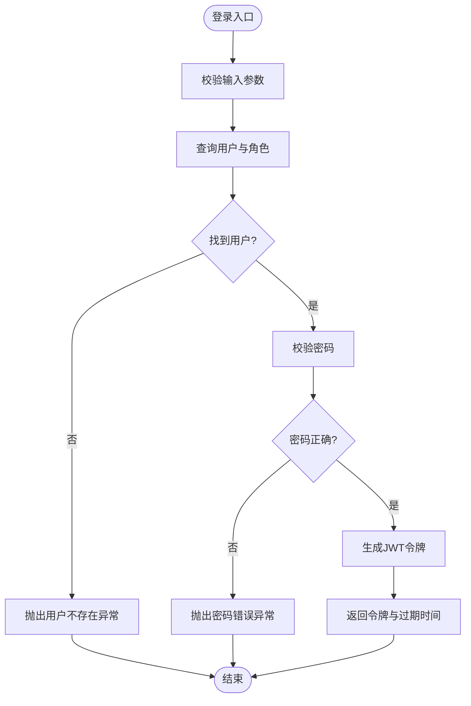
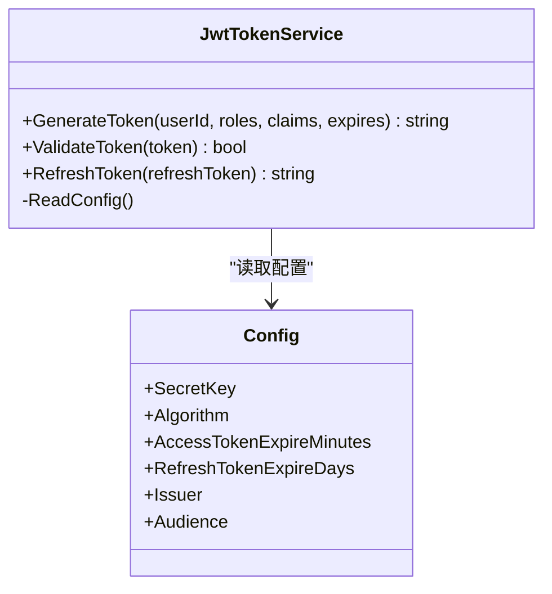
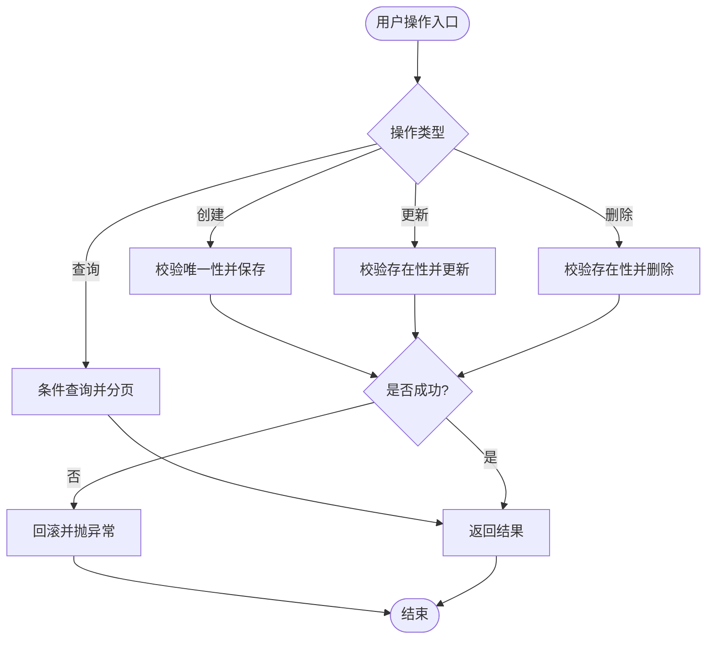
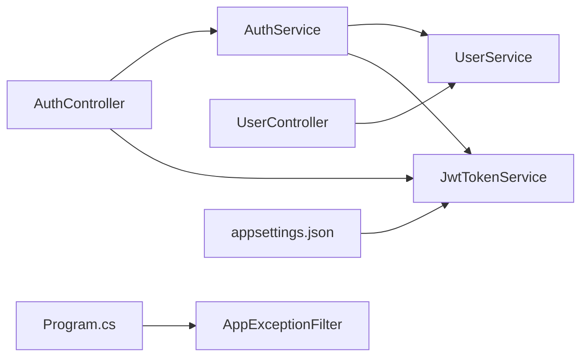

# 核心业务服务

<cite>
**本文引用的文件**   
- [AuthService.cs](file://dip-system/api/Services/AuthService.cs)
- [JwtTokenService.cs](file://dip-system/api/Services/JwtTokenService.cs)
- [UserService.cs](file://dip-system/api/Services/UserService.cs)
- [AuthController.cs](file://dip-system/api/Controllers/AuthController.cs)
- [UserController.cs](file://dip-system/api/Controllers/UserController.cs)
- [AppExceptionFilter.cs](file://dip-system/api/Controllers/AppExceptionFilter.cs)
- [Program.cs](file://dip-system/api/Program.cs)
- [appsettings.json](file://dip-system/api/appsettings.json)
- [Auth.cs](file://dip-system/api/Models/Auth.cs)
- [ApiResponse.cs](file://dip-system/api/Models/ApiResponse.cs)
</cite>

## 目录
1. [简介](#简介)
2. [项目结构](#项目结构)
3. [核心组件](#核心组件)
4. [架构总览](#架构总览)
5. [详细组件分析](#详细组件分析)
6. [依赖关系分析](#依赖关系分析)
7. [性能考虑](#性能考虑)
8. [故障排查指南](#故障排查指南)
9. [结论](#结论)
10. [附录：API调用示例与错误处理模式](#附录api调用示例与错误处理模式)

## 简介
本文件面向DIP物料管理系统的后端核心业务服务，重点围绕身份认证服务(AuthService)、JWT令牌服务(JwtTokenService)和用户管理服务(UserService)，系统阐述用户登录、权限验证、会话管理、令牌生成/验证/刷新策略、用户CRUD与角色权限管理。文档同时覆盖服务间依赖关系、事务边界设计、异常处理策略，并提供API调用示例与错误处理模式，帮助开发者快速理解并正确使用这些核心能力。

## 项目结构
- 控制器层：负责HTTP请求解析、参数校验、调用服务层并返回统一响应。
- 服务层：承载核心业务逻辑，包括认证、用户管理与JWT令牌操作。
- 模型层：定义请求/响应DTO、实体与通用响应封装。
- 配置与启动：应用启动、中间件注册、依赖注入与全局异常处理。

图表来源 
- [AuthController.cs](file://dip-system/api/Controllers/AuthController.cs)
- [AuthService.cs](file://dip-system/api/Services/AuthService.cs)
- [JwtTokenService.cs](file://dip-system/api/Services/JwtTokenService.cs)
- [UserService.cs](file://dip-system/api/Services/UserService.cs)
- [Auth.cs](file://dip-system/api/Models/Auth.cs)
- [ApiResponse.cs](file://dip-system/api/Models/ApiResponse.cs)
- [Program.cs](file://dip-system/api/Program.cs)
- [appsettings.json](file://dip-system/api/appsettings.json)

章节来源
- [Program.cs](file://dip-system/api/Program.cs)
- [appsettings.json](file://dip-system/api/appsettings.json)

## 核心组件
- AuthService：实现用户登录、密码校验、权限检查、会话上下文构建；协调JwtTokenService与UserService完成认证流程。
- JwtTokenService：负责JWT令牌的签发、校验、续期（刷新）策略，读取密钥与过期时间等配置。
- UserService：提供用户CRUD、角色与权限管理、用户信息查询与更新。

章节来源
- [AuthService.cs](file://dip-system/api/Services/AuthService.cs)
- [JwtTokenService.cs](file://dip-system/api/Services/JwtTokenService.cs)
- [UserService.cs](file://dip-system/api/Services/UserService.cs)

## 架构总览
认证与授权的整体流程如下：客户端通过AuthController发起登录请求，AuthController调用AuthService进行用户名/密码校验与权限判断；AuthService委托JwtTokenService生成JWT，并返回给客户端；后续请求携带JWT，服务端通过中间件或过滤器校验令牌有效性，并在需要时结合UserService获取用户与角色信息以做权限决策。

图表来源 
- [AuthController.cs](file://dip-system/api/Controllers/AuthController.cs)
- [AuthService.cs](file://dip-system/api/Services/AuthService.cs)
- [JwtTokenService.cs](file://dip-system/api/Services/JwtTokenService.cs)
- [UserService.cs](file://dip-system/api/Services/UserService.cs)

## 详细组件分析

### 身份认证服务(AuthService)
- 功能要点
  - 用户登录：接收用户名与密码，调用UserService查询用户与角色，校验密码后生成JWT。
  - 权限验证：基于用户角色与资源访问规则进行鉴权，必要时结合控制器层的授权特性。
  - 会话管理：无状态会话，使用JWT作为会话载体；服务端不持久化会话，仅校验签名与过期时间。
- 关键流程
  - 登录：参数校验→用户查询→密码校验→生成令牌→返回结果。
  - 鉴权：从请求上下文提取用户标识与角色→匹配权限策略→放行或拒绝。
- 事务边界
  - 登录为只读查询+令牌生成，不涉及写操作，无需数据库事务。
  - 若涉及多步校验或审计记录，应在服务层显式开启事务，确保一致性。
- 异常处理
  - 用户名不存在或密码错误：抛出认证失败异常，由全局异常过滤器转换为统一错误响应。
  - 权限不足：返回明确的403响应，包含错误码与提示。
- 依赖关系
  - 依赖UserService获取用户与角色数据。
  - 依赖JwtTokenService生成与校验JWT。

图表来源 
- [AuthService.cs](file://dip-system/api/Services/AuthService.cs)
- [UserService.cs](file://dip-system/api/Services/UserService.cs)
- [JwtTokenService.cs](file://dip-system/api/Services/JwtTokenService.cs)

章节来源
- [AuthService.cs](file://dip-system/api/Services/AuthService.cs)
- [UserService.cs](file://dip-system/api/Services/UserService.cs)
- [JwtTokenService.cs](file://dip-system/api/Services/JwtTokenService.cs)

### JWT令牌服务(JwtTokenService)
- 功能要点
  - 令牌生成：根据用户ID、角色、自定义声明与过期时间生成JWT。
  - 令牌验证：校验签名、过期时间、发行者/受众等声明。
  - 刷新策略：支持短生命周期访问令牌与长生命周期刷新令牌；刷新时重新签发新访问令牌。
- 配置项
  - 密钥、算法、过期时间、颁发者、受众等来自配置文件。
- 安全建议
  - 密钥应通过环境变量或安全配置中心注入。
  - 避免在令牌中存放敏感信息；必要时加密或单独存储。
- 异常处理
  - 无效签名或过期：抛出令牌无效异常，由全局异常过滤器转换为401响应。
  - 配置缺失：启动阶段即报错，防止运行时不可用。

图表来源 
- [JwtTokenService.cs](file://dip-system/api/Services/JwtTokenService.cs)
- [appsettings.json](file://dip-system/api/appsettings.json)

章节来源
- [JwtTokenService.cs](file://dip-system/api/Services/JwtTokenService.cs)
- [appsettings.json](file://dip-system/api/appsettings.json)

### 用户管理服务(UserService)
- 功能要点
  - 用户CRUD：创建、查询、更新、删除用户；支持分页与条件筛选。
  - 角色权限：为用户分配角色，维护角色与资源的映射关系。
  - 数据一致性：批量操作需保证事务性，失败回滚。
- 事务边界
  - 单条写入：建议在方法级别开启事务，确保原子性。
  - 批量写入：使用显式事务包裹多条操作，保证一致性与可恢复性。
- 异常处理
  - 重复用户名：抛出唯一性冲突异常。
  - 权限不足或角色不存在：抛出业务异常，便于上层捕获并返回明确错误。
- 依赖关系
  - 通常依赖仓储或ORM访问数据库；在本项目中由服务层直接实现或调用底层数据访问。

图表来源 
- [UserService.cs](file://dip-system/api/Services/UserService.cs)

章节来源
- [UserService.cs](file://dip-system/api/Services/UserService.cs)

## 依赖关系分析
- 控制器到服务：AuthController依赖AuthService与JwtTokenService；UserController依赖UserService。
- 服务间协作：AuthService依赖UserService与JwtTokenService；UserService独立于认证流程，但被AuthService用于用户与角色数据获取。
- 配置与启动：Program.cs注册中间件、依赖注入与全局异常过滤器；appsettings.json提供JWT与安全相关配置。

图表来源 
- [AuthController.cs](file://dip-system/api/Controllers/AuthController.cs)
- [AuthService.cs](file://dip-system/api/Services/AuthService.cs)
- [JwtTokenService.cs](file://dip-system/api/Services/JwtTokenService.cs)
- [UserService.cs](file://dip-system/api/Services/UserService.cs)
- [Program.cs](file://dip-system/api/Program.cs)
- [appsettings.json](file://dip-system/api/appsettings.json)

章节来源
- [Program.cs](file://dip-system/api/Program.cs)
- [appsettings.json](file://dip-system/api/appsettings.json)

## 性能考虑
- JWT无状态：服务端不维护会话状态，减少内存与存储压力；适合水平扩展。
- 令牌大小控制：避免在JWT中放入过多声明，降低网络开销。
- 缓存策略：对频繁查询的用户与角色信息可引入缓存，提升响应速度。
- 异步处理：I/O密集型操作采用异步，提高吞吐。
- 限流与防重：对登录接口实施限流与防重放机制，保障稳定性。

[本节为通用指导，不直接分析具体文件]

## 故障排查指南
- 登录失败
  - 现象：返回401或业务错误码。
  - 排查：检查用户名是否存在、密码是否正确、用户是否被禁用。
  - 参考：AuthService的登录流程与异常抛出点。
- 令牌无效
  - 现象：后续请求返回401。
  - 排查：确认客户端是否正确携带Authorization头；检查服务器时间与签发时间偏差；核对密钥与算法配置。
  - 参考：JwtTokenService的验证逻辑与配置项。
- 权限不足
  - 现象：返回403。
  - 排查：确认用户角色与资源权限映射；检查控制器或方法的授权要求。
  - 参考：AuthService的权限校验逻辑。
- 全局异常
  - 现象：未捕获异常导致500。
  - 排查：查看AppExceptionFilter的统一错误处理；定位异常堆栈。
  - 参考：AppExceptionFilter的实现。

章节来源
- [AuthService.cs](file://dip-system/api/Services/AuthService.cs)
- [JwtTokenService.cs](file://dip-system/api/Services/JwtTokenService.cs)
- [AppExceptionFilter.cs](file://dip-system/api/Controllers/AppExceptionFilter.cs)

## 结论
AuthService、JwtTokenService与UserService构成了DIP物料管理系统认证与用户管理的核心。通过无状态JWT与会话管理、严格的权限校验与统一的异常处理，系统在安全性、可扩展性与可维护性方面具备良好基础。建议在生产环境强化密钥管理、日志审计与监控告警，持续优化性能与用户体验。

[本节为总结，不直接分析具体文件]

## 附录：API调用示例与错误处理模式
- 登录
  - 请求：POST /auth/login，请求体包含用户名与密码。
  - 响应：成功返回令牌与过期时间；失败返回统一错误响应。
  - 错误模式：用户名不存在、密码错误、系统异常。
- 刷新令牌
  - 请求：POST /auth/refresh-token，请求体包含刷新令牌。
  - 响应：成功返回新的访问令牌；失败返回401或业务错误。
- 用户管理
  - 请求：GET/POST/PUT/DELETE /users，支持分页与条件查询。
  - 响应：成功返回数据或操作结果；失败返回统一错误响应。
  - 错误模式：重复用户名、权限不足、数据不一致。

统一响应格式参考：
- ApiResponse：包含状态码、消息与数据字段，便于前端统一处理。

章节来源
- [AuthController.cs](file://dip-system/api/Controllers/AuthController.cs)
- [UserController.cs](file://dip-system/api/Controllers/UserController.cs)
- [ApiResponse.cs](file://dip-system/api/Models/ApiResponse.cs)