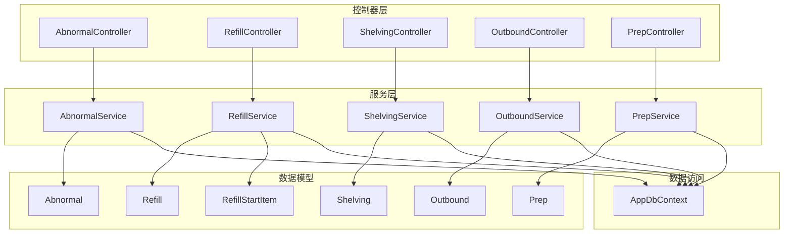
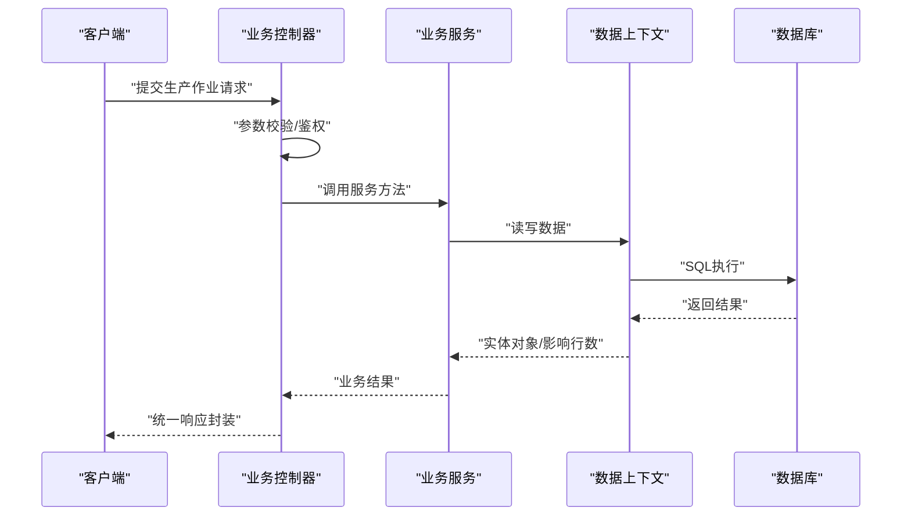
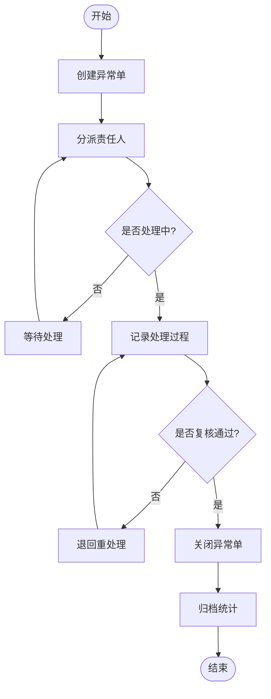
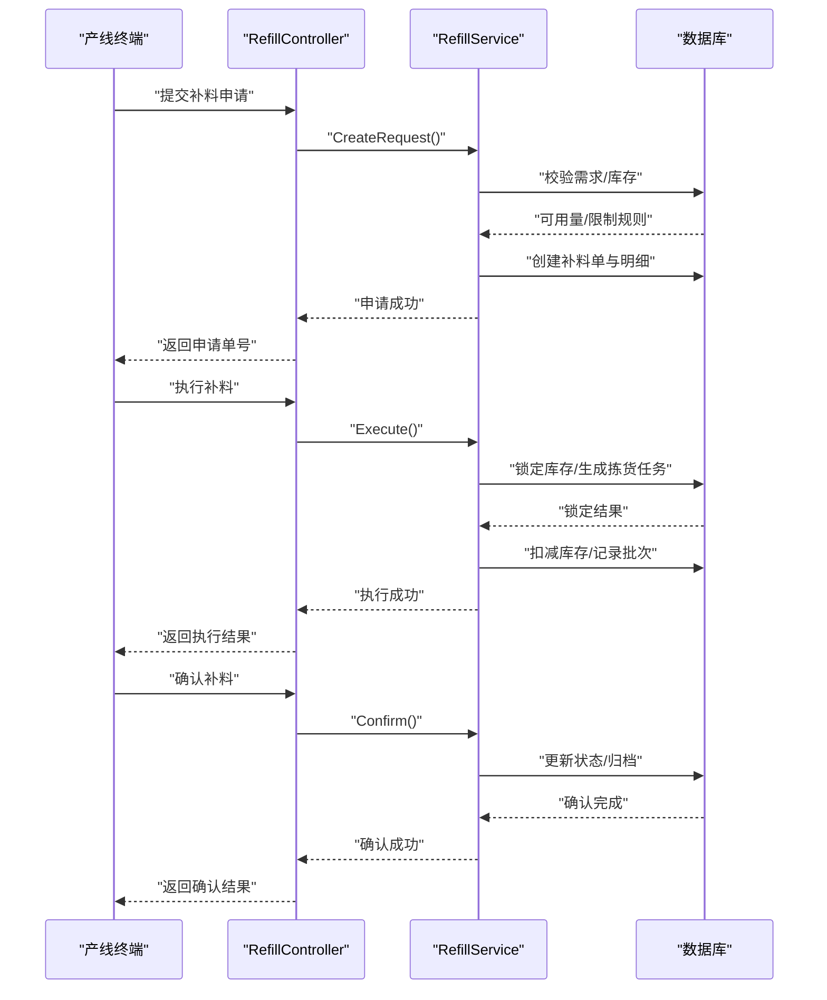
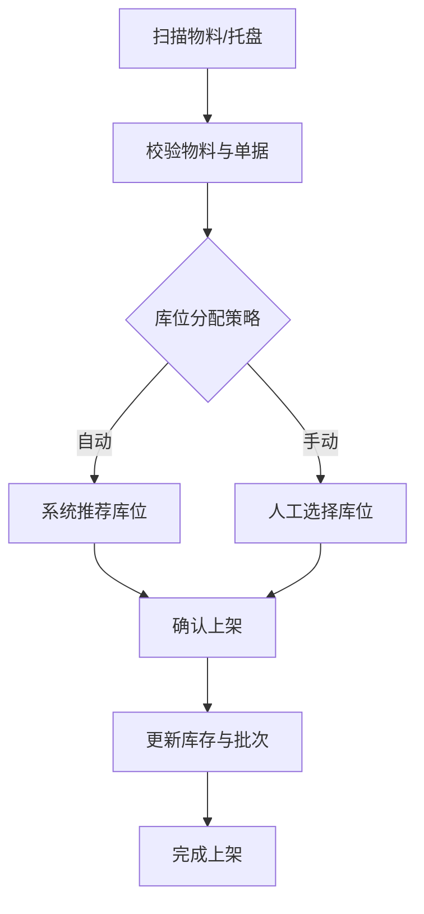
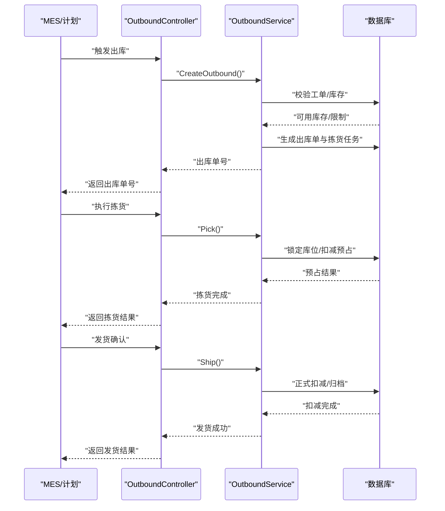
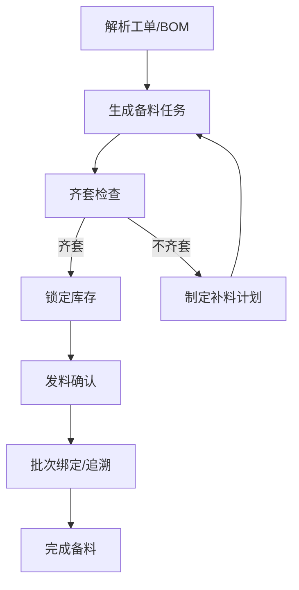
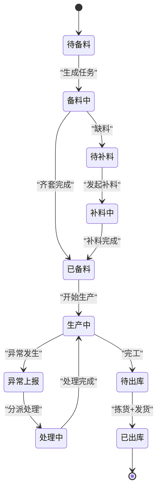
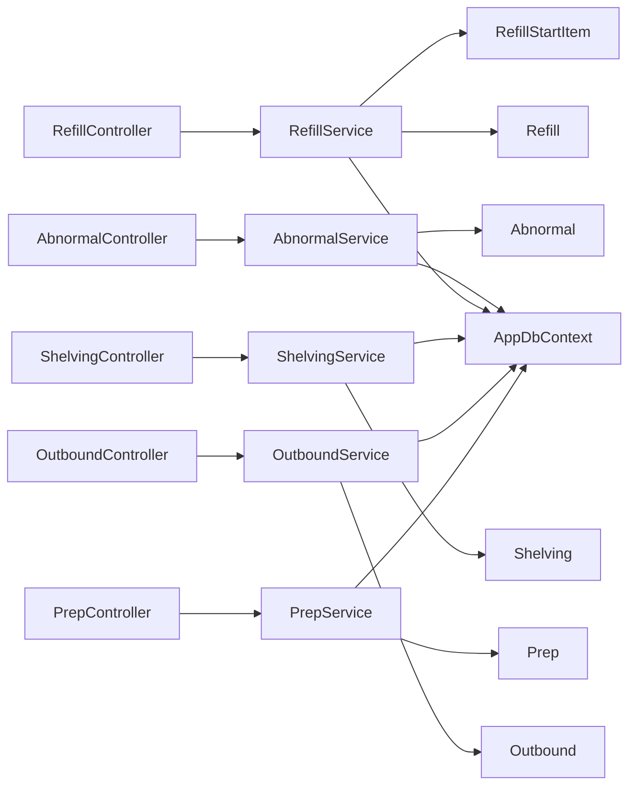

# 生产作业服务

<cite>
**本文引用的文件**   
- [AbnormalService.cs](file://dip-system/api/Services/AbnormalService.cs)
- [AbnormalController.cs](file://dip-system/api/Controllers/AbnormalController.cs)
- [Abnormal.cs](file://dip-system/api/Models/Abnormal.cs)
- [RefillService.cs](file://dip-system/api/Services/RefillService.cs)
- [RefillController.cs](file://dip-system/api/Controllers/RefillController.cs)
- [Refill.cs](file://dip-system/api/Models/Refill.cs)
- [RefillStartItem.cs](file://dip-system/api/Models/RefillStartItem.cs)
- [ShelvingService.cs](file://dip-system/api/Services/ShelvingService.cs)
- [ShelvingController.cs](file://dip-system/api/Controllers/ShelvingController.cs)
- [Shelving.cs](file://dip-system/api/Models/Shelving.cs)
- [OutboundService.cs](file://dip-system/api/Services/OutboundService.cs)
- [OutboundController.cs](file://dip-system/api/Controllers/OutboundController.cs)
- [Outbound.cs](file://dip-system/api/Models/Outbound.cs)
- [PrepService.cs](file://dip-system/api/Services/PrepService.cs)
- [PrepController.cs](file://dip-system/api/Controllers/PrepController.cs)
- [Prep.cs](file://dip-system/api/Models/Prep.cs)
- [AppDbContext.cs](file://dip-system/api/Data/AppDbContext.cs)
- [ApiResponse.cs](file://dip-system/api/Models/ApiResponse.cs)
</cite>

## 目录
1. [简介](#简介)
2. [项目结构](#项目结构)
3. [核心组件](#核心组件)
4. [架构总览](#架构总览)
5. [详细组件分析](#详细组件分析)
6. [依赖关系分析](#依赖关系分析)
7. [性能考虑](#性能考虑)
8. [故障排查指南](#故障排查指南)
9. [结论](#结论)
10. [附录](#附录)

## 简介
本文件面向DIP物料管理系统的“生产作业服务”，聚焦以下五大服务的业务流程与实现要点：异常服务（AbnormalService）、补料服务（RefillService）、上架服务（ShelvingService）、出库服务（OutboundService）、备料服务（PrepService）。文档覆盖各服务的异常上报与处理、补料申请执行确认、库位分配与批次管理、拣货策略与发货确认、备料任务与发料管理等，并补充生产作业的状态管理、进度跟踪与质量管控要点。

## 项目结构
生产作业相关代码位于后端API层，采用控制器-服务-数据模型的分层组织：
- Controllers：对外暴露REST接口，负责参数校验、权限控制、调用服务层。
- Services：业务编排与事务边界，协调仓储、库存、订单等子域。
- Models：实体定义，映射数据库表结构。
- Data：EF Core上下文，统一数据访问入口。

图表来源
- [AbnormalController.cs](file://dip-system/api/Controllers/AbnormalController.cs)
- [AbnormalService.cs](file://dip-system/api/Services/AbnormalService.cs)
- [Abnormal.cs](file://dip-system/api/Models/Abnormal.cs)
- [RefillController.cs](file://dip-system/api/Controllers/RefillController.cs)
- [RefillService.cs](file://dip-system/api/Services/RefillService.cs)
- [Refill.cs](file://dip-system/api/Models/Refill.cs)
- [RefillStartItem.cs](file://dip-system/api/Models/RefillStartItem.cs)
- [ShelvingController.cs](file://dip-system/api/Controllers/ShelvingController.cs)
- [ShelvingService.cs](file://dip-system/api/Services/ShelvingService.cs)
- [Shelving.cs](file://dip-system/api/Models/Shelving.cs)
- [OutboundController.cs](file://dip-system/api/Controllers/OutboundController.cs)
- [OutboundService.cs](file://dip-system/api/Services/OutboundService.cs)
- [Outbound.cs](file://dip-system/api/Models/Outbound.cs)
- [PrepController.cs](file://dip-system/api/Controllers/PrepController.cs)
- [PrepService.cs](file://dip-system/api/Services/PrepService.cs)
- [Prep.cs](file://dip-system/api/Models/Prep.cs)
- [AppDbContext.cs](file://dip-system/api/Data/AppDbContext.cs)

章节来源
- [AbnormalController.cs](file://dip-system/api/Controllers/AbnormalController.cs)
- [AbnormalService.cs](file://dip-system/api/Services/AbnormalService.cs)
- [RefillController.cs](file://dip-system/api/Controllers/RefillController.cs)
- [RefillService.cs](file://dip-system/api/Services/RefillService.cs)
- [ShelvingController.cs](file://dip-system/api/Controllers/ShelvingController.cs)
- [ShelvingService.cs](file://dip-system/api/Services/ShelvingService.cs)
- [OutboundController.cs](file://dip-system/api/Controllers/OutboundController.cs)
- [OutboundService.cs](file://dip-system/api/Services/OutboundService.cs)
- [PrepController.cs](file://dip-system/api/Controllers/PrepController.cs)
- [PrepService.cs](file://dip-system/api/Services/PrepService.cs)
- [AppDbContext.cs](file://dip-system/api/Data/AppDbContext.cs)

## 核心组件
- 异常服务（AbnormalService）：负责异常事件的上报、流转、处理与统计分析，提供状态机驱动的处理闭环。
- 补料服务（RefillService）：承接产线补料申请，完成审批、拣配、执行与确认，保障产线连续供料。
- 上架服务（ShelvingService）：处理到货或退料后的上架操作，支持库位分配策略与批次管理。
- 出库服务（OutboundService）：管理生产领料出库，包含拣货策略、波次生成、发货确认与库存扣减。
- 备料服务（PrepService）：根据工单生成备料任务，进行配料检查与发料管理，确保齐套性。

章节来源
- [AbnormalService.cs](file://dip-system/api/Services/AbnormalService.cs)
- [RefillService.cs](file://dip-system/api/Services/RefillService.cs)
- [ShelvingService.cs](file://dip-system/api/Services/ShelvingService.cs)
- [OutboundService.cs](file://dip-system/api/Services/OutboundService.cs)
- [PrepService.cs](file://dip-system/api/Services/PrepService.cs)

## 架构总览
生产作业服务遵循典型的分层架构：控制器接收请求，服务层编排业务逻辑，数据模型映射持久化，EF Core上下文统一访问数据库。所有服务通过统一的响应封装返回结果，便于前端一致化处理。

图表来源
- [AbnormalController.cs](file://dip-system/api/Controllers/AbnormalController.cs)
- [AbnormalService.cs](file://dip-system/api/Services/AbnormalService.cs)
- [AppDbContext.cs](file://dip-system/api/Data/AppDbContext.cs)
- [ApiResponse.cs](file://dip-system/api/Models/ApiResponse.cs)

## 详细组件分析

### 异常服务（AbnormalService）
- 功能范围
  - 异常上报：采集异常类型、发生位置、关联工单/设备、图片证据等。
  - 处理流程：创建异常单、分派责任人、处理中、验证通过/关闭、归档统计。
  - 统计分析：按类型、时间、责任部门、严重等级等多维度汇总。
- 关键流程
  - 上报：校验输入→创建异常记录→通知相关人员→进入待处理。
  - 处理：领取任务→处置记录→复核→关闭或退回重处理。
  - 统计：聚合报表、趋势分析、KPI指标。
- 状态管理
  - 典型状态：待处理、处理中、已关闭、已归档；支持回滚与重试。
- 质量管控
  - 强制附件、必填字段校验；处理时效监控与超时提醒。

图表来源
- [AbnormalService.cs](file://dip-system/api/Services/AbnormalService.cs)
- [Abnormal.cs](file://dip-system/api/Models/Abnormal.cs)

章节来源
- [AbnormalService.cs](file://dip-system/api/Services/AbnormalService.cs)
- [Abnormal.cs](file://dip-system/api/Models/Abnormal.cs)
- [AbnormalController.cs](file://dip-system/api/Controllers/AbnormalController.cs)

### 补料服务（RefillService）
- 功能范围
  - 补料申请：基于产线缺料预警或人工发起，生成补料单。
  - 执行流程：审核→拣配→打印标签→仓库发料→产线签收。
  - 确认流程：数量核对、批次追溯、差异处理。
- 关键流程
  - 申请：校验工单/站点→计算需求量→生成补料明细。
  - 执行：锁定库存→生成拣货任务→出库扣减→发料确认。
  - 确认：扫码核对→批次绑定→更新状态为已完成。
- 批次管理
  - 支持先进先出（FIFO）或指定批次；记录供应商批号与有效期。
- 质量管控
  - 防错校验：条码一致性、数量上限、批次有效性。

图表来源
- [RefillController.cs](file://dip-system/api/Controllers/RefillController.cs)
- [RefillService.cs](file://dip-system/api/Services/RefillService.cs)
- [Refill.cs](file://dip-system/api/Models/Refill.cs)
- [RefillStartItem.cs](file://dip-system/api/Models/RefillStartItem.cs)

章节来源
- [RefillService.cs](file://dip-system/api/Services/RefillService.cs)
- [Refill.cs](file://dip-system/api/Models/Refill.cs)
- [RefillStartItem.cs](file://dip-system/api/Models/RefillStartItem.cs)
- [RefillController.cs](file://dip-system/api/Controllers/RefillController.cs)

### 上架服务（ShelvingService）
- 功能范围
  - 上架操作：到货/退料后扫描入库，自动或手动分配库位。
  - 库位分配：依据物料属性、库区策略、容量与混放规则。
  - 批次管理：绑定批次、效期、供应商信息，支持追溯。
- 关键流程
  - 扫描→校验→分配库位→写入上架记录→更新库存。
  - 支持整箱/散件上架、多批次合并、拆箱上架。
- 质量管控
  - 库位校验（类型匹配、温度/防静电要求）、批次唯一性、数量准确性。

图表来源
- [ShelvingService.cs](file://dip-system/api/Services/ShelvingService.cs)
- [Shelving.cs](file://dip-system/api/Models/Shelving.cs)

章节来源
- [ShelvingService.cs](file://dip-system/api/Services/ShelvingService.cs)
- [Shelving.cs](file://dip-system/api/Models/Shelving.cs)
- [ShelvingController.cs](file://dip-system/api/Controllers/ShelvingController.cs)

### 出库服务（OutboundService）
- 功能范围
  - 出库流程：工单领料→生成出库单→拣货策略→打包发货→确认出库。
  - 拣货策略：按工单/波次/库位顺序（如就近拣选、FIFO）。
  - 发货确认：扫码核对、批次绑定、库存扣减、回传MES。
- 关键流程
  - 创建出库单→分配拣货任务→执行拣货→复核→发货→归档。
- 质量管控
  - 防错校验（物料/数量/批次）、差异处理、异常拦截。

图表来源
- [OutboundController.cs](file://dip-system/api/Controllers/OutboundController.cs)
- [OutboundService.cs](file://dip-system/api/Services/OutboundService.cs)
- [Outbound.cs](file://dip-system/api/Models/Outbound.cs)

章节来源
- [OutboundService.cs](file://dip-system/api/Services/OutboundService.cs)
- [Outbound.cs](file://dip-system/api/Models/Outbound.cs)
- [OutboundController.cs](file://dip-system/api/Controllers/OutboundController.cs)

### 备料服务（PrepService）
- 功能范围
  - 备料任务：根据BOM与工单生成备料清单，支持齐套检查。
  - 配料检查：物料可用性、替代料策略、批次与效期校验。
  - 发料管理：按工单发料、批次绑定、发料记录与追溯。
- 关键流程
  - 解析工单→生成备料任务→检查齐套→锁定库存→发料确认。
- 质量管控
  - 齐套率统计、替代料审批、批次追溯、发料差异处理。

图表来源
- [PrepService.cs](file://dip-system/api/Services/PrepService.cs)
- [Prep.cs](file://dip-system/api/Models/Prep.cs)

章节来源
- [PrepService.cs](file://dip-system/api/Services/PrepService.cs)
- [Prep.cs](file://dip-system/api/Models/Prep.cs)
- [PrepController.cs](file://dip-system/api/Controllers/PrepController.cs)

### 概念总览
生产作业各服务围绕“工单”展开，形成从备料→补料→异常→上架→出库的完整闭环。状态机贯穿各环节，确保可追踪、可审计、可回溯。

[本图为概念流程图，不直接映射具体源码文件]

## 依赖关系分析
- 控制器与服务：每个业务域由独立控制器对接对应服务，职责清晰、耦合度低。
- 服务与数据模型：服务通过EF Core上下文访问数据库，实体模型与表结构一一对应。
- 外部集成：可与MES、WMS、QMS等系统集成，通过统一响应格式交互。

图表来源
- [AbnormalController.cs](file://dip-system/api/Controllers/AbnormalController.cs)
- [AbnormalService.cs](file://dip-system/api/Services/AbnormalService.cs)
- [Abnormal.cs](file://dip-system/api/Models/Abnormal.cs)
- [RefillController.cs](file://dip-system/api/Controllers/RefillController.cs)
- [RefillService.cs](file://dip-system/api/Services/RefillService.cs)
- [Refill.cs](file://dip-system/api/Models/Refill.cs)
- [RefillStartItem.cs](file://dip-system/api/Models/RefillStartItem.cs)
- [ShelvingController.cs](file://dip-system/api/Controllers/ShelvingController.cs)
- [ShelvingService.cs](file://dip-system/api/Services/ShelvingService.cs)
- [Shelving.cs](file://dip-system/api/Models/Shelving.cs)
- [OutboundController.cs](file://dip-system/api/Controllers/OutboundController.cs)
- [OutboundService.cs](file://dip-system/api/Services/OutboundService.cs)
- [Outbound.cs](file://dip-system/api/Models/Outbound.cs)
- [PrepController.cs](file://dip-system/api/Controllers/PrepController.cs)
- [PrepService.cs](file://dip-system/api/Services/PrepService.cs)
- [Prep.cs](file://dip-system/api/Models/Prep.cs)
- [AppDbContext.cs](file://dip-system/api/Data/AppDbContext.cs)

章节来源
- [AppDbContext.cs](file://dip-system/api/Data/AppDbContext.cs)

## 性能考虑
- 批量操作：对大批量拣货、上架、备料场景，建议分批提交与异步处理，降低锁竞争。
- 索引优化：高频查询字段（工单号、物料编码、库位码、批次号）建立合适索引。
- 缓存策略：热点数据（库位策略、字典）使用内存缓存减少数据库压力。
- 事务边界：严格控制事务范围，避免长事务导致阻塞。
- 并发控制：对库存扣减、库位占用等操作引入乐观锁或分布式锁。

[本节为通用指导，不直接分析具体文件]

## 故障排查指南
- 常见问题定位
  - 参数校验失败：检查控制器入参与模型约束。
  - 库存不足：查看可用量、预占量与锁定状态。
  - 批次不一致：核对批次绑定与效期校验逻辑。
  - 状态机卡住：检查状态转换条件与前置依赖。
- 日志与审计
  - 启用操作日志与审计表，记录关键步骤与责任人。
  - 错误堆栈与异常分类，便于快速定位根因。
- 恢复与补偿
  - 设计补偿事务与重试机制，保证最终一致性。
  - 提供回滚接口与数据修复工具。

章节来源
- [ApiResponse.cs](file://dip-system/api/Models/ApiResponse.cs)

## 结论
生产作业服务以清晰的层次结构与严谨的状态机为核心，覆盖异常、补料、上架、出库、备料五大关键环节。通过统一的响应封装与数据模型，实现了高内聚、低耦合的可维护架构。建议在后续迭代中持续优化性能与质量管控能力，完善与MES/WMS/QMS的集成，提升整体生产效率与可追溯性。

[本节为总结性内容，不直接分析具体文件]

## 附录
- 术语说明
  - 工单：生产任务的最小执行单元。
  - 批次：同一生产或采购来源的物料集合，具备唯一标识。
  - 库位：仓库中用于存放物料的物理位置。
  - 齐套：工单所需物料全部可用且满足数量与批次要求。
- 参考文件
  - 数据模型定义与字段说明见各Model文件。
  - 控制器接口定义与请求示例见各Controller文件。
  - 服务层业务逻辑与事务边界见各Service文件。

[本节为辅助信息，不直接分析具体文件]