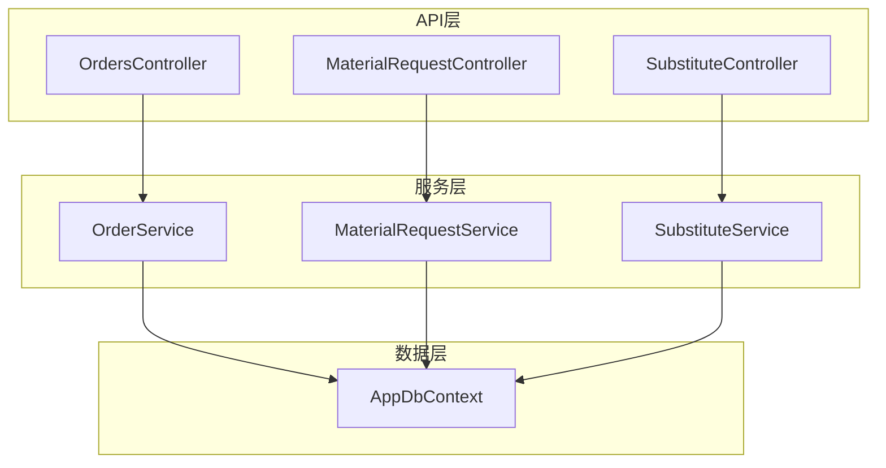
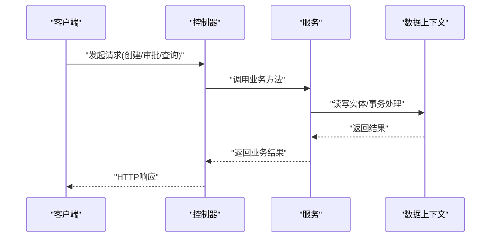
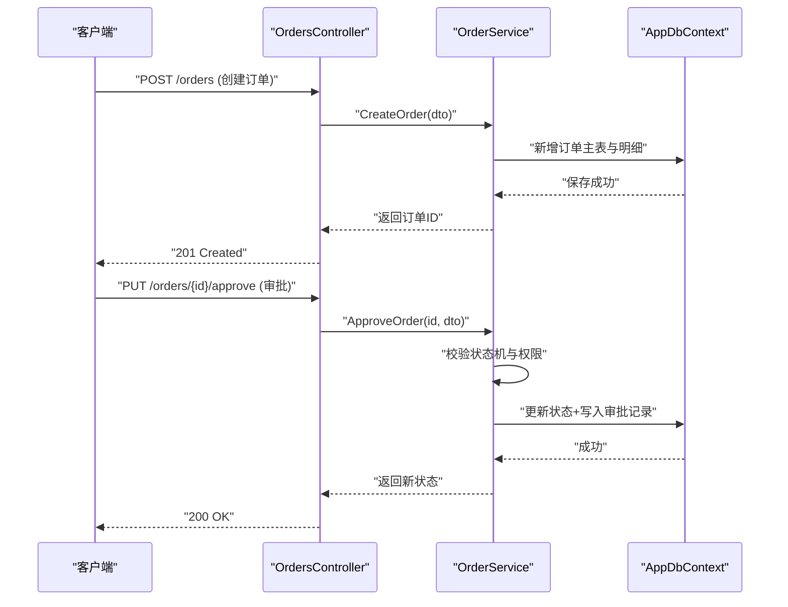
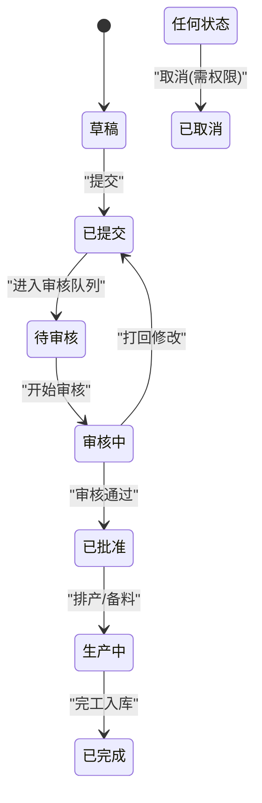
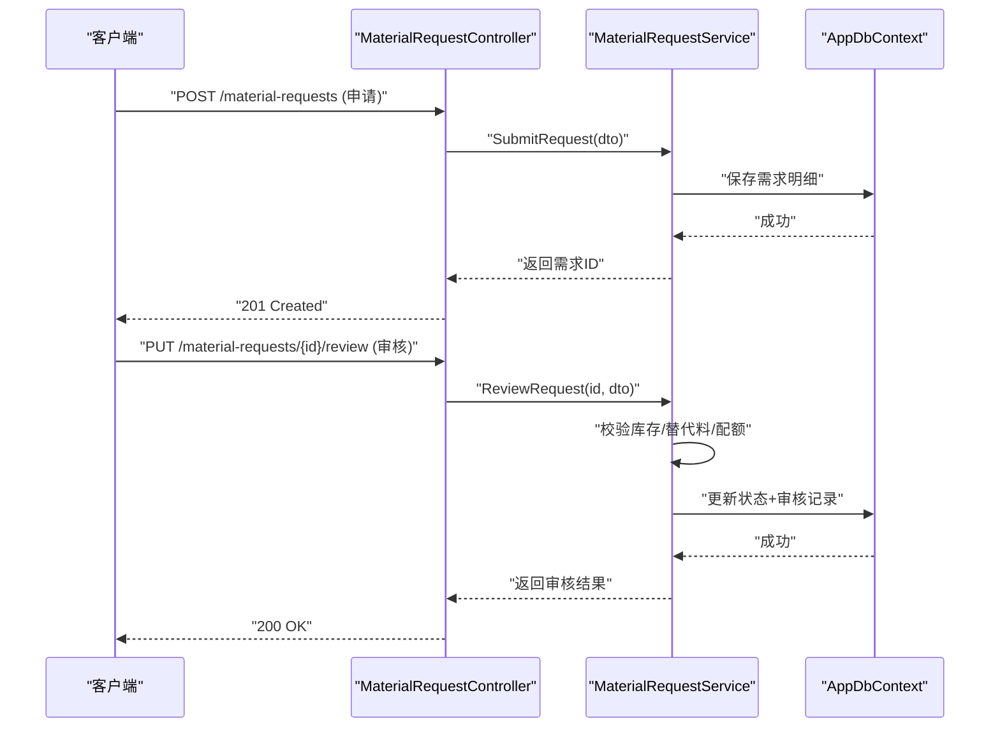
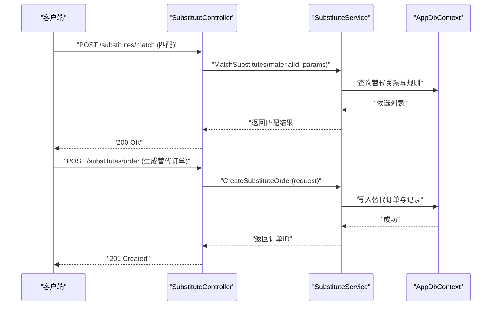
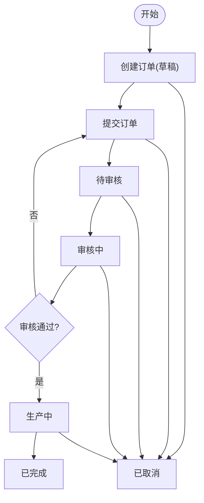
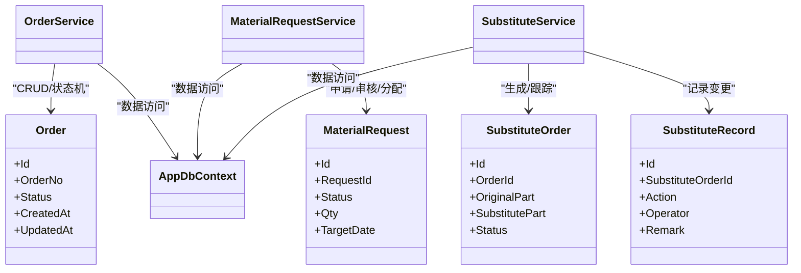

# 订单管理服务

<cite>
**本文引用的文件**   
- [OrderService.cs](file://dip-system/api/Services/OrderService.cs)
- [OrdersController.cs](file://dip-system/api/Controllers/OrdersController.cs)
- [Order.cs](file://dip-system/api/Models/Order.cs)
- [MaterialRequestService.cs](file://dip-system/api/Services/MaterialRequestService.cs)
- [MaterialRequest.cs](file://dip-system/api/Models/MaterialRequest.cs)
- [SubstituteService.cs](file://dip-system/api/Services/SubstituteService.cs)
- [SubstituteOrder.cs](file://dip-system/api/Models/SubstituteOrder.cs)
- [SubstituteRecord.cs](file://dip-system/api/Models/SubstituteRecord.cs)
- [AppDbContext.cs](file://dip-system/api/Data/AppDbContext.cs)
- [Program.cs](file://dip-system/api/Program.cs)
</cite>

## 目录
1. [简介](#简介)
2. [项目结构](#项目结构)
3. [核心组件](#核心组件)
4. [架构总览](#架构总览)
5. [详细组件分析](#详细组件分析)
6. [依赖关系分析](#依赖关系分析)
7. [性能考虑](#性能考虑)
8. [故障排查指南](#故障排查指南)
9. [结论](#结论)
10. [附录](#附录)

## 简介
本文件面向DIP物料管理系统的“订单管理服务”，围绕以下目标展开：
- 订单服务(OrderService)的订单创建、状态流转、审批流程与订单跟踪机制
- 物料需求服务(MaterialRequestService)的需求申请、需求审核、需求分配流程
- 替代料服务(SubstituteService)的替代料匹配、替换规则与变更记录
- 订单生命周期管理与状态机设计，以及与工作流集成的方式
- 订单查询优化与批量处理能力

## 项目结构
后端采用ASP.NET Core Web API，分层清晰：
- Controllers：对外HTTP接口（如OrdersController、MaterialRequestController、SubstituteController）
- Services：业务逻辑实现（如OrderService、MaterialRequestService、SubstituteService）
- Models：领域模型与DTO（如Order、MaterialRequest、SubstituteOrder、SubstituteRecord）
- Data：数据访问上下文（AppDbContext）
- Program：应用启动与依赖注入配置

图表来源
- [OrdersController.cs](file://dip-system/api/Controllers/OrdersController.cs)
- [OrderService.cs](file://dip-system/api/Services/OrderService.cs)
- [MaterialRequestService.cs](file://dip-system/api/Services/MaterialRequestService.cs)
- [SubstituteService.cs](file://dip-system/api/Services/SubstituteService.cs)
- [AppDbContext.cs](file://dip-system/api/Data/AppDbContext.cs)

章节来源
- [Program.cs](file://dip-system/api/Program.cs)
- [AppDbContext.cs](file://dip-system/api/Data/AppDbContext.cs)

## 核心组件
- OrderService：负责订单全生命周期管理，包括创建、状态变更、审批流转、跟踪记录、查询与批量操作。
- MaterialRequestService：负责物料需求的申请、审核、分配与执行跟踪。
- SubstituteService：负责替代料匹配、替换规则校验、生成替代订单与变更记录。
- AppDbContext：统一的数据访问入口，提供实体集合与事务能力。

章节来源
- [OrderService.cs](file://dip-system/api/Services/OrderService.cs)
- [MaterialRequestService.cs](file://dip-system/api/Services/MaterialRequestService.cs)
- [SubstituteService.cs](file://dip-system/api/Services/SubstituteService.cs)
- [AppDbContext.cs](file://dip-system/api/Data/AppDbContext.cs)

## 架构总览
系统以控制器为入口，调用服务层完成业务编排，最终通过EF Core上下文持久化到数据库。关键交互如下：

图表来源
- [OrdersController.cs](file://dip-system/api/Controllers/OrdersController.cs)
- [OrderService.cs](file://dip-system/api/Services/OrderService.cs)
- [AppDbContext.cs](file://dip-system/api/Data/AppDbContext.cs)

## 详细组件分析

### 订单服务(OrderService)
- 职责
  - 订单创建：接收订单主从信息，校验必填字段与业务约束，落库并生成初始状态。
  - 状态流转：基于状态机驱动状态变更，确保状态转换合法且可审计。
  - 审批流程：支持多级审批（如提交、审核、批准），记录审批意见与时间线。
  - 订单跟踪：维护订单事件日志，支持按单号、状态、时间范围等条件查询。
  - 查询优化：分页、排序、过滤、索引命中；必要时使用投影减少数据传输。
  - 批量处理：批量更新状态、批量导出、批量合并或拆分订单。

- 关键流程（序列图）

- 状态机设计（建议）
  - 状态集合：草稿、已提交、待审核、审核中、已批准、生产中、已完成、已取消
  - 转换规则：仅允许相邻或特定跨态跳转；每次转换需记录原因与操作人
  - 并发控制：乐观锁或版本号避免重复审批

- 查询与批量能力
  - 查询：支持多条件组合过滤、分页、排序；对高频字段建立索引
  - 批量：批量状态更新、批量导出CSV/Excel、批量合并订单（同客户/同交期）

章节来源
- [OrderService.cs](file://dip-system/api/Services/OrderService.cs)
- [Order.cs](file://dip-system/api/Models/Order.cs)
- [OrdersController.cs](file://dip-system/api/Controllers/OrdersController.cs)

### 物料需求服务(MaterialRequestService)
- 职责
  - 需求申请：根据BOM或生产计划生成物料需求清单，支持多工厂/多产线维度
  - 需求审核：校验库存可用性、安全库存阈值、替代料策略，形成审核意见
  - 需求分配：将需求分配到仓库/供应商/调拨单，生成出库任务或采购建议
  - 执行跟踪：记录需求状态变化（申请、审核、分配、发料、完成）

- 关键流程（序列图）

- 审核与分配要点
  - 库存可用量计算：在途、锁定、可用三者关系
  - 替代料匹配：优先级、有效期、质量等级、成本差异
  - 分配策略：就近仓库、最小批次、供应商交期承诺

章节来源
- [MaterialRequestService.cs](file://dip-system/api/Services/MaterialRequestService.cs)
- [MaterialRequest.cs](file://dip-system/api/Models/MaterialRequest.cs)

### 替代料服务(SubstituteService)
- 职责
  - 替代料匹配：依据物料编码、规格、参数、认证清单进行匹配
  - 替换规则：优先级、兼容性、有效期、成本上限、质量等级
  - 变更记录：生成替代订单与替代记录，保留前后对比与审计轨迹

- 关键流程（序列图）

- 匹配与规则
  - 匹配维度：物料族、封装、精度、温度等级、认证状态
  - 规则权重：兼容性>认证>成本>交期>库存
  - 变更记录：原物料、替代物料、生效时间、责任人、备注

章节来源
- [SubstituteService.cs](file://dip-system/api/Services/SubstituteService.cs)
- [SubstituteOrder.cs](file://dip-system/api/Models/SubstituteOrder.cs)
- [SubstituteRecord.cs](file://dip-system/api/Models/SubstituteRecord.cs)

### 订单生命周期与工作流集成
- 生命周期阶段
  - 草稿→提交→待审核→审核中→已批准→生产中→已完成→已取消
- 工作流集成建议
  - 通过外部工作流引擎或内部状态机驱动审批节点
  - 每个状态变更触发事件，用于通知、审计与报表统计
  - 支持回滚与撤销（在合规范围内）

章节来源
- [OrderService.cs](file://dip-system/api/Services/OrderService.cs)
- [Order.cs](file://dip-system/api/Models/Order.cs)

## 依赖关系分析
- 控制器与服务：松耦合，通过接口或依赖注入装配
- 服务与数据：通过AppDbContext访问实体集合，保证事务边界
- 实体关系：订单主从、需求明细、替代订单与记录之间外键关联

图表来源
- [Order.cs](file://dip-system/api/Models/Order.cs)
- [MaterialRequest.cs](file://dip-system/api/Models/MaterialRequest.cs)
- [SubstituteOrder.cs](file://dip-system/api/Models/SubstituteOrder.cs)
- [SubstituteRecord.cs](file://dip-system/api/Models/SubstituteRecord.cs)
- [OrderService.cs](file://dip-system/api/Services/OrderService.cs)
- [MaterialRequestService.cs](file://dip-system/api/Services/MaterialRequestService.cs)
- [SubstituteService.cs](file://dip-system/api/Services/SubstituteService.cs)
- [AppDbContext.cs](file://dip-system/api/Data/AppDbContext.cs)

章节来源
- [AppDbContext.cs](file://dip-system/api/Data/AppDbContext.cs)

## 性能考虑
- 查询优化
  - 对常用过滤字段建立索引（如订单号、状态、创建时间）
  - 使用投影只取必要字段，减少网络传输
  - 分页与游标结合，避免大偏移量
- 批量处理
  - 批量更新使用事务包裹，减少往返次数
  - 分批提交，避免长事务导致锁竞争
- 缓存策略
  - 字典与配置类数据使用内存缓存
  - 热点查询结果短期缓存，注意失效策略
- 并发控制
  - 使用乐观锁版本字段防止覆盖写
  - 审批与状态变更加分布式锁（如需跨进程）

[本节为通用指导，不直接分析具体文件]

## 故障排查指南
- 常见错误
  - 状态转换非法：检查当前状态与目标状态是否允许
  - 审批失败：确认权限、审批链路与前置条件
  - 替代料匹配为空：检查替代关系配置、有效期与认证状态
- 定位手段
  - 查看订单/需求/替代记录的审计日志
  - 检查数据库事务日志与异常堆栈
  - 核对依赖项注册与配置是否正确

章节来源
- [OrderService.cs](file://dip-system/api/Services/OrderService.cs)
- [MaterialRequestService.cs](file://dip-system/api/Services/MaterialRequestService.cs)
- [SubstituteService.cs](file://dip-system/api/Services/SubstituteService.cs)

## 结论
本订单管理服务以清晰的分层架构与明确的服务职责为核心，通过状态机驱动订单生命周期，结合物料需求与替代料机制，形成完整的DIP物料管理闭环。建议在后续迭代中完善工作流引擎集成、增强查询性能与扩展批量处理能力，以满足更大规模的生产场景。

[本节为总结性内容，不直接分析具体文件]

## 附录
- 术语
  - 订单：生产或出货相关的物料需求汇总
  - 物料需求：基于BOM或计划的物料消耗清单
  - 替代料：与原物料功能等效并可替换的物料
- 参考文件
  - 控制器：OrdersController、MaterialRequestController、SubstituteController
  - 服务：OrderService、MaterialRequestService、SubstituteService
  - 模型：Order、MaterialRequest、SubstituteOrder、SubstituteRecord
  - 数据：AppDbContext

[本节为补充说明，不直接分析具体文件]