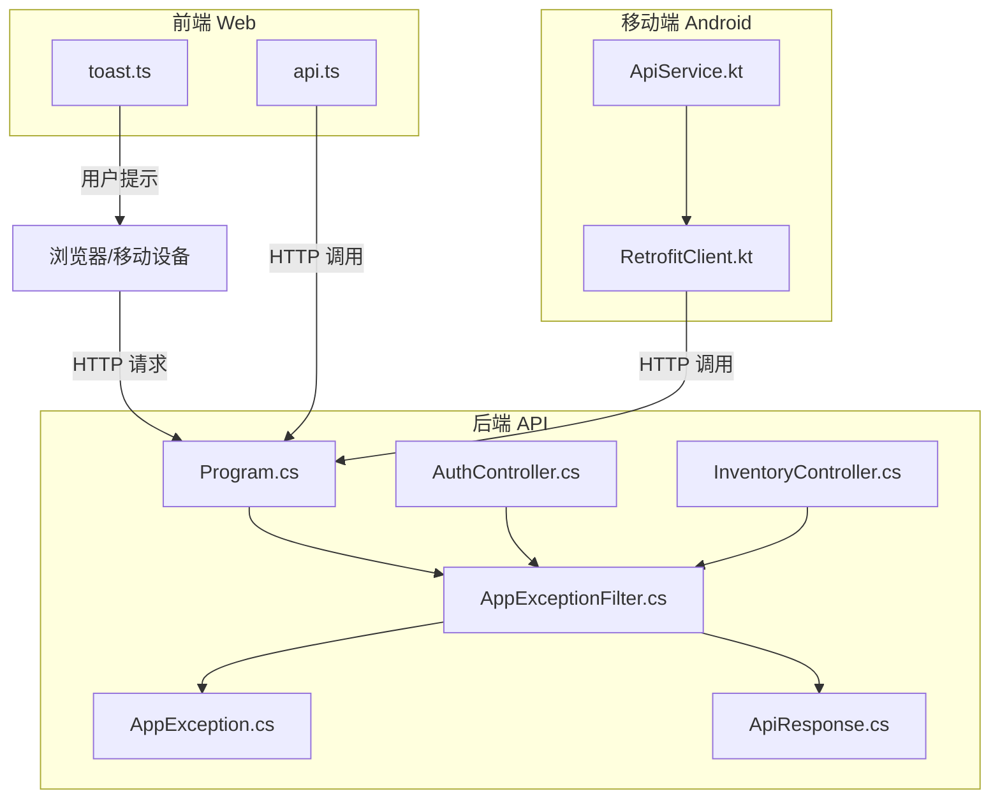
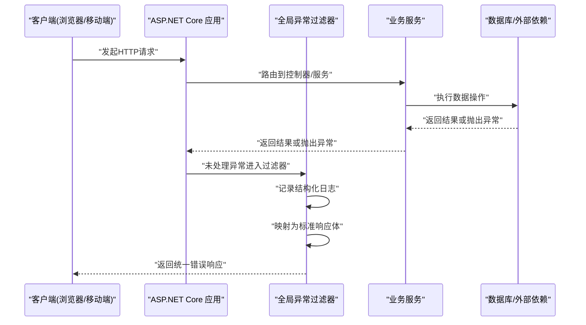
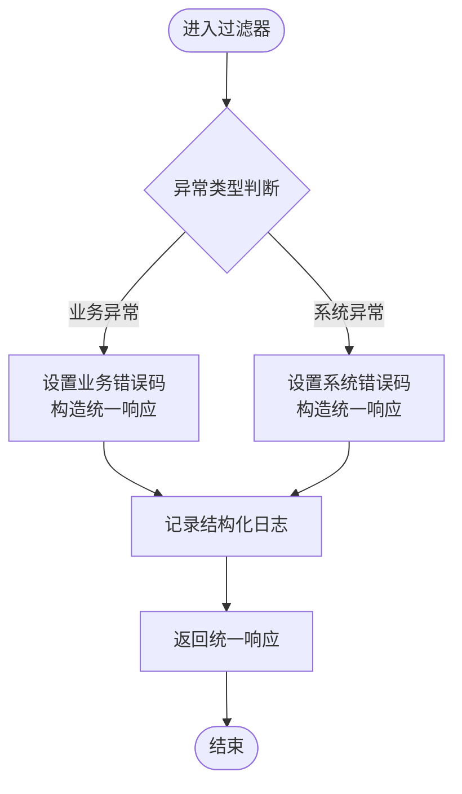
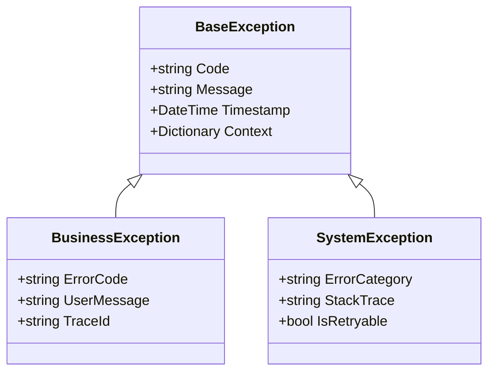
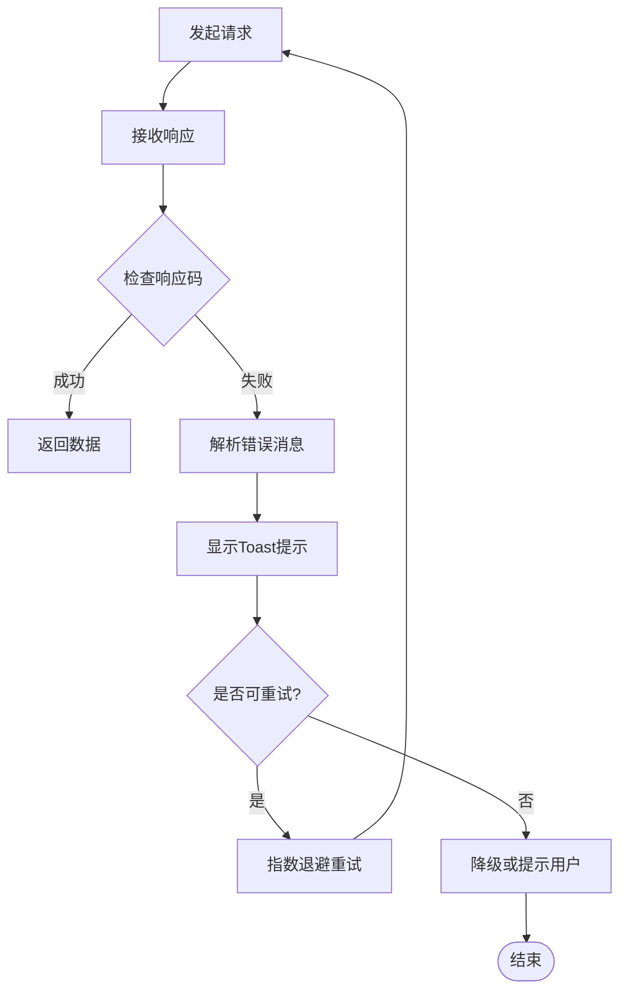
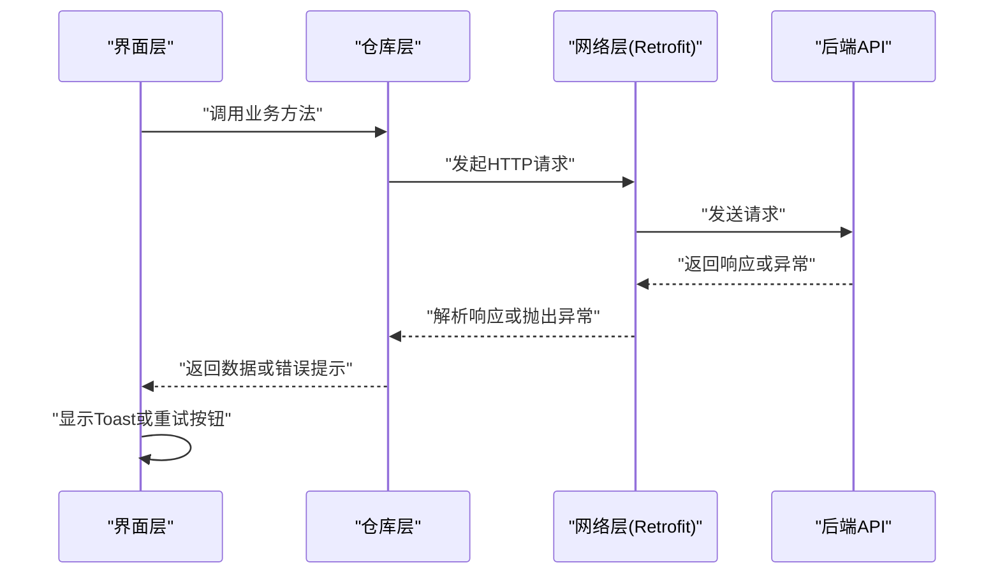
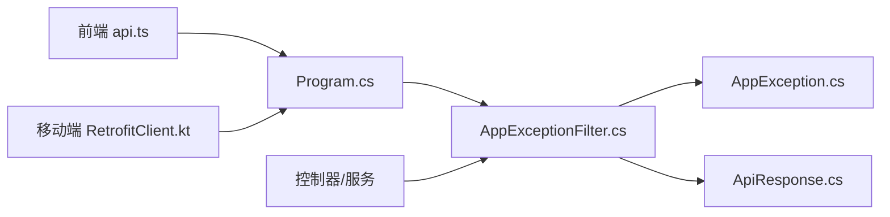
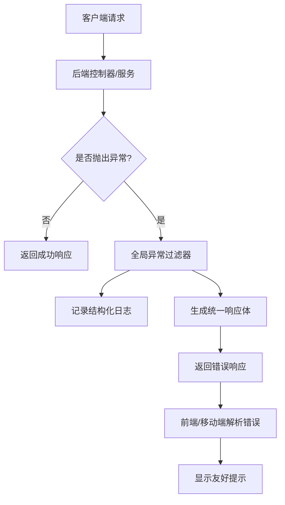

# 错误处理架构

<cite>
**本文引用的文件**   
- [AppExceptionFilter.cs](file://dip-system/api/Controllers/AppExceptionFilter.cs)
- [AppException.cs](file://dip-system/api/Services/AppException.cs)
- [ApiResponse.cs](file://dip-system/api/Models/ApiResponse.cs)
- [Program.cs](file://dip-system/api/Program.cs)
- [AuthController.cs](file://dip-system/api/Controllers/AuthController.cs)
- [InventoryController.cs](file://dip-system/api/Controllers/InventoryController.cs)
- [RetrofitClient.kt](file://mobile-android/app/src/main/java/com/dip/material/data/network/RetrofitClient.kt)
- [ApiService.kt](file://mobile-android/app/src/main/java/com/dip/material/data/network/ApiService.kt)
- [toast.ts](file://dip-system/frontend-web/src/lib/toast.ts)
- [api.ts](file://dip-system/frontend-web/src/lib/api.ts)
</cite>

## 目录
1. [引言](#引言)
2. [项目结构](#项目结构)
3. [核心组件](#核心组件)
4. [架构总览](#架构总览)
5. [详细组件分析](#详细组件分析)
6. [依赖关系分析](#依赖关系分析)
7. [性能考虑](#性能考虑)
8. [故障排查指南](#故障排查指南)
9. [结论](#结论)
10. [附录](#附录)

## 引言
本文件为DIP物料管理系统的“错误处理架构”设计文档，面向后端（ASP.NET Core）、移动端（Android/Kotlin）与前端Web（React/Vite）三端。目标包括：
- 全局异常过滤器的实现原理与异常捕获机制
- 自定义异常类型的设计与层次结构
- 统一响应格式与错误码规范
- 前后端错误处理策略与用户友好提示
- 日志记录与错误追踪机制
- 错误处理流程图与异常分类表
- 错误监控与告警机制设计

## 项目结构
围绕错误处理的关键代码分布在以下位置：
- 后端API：控制器、服务、模型、程序入口与全局过滤器
- 前端Web：HTTP客户端封装与Toast提示
- 移动端Android：网络层封装与错误处理

图表来源 
- [Program.cs](file://dip-system/api/Program.cs)
- [AppExceptionFilter.cs](file://dip-system/api/Controllers/AppExceptionFilter.cs)
- [AppException.cs](file://dip-system/api/Services/AppException.cs)
- [ApiResponse.cs](file://dip-system/api/Models/ApiResponse.cs)
- [AuthController.cs](file://dip-system/api/Controllers/AuthController.cs)
- [InventoryController.cs](file://dip-system/api/Controllers/InventoryController.cs)
- [RetrofitClient.kt](file://mobile-android/app/src/main/java/com/dip/material/data/network/RetrofitClient.kt)
- [ApiService.kt](file://mobile-android/app/src/main/java/com/dip/material/data/network/ApiService.kt)
- [toast.ts](file://dip-system/frontend-web/src/lib/toast.ts)
- [api.ts](file://dip-system/frontend-web/src/lib/api.ts)

章节来源
- [Program.cs](file://dip-system/api/Program.cs)
- [AppExceptionFilter.cs](file://dip-system/api/Controllers/AppExceptionFilter.cs)
- [AppException.cs](file://dip-system/api/Services/AppException.cs)
- [ApiResponse.cs](file://dip-system/api/Models/ApiResponse.cs)
- [AuthController.cs](file://dip-system/api/Controllers/AuthController.cs)
- [InventoryController.cs](file://dip-system/api/Controllers/InventoryController.cs)
- [RetrofitClient.kt](file://mobile-android/app/src/main/java/com/dip/material/data/network/RetrofitClient.kt)
- [ApiService.kt](file://mobile-android/app/src/main/java/com/dip/material/data/network/ApiService.kt)
- [toast.ts](file://dip-system/frontend-web/src/lib/toast.ts)
- [api.ts](file://dip-system/frontend-web/src/lib/api.ts)

## 核心组件
- 全局异常过滤器：集中捕获未处理异常，统一转换为标准响应体，并输出结构化日志
- 自定义异常类型：业务异常与系统异常的层次化定义，便于区分错误来源与处理策略
- 统一响应格式：包含状态码、消息、数据与扩展字段，保证前后端一致交互
- 前端拦截器：对HTTP响应进行解析与错误提示，提供友好的用户反馈
- 移动端网络层：对网络异常与业务异常进行分类处理，确保稳定体验

章节来源
- [AppExceptionFilter.cs](file://dip-system/api/Controllers/AppExceptionFilter.cs)
- [AppException.cs](file://dip-system/api/Services/AppException.cs)
- [ApiResponse.cs](file://dip-system/api/Models/ApiResponse.cs)
- [api.ts](file://dip-system/frontend-web/src/lib/api.ts)
- [RetrofitClient.kt](file://mobile-android/app/src/main/java/com/dip/material/data/network/RetrofitClient.kt)

## 架构总览
下图展示从客户端到后端的完整错误处理流程，包括全局过滤器、自定义异常、统一响应以及前端/移动端提示。

图表来源 
- [Program.cs](file://dip-system/api/Program.cs)
- [AppExceptionFilter.cs](file://dip-system/api/Controllers/AppExceptionFilter.cs)
- [AppException.cs](file://dip-system/api/Services/AppException.cs)
- [ApiResponse.cs](file://dip-system/api/Models/ApiResponse.cs)

## 详细组件分析

### 全局异常过滤器
职责与实现要点：
- 在管道中注册，捕获所有未处理的异常
- 将异常分类为业务异常与系统异常，分别设置HTTP状态码
- 生成统一响应体，包含错误码、消息、时间戳与可选堆栈信息
- 输出结构化日志，便于追踪与监控

图表来源 
- [AppExceptionFilter.cs](file://dip-system/api/Controllers/AppExceptionFilter.cs)
- [AppException.cs](file://dip-system/api/Services/AppException.cs)
- [ApiResponse.cs](file://dip-system/api/Models/ApiResponse.cs)

章节来源
- [AppExceptionFilter.cs](file://dip-system/api/Controllers/AppExceptionFilter.cs)

### 自定义异常类型与层次结构
设计原则：
- 基础异常：作为所有异常的基类，携带通用字段（如错误码、消息、上下文）
- 业务异常：用于可预期的业务错误（如库存不足、权限不足），附带业务上下文
- 系统异常：用于不可预期的系统错误（如数据库连接失败、第三方服务超时）

图表来源 
- [AppException.cs](file://dip-system/api/Services/AppException.cs)

章节来源
- [AppException.cs](file://dip-system/api/Services/AppException.cs)

### 统一响应格式与错误码规范
统一响应体字段建议：
- code：数字或字符串错误码
- message：用户可读的错误消息
- data：成功时的数据负载，失败时为null
- timestamp：请求时间戳
- traceId：链路追踪ID（可选）

错误码规范建议：
- 2xx：成功
- 4xx：客户端错误（参数校验失败、权限不足等）
- 5xx：服务端错误（数据库异常、第三方服务异常等）
- 业务错误码：以模块前缀区分（如INV-001表示库存相关）

章节来源
- [ApiResponse.cs](file://dip-system/api/Models/ApiResponse.cs)

### 前端Web错误处理策略
- HTTP拦截器：统一解析响应体，根据code与message决定成功或失败路径
- 错误提示：使用Toast组件显示友好消息，避免直接暴露技术细节
- 重试与降级：对可重试的网络错误进行指数退避重试；对不可用服务进行降级处理

图表来源 
- [api.ts](file://dip-system/frontend-web/src/lib/api.ts)
- [toast.ts](file://dip-system/frontend-web/src/lib/toast.ts)

章节来源
- [api.ts](file://dip-system/frontend-web/src/lib/api.ts)
- [toast.ts](file://dip-system/frontend-web/src/lib/toast.ts)

### 移动端Android错误处理策略
- 网络层封装：基于Retrofit的拦截器统一处理网络异常与业务异常
- 错误分类：区分网络错误（超时、无网）与业务错误（参数错误、权限不足）
- 用户提示：通过UI层提示错误信息，并提供重试按钮

图表来源 
- [RetrofitClient.kt](file://mobile-android/app/src/main/java/com/dip/material/data/network/RetrofitClient.kt)
- [ApiService.kt](file://mobile-android/app/src/main/java/com/dip/material/data/network/ApiService.kt)

章节来源
- [RetrofitClient.kt](file://mobile-android/app/src/main/java/com/dip/material/data/network/RetrofitClient.kt)
- [ApiService.kt](file://mobile-android/app/src/main/java/com/dip/material/data/network/ApiService.kt)

## 依赖关系分析
- Program.cs负责注册全局异常过滤器与中间件
- AppExceptionFilter依赖AppException与ApiResponse进行异常转换与响应构建
- 控制器与服务层抛出业务异常，由过滤器统一处理
- 前端与移动端通过网络层封装与拦截器处理错误，提升用户体验

图表来源 
- [Program.cs](file://dip-system/api/Program.cs)
- [AppExceptionFilter.cs](file://dip-system/api/Controllers/AppExceptionFilter.cs)
- [AppException.cs](file://dip-system/api/Services/AppException.cs)
- [ApiResponse.cs](file://dip-system/api/Models/ApiResponse.cs)
- [api.ts](file://dip-system/frontend-web/src/lib/api.ts)
- [RetrofitClient.kt](file://mobile-android/app/src/main/java/com/dip/material/data/network/RetrofitClient.kt)

章节来源
- [Program.cs](file://dip-system/api/Program.cs)
- [AppExceptionFilter.cs](file://dip-system/api/Controllers/AppExceptionFilter.cs)
- [AppException.cs](file://dip-system/api/Services/AppException.cs)
- [ApiResponse.cs](file://dip-system/api/Models/ApiResponse.cs)
- [api.ts](file://dip-system/frontend-web/src/lib/api.ts)
- [RetrofitClient.kt](file://mobile-android/app/src/main/java/com/dip/material/data/network/RetrofitClient.kt)

## 性能考虑
- 异常日志应异步写入，避免阻塞主线程
- 对高频错误进行采样记录，防止日志风暴
- 统一响应体的序列化需优化，减少内存分配
- 前端与移动端的重试策略应避免雪崩效应

## 故障排查指南
常见问题与定位步骤：
- 无法捕获异常：检查全局过滤器是否在Program中正确注册
- 错误码不清晰：确认业务异常是否设置了明确的错误码与消息
- 前端未提示错误：检查拦截器是否正确解析响应体与错误码
- 移动端网络错误：检查Retrofit拦截器与错误分类逻辑

章节来源
- [Program.cs](file://dip-system/api/Program.cs)
- [AppExceptionFilter.cs](file://dip-system/api/Controllers/AppExceptionFilter.cs)
- [api.ts](file://dip-system/frontend-web/src/lib/api.ts)
- [RetrofitClient.kt](file://mobile-android/app/src/main/java/com/dip/material/data/network/RetrofitClient.kt)

## 结论
本错误处理架构通过全局过滤器、自定义异常、统一响应与多端拦截器，实现了端到端的错误捕获、分类、记录与提示。建议在后续迭代中引入更完善的错误监控与告警机制，进一步提升系统的可观测性与稳定性。

## 附录

### 错误处理流程图（端到端）

### 异常分类表
- 业务异常：参数校验失败、权限不足、库存不足、订单状态异常
- 系统异常：数据库连接失败、第三方服务超时、文件读写失败
- 网络异常：无网络连接、DNS解析失败、SSL握手失败
- 未知异常：未捕获的系统级异常，需快速定位与修复