# 系统介绍

<cite>
**本文档引用的文件**   
- [Program.cs](file://dip-system/api/Program.cs)
- [appsettings.json](file://dip-system/api/appsettings.json)
- [AppDbContext.cs](file://dip-system/api/Data/AppDbContext.cs)
- [AuthController.cs](file://dip-system/api/Controllers/AuthController.cs)
- [AuthService.cs](file://dip-system/api/Services/AuthService.cs)
- [InventoryController.cs](file://dip-system/api/Controllers/InventoryController.cs)
- [InventoryService.cs](file://dip-system/api/Services/InventoryService.cs)
- [MaterialRequestController.cs](file://dip-system/api/Controllers/MaterialRequestController.cs)
- [MaterialRequestService.cs](file://dip-system/api/Services/MaterialRequestService.cs)
- [SubstituteController.cs](file://dip-system/api/Controllers/SubstituteController.cs)
- [SubstituteService.cs](file://dip-system/api/Services/SubstituteService.cs)
- [OutboundController.cs](file://dip-system/api/Controllers/OutboundController.cs)
- [OutboundService.cs](file://dip-system/api/Services/OutboundService.cs)
- [RefillController.cs](file://dip-system/api/Controllers/RefillController.cs)
- [RefillService.cs](file://dip-system/api/Services/RefillService.cs)
- [PrepController.cs](file://dip-system/api/Controllers/PrepController.cs)
- [PrepService.cs](file://dip-system/api/Services/PrepService.cs)
- [ShelvingController.cs](file://dip-system/api/Controllers/ShelvingController.cs)
- [ShelvingService.cs](file://dip-system/api/Services/ShelvingService.cs)
- [TransferController.cs](file://dip-system/api/Controllers/TransferController.cs)
- [TransferService.cs](file://dip-system/api/Services/TransferService.cs)
- [ReturnController.cs](file://dip-system/api/Controllers/ReturnController.cs)
- [ReturnService.cs](file://dip-system/api/Services/ReturnService.cs)
- [StockCountController.cs](file://dip-system/api/Controllers/StockCountController.cs)
- [StockCountService.cs](file://dip-system/api/Services/StockCountService.cs)
- [AbnormalController.cs](file://dip-system/api/Controllers/AbnormalController.cs)
- [AbnormalService.cs](file://dip-system/api/Services/AbnormalService.cs)
- [ChangeoverController.cs](file://dip-system/api/Controllers/ChangeoverController.cs)
- [ChangeoverService.cs](file://dip-system/api/Services/ChangeoverService.cs)
- [DashboardController.cs](file://dip-system/api/Controllers/DashboardController.cs)
- [DashboardService.cs](file://dip-system/api/Services/DashboardService.cs)
- [ReportController.cs](file://dip-system/api/Controllers/ReportController.cs)
- [ReportService.cs](file://dip-system/api/Services/ReportService.cs)
- [OnlineController.cs](file://dip-system/api/Controllers/OnlineController.cs)
- [OnlineService.cs](file://dip-system/api/Services/OnlineService.cs)
- [LocationsController.cs](file://dip-system/api/Controllers/LocationsController.cs)
- [LocationService.cs](file://dip-system/api/Services/LocationService.cs)
- [PartsController.cs](file://dip-system/api/Controllers/PartsController.cs)
- [PartService.cs](file://dip-system/api/Services/PartService.cs)
- [UserController.cs](file://dip-system/api/Controllers/UserController.cs)
- [UserService.cs](file://dip-system/api/Services/UserService.cs)
- [OrderController.cs](file://dip-system/api/Controllers/OrdersController.cs)
- [OrderService.cs](file://dip-system/api/Services/OrderService.cs)
- [ApiResponse.cs](file://dip-system/api/Models/ApiResponse.cs)
- [BaseEntity.cs](file://dip-system/api/Models/BaseEntity.cs)
- [Master.cs](file://dip-system/api/Models/Master.cs)
- [Inventory.cs](file://dip-system/api/Models/Inventory.cs)
- [MaterialRequest.cs](file://dip-system/api/Models/MaterialRequest.cs)
- [SubstituteRecord.cs](file://dip-system/api/Models/SubstituteRecord.cs)
- [Outbound.cs](file://dip-system/api/Models/Outbound.cs)
- [Refill.cs](file://dip-system/api/Models/Refill.cs)
- [Prep.cs](file://dip-system/api/Models/Prep.cs)
- [Shelving.cs](file://dip-system/api/Models/Shelving.cs)
- [Transfer.cs](file://dip-system/api/Models/Transfer.cs)
- [Return.cs](file://dip-system/api/Models/Return.cs)
- [StockCount.cs](file://dip-system/api/Models/StockCount.cs)
- [Abnormal.cs](file://dip-system/api/Models/Abnormal.cs)
- [Changeover.cs](file://dip-system/api/Models/Changeover.cs)
- [Online.cs](file://dip-system/api/Models/Online.cs)
- [Audit.cs](file://dip-system/api/Models/Audit.cs)
- [Auth.cs](file://dip-system/api/Models/Auth.cs)
- [JwtTokenService.cs](file://dip-system/api/Services/JwtTokenService.cs)
- [AppExceptionFilter.cs](file://dip-system/api/Controllers/AppExceptionFilter.cs)
- [RequireManagerFilter.cs](file://dip-system/api/Controllers/RequireManagerFilter.cs)
- [LocalDateTimeConverter.cs](file://dip-system/api/Converters/LocalDateTimeConverter.cs)
- [ApiService.kt](file://mobile-android/app/src/main/java/com/dip/material/data/network/ApiService.kt)
- [RetrofitClient.kt](file://mobile-android/app/src/main/java/com/dip/material/data/network/RetrofitClient.kt)
- [AuthInterceptor.kt](file://mobile-android/app/src/main/java/com/dip/material/data/network/AuthInterceptor.kt)
- [TokenHolder.kt](file://mobile-android/app/src/main/java/com/dip/material/data/network/TokenHolder.kt)
- [CallMaterialScreen.kt](file://mobile-android/app/src/main/java/com/dip/material/ui/callmaterial/CallMaterialScreen.kt)
- [HomeScreen.kt](file://mobile-android/app/src/main/java/com/dip/material/ui/home/HomeScreen.kt)
- [LoginScreen.kt](file://mobile-android/app/src/main/java/com/dip/material/ui/login/LoginScreen.kt)
- [OutboundScreen.kt](file://mobile-android/app/src/main/java/com/dip/material/ui/outbound/OutboundScreen.kt)
- [RefillScreen.kt](file://mobile-android/app/src/main/java/com/dip/material/ui/refill/RefillScreen.kt)
- [PrepScreen.kt](file://mobile-android/app/src/main/java/com/dip/material/ui/prep/PrepScreen.kt)
- [ShelvingScreen.kt](file://mobile-android/app/src/main/java/com/dip/material/ui/shelving/ShelvingScreen.kt)
- [SubstituteScreen.kt](file://mobile-android/app/src/main/java/com/dip/material/ui/substitute/SubstituteScreen.kt)
- [BarcodeAnalyzer.kt](file://mobile-android/app/src/main/java/com/dip/material/ui/components/BarcodeAnalyzer.kt)
- [QrCodeScanner.kt](file://mobile-android/app/src/main/java/com/dip/material/ui/components/QrCodeScanner.kt)
- [ScanBus.kt](file://mobile-android/app/src/main/java/com/dip/material/utils/ScanBus.kt)
- [ScanConfig.kt](file://mobile-android/app/src/main/java/com/dip/material/utils/ScanConfig.kt)
- [ScanSoundManager.kt](file://mobile-android/app/src/main/java/com/dip/material/utils/ScanSoundManager.kt)
- [AppRepository.kt](file://mobile-android/app/src/main/java/com/dip/material/data/repository/AppRepository.kt)
- [DIPApplication.kt](file://mobile-android/app/src/main/java/com/dip/material/DIPApplication.kt)
- [MainActivity.kt](file://mobile-android/app/src/main/java/com/dip/material/MainActivity.kt)
- [index.html](file://dip-system/frontend-web/index.html)
- [main.tsx](file://dip-system/frontend-web/src/main.tsx)
- [App.tsx](file://dip-system/frontend-web/src/App.tsx)
- [api.ts](file://dip-system/frontend-web/src/lib/api.ts)
- [auth.ts](file://dip-system/frontend-web/src/lib/auth.ts)
- [Dashboard.tsx](file://dip-system/frontend-web/src/pages/Dashboard.tsx)
- [InventoryList.tsx](file://dip-system/frontend-web/src/pages/InventoryList.tsx)
- [MaterialRequestList.tsx](file://dip-system/frontend-web/src/pages/MaterialRequestList.tsx)
- [SubstituteList.tsx](file://dip-system/frontend-web/src/pages/SubstituteList.tsx)
- [OutboundList.tsx](file://dip-system/frontend-web/src/pages/OutboundList.tsx)
- [RefillList.tsx](file://dip-system/frontend-web/src/pages/RefillList.tsx)
- [PrepList.tsx](file://dip-system/frontend-web/src/pages/PrepList.tsx)
- [ShelvingList.tsx](file://dip-system/frontend-web/src/pages/ShelvingList.tsx)
- [TransferList.tsx](file://dip-system/frontend-web/src/pages/TransferList.tsx)
- [ReturnList.tsx](file://dip-system/frontend-web/src/pages/ReturnList.tsx)
- [StockCountList.tsx](file://dip-system/frontend-web/src/pages/StockCountList.tsx)
- [AbnormalList.tsx](file://dip-system/frontend-web/src/pages/AbnormalList.tsx)
- [ChangeoverList.tsx](file://dip-system/frontend-web/src/pages/ChangeoverList.tsx)
- [OnlineList.tsx](file://dip-system/frontend-web/src/pages/OnlineList.tsx)
- [LocationList.tsx](file://dip-system/frontend-web/src/pages/LocationList.tsx)
- [PartList.tsx](file://dip-system/frontend-web/src/pages/PartList.tsx)
- [UserList.tsx](file://dip-system/frontend-web/src/pages/UserList.tsx)
- [OrderList.tsx](file://dip-system/frontend-web/src/pages/OrderList.tsx)
- [docker-compose.yml](file://dip-system/docker-compose.yml)
- [init-db.sql](file://scripts/init-db.sql)
</cite>

## 目录
1. [引言](#引言)
2. [项目结构](#项目结构)
3. [核心组件](#核心组件)
4. [架构总览](#架构总览)
5. [详细组件分析](#详细组件分析)
6. [依赖分析](#依赖分析)
7. [性能考虑](#性能考虑)
8. [故障排查指南](#故障排查指南)
9. [结论](#结论)
10. [附录](#附录)

## 引言
本系统为面向制造业的数字化物料管理系统，重点服务SMT贴片生产线。系统围绕“备料、发料、补料、退料、调拨、盘点、替代料、异常与换线”等关键业务场景，构建统一的物料主数据、库存台账与作业流程闭环，帮助制造企业：
- 提高物料管理效率：通过条码/二维码扫描、移动端快速作业、在线看板与自动化校验，减少手工录入与核对时间。
- 减少生产停机时间：实现精准备料与及时补料，避免缺料导致的停线；替代料审批与记录可快速决策并追溯。
- 优化库存周转率：以订单驱动的物料需求计划、安全库存预警与批次效期管理，降低呆滞与超储风险。

系统解决的典型痛点包括：
- 传统纸质记录效率低、易出错、难追溯
- 物料准备不及时导致产线等待
- 替代料管理混乱、缺乏统一审批与审计
- 库存账实不符、盘点耗时且不准确
- 多仓库/库位管理复杂，调拨与退料流程不透明

主要用户角色：
- 产线操作员：扫码备料、发料、补料、退料、上报异常
- 物料管理员：库存维护、入库上架、出库审核、调拨与盘点
- 生产主管：工单与换线管理、替代料审批、看板监控与报表
- 系统管理员：用户权限、基础数据、系统配置与审计

部署环境与运行要求：
- 后端：ASP.NET Core Web API（.NET），使用EF Core访问关系型数据库
- 前端Web：React + TypeScript + Vite + TailwindCSS
- 移动端：Android（Kotlin + Jetpack Compose），集成条码/二维码扫描
- 数据库：支持SQL Server/MySQL等（由配置文件决定）
- 容器化：提供docker-compose编排脚本，便于本地或生产环境一键部署

## 项目结构
系统采用前后端分离与多端协同的架构：
- 后端API（C#/.NET）：按功能域划分控制器与服务层，数据模型与上下文清晰分层
- 前端Web（React）：页面级路由与模块化组件，统一API封装与鉴权拦截
- 移动端（Android）：基于MVVM+Compose，网络层封装Retrofit与鉴权拦截器，扫码能力集成
- 基础设施：数据库初始化脚本、容器编排、全局异常处理与JWT鉴权

```mermaid
graph TB
subgraph "客户端"
WEB["Web前端<br/>React + TS"]
AND["移动端<br/>Android(Kotlin)"]
end
subgraph "应用服务"
API["API网关/认证<br/>AuthController/AuthService"]
INV["库存服务<br/>InventoryController/Service"]
MR["物料需求<br/>MaterialRequestController/Service"]
SUB["替代料<br/>SubstituteController/Service"]
OUT["出库/发料<br/>OutboundController/Service"]
REF["补料<br/>RefillController/Service"]
PREP["备料<br/>PrepController/Service"]
SHELV["上架<br/>ShelvingController/Service"]
TRANS["调拨<br/>TransferController/Service"]
RET["退料<br/>ReturnController/Service"]
SC["盘点<br/>StockCountController/Service"]
ABN["异常<br/>AbnormalController/Service"]
CHG["换线<br/>ChangeoverController/Service"]
DSH["看板/报表<br/>Dashboard/Report"]
ONL["在线状态<br/>OnlineController/Service"]
LOC["库位<br/>LocationsController/Service"]
PART["物料主数据<br/>PartsController/Service"]
USR["用户权限<br/>UserController/UserService"]
ORD["订单<br/>OrdersController/Service"]
end
subgraph "数据层"
DB["数据库<br/>SQL Server/MySQL"]
CTX["EF Core 上下文<br/>AppDbContext"]
end
WEB --> API
AND --> API
API --> INV
API --> MR
API --> SUB
API --> OUT
API --> REF
API --> PREP
API --> SHELV
API --> TRANS
API --> RET
API --> SC
API --> ABN
API --> CHG
API --> DSH
API --> ONL
API --> LOC
API --> PART
API --> USR
API --> ORD
INV --> CTX
MR --> CTX
SUB --> CTX
OUT --> CTX
REF --> CTX
PREP --> CTX
SHELV --> CTX
TRANS --> CTX
RET --> CTX
SC --> CTX
ABN --> CTX
CHG --> CTX
DSH --> CTX
ONL --> CTX
LOC --> CTX
PART --> CTX
USR --> CTX
ORD --> CTX
CTX --> DB
```

图表来源
- [Program.cs:1-200](file://dip-system/api/Program.cs#L1-L200)
- [AppDbContext.cs:1-200](file://dip-system/api/Data/AppDbContext.cs#L1-L200)

章节来源
- [Program.cs:1-200](file://dip-system/api/Program.cs#L1-L200)
- [appsettings.json:1-200](file://dip-system/api/appsettings.json#L1-L200)
- [docker-compose.yml:1-200](file://dip-system/docker-compose.yml#L1-L200)

## 核心组件
- 认证与授权：JWT令牌签发与校验，统一鉴权过滤器与拦截器
- 库存与主数据：物料主数据、库位、库存台账与安全库存策略
- 作业流程：备料、发料、补料、退料、调拨、盘点、替代料、异常与换线
- 在线与看板：设备/人员在线状态、生产看板与统计报表
- 数据持久化：EF Core实体映射、迁移与事务控制
- 前端与移动端：统一API封装、扫码采集、离线缓存与错误提示

章节来源
- [AuthController.cs:1-200](file://dip-system/api/Controllers/AuthController.cs#L1-L200)
- [AuthService.cs:1-200](file://dip-system/api/Services/AuthService.cs#L1-L200)
- [JwtTokenService.cs:1-200](file://dip-system/api/Services/JwtTokenService.cs#L1-L200)
- [InventoryController.cs:1-200](file://dip-system/api/Controllers/InventoryController.cs#L1-L200)
- [InventoryService.cs:1-200](file://dip-system/api/Services/InventoryService.cs#L1-L200)
- [MaterialRequestController.cs:1-200](file://dip-system/api/Controllers/MaterialRequestController.cs#L1-L200)
- [MaterialRequestService.cs:1-200](file://dip-system/api/Services/MaterialRequestService.cs#L1-L200)
- [SubstituteController.cs:1-200](file://dip-system/api/Controllers/SubstituteController.cs#L1-L200)
- [SubstituteService.cs:1-200](file://dip-system/api/Services/SubstituteService.cs#L1-L200)
- [OutboundController.cs:1-200](file://dip-system/api/Controllers/OutboundController.cs#L1-L200)
- [OutboundService.cs:1-200](file://dip-system/api/Services/OutboundService.cs#L1-L200)
- [RefillController.cs:1-200](file://dip-system/api/Controllers/RefillController.cs#L1-L200)
- [RefillService.cs:1-200](file://dip-system/api/Services/RefillService.cs#L1-L200)
- [PrepController.cs:1-200](file://dip-system/api/Controllers/PrepController.cs#L1-L200)
- [PrepService.cs:1-200](file://dip-system/api/Services/PrepService.cs#L1-L200)
- [ShelvingController.cs:1-200](file://dip-system/api/Controllers/ShelvingController.cs#L1-L200)
- [ShelvingService.cs:1-200](file://dip-system/api/Services/ShelvingService.cs#L1-L200)
- [TransferController.cs:1-200](file://dip-system/api/Controllers/TransferController.cs#L1-L200)
- [TransferService.cs:1-200](file://dip-system/api/Services/TransferService.cs#L1-L200)
- [ReturnController.cs:1-200](file://dip-system/api/Controllers/ReturnController.cs#L1-L200)
- [ReturnService.cs:1-200](file://dip-system/api/Services/ReturnService.cs#L1-L200)
- [StockCountController.cs:1-200](file://dip-system/api/Controllers/StockCountController.cs#L1-L200)
- [StockCountService.cs:1-200](file://dip-system/api/Services/StockCountService.cs#L1-L200)
- [AbnormalController.cs:1-200](file://dip-system/api/Controllers/AbnormalController.cs#L1-L200)
- [AbnormalService.cs:1-200](file://dip-system/api/Services/AbnormalService.cs#L1-L200)
- [ChangeoverController.cs:1-200](file://dip-system/api/Controllers/ChangeoverController.cs#L1-L200)
- [ChangeoverService.cs:1-200](file://dip-system/api/Services/ChangeoverService.cs#L1-L200)
- [DashboardController.cs:1-200](file://dip-system/api/Controllers/DashboardController.cs#L1-L200)
- [DashboardService.cs:1-200](file://dip-system/api/Services/DashboardService.cs#L1-L200)
- [ReportController.cs:1-200](file://dip-system/api/Controllers/ReportController.cs#L1-L200)
- [ReportService.cs:1-200](file://dip-system/api/Services/ReportService.cs#L1-L200)
- [OnlineController.cs:1-200](file://dip-system/api/Controllers/OnlineController.cs#L1-L200)
- [OnlineService.cs:1-200](file://dip-system/api/Services/OnlineService.cs#L1-L200)
- [LocationsController.cs:1-200](file://dip-system/api/Controllers/LocationsController.cs#L1-L200)
- [LocationService.cs:1-200](file://dip-system/api/Services/LocationService.cs#L1-L200)
- [PartsController.cs:1-200](file://dip-system/api/Controllers/PartsController.cs#L1-L200)
- [PartService.cs:1-200](file://dip-system/api/Services/PartService.cs#L1-L200)
- [UserController.cs:1-200](file://dip-system/api/Controllers/UserController.cs#L1-L200)
- [UserService.cs:1-200](file://dip-system/api/Services/UserService.cs#L1-L200)
- [OrderController.cs:1-200](file://dip-system/api/Controllers/OrdersController.cs#L1-L200)
- [OrderService.cs:1-200](file://dip-system/api/Services/OrderService.cs#L1-L200)

## 架构总览
系统采用分层架构与微服务式模块划分，前后端通过RESTful API交互，移动端与Web端共享同一套接口契约。认证采用JWT，数据访问通过EF Core ORM，统一异常处理与审计日志贯穿全链路。

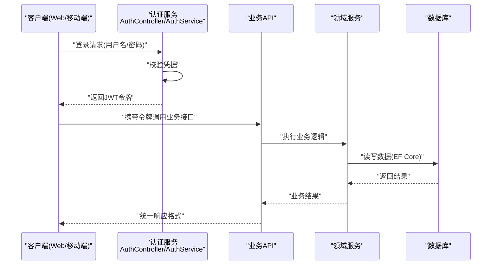

图表来源
- [AuthController.cs:1-200](file://dip-system/api/Controllers/AuthController.cs#L1-L200)
- [AuthService.cs:1-200](file://dip-system/api/Services/AuthService.cs#L1-L200)
- [JwtTokenService.cs:1-200](file://dip-system/api/Services/JwtTokenService.cs#L1-L200)
- [AppDbContext.cs:1-200](file://dip-system/api/Data/AppDbContext.cs#L1-L200)

## 详细组件分析

### 认证与授权
- 登录流程：客户端提交凭据，服务端校验后签发JWT；后续请求需携带令牌，服务端通过中间件与拦截器校验有效性
- 权限控制：基于角色的访问控制，结合过滤器对敏感接口进行鉴权
- 移动端鉴权：Retrofit拦截器自动附加令牌，TokenHolder集中管理令牌生命周期

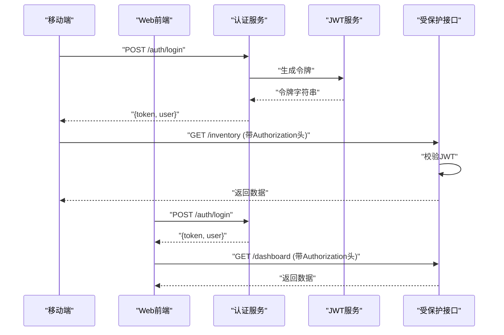

图表来源
- [AuthController.cs:1-200](file://dip-system/api/Controllers/AuthController.cs#L1-L200)
- [AuthService.cs:1-200](file://dip-system/api/Services/AuthService.cs#L1-L200)
- [JwtTokenService.cs:1-200](file://dip-system/api/Services/JwtTokenService.cs#L1-L200)
- [ApiService.kt:1-200](file://mobile-android/app/src/main/java/com/dip/material/data/network/ApiService.kt#L1-L200)
- [AuthInterceptor.kt:1-200](file://mobile-android/app/src/main/java/com/dip/material/data/network/AuthInterceptor.kt#L1-L200)
- [TokenHolder.kt:1-200](file://mobile-android/app/src/main/java/com/dip/material/data/network/TokenHolder.kt#L1-L200)
- [api.ts:1-200](file://dip-system/frontend-web/src/lib/api.ts#L1-L200)
- [auth.ts:1-200](file://dip-system/frontend-web/src/lib/auth.ts#L1-L200)

章节来源
- [AuthController.cs:1-200](file://dip-system/api/Controllers/AuthController.cs#L1-L200)
- [AuthService.cs:1-200](file://dip-system/api/Services/AuthService.cs#L1-L200)
- [JwtTokenService.cs:1-200](file://dip-system/api/Services/JwtTokenService.cs#L1-L200)
- [AuthInterceptor.kt:1-200](file://mobile-android/app/src/main/java/com/dip/material/data/network/AuthInterceptor.kt#L1-L200)
- [TokenHolder.kt:1-200](file://mobile-android/app/src/main/java/com/dip/material/data/network/TokenHolder.kt#L1-L200)
- [api.ts:1-200](file://dip-system/frontend-web/src/lib/api.ts#L1-L200)
- [auth.ts:1-200](file://dip-system/frontend-web/src/lib/auth.ts#L1-L200)

### 库存与主数据
- 物料主数据：物料编码、描述、规格、单位、供应商、安全库存、批次与效期策略
- 库位管理：仓库、库区、货架、库位层级，支持条码标识
- 库存台账：实时库存、在途、锁定、可用量，支持批次追踪与先进先出

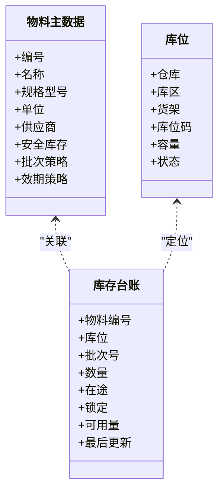

图表来源
- [PartsController.cs:1-200](file://dip-system/api/Controllers/PartsController.cs#L1-L200)
- [PartService.cs:1-200](file://dip-system/api/Services/PartService.cs#L1-L200)
- [LocationsController.cs:1-200](file://dip-system/api/Controllers/LocationsController.cs#L1-L200)
- [LocationService.cs:1-200](file://dip-system/api/Services/LocationService.cs#L1-L200)
- [InventoryController.cs:1-200](file://dip-system/api/Controllers/InventoryController.cs#L1-L200)
- [InventoryService.cs:1-200](file://dip-system/api/Services/InventoryService.cs#L1-L200)
- [Inventory.cs:1-200](file://dip-system/api/Models/Inventory.cs#L1-L200)
- [Master.cs:1-200](file://dip-system/api/Models/Master.cs#L1-L200)

章节来源
- [PartsController.cs:1-200](file://dip-system/api/Controllers/PartsController.cs#L1-L200)
- [PartService.cs:1-200](file://dip-system/api/Services/PartService.cs#L1-L200)
- [LocationsController.cs:1-200](file://dip-system/api/Controllers/LocationsController.cs#L1-L200)
- [LocationService.cs:1-200](file://dip-system/api/Services/LocationService.cs#L1-L200)
- [InventoryController.cs:1-200](file://dip-system/api/Controllers/InventoryController.cs#L1-L200)
- [InventoryService.cs:1-200](file://dip-system/api/Services/InventoryService.cs#L1-L200)
- [Inventory.cs:1-200](file://dip-system/api/Models/Inventory.cs#L1-L200)
- [Master.cs:1-200](file://dip-system/api/Models/Master.cs#L1-L200)

### 备料与发料流程
- 备料：根据工单BOM生成备料清单，支持扫码拣选与差异校验
- 发料：按工单与工序发料，扣减库存并记录批次与库位
- 补料：产线消耗触发补料申请，自动匹配库存并执行出库
- 退料：剩余物料退回仓库，更新库存与工单消耗

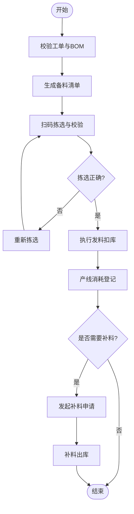

图表来源
- [PrepController.cs:1-200](file://dip-system/api/Controllers/PrepController.cs#L1-L200)
- [PrepService.cs:1-200](file://dip-system/api/Services/PrepService.cs#L1-L200)
- [OutboundController.cs:1-200](file://dip-system/api/Controllers/OutboundController.cs#L1-L200)
- [OutboundService.cs:1-200](file://dip-system/api/Services/OutboundService.cs#L1-L200)
- [RefillController.cs:1-200](file://dip-system/api/Controllers/RefillController.cs#L1-L200)
- [RefillService.cs:1-200](file://dip-system/api/Services/RefillService.cs#L1-L200)
- [Prep.cs:1-200](file://dip-system/api/Models/Prep.cs#L1-L200)
- [Outbound.cs:1-200](file://dip-system/api/Models/Outbound.cs#L1-L200)
- [Refill.cs:1-200](file://dip-system/api/Models/Refill.cs#L1-L200)

章节来源
- [PrepController.cs:1-200](file://dip-system/api/Controllers/PrepController.cs#L1-L200)
- [PrepService.cs:1-200](file://dip-system/api/Services/PrepService.cs#L1-L200)
- [OutboundController.cs:1-200](file://dip-system/api/Controllers/OutboundController.cs#L1-L200)
- [OutboundService.cs:1-200](file://dip-system/api/Services/OutboundService.cs#L1-L200)
- [RefillController.cs:1-200](file://dip-system/api/Controllers/RefillController.cs#L1-L200)
- [RefillService.cs:1-200](file://dip-system/api/Services/RefillService.cs#L1-L200)
- [Prep.cs:1-200](file://dip-system/api/Models/Prep.cs#L1-L200)
- [Outbound.cs:1-200](file://dip-system/api/Models/Outbound.cs#L1-L200)
- [Refill.cs:1-200](file://dip-system/api/Models/Refill.cs#L1-L200)

### 替代料管理
- 替代关系：定义原物料与替代物料的等效关系与优先级
- 替代申请：产线因缺料发起替代申请，主管审批后生效
- 替代记录：记录替代原因、数量、批次与操作人，支持追溯

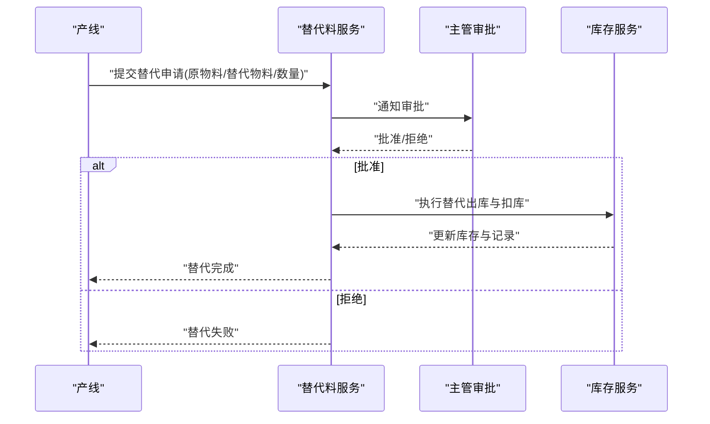

图表来源
- [SubstituteController.cs:1-200](file://dip-system/api/Controllers/SubstituteController.cs#L1-L200)
- [SubstituteService.cs:1-200](file://dip-system/api/Services/SubstituteService.cs#L1-L200)
- [SubstituteRecord.cs:1-200](file://dip-system/api/Models/SubstituteRecord.cs#L1-L200)
- [InventoryController.cs:1-200](file://dip-system/api/Controllers/InventoryController.cs#L1-L200)
- [InventoryService.cs:1-200](file://dip-system/api/Services/InventoryService.cs#L1-L200)

章节来源
- [SubstituteController.cs:1-200](file://dip-system/api/Controllers/SubstituteController.cs#L1-L200)
- [SubstituteService.cs:1-200](file://dip-system/api/Services/SubstituteService.cs#L1-L200)
- [SubstituteRecord.cs:1-200](file://dip-system/api/Models/SubstituteRecord.cs#L1-L200)
- [InventoryController.cs:1-200](file://dip-system/api/Controllers/InventoryController.cs#L1-L200)
- [InventoryService.cs:1-200](file://dip-system/api/Services/InventoryService.cs#L1-L200)

### 调拨、退料与盘点
- 调拨：跨仓库/库位移动库存，记录调拨单与批次流向
- 退料：产线剩余物料退回仓库，更新可用量与工单消耗
- 盘点：循环盘点与全盘，差异调整与审计

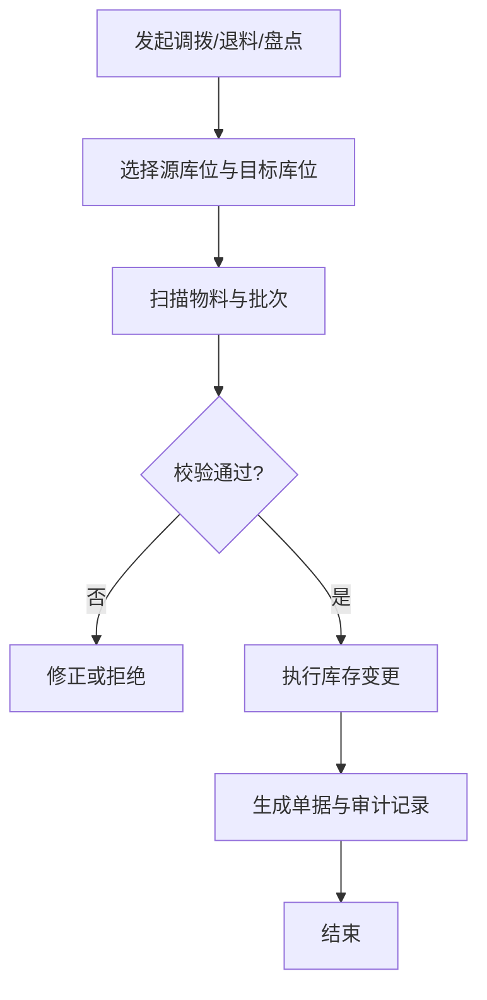

图表来源
- [TransferController.cs:1-200](file://dip-system/api/Controllers/TransferController.cs#L1-L200)
- [TransferService.cs:1-200](file://dip-system/api/Services/TransferService.cs#L1-L200)
- [ReturnController.cs:1-200](file://dip-system/api/Controllers/ReturnController.cs#L1-L200)
- [ReturnService.cs:1-200](file://dip-system/api/Services/ReturnService.cs#L1-L200)
- [StockCountController.cs:1-200](file://dip-system/api/Controllers/StockCountController.cs#L1-L200)
- [StockCountService.cs:1-200](file://dip-system/api/Services/StockCountService.cs#L1-L200)
- [Transfer.cs:1-200](file://dip-system/api/Models/Transfer.cs#L1-L200)
- [Return.cs:1-200](file://dip-system/api/Models/Return.cs#L1-L200)
- [StockCount.cs:1-200](file://dip-system/api/Models/StockCount.cs#L1-L200)

章节来源
- [TransferController.cs:1-200](file://dip-system/api/Controllers/TransferController.cs#L1-L200)
- [TransferService.cs:1-200](file://dip-system/api/Services/TransferService.cs#L1-L200)
- [ReturnController.cs:1-200](file://dip-system/api/Controllers/ReturnController.cs#L1-L200)
- [ReturnService.cs:1-200](file://dip-system/api/Services/ReturnService.cs#L1-L200)
- [StockCountController.cs:1-200](file://dip-system/api/Controllers/StockCountController.cs#L1-L200)
- [StockCountService.cs:1-200](file://dip-system/api/Services/StockCountService.cs#L1-L200)
- [Transfer.cs:1-200](file://dip-system/api/Models/Transfer.cs#L1-L200)
- [Return.cs:1-200](file://dip-system/api/Models/Return.cs#L1-L200)
- [StockCount.cs:1-200](file://dip-system/api/Models/StockCount.cs#L1-L200)

### 异常与换线
- 异常上报：物料异常、设备异常、质量异常快速上报与跟踪
- 换线管理：切换产品与BOM，准备新工单与物料，记录换线时间与影响

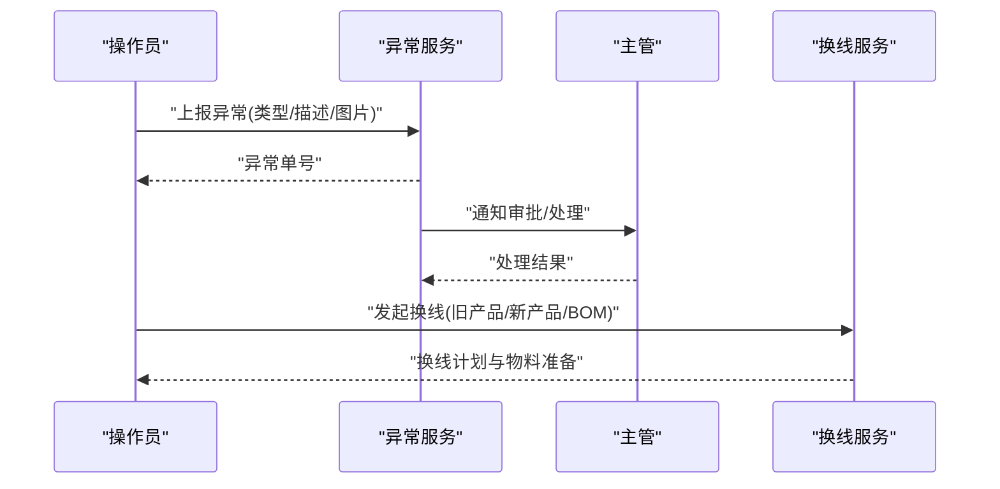

图表来源
- [AbnormalController.cs:1-200](file://dip-system/api/Controllers/AbnormalController.cs#L1-L200)
- [AbnormalService.cs:1-200](file://dip-system/api/Services/AbnormalService.cs#L1-L200)
- [ChangeoverController.cs:1-200](file://dip-system/api/Controllers/ChangeoverController.cs#L1-L200)
- [ChangeoverService.cs:1-200](file://dip-system/api/Services/ChangeoverService.cs#L1-L200)
- [Abnormal.cs:1-200](file://dip-system/api/Models/Abnormal.cs#L1-L200)
- [Changeover.cs:1-200](file://dip-system/api/Models/Changeover.cs#L1-L200)

章节来源
- [AbnormalController.cs:1-200](file://dip-system/api/Controllers/AbnormalController.cs#L1-L200)
- [AbnormalService.cs:1-200](file://dip-system/api/Services/AbnormalService.cs#L1-L200)
- [ChangeoverController.cs:1-200](file://dip-system/api/Controllers/ChangeoverController.cs#L1-L200)
- [ChangeoverService.cs:1-200](file://dip-system/api/Services/ChangeoverService.cs#L1-L200)
- [Abnormal.cs:1-200](file://dip-system/api/Models/Abnormal.cs#L1-L200)
- [Changeover.cs:1-200](file://dip-system/api/Models/Changeover.cs#L1-L200)

### 看板与报表
- 在线状态：人员与设备在线状态监控
- 看板指标：库存健康度、缺料预警、替代率、盘点差异
- 报表导出：库存周转、出入库明细、替代与异常统计

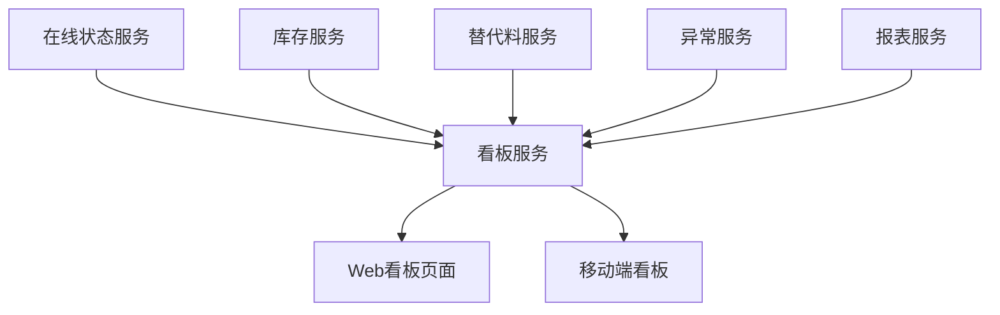

图表来源
- [OnlineController.cs:1-200](file://dip-system/api/Controllers/OnlineController.cs#L1-L200)
- [OnlineService.cs:1-200](file://dip-system/api/Services/OnlineService.cs#L1-L200)
- [DashboardController.cs:1-200](file://dip-system/api/Controllers/DashboardController.cs#L1-L200)
- [DashboardService.cs:1-200](file://dip-system/api/Services/DashboardService.cs#L1-L200)
- [ReportController.cs:1-200](file://dip-system/api/Controllers/ReportController.cs#L1-L200)
- [ReportService.cs:1-200](file://dip-system/api/Services/ReportService.cs#L1-L200)

章节来源
- [OnlineController.cs:1-200](file://dip-system/api/Controllers/OnlineController.cs#L1-L200)
- [OnlineService.cs:1-200](file://dip-system/api/Services/OnlineService.cs#L1-L200)
- [DashboardController.cs:1-200](file://dip-system/api/Controllers/DashboardController.cs#L1-L200)
- [DashboardService.cs:1-200](file://dip-system/api/Services/DashboardService.cs#L1-L200)
- [ReportController.cs:1-200](file://dip-system/api/Controllers/ReportController.cs#L1-L200)
- [ReportService.cs:1-200](file://dip-system/api/Services/ReportService.cs#L1-L200)

### 前端与移动端
- Web前端：React+TS，统一API封装与鉴权拦截，页面级路由与组件化
- 移动端：Kotlin+Compose，扫码采集、离线缓存、错误提示与导航
- 扫码能力：条码/二维码解析、扫描回调总线、声音反馈与相机覆盖层

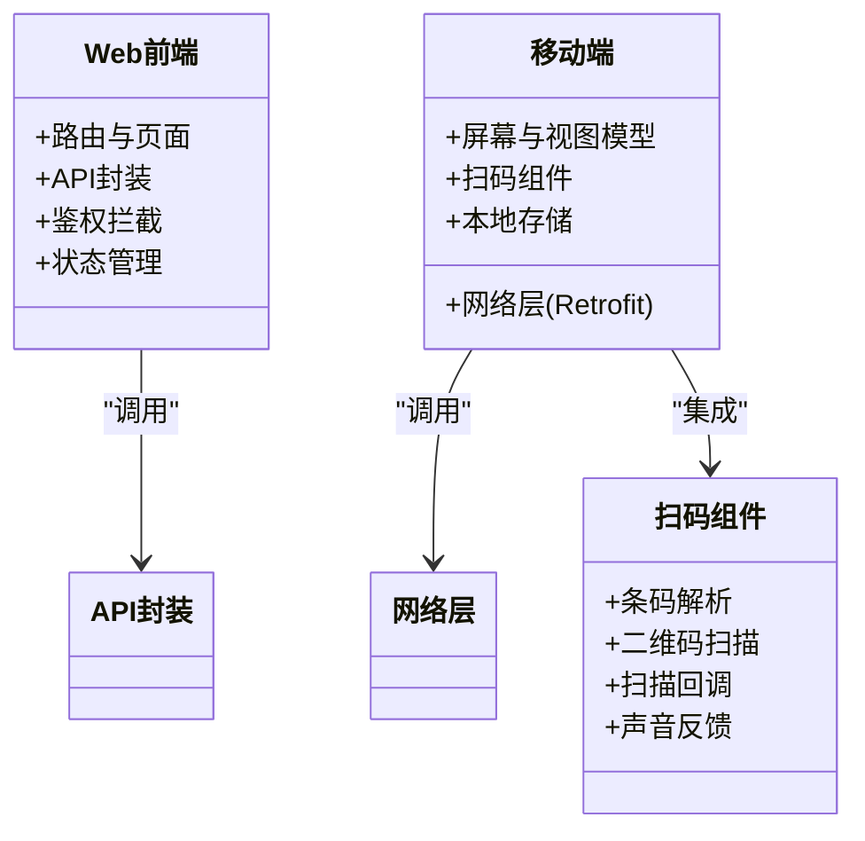

图表来源
- [main.tsx:1-200](file://dip-system/frontend-web/src/main.tsx#L1-L200)
- [App.tsx:1-200](file://dip-system/frontend-web/src/App.tsx#L1-L200)
- [api.ts:1-200](file://dip-system/frontend-web/src/lib/api.ts#L1-L200)
- [auth.ts:1-200](file://dip-system/frontend-web/src/lib/auth.ts#L1-L200)
- [ApiService.kt:1-200](file://mobile-android/app/src/main/java/com/dip/material/data/network/ApiService.kt#L1-L200)
- [RetrofitClient.kt:1-200](file://mobile-android/app/src/main/java/com/dip/material/data/network/RetrofitClient.kt#L1-L200)
- [AuthInterceptor.kt:1-200](file://mobile-android/app/src/main/java/com/dip/material/data/network/AuthInterceptor.kt#L1-L200)
- [TokenHolder.kt:1-200](file://mobile-android/app/src/main/java/com/dip/material/data/network/TokenHolder.kt#L1-L200)
- [BarcodeAnalyzer.kt:1-200](file://mobile-android/app/src/main/java/com/dip/material/ui/components/BarcodeAnalyzer.kt#L1-L200)
- [QrCodeScanner.kt:1-200](file://mobile-android/app/src/main/java/com/dip/material/ui/components/QrCodeScanner.kt#L1-L200)
- [ScanBus.kt:1-200](file://mobile-android/app/src/main/java/com/dip/material/utils/ScanBus.kt#L1-L200)
- [ScanConfig.kt:1-200](file://mobile-android/app/src/main/java/com/dip/material/utils/ScanConfig.kt#L1-L200)
- [ScanSoundManager.kt:1-200](file://mobile-android/app/src/main/java/com/dip/material/utils/ScanSoundManager.kt#L1-L200)

章节来源
- [main.tsx:1-200](file://dip-system/frontend-web/src/main.tsx#L1-L200)
- [App.tsx:1-200](file://dip-system/frontend-web/src/App.tsx#L1-L200)
- [api.ts:1-200](file://dip-system/frontend-web/src/lib/api.ts#L1-L200)
- [auth.ts:1-200](file://dip-system/frontend-web/src/lib/auth.ts#L1-L200)
- [ApiService.kt:1-200](file://mobile-android/app/src/main/java/com/dip/material/data/network/ApiService.kt#L1-L200)
- [RetrofitClient.kt:1-200](file://mobile-android/app/src/main/java/com/dip/material/data/network/RetrofitClient.kt#L1-L200)
- [AuthInterceptor.kt:1-200](file://mobile-android/app/src/main/java/com/dip/material/data/network/AuthInterceptor.kt#L1-L200)
- [TokenHolder.kt:1-200](file://mobile-android/app/src/main/java/com/dip/material/data/network/TokenHolder.kt#L1-L200)
- [BarcodeAnalyzer.kt:1-200](file://mobile-android/app/src/main/java/com/dip/material/ui/components/BarcodeAnalyzer.kt#L1-L200)
- [QrCodeScanner.kt:1-200](file://mobile-android/app/src/main/java/com/dip/material/ui/components/QrCodeScanner.kt#L1-L200)
- [ScanBus.kt:1-200](file://mobile-android/app/src/main/java/com/dip/material/utils/ScanBus.kt#L1-L200)
- [ScanConfig.kt:1-200](file://mobile-android/app/src/main/java/com/dip/material/utils/ScanConfig.kt#L1-L200)
- [ScanSoundManager.kt:1-200](file://mobile-android/app/src/main/java/com/dip/material/utils/ScanSoundManager.kt#L1-L200)

## 依赖分析
- 控制器与服务层解耦：每个业务域独立控制器与服务，便于扩展与维护
- EF Core数据访问：统一上下文与实体映射，支持事务与审计
- 前端与移动端共享API契约：统一响应格式与错误码
- 容器化部署：docker-compose编排后端、数据库与反向代理

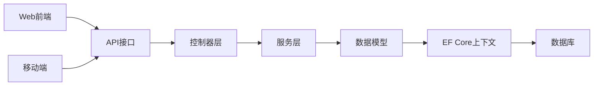

图表来源
- [Program.cs:1-200](file://dip-system/api/Program.cs#L1-L200)
- [AppDbContext.cs:1-200](file://dip-system/api/Data/AppDbContext.cs#L1-L200)
- [docker-compose.yml:1-200](file://dip-system/docker-compose.yml#L1-L200)

章节来源
- [Program.cs:1-200](file://dip-system/api/Program.cs#L1-L200)
- [AppDbContext.cs:1-200](file://dip-system/api/Data/AppDbContext.cs#L1-L200)
- [docker-compose.yml:1-200](file://dip-system/docker-compose.yml#L1-L200)

## 性能考虑
- 数据库索引：对高频查询字段建立索引（物料编码、库位、批次、时间戳）
- 分页与懒加载：列表接口默认分页，避免大数据量传输
- 缓存策略：热点数据（如主数据、字典）使用内存缓存
- 并发控制：库存扣减使用乐观锁或分布式锁，防止超卖
- 异步处理：耗时操作（报表生成、消息通知）异步执行
- 前端优化：组件懒加载、图片压缩与CDN加速

[本节为通用指导，无需特定文件引用]

## 故障排查指南
- 认证失败：检查JWT配置、令牌有效期与拦截器是否正确注入
- 数据库连接：验证连接字符串、端口与防火墙规则
- 接口报错：查看统一异常过滤器日志与响应体错误信息
- 扫码异常：确认相机权限、扫描SDK版本与回调总线订阅
- 性能问题：分析慢查询、缓存命中率与并发冲突

章节来源
- [AppExceptionFilter.cs:1-200](file://dip-system/api/Controllers/AppExceptionFilter.cs#L1-L200)
- [ApiResponse.cs:1-200](file://dip-system/api/Models/ApiResponse.cs#L1-L200)
- [LocalDateTimeConverter.cs:1-200](file://dip-system/api/Converters/LocalDateTimeConverter.cs#L1-L200)
- [ScanBus.kt:1-200](file://mobile-android/app/src/main/java/com/dip/material/utils/ScanBus.kt#L1-L200)
- [ScanConfig.kt:1-200](file://mobile-android/app/src/main/java/com/dip/material/utils/ScanConfig.kt#L1-L200)
- [ScanSoundManager.kt:1-200](file://mobile-android/app/src/main/java/com/dip/material/utils/ScanSoundManager.kt#L1-L200)

## 结论
本系统通过统一的物料主数据、库存台账与作业流程闭环，有效解决传统纸质记录效率低、物料准备不及时、替代料管理混乱等痛点，显著提升SMT产线的物料管理效率、减少停机时间并优化库存周转率。系统采用前后端分离与多端协同架构，具备高可扩展性与可维护性，适合制造企业的数字化升级与持续演进。

[本节为总结性内容，无需特定文件引用]

## 附录
- 部署清单：后端镜像、数据库镜像、反向代理与域名配置
- 初始化脚本：数据库表结构与基础数据初始化
- 用户手册：各角色操作流程与最佳实践

章节来源
- [docker-compose.yml:1-200](file://dip-system/docker-compose.yml#L1-L200)
- [init-db.sql:1-200](file://scripts/init-db.sql#L1-L200)