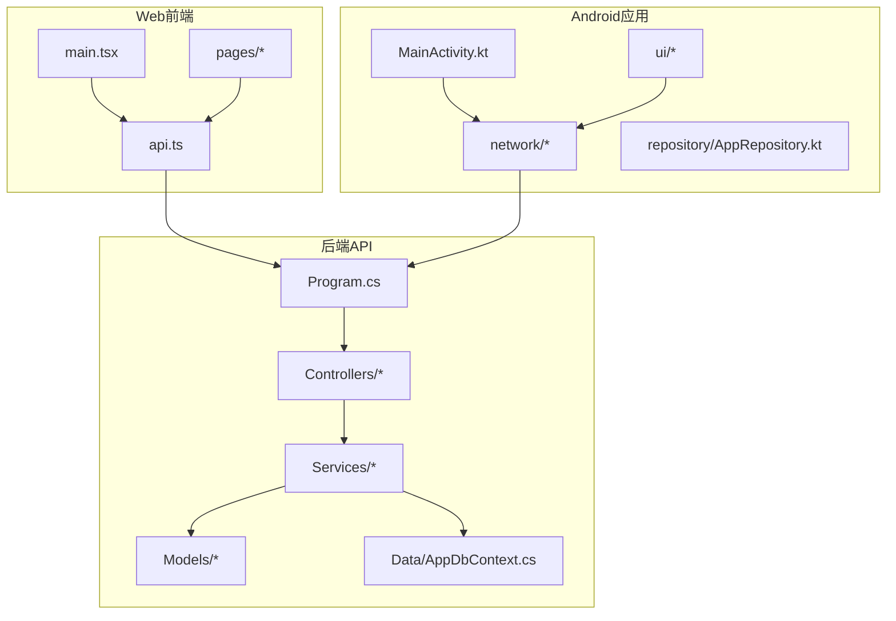
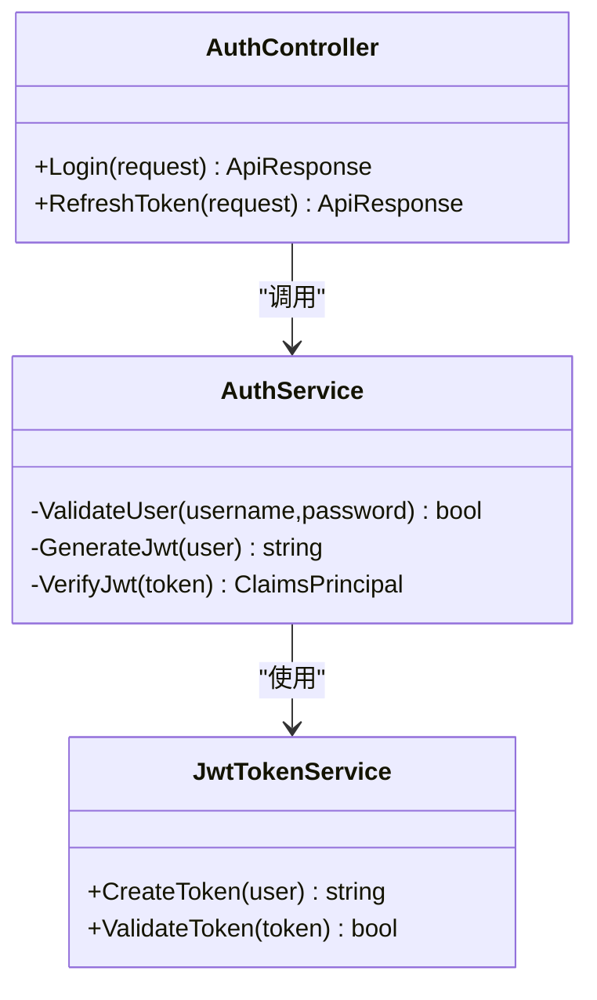
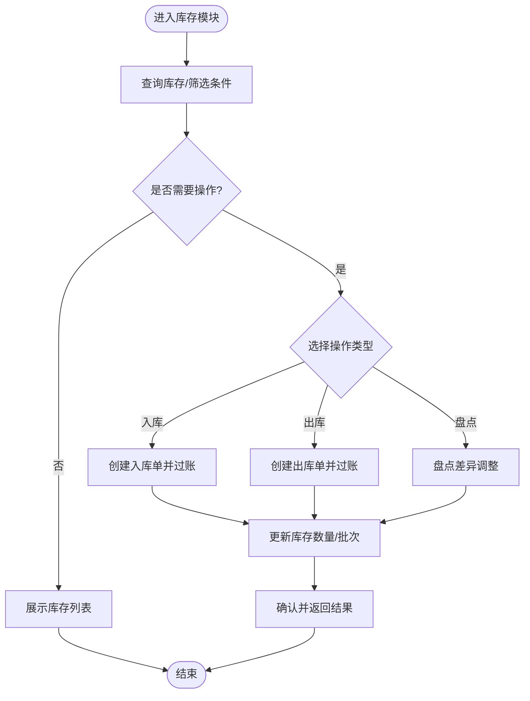
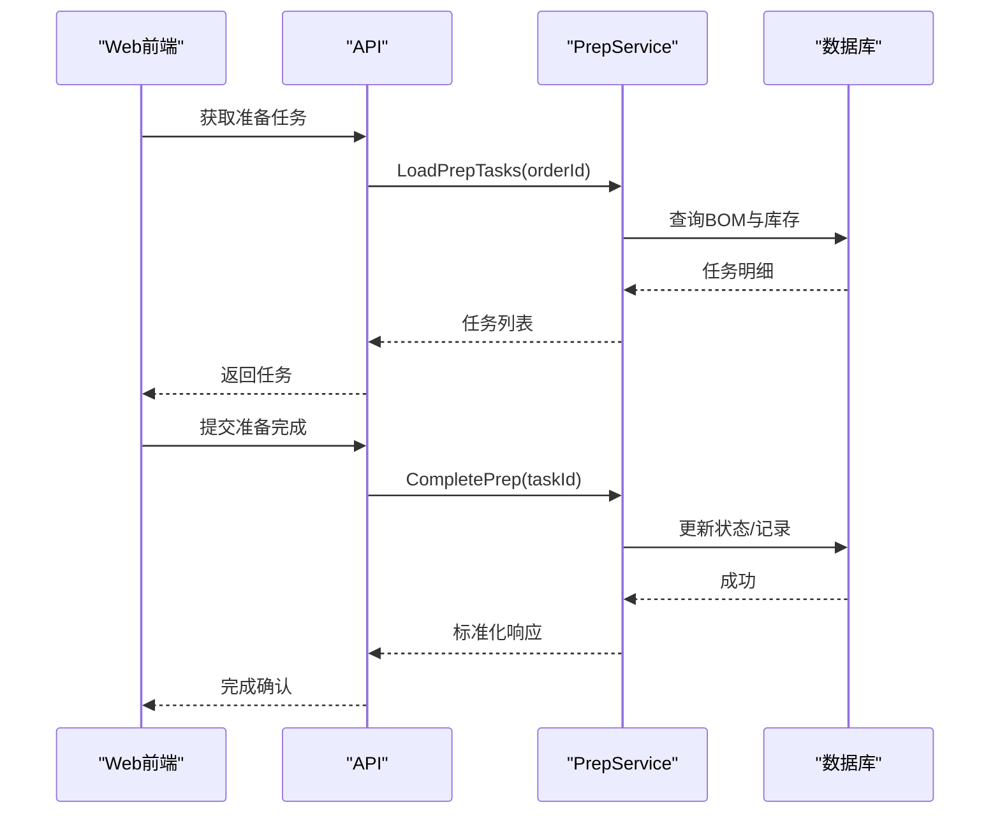
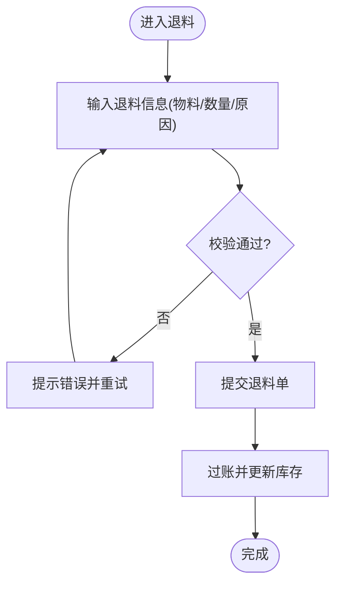
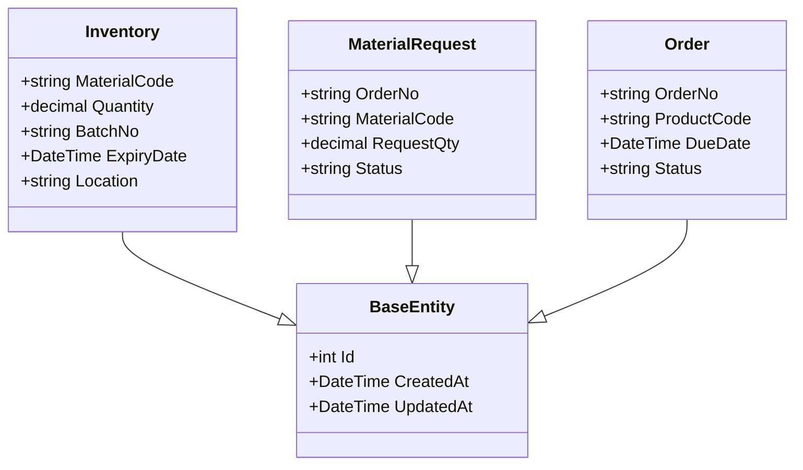
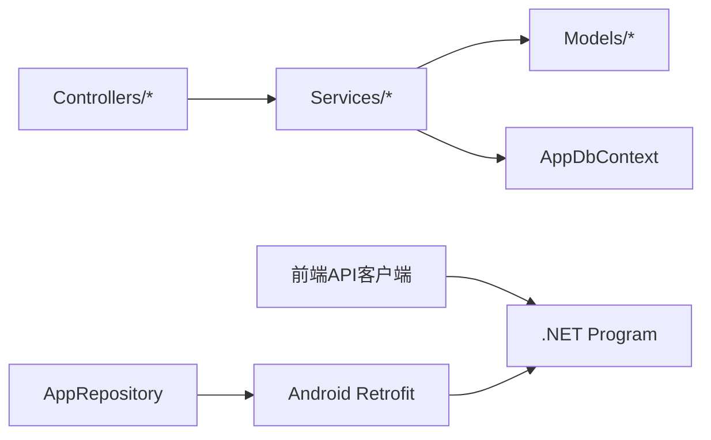

# 项目概览

<cite>
**本文引用的文件**   
- [Program.cs](file://dip-system/api/Program.cs)
- [appsettings.json](file://dip-system/api/appsettings.json)
- [AppDbContext.cs](file://dip-system/api/Data/AppDbContext.cs)
- [AuthController.cs](file://dip-system/api/Controllers/AuthController.cs)
- [InventoryController.cs](file://dip-system/api/Controllers/InventoryController.cs)
- [PrepController.cs](file://dip-system/api/Controllers/PrepController.cs)
- [RefillController.cs](file://dip-system/api/Controllers/RefillController.cs)
- [ReturnController.cs](file://dip-system/api/Controllers/ReturnController.cs)
- [SubstituteController.cs](file://dip-system/api/Controllers/SubstituteController.cs)
- [ChangeoverController.cs](file://dip-system/api/Controllers/ChangeoverController.cs)
- [AuthService.cs](file://dip-system/api/Services/AuthService.cs)
- [InventoryService.cs](file://dip-system/api/Services/InventoryService.cs)
- [PrepService.cs](file://dip-system/api/Services/PrepService.cs)
- [RefillService.cs](file://dip-system/api/Services/RefillService.cs)
- [ReturnService.cs](file://dip-system/api/Services/ReturnService.cs)
- [SubstituteService.cs](file://dip-system/api/Services/SubstituteService.cs)
- [ChangeoverService.cs](file://dip-system/api/Services/ChangeoverService.cs)
- [ApiResponse.cs](file://dip-system/api/Models/ApiResponse.cs)
- [BaseEntity.cs](file://dip-system/api/Models/BaseEntity.cs)
- [Inventory.cs](file://dip-system/api/Models/Inventory.cs)
- [MaterialRequest.cs](file://dip-system/api/Models/MaterialRequest.cs)
- [Order.cs](file://dip-system/api/Models/Order.cs)
- [Vite配置](file://dip-system/frontend-web/vite.config.ts)
- [前端入口](file://dip-system/frontend-web/src/main.tsx)
- [API客户端](file://dip-system/frontend-web/src/lib/api.ts)
- [登录页](file://dip-system/frontend-web/src/pages/Login.tsx)
- [库存列表页](file://dip-system/frontend-web/src/pages/InventoryList.tsx)
- [准备物料页](file://dip-system/frontend-web/src/pages/PrepList.tsx)
- [补料页](file://dip-system/frontend-web/src/pages/RefillList.tsx)
- [退料页](file://dip-system/frontend-web/src/pages/ReturnList.tsx)
- [替代料页](file://dip-system/frontend-web/src/pages/SubstituteList.tsx)
- [换线页](file://dip-system/frontend-web/src/pages/ChangeoverList.tsx)
- [Android应用清单](file://mobile-android/app/src/main/AndroidManifest.xml)
- [主Activity](file://mobile-android/app/src/main/java/com/dip/material/MainActivity.kt)
- [网络接口定义](file://mobile-android/app/src/main/java/com/dip/material/data/network/ApiService.kt)
- [Retrofit客户端](file://mobile-android/app/src/main/java/com/dip/material/data/network/RetrofitClient.kt)
- [认证拦截器](file://mobile-android/app/src/main/java/com/dip/material/data/network/AuthInterceptor.kt)
- [仓库类](file://mobile-android/app/src/main/java/com/dip/material/data/repository/AppRepository.kt)
- [补料界面](file://mobile-android/app/src/main/java/com/dip/material/ui/refill/RefillScreen.kt)
- [补料视图模型](file://mobile-android/app/src/main/java/com/dip/material/ui/refill/RefillViewModel.kt)
- [准备物料界面](file://mobile-android/app/src/main/java/com/dip/material/ui/prep/PrepScreen.kt)
- [准备物料视图模型](file://mobile-android/app/src/main/java/com/dip/material/ui/prep/PrepViewModel.kt)
- [退料界面](file://mobile-android/app/src/main/java/com/dip/material/ui/return_/ReturnScreen.kt)
- [退料视图模型](file://mobile-android/app/src/main/java/com/dip/material/ui/return_/ReturnViewModel.kt)
- [替代料界面](file://mobile-android/app/src/main/java/com/dip/material/ui/substitute/SubstituteScreen.kt)
- [替代料视图模型](file://mobile-android/app/src/main/java/com/dip/material/ui/substitute/SubstituteViewModel.kt)
- [换线界面](file://mobile-android/app/src/main/java/com/dip/material/ui/changeover/ChangeoverScreen.kt)
- [换线视图模型](file://mobile-android/app/src/main/java/com/dip/material/ui/changeover/ChangeoverViewModel.kt)
- [初始化SQL脚本](file://scripts/init-db.sql)
- [Docker Compose](file://dip-system/docker-compose.yml)
</cite>

## 目录
1. [简介](#简介)
2. [项目结构](#项目结构)
3. [核心组件](#核心组件)
4. [架构总览](#架构总览)
5. [详细组件分析](#详细组件分析)
6. [依赖关系分析](#依赖关系分析)
7. [性能考虑](#性能考虑)
8. [故障排查指南](#故障排查指南)
9. [结论](#结论)
10. [附录：快速入门](#附录快速入门)

## 简介
本系统为面向制造业的DIP物料管理系统，覆盖物料准备、补料、退料、换线、替代料管理与库存管理等核心业务场景。系统由三大部分组成：
- Web前端（React + TypeScript）：提供可视化操作与报表展示
- 后端API（C# .NET）：统一对外暴露REST API，承载业务逻辑与数据持久化
- Android移动应用（Kotlin + Jetpack Compose）：现场扫码、快速作业与离线友好交互

技术栈选择基于团队能力与生态成熟度：后端采用C# .NET，前端采用React，移动端采用Kotlin。部署上支持容器化编排，便于在工厂内网或云端快速落地。

## 项目结构
仓库包含三大子系统与配套资源：
- dip-system/api：.NET Web API，含控制器、服务层、数据模型、数据库上下文与配置
- dip-system/frontend-web：React前端工程，使用Vite构建，页面按功能模块组织
- mobile-android：Android原生应用，采用MVVM与Compose UI，通过Retrofit访问后端API
- scripts：数据库初始化脚本
- docker-compose.yml：一键编排后端与数据库等依赖



图表来源
- [Program.cs](file://dip-system/api/Program.cs)
- [Vite配置](file://dip-system/frontend-web/vite.config.ts)
- [前端入口](file://dip-system/frontend-web/src/main.tsx)
- [Android应用清单](file://mobile-android/app/src/main/AndroidManifest.xml)
- [主Activity](file://mobile-android/app/src/main/java/com/dip/material/MainActivity.kt)

章节来源
- [Program.cs](file://dip-system/api/Program.cs)
- [appsettings.json](file://dip-system/api/appsettings.json)
- [Vite配置](file://dip-system/frontend-web/vite.config.ts)
- [前端入口](file://dip-system/frontend-web/src/main.tsx)
- [Android应用清单](file://mobile-android/app/src/main/AndroidManifest.xml)

## 核心组件
- 认证与授权：JWT令牌签发与校验，前后端共享安全上下文
- 库存管理：出入库、盘点、位置管理、批次与效期跟踪
- 物料准备：根据工单/BOM生成备料任务，支持扫码核对
- 补料流程：生产缺料时发起补料申请与执行
- 退料流程：剩余物料退回仓库，记录原因与去向
- 替代料管理：替代料策略、审批与记录追溯
- 换线管理：产线切换计划、物料清场与确认
- 在线监控：设备/工位在线状态与实时看板

章节来源
- [AuthController.cs](file://dip-system/api/Controllers/AuthController.cs)
- [AuthService.cs](file://dip-system/api/Services/AuthService.cs)
- [InventoryController.cs](file://dip-system/api/Controllers/InventoryController.cs)
- [InventoryService.cs](file://dip-system/api/Services/InventoryService.cs)
- [PrepController.cs](file://dip-system/api/Controllers/PrepController.cs)
- [PrepService.cs](file://dip-system/api/Services/PrepService.cs)
- [RefillController.cs](file://dip-system/api/Controllers/RefillController.cs)
- [RefillService.cs](file://dip-system/api/Services/RefillService.cs)
- [ReturnController.cs](file://dip-system/api/Controllers/ReturnController.cs)
- [ReturnService.cs](file://dip-system/api/Services/ReturnService.cs)
- [SubstituteController.cs](file://dip-system/api/Controllers/SubstituteController.cs)
- [SubstituteService.cs](file://dip-system/api/Services/SubstituteService.cs)
- [ChangeoverController.cs](file://dip-system/api/Controllers/ChangeoverController.cs)
- [ChangeoverService.cs](file://dip-system/api/Services/ChangeoverService.cs)

## 架构总览
系统采用前后端分离与移动端直连API的分层架构。Web前端与Android应用均通过HTTP调用后端API；后端以.NET Web API为核心，结合EF Core进行数据访问，统一返回标准响应体。

```mermaid
sequenceDiagram
participant U as "用户"
participant FE as "Web前端"
participant AND as "Android应用"
participant API as ".NET API"
participant SVC as "服务层"
participant DB as "数据库"
U->>FE : 打开登录页
FE->>API : POST /auth/login
API->>SVC : 验证凭据
SVC->>DB : 查询用户
DB-->>SVC : 用户信息
SVC-->>API : 返回令牌
API-->>FE : {token, user}
U->>AND : 启动补料
AND->>API : GET/POST 补料相关接口
API->>SVC : 执行业务逻辑
SVC->>DB : 读写库存/记录
DB-->>SVC : 结果
SVC-->>API : 标准化响应
API-->>AND : 成功/失败
```

图表来源
- [前端入口](file://dip-system/frontend-web/src/main.tsx)
- [API客户端](file://dip-system/frontend-web/src/lib/api.ts)
- [AuthController.cs](file://dip-system/api/Controllers/AuthController.cs)
- [AuthService.cs](file://dip-system/api/Services/AuthService.cs)
- [AppDbContext.cs](file://dip-system/api/Data/AppDbContext.cs)
- [Android应用清单](file://mobile-android/app/src/main/AndroidManifest.xml)
- [Retrofit客户端](file://mobile-android/app/src/main/java/com/dip/material/data/network/RetrofitClient.kt)

## 详细组件分析

### 认证与授权
- 后端提供登录接口，校验用户名密码后签发JWT；后续请求需携带令牌
- 前端在登录后保存令牌并在请求头中附加；移动端通过拦截器自动注入令牌
- 错误码与消息统一封装，便于两端一致处理



图表来源
- [AuthController.cs](file://dip-system/api/Controllers/AuthController.cs)
- [AuthService.cs](file://dip-system/api/Services/AuthService.cs)

章节来源
- [AuthController.cs](file://dip-system/api/Controllers/AuthController.cs)
- [AuthService.cs](file://dip-system/api/Services/AuthService.cs)
- [ApiResponse.cs](file://dip-system/api/Models/ApiResponse.cs)
- [API客户端](file://dip-system/frontend-web/src/lib/api.ts)
- [认证拦截器](file://mobile-android/app/src/main/java/com/dip/material/data/network/AuthInterceptor.kt)

### 库存管理
- 提供库存查询、入库、出库、盘点、位置管理等接口
- 数据模型包含批次、效期、库位、单位换算等字段
- 前端与移动端分别提供库存列表与操作界面



图表来源
- [InventoryController.cs](file://dip-system/api/Controllers/InventoryController.cs)
- [InventoryService.cs](file://dip-system/api/Services/InventoryService.cs)
- [Inventory.cs](file://dip-system/api/Models/Inventory.cs)
- [库存列表页](file://dip-system/frontend-web/src/pages/InventoryList.tsx)

章节来源
- [InventoryController.cs](file://dip-system/api/Controllers/InventoryController.cs)
- [InventoryService.cs](file://dip-system/api/Services/InventoryService.cs)
- [Inventory.cs](file://dip-system/api/Models/Inventory.cs)
- [库存列表页](file://dip-system/frontend-web/src/pages/InventoryList.tsx)

### 物料准备
- 根据订单/BOM生成备料任务，支持扫码核对物料编码与数量
- 前端与移动端提供准备任务列表与执行界面



图表来源
- [PrepController.cs](file://dip-system/api/Controllers/PrepController.cs)
- [PrepService.cs](file://dip-system/api/Services/PrepService.cs)
- [准备物料页](file://dip-system/frontend-web/src/pages/PrepList.tsx)
- [准备物料界面](file://mobile-android/app/src/main/java/com/dip/material/ui/prep/PrepScreen.kt)
- [准备物料视图模型](file://mobile-android/app/src/main/java/com/dip/material/ui/prep/PrepViewModel.kt)

章节来源
- [PrepController.cs](file://dip-system/api/Controllers/PrepController.cs)
- [PrepService.cs](file://dip-system/api/Services/PrepService.cs)
- [准备物料页](file://dip-system/frontend-web/src/pages/PrepList.tsx)
- [准备物料界面](file://mobile-android/app/src/main/java/com/dip/material/ui/prep/PrepScreen.kt)
- [准备物料视图模型](file://mobile-android/app/src/main/java/com/dip/material/ui/prep/PrepViewModel.kt)

### 补料流程
- 生产缺料时发起补料申请，支持扫码与批量录入
- 移动端提供补料界面与视图模型，简化现场操作

```mermaid
sequenceDiagram
participant AND as "Android应用"
participant API as "API"
participant SVC as "RefillService"
participant DB as "数据库"
AND->>API : 提交补料申请
API->>SVC : CreateRefill(request)
SVC->>DB : 写入补料记录/扣减可用量
DB-->>SVC : 成功
SVC-->>API : 标准化响应
API-->>AND : 补料成功
```

图表来源
- [RefillController.cs](file://dip-system/api/Controllers/RefillController.cs)
- [RefillService.cs](file://dip-system/api/Services/RefillService.cs)
- [补料界面](file://mobile-android/app/src/main/java/com/dip/material/ui/refill/RefillScreen.kt)
- [补料视图模型](file://mobile-android/app/src/main/java/com/dip/material/ui/refill/RefillViewModel.kt)

章节来源
- [RefillController.cs](file://dip-system/api/Controllers/RefillController.cs)
- [RefillService.cs](file://dip-system/api/Services/RefillService.cs)
- [补料界面](file://mobile-android/app/src/main/java/com/dip/material/ui/refill/RefillScreen.kt)
- [补料视图模型](file://mobile-android/app/src/main/java/com/dip/material/ui/refill/RefillViewModel.kt)

### 退料流程
- 将剩余物料退回仓库，记录原因、批次与去向
- 前端与移动端均提供退料操作界面



图表来源
- [ReturnController.cs](file://dip-system/api/Controllers/ReturnController.cs)
- [ReturnService.cs](file://dip-system/api/Services/ReturnService.cs)
- [退料页](file://dip-system/frontend-web/src/pages/ReturnList.tsx)
- [退料界面](file://mobile-android/app/src/main/java/com/dip/material/ui/return_/ReturnScreen.kt)
- [退料视图模型](file://mobile-android/app/src/main/java/com/dip/material/ui/return_/ReturnViewModel.kt)

章节来源
- [ReturnController.cs](file://dip-system/api/Controllers/ReturnController.cs)
- [ReturnService.cs](file://dip-system/api/Services/ReturnService.cs)
- [退料页](file://dip-system/frontend-web/src/pages/ReturnList.tsx)
- [退料界面](file://mobile-android/app/src/main/java/com/dip/material/ui/return_/ReturnScreen.kt)
- [退料视图模型](file://mobile-android/app/src/main/java/com/dip/material/ui/return_/ReturnViewModel.kt)

### 替代料管理
- 维护替代料关系与策略，支持审批与记录追溯
- 前端与移动端提供替代料选择与确认界面

```mermaid
sequenceDiagram
participant FE as "Web前端"
participant AND as "Android应用"
participant API as "API"
participant SVC as "SubstituteService"
participant DB as "数据库"
FE->>API : 查询可替代料
API->>SVC : GetSubstitutes(materialId)
SVC->>DB : 读取替代关系
DB-->>SVC : 替代列表
SVC-->>API : 返回列表
API-->>FE : 返回结果
AND->>API : 提交替代料使用
API->>SVC : UseSubstitute(request)
SVC->>DB : 记录使用与审批状态
DB-->>SVC : 成功
SVC-->>API : 标准化响应
API-->>AND : 确认成功
```

图表来源
- [SubstituteController.cs](file://dip-system/api/Controllers/SubstituteController.cs)
- [SubstituteService.cs](file://dip-system/api/Services/SubstituteService.cs)
- [替代料页](file://dip-system/frontend-web/src/pages/SubstituteList.tsx)
- [替代料界面](file://mobile-android/app/src/main/java/com/dip/material/ui/substitute/SubstituteScreen.kt)
- [替代料视图模型](file://mobile-android/app/src/main/java/com/dip/material/ui/substitute/SubstituteViewModel.kt)

章节来源
- [SubstituteController.cs](file://dip-system/api/Controllers/SubstituteController.cs)
- [SubstituteService.cs](file://dip-system/api/Services/SubstituteService.cs)
- [替代料页](file://dip-system/frontend-web/src/pages/SubstituteList.tsx)
- [替代料界面](file://mobile-android/app/src/main/java/com/dip/material/ui/substitute/SubstituteScreen.kt)
- [替代料视图模型](file://mobile-android/app/src/main/java/com/dip/material/ui/substitute/SubstituteViewModel.kt)

### 换线管理
- 管理产线换线计划、清场与确认，确保物料与工艺切换有序
- 前端与移动端提供换线任务与执行界面

```mermaid
sequenceDiagram
participant FE as "Web前端"
participant AND as "Android应用"
participant API as "API"
participant SVC as "ChangeoverService"
participant DB as "数据库"
FE->>API : 创建换线计划
API->>SVC : CreateChangeover(plan)
SVC->>DB : 写入计划与状态
DB-->>SVC : 成功
SVC-->>API : 返回计划ID
API-->>FE : 创建成功
AND->>API : 提交换线完成
API->>SVC : CompleteChangeover(id)
SVC->>DB : 更新状态/记录清场
DB-->>SVC : 成功
SVC-->>API : 标准化响应
API-->>AND : 完成确认
```

图表来源
- [ChangeoverController.cs](file://dip-system/api/Controllers/ChangeoverController.cs)
- [ChangeoverService.cs](file://dip-system/api/Services/ChangeoverService.cs)
- [换线页](file://dip-system/frontend-web/src/pages/ChangeoverList.tsx)
- [换线界面](file://mobile-android/app/src/main/java/com/dip/material/ui/changeover/ChangeoverScreen.kt)
- [换线视图模型](file://mobile-android/app/src/main/java/com/dip/material/ui/changeover/ChangeoverViewModel.kt)

章节来源
- [ChangeoverController.cs](file://dip-system/api/Controllers/ChangeoverController.cs)
- [ChangeoverService.cs](file://dip-system/api/Services/ChangeoverService.cs)
- [换线页](file://dip-system/frontend-web/src/pages/ChangeoverList.tsx)
- [换线界面](file://mobile-android/app/src/main/java/com/dip/material/ui/changeover/ChangeoverScreen.kt)
- [换线视图模型](file://mobile-android/app/src/main/java/com/dip/material/ui/changeover/ChangeoverViewModel.kt)

### 数据模型与基础实体
- BaseEntity提供通用字段（如ID、创建时间、更新时间等）
- Inventory、MaterialRequest、Order等业务模型描述核心实体关系



图表来源
- [BaseEntity.cs](file://dip-system/api/Models/BaseEntity.cs)
- [Inventory.cs](file://dip-system/api/Models/Inventory.cs)
- [MaterialRequest.cs](file://dip-system/api/Models/MaterialRequest.cs)
- [Order.cs](file://dip-system/api/Models/Order.cs)

章节来源
- [BaseEntity.cs](file://dip-system/api/Models/BaseEntity.cs)
- [Inventory.cs](file://dip-system/api/Models/Inventory.cs)
- [MaterialRequest.cs](file://dip-system/api/Models/MaterialRequest.cs)
- [Order.cs](file://dip-system/api/Models/Order.cs)

## 依赖关系分析
- 前端依赖后端API，通过统一的API客户端封装请求与鉴权
- 后端控制器依赖服务层，服务层依赖数据模型与数据库上下文
- Android应用通过Retrofit与拦截器访问后端，仓库类聚合网络与本地存储



图表来源
- [API客户端](file://dip-system/frontend-web/src/lib/api.ts)
- [Program.cs](file://dip-system/api/Program.cs)
- [AppDbContext.cs](file://dip-system/api/Data/AppDbContext.cs)
- [Retrofit客户端](file://mobile-android/app/src/main/java/com/dip/material/data/network/RetrofitClient.kt)
- [仓库类](file://mobile-android/app/src/main/java/com/dip/material/data/repository/AppRepository.kt)

章节来源
- [API客户端](file://dip-system/frontend-web/src/lib/api.ts)
- [Program.cs](file://dip-system/api/Program.cs)
- [AppDbContext.cs](file://dip-system/api/Data/AppDbContext.cs)
- [Retrofit客户端](file://mobile-android/app/src/main/java/com/dip/material/data/network/RetrofitClient.kt)
- [仓库类](file://mobile-android/app/src/main/java/com/dip/material/data/repository/AppRepository.kt)

## 性能考虑
- 数据库索引：对高频查询字段（物料编码、订单号、库位）建立索引，减少扫描
- 分页与过滤：列表接口默认分页，避免一次性加载大量数据
- 缓存策略：热点字典与配置可使用内存缓存，降低数据库压力
- 连接池：合理设置数据库连接池大小，避免并发瓶颈
- 前端优化：按需加载页面与组件，减少首屏体积
- 移动端优化：合理使用协程与缓存，提升扫码与网络请求体验

## 故障排查指南
- 认证失败：检查JWT令牌是否过期、请求头是否正确携带；查看后端日志中的认证异常
- 网络错误：确认后端服务地址与端口可达；检查跨域与HTTPS证书配置
- 数据不一致：核对事务边界与幂等性设计；检查并发更新时的锁机制
- 性能问题：定位慢查询与N+1问题；增加必要索引与缓存
- 移动端扫码：检查权限与硬件驱动；确认广播接收器与事件总线配置

章节来源
- [ApiResponse.cs](file://dip-system/api/Models/ApiResponse.cs)
- [认证拦截器](file://mobile-android/app/src/main/java/com/dip/material/data/network/AuthInterceptor.kt)
- [Retrofit客户端](file://mobile-android/app/src/main/java/com/dip/material/data/network/RetrofitClient.kt)

## 结论
本系统以清晰的三层架构与模块化设计，支撑DIP制造现场的物料管理全流程。通过Web与移动端协同，实现从备料到补退料、替代料与换线的闭环管理。建议在生产环境启用容器化部署与监控告警，持续优化数据库与网络性能，保障稳定高效运行。

## 附录：快速入门
- 前置要求
  - 安装.NET SDK、Node.js、Android Studio
  - 准备数据库（MySQL/SQL Server），执行初始化脚本
- 启动后端
  - 配置数据库连接与JWT密钥
  - 运行API程序，监听端口
- 启动前端
  - 安装依赖并构建静态资源
  - 配置后端API地址，启动开发服务器
- 启动移动端
  - 配置后端API地址与签名信息
  - 编译并安装到设备或模拟器
- 容器化部署（可选）
  - 使用docker-compose一键拉起后端与数据库
  - 验证健康检查与端口映射

章节来源
- [init-db.sql](file://scripts/init-db.sql)
- [appsettings.json](file://dip-system/api/appsettings.json)
- [Program.cs](file://dip-system/api/Program.cs)
- [Vite配置](file://dip-system/frontend-web/vite.config.ts)
- [前端入口](file://dip-system/frontend-web/src/main.tsx)
- [Android应用清单](file://mobile-android/app/src/main/AndroidManifest.xml)
- [Docker Compose](file://dip-system/docker-compose.yml)